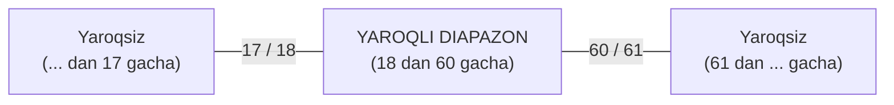

import { Callout } from 'nextra/components'

# Boundary Value Analysis (BVA): Chegara Qiymatlari Tahlili

**Boundary Value Analysis (BVA)** — qora quti sinovining eng mashhur va samarali texnikalaridan biri bo'lib, u kiruvchi ma'lumotlar diapazonining **chegaralarida** joylashgan qiymatlarni sinashga asoslanadi.

Amaliyot shuni ko'rsatadiki, dasturlashdagi xatoliklarning eng katta qismi (masalan: `>` o'rniga `>=` yoki `<` o'rniga `<=` qo'llanilishi) aynan diapazonning chegaraviy nuqtalarida sodir bo'ladi.

---

## BVA Nazariy Asosi

Agar biror tizim `[A, B]` oraliqdagi butun sonlarni qabul qilsa:
- **Quyi chegara (Minimum):** `A`
- **Yuqori chegara (Maximum):** `B`

### 2-Nuqtali BVA (2-Point Boundary Testing):
Har bir chegara uchun 2 ta qiymat tekshiriladi (chegaradagi va undan tashqaridagi qiymat):
- Quyi chegara: `A` (yaroqli), `A - 1` (yaroqsiz)
- Yuqori chegara: `B` (yaroqli), `B + 1` (yaroqsiz)

### 3-Nuqtali BVA (3-Point Boundary Testing — ISTQB standarti):
Har bir chegara uchun 3 ta qiymat tekshiriladi (chegaradan bitta oldin, chegara usti va bitta keyin):
- Quyi chegara: `A - 1` (yaroqsiz), `A` (yaroqli), `A + 1` (yaroqli)
- Yuqori chegara: `B - 1` (yaroqli), `B` (yaroqli), `B + 1` (yaroqsiz)

---

## Amaliy Misol: Foydalanuvchi Yoshi Maydoni

Talab: *Ro'yxatdan o'tishda foydalanuvchining yoshi 18 dan 60 gacha (ikkalasi ham kiradi) bo'lishi lozim.*

### 2-Nuqtali BVA uchun Test-keyslar To'plami:

| Test ID | Sinov Qiymati (Yosh) | Qiymat Tavsifi | Kutilayotgan Natija |
| :--- | :--- | :--- | :--- |
| **TC-01** | `17` | Quyi chegara osti (`Min - 1`) | Xatolik xabari chiqishi kerak (Yaroqsiz) |
| **TC-02** | `18` | Quyi chegara usti (`Min`) | Muvaffaqiyatli qabul qilinishi kerak (Yaroqli) |
| **TC-03** | `19` | Quyi chegara ichi (`Min + 1`) | Muvaffaqiyatli qabul qilinishi kerak (Yaroqli) |
| **TC-04** | `59` | Yuqori chegara ichi (`Max - 1`) | Muvaffaqiyatli qabul qilinishi kerak (Yaroqli) |
| **TC-05** | `60` | Yuqori chegara usti (`Max`) | Muvaffaqiyatli qabul qilinishi kerak (Yaroqli) |
| **TC-06** | `61` | Yuqori chegara usti (`Max + 1`) | Xatolik xabari chiqishi kerak (Yaroqsiz) |

<Callout type="info">
  **Xulosa:** 18 dan 60 gacha bo'lgan barcha 43 ta sonni birma-bir kiritib tekshirish shart emas! Yuqoridagi 6 ta chegaraviy test kutilayotgan xatoliklarning 95% dan ortig'ini aniqlash uchun to'liq yetarlidir.
</Callout>
