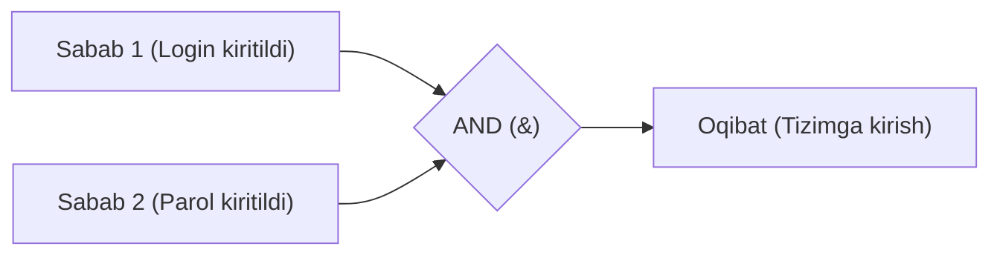

import { Callout } from 'nextra/components'

# Cause-Effect (Sabab-Oqibat Graflari) Texnikasi

**Cause and Effect Graphing** (Sabab-oqibat grafigi) — dasturiy talablardagi kiruvchi shartlar (Sabablar — Causes) va tizimning chiquvchi reaksiyalari (Oqibatlar — Effects) o'rtasidagi mantiqiy bog'liqlikni Bul mantiqiy operatorlari (AND, OR, NOT) yordamida grafik shaklida tasvirlash texnikasidir.

Ushbu texnika yozma texnik talablardagi (SRS) noaniqliklar va mantiqiy qarama-qarshiliklarni aniqlashda juda qo'l keladi.

---

## Asosiy Mantiqiy Belgilar

Sabab-oqibat grafigida quyidagi 4 ta asosiy mantiqiy munosabat qo'llaniladi:

1. **Ayniyat (Identity):** Agar `C1` sodir bo'lsa, `E1` yuzaga keladi (`C1 -> E1`).
2. **Inkor (NOT):** Agar `C1` sodir bo'lmasa, `E1` yuzaga keladi.
3. **Mantiqiy Ko'paytirish (AND):** Faqat barcha sabablar (`C1` VA `C2`) bir vaqtda to'g'ri bo'lgandagina oqibat (`E1`) yuzaga keladi.
4. **Mantiqiy Qo'shish (OR):** Kamida bitta sabab (`C1` YOKI `C2`) to'g'ri bo'lsa, oqibat (`E1`) yuzaga keladi.

---

## Sabab-Oqibat Grafigidan Test-keysgacha Bo'lgan 4 Qadam:

1. **Spetsifikatsiyani tahlil qilish:** Matndan barcha sabablar (kiruvchi parametrlar) va oqibatlar (natijalar) ajratib olinadi va har biriga raqam beriladi.
2. **Grafik chizish:** Mantiqiy amallar yordamida sabablar oqibatlar bilan tutashtiriladi.
3. **Qarorlar jadvaliga o'tkazish:** Hosil bo'lgan grafik asosida qisqartirilgan qarorlar jadvali (Decision Table) tuziladi.
4. **Test-keyslarni yozish:** Jadvalning har bir ustuni alohida mustaqil test-keysga aylantiriladi.
