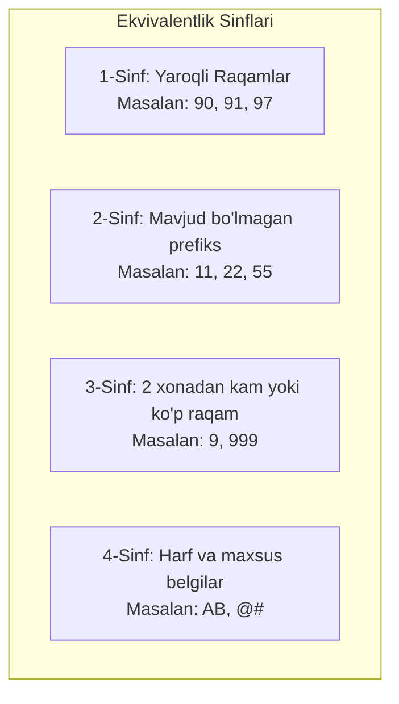

import { Callout } from 'nextra/components'

# Equivalence Partitioning (EP): Ekvivalentlik Sinflariga Ajratish

**Equivalence Partitioning (EP)** (shuningdek, *Ekvivalent bo'laklash*) — barcha mumkin bo'lgan kiruvchi ma'lumotlarni shunday guruhlarga (sinflarga) ajratish texnikasiki, bitta guruhga tegishli bo'lgan har qanday qiymat kiritilganda tizim mutlaqo bir xil natija (reaksiya) berishi taxmin qilinadi.

Ushbu texnikaning bosh maqsadi — ortiqcha, takrorlanuvchi testlarni yo'qotish va testlar sonini sezilarli darajada optimallashtirishdir.

---

## Yaroqli va Yaroqsiz Sinflar

EP da ma'lumotlar ikkita asosiy toifaga ajratiladi:
1. **Yaroqli ekvivalentlik sinfi (Valid Class):** Tizim talablariga mos keluvchi va to'g'ri qabul qilinishi shart bo'lgan ma'lumotlar guruhi.
2. **Yaroqsiz ekvivalentlik sinfi (Invalid Class):** Tizim talablariga zid bo'lgan, dastur tomonidan rad etilib, tegishli xatolik xabari ko'rsatilishi kerak bo'lgan ma'lumotlar guruhi.

---

## Amaliy Misol: Mobil Operator Kodlari

Talab: *Ilovaga faqat O'zbekistonning amaldagi 2 xonali mobil prefikslari kiritilishi mumkin: masalan, 90, 91, 93, 94, 95, 97, 98, 99.*

### Sinov To'plami:

| Ekvivalentlik Sinfi | Tanlangan Sinov Qiymati | Kutilgan Natija |
| :--- | :--- | :--- |
| **Yaroqli (Valid)** | `90` | Prefiks muvaffaqiyatli qabul qilinadi |
| **Yaroqsiz (Invalid: nofaol prefiks)** | `44` | "Bunday operator kodi mavjud emas" xatosi |
| **Yaroqsiz (Invalid: uzunlik)** | `999` | "Prefiks 2 ta raqamdan iborat bo'lishi kerak" |
| **Yaroqsiz (Invalid: matn/belgi)** | `AA` | "Faqat raqamlar kiritilishi lozim" |

<Callout type="info">
  **Ekvivalentlik qoidasi:** Agar bitta sinfdan olingan qiymat (masalan, `90`) muvaffaqiyatli o'tsa, xuddi shu sinfdagi `91` yoki `97` ham xuddi shunday ishlaydi deb hisoblanadi. Har bir sinfdan bittadan vakil qiymatni tanlash 100% yetarlidir.
</Callout>
