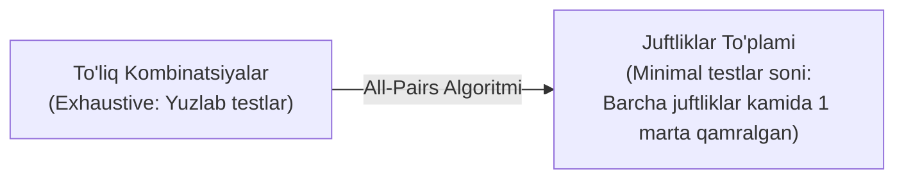

import { Callout } from 'nextra/components'

# Error Guessing va All-Pairs Testing

Rasmiy matematik usullar (BVA, EP) bilan bir qatorda, qora quti sinovida sinovchining amaliy tajribasiga tayanuvchi **Error Guessing** va kombinatorik testlarni qisqartiruvchi **All-Pairs Testing** usullari juda keng qo'llaniladi.

---

## 1. Error Guessing (Xatolarni Taxmin Qilish)

**Error Guessing** — hech qanday qat'iy matematik qoidalarga bo'ysunmaydigan, balki QA muhandisining kasbiy instinkti, oldingi loyihalardagi tajribasi va dasturchilar ko'pincha qayerda adashishini bilishiga asoslangan tajribaviy (Experience-based) texnikadir.

### QA Muhandisi Doim Sinab Ko'radigan Odatiy "Xatarli" Holatlar:
- **Bo'sh qiymatlar:** Maydonni bo'sh qoldirish, faqat probellar (`"   "`) kiritish, `null` yoki `undefined` yuborish.
- **Nolga bo'lish:** Miqdor yoki narx o'rniga `0` kiritish.
- **Matn maydonlariga maxsus belgilar:** Emojilar (`😀`), SQL-injektsiya belgilari (`' OR 1=1 --`), XSS skriptlari (``).
- **O'ta katta hajmli matnlar:** 255 ta belgilik maydonga 10 000 ta belgi nusxalab qo'yish (Buffer overflow tekshiruvi).
- **Fayl yuklashda kutilmagan formatlar:** Rasm o'rniga `.exe` yoki 2 GB hajmli bo'sh fayl yuklash.
- **Tezkor ikki marta bosish (Double-click):** "To'lash" yoki "Yuborish" tugmasini ketma-ket bir necha bor bosish.

---

## 2. All-Pairs Testing (Pairwise Testing — Juft-Juft Sinash)

Amaliyotda tizim bir vaqtning o'zida o'nlab parametrlarga ega bo'lishi mumkin (masalan: 3 ta brauzer x 3 ta operatsion tizim x 3 ta ekran o'lchami x 2 ta til = 54 ta kombinatsiya).

**All-Pairs qoidasi:** Dasturiy nosozliklarning 80-90% qismi bir vaqtning o'zida 3 yoki 4 ta parametrning emas, balki **ikkita parametrning noto'g'ri o'zaro ta'siridan (interaksiyasidan)** kelib chiqadi.

### Amaliy Foydasi:
All-Pairs maxsus algoritmlari (masalan, *Pict* vositasi) yordamida yuzlab yoki minglab kombinatsiyalarni barcha parametrlar juftliklarini to'liq saqlagan holda atigi 15-20 ta test-keysga qisqartirish mumkin.

<Callout type="info">
  **Tajriba va ilm uyg'unligi:** Error Guessing rasmiy test texnikalarining o'rnini bosa olmaydi, ammo BVA va EP o'tkazilgandan so'ng, tizimning chidamliligini stress-tekshirishda eng yaxshi qo'shimcha qurol hisoblanadi.
</Callout>
