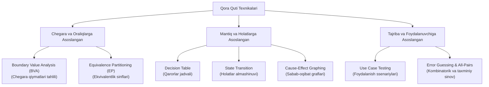

import { Cards, Callout } from 'nextra/components'

# Qora Quti Sinov Texnikalari (Black Box Techniques)

Dasturiy ta'minotni sinashda barcha mumkin bo'lgan ma'lumotlar kombinatsiyasini tekshirib chiqish (Exhaustive Testing) jismonan imkonsizdir. Masalan, oddiygina 1 dan 100 gacha son qabul qiluvchi ikkita kiritish maydoni 100 x 100 = 10 000 ta kombinatsiyani keltirib chiqaradi.

**Qora quti sinov texnikalari** — minimal test-keyslar soni bilan maksimal darajadagi nuqsonlarni aniqlash imkonini beruvchi, matematik va mantiqiy asoslangan test dizayn usullaridir.

---

## Asosiy Texnikalar Tasnifi

---

## Modul Bo'limlari

<Cards num={2}>
  <Cards.Card
    title="▶️ Boundary Value Analysis (BVA)"
    href="/docs/black-box-techniques/boundary-value-analysis"
  >
    Xatoliklarning eng ko'p to'planadigan nuqtasi — diapazon chegaralarini (min, max, min-1, max+1) aniqlash va sinash.
  </Cards.Card>
  <Cards.Card
    title="▶️ Equivalence Partitioning (EP)"
    href="/docs/black-box-techniques/equivalence-partitioning"
  >
    Katta hajmdagi kiruvchi ma'lumotlarni teng kuchli (yaroqli va yaroqsiz) sinflarga ajratish orqali testlar sonini keskin qisqartirish.
  </Cards.Card>
  <Cards.Card
    title="▶️ Decision Table (Qarorlar Jadvali)"
    href="/docs/black-box-techniques/decision-table"
  >
    Murakkab biznes qoidalar va bir nechta shartlarning o'zaro kombinatsiyasini jadval ko'rinishida modellashtirish.
  </Cards.Card>
  <Cards.Card
    title="▶️ State Transition (Holatlar Almashinuvi)"
    href="/docs/black-box-techniques/state-transition"
  >
    Tizimning bir holatdan ikkinchisiga o'tish zanjirini va ruxsat berilmagan noqonuniy o'tishlarni tekshirish.
  </Cards.Card>
  <Cards.Card
    title="▶️ Cause-Effect (Sabab-Oqibat Graflari)"
    href="/docs/black-box-techniques/cause-and-effect"
  >
    Kiruvchi sabablar va chiquvchi oqibatlar o'rtasidagi mantiqiy munosabatlarni Bul algebrasi yordamida ifodalash.
  </Cards.Card>
  <Cards.Card
    title="▶️ Use Case Testing"
    href="/docs/black-box-techniques/use-case-testing"
  >
    Foydalanuvchining real hayotiy ssenariylari (Happy path, muqobil va xatolik yo'llari) asosida test-keyslar yaratish.
  </Cards.Card>
  <Cards.Card
    title="▶️ Error Guessing & All-Pairs Sinovi"
    href="/docs/black-box-techniques/error-guessing"
  >
    Sinovchining kasbiy tajribasiga asoslangan noan'anaviy xatolarni topish va juft-juft kombinatorik qamrov.
  </Cards.Card>
</Cards>
