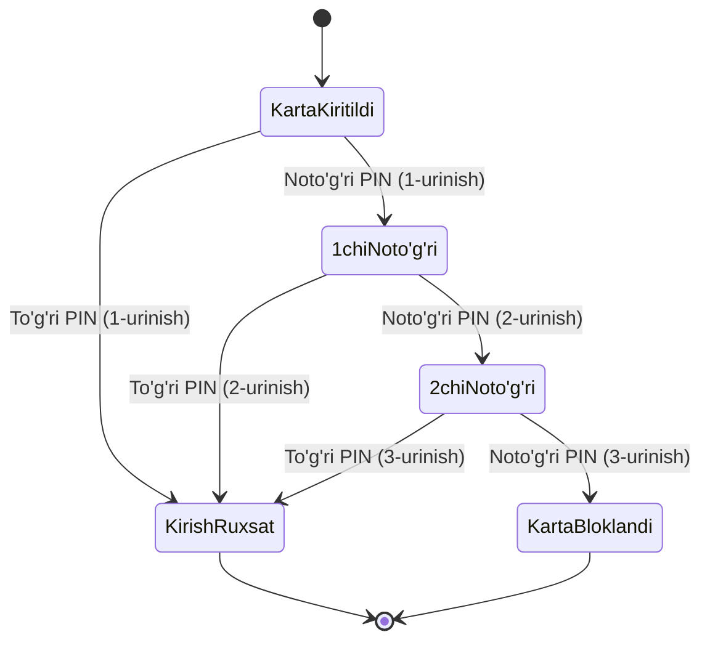

import { Callout } from 'nextra/components'

# State Transition (Holatlar Almashinuvi) Sinovi

**State Transition Testing** — tizimning joriy holati (State), unga ta'sir qiluvchi tashqi hodisa (Event / Trigger) va ushbu hodisa natijasida tizimning yangi holatga o'tishi (Transition) hamda beradigan javobini sinashga asoslangan texnikadir.

Bu texnika buyurtmalar hayotiy sikli, elektron to'lovlar, bankomatlar (ATM) va foydalanuvchi akkauntini bloklash kabi ketma-ket holat o'zgarishiga asoslangan tizimlarni sinashda o'ta muhimdir.

---

## Asosiy Tushunchalar

- **Holat (State):** Tizim ma'lum bir voqea sodir bo'lishini kutib turgan barqaror holat (masalan: *Kutilmoqda*, *To'langan*, *Yetkazilmoqda*, *Bekor qilingan*).
- **Hodisa (Event):** Tizimga tashqaridan keladigan turtki (masalan: tugmani bosish, pul yechilishi, vaqt tugashi).
- **O'tish (Transition):** Hodisa sababli bir holatdan ikkinchisiga siljish.
- **Harakat (Action):** O'tish paytida tizim tomonidan bajariladigan ish (masalan: SMS xabar yuborish, kvitansiya chiqarish).

---

## Amaliy Misol: Bankomatda PIN-kod Kiritish

Qoida: *Foydalanuvchi to'g'ri PIN kiritsa — menyuga o'tadi. Noto'g'ri kiritsa, yana 2 marta urinish beriladi. Uchinchi marta noto'g'ri kiritilsa — karta bloklanadi.*

---

## Holatlar Almashinuvi Jadvali (State Transition Table)

QA muhandisi nafaqat to'g'ri o'tishlarni (Positive testing), balki **mumkin bo'lmagan (noqonuniy) o'tishlarni ham (Negative testing)** tekshirishi shart:

| Boshlang'ich Holat | Hodisa (Event) | Yangi Holat | Ruxsat etilganmi? |
| :--- | :--- | :--- | :---: |
| Karta kiritildi | To'g'ri PIN | Tizimga kirdi | **Ha (Yaroqli)** |
| Karta kiritildi | Noto'g'ri PIN (1) | Qayta kiritishni kutish | **Ha (Yaroqli)** |
| 2-xato holat | Noto'g'ri PIN (3) | Karta bloklandi | **Ha (Yaroqli)** |
| Karta bloklandi | To'g'ri PIN kiritish | Tizimga kirdi | **YO'Q! (Xatolik)** |

<Callout type="warning">
  **Kritik xatoliklarni topish:** Agar karta allaqachon bloklangan holatda foydalanuvchi to'g'ri PIN kiritsa va tizim unga pul yechishga ruxsat berib yuborsa — bu xavfli dasturiy nosozlikdir. State Transition texnikasi aynan shunday noqonuniy o'tishlarni fosh qiladi.
</Callout>
