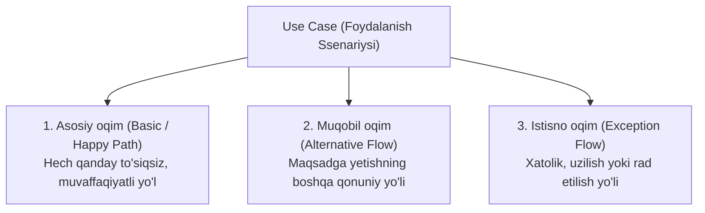

import { Callout } from 'nextra/components'

# Use Case Testing: Foydalanish Ssenariylari Asosidagi Sinov

**Use Case Testing** — dasturiy tizimni foydalanuvchi (yoki boshqa tashqi tizim) va dastur o'rtasidagi real hayotiy muloqot ssenariylari (Use Case) asosida sinash uslubidir.

Use Case — bu qandaydir aniq biznes maqsadga erishish uchun foydalanuvchi tomonidan bajariladigan harakatlar ketma-ketligini ifodalaydi (masalan: "Tovarni xarid qilish", "Parolni tiklash", "Pul o'tkazish").

---

## Use Case ning 3 Xil Oqimi (Flows)

Har bir Use Case sinovida quyidagi uch xil ssenariy yo'li tekshiriladi:

---

## Amaliy Misol: "Onlayn Buyurtma Berish" Ssenariysi

- **Aktyor (Actor):** Ro'yxatdan o'tgan xaridor.
- **Old shart (Precondition):** Foydalanuvchi tizimga kirgan va savatchada tovar mavjud.
- **Asosiy maqsad:** Tovar uchun to'lov qilib buyurtmani rasmiylashtirish.

### Sinov Ssenariylari Tahlili:

1. **Asosiy oqim (Happy Path):**
   - Xaridor "Buyurtma berish" tugmasini bosadi -> Manzilni tasdiqlaydi -> Kartadan to'lov qiladi -> To'lov muvaffaqiyatli o'tadi -> Kvitansiya ko'rsatiladi.
2. **Muqobil oqim (Alternative Flow):**
   - Xaridor kartadan to'lash o'rniga "Kuryerga naqd pul to'lash" usulini tanlaydi -> Buyurtma muvaffaqiyatli rasmiylashtiriladi.
3. **Istisno oqim (Exception Flow):**
   - Kartada yetarli mablag' bo'lmaydi -> To'lov rad etiladi -> Foydalanuvchiga "Mablag' yetarli emas, boshqa karta tanlang" xabari ko'rsatiladi va buyurtma to'lanmagan holatda saqlanadi.

<Callout type="info">
  **Integration va E2E sinovdagi o'rni:** Use Case testlar ko'pincha tizimli (System Testing) va qabul (UAT) sinovlarida butun biznes jarayonning boshidan oxirigacha (End-to-End) uzluksiz ishlashini tekshirish uchun asos bo'lib xizmat qiladi.
</Callout>
