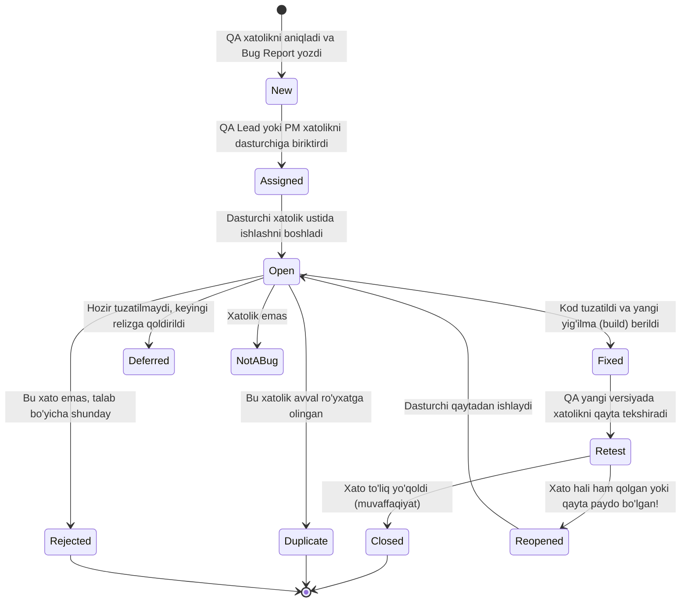

import { Callout } from 'nextra/components'

# Bug Life Cycle: Xatolik Hayot Sikli

**Bug Life Cycle (Defect Life Cycle)** — dasturdagi nosozlik QA muhandisi tomonidan ilk bor aniqlangan lahzadan boshlab, to'liq tuzatilib, qayta tekshirilib va rasman yopilguniga (Closed) qadar bosib o'tadigan barcha holatlar (States) va bosqichlar majmuidir.

Bug Life Cycle dasturchi va tester o'rtasidagi muloqotni tartibga soladi va birorta ham xatolik e'tibordan chetda qolmasligini kafolatlaydi.

---

## Xatolik Hayot Siklining To'liq Grafigi

---

## Holatlar (States) Tafsiloti

1. **New (Yangi):** QA mutaxassisi xatolikni topib, Bug Tracking tizimiga (Jira, Bugzilla) birinchi marta kiritgandagi holati.
2. **Assigned (Biriktirilgan):** Xatolik tahlil qilinib, uni tuzatishi shart bo'lgan aniq dasturchiga topshirilgan holat.
3. **Open (Ochiq):** Dasturchi muammoning ildizini tahlil qilishni va kodni tuzatishni boshlagan holat.
4. **Duplicate (Dublikat):** Xuddi shu xatolik haqida allaqachon boshqa bir tester hisobot yozgan bo'lsa, takroriy hisobot yopiladi.
5. **Rejected (Rad etilgan):** Dasturchi texnik talabnoma (SRS) asosida bu harakat xato emas, balki talabda shunday belgilanganini isbotlagan holat.
6. **Deferred (Kechiktirilgan):** Xatolik tan olinadi, ammo uning ustuvorligi past bo'lganligi sababli, joriy relizdan keyingi versiyalarda tuzatishga qoldiriladi.
7. **Fixed (Tuzatilgan):** Dasturchi kerakli kod o'zgarishlarini amalga oshirib, yangi versiyani sinov muhitiga chiqargan holat.
8. **Retest (Qayta sinov):** QA mutaxassisi yangilangan versiyada avvalgi xatolik rostdan ham bartaraf etilganini amalda tekshirayotgan holat.
9. **Reopened (Qayta ochilgan):** Agar qayta sinovda xatolik hali ham bartaraf etilmagani ma'lum bo'lsa, test holati yana qayta ochiladi va dasturchiga qaytariladi.
10. **Closed (Yopilgan):** Xatolik muvaffaqiyatli tuzatilgani isbotlangach, hisobot rasman yopiladi va arxivlanadi.
