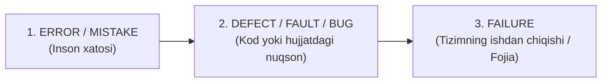

import { Callout } from 'nextra/components'

# Bug, Defect, Error, Fault va Failure: Aniq Farqlar

Kundalik so'zlashuvda dasturdagi nosozliklar uchun "bug", "xato", "glyuk" so'zlari bir-birining o'rnida ishlatiladi. Biroq xalqaro ISTQB va IEEE standartlarida ushbu atamalarning har biri muayyan hodisani anglatuvchi qat'iy ma'noga ega.

---

## Atamalarning Sabab-Oqibat Zanjiri

---

## Terminlar Tafsiloti

### 1. Error / Mistake (Inson xatosi):
- **Ta'rif:** Dasturchi, biznes tahlilchi yoki loyihachi tomonidan charchoq, tushunmovchilik yoki tajribasizlik oqibatida yo'l qo'yilgan insoniy noaniqlik.
- *Misol:* Dasturchi talabnomadagi "yoshi kamida 18 bo'lishi kerak" shartini noto'g'ri o'qib, kodda `age > 18` deb yozib qo'ydi.

### 2. Defect / Bug / Fault (Nuqson / Xatolik):
- **Ta'rif:** Inson xatosi tufayli dasturiy kodda, talabnoma matnida yoki konfiguratsiya faylida hosil bo'lgan yashirin kamchilik.
- *Misol:* Kodda mavjud bo'lgan noto'g'ri if-sharti (`if (age > 18)`). Dastur ishga tushirilmaguncha u shunchaki nuqson (Defect) bo'lib turadi.
- *"Bug"* so'zi asosan sinovchilar va dasturchilar orasidagi norasmiy atama bo'lib, "Defect" so'zining sinonimidir.

### 3. Failure (Ishdan chiqish / Muvaffaqiyatsizlik):
- **Ta'rif:** Kodda yashiringan defekt dasturni ishga tushirish (ijro etish) paytida aktivlashib, tizimning amaldagi xatti-harakati kutilgan natijadan farq qilishi yoki dasturning to'liq to'xtab qolishi.
- *Misol:* Aynan 18 yoshli foydalanuvchi tizimga kirishga uringanida ekranda "Kirish taqiqlandi" xabari chiqishi yoki sayt qulashi.

---

## Qiyosiy Matrisa

| Atama | Qayerda sodir bo'ladi? | Kim/Nima keltirib chiqaradi? | Dastur ishga tushganmi? |
| :--- | :--- | :--- | :---: |
| **Error (Xato)** | Inson ongi / Fikrida | Dasturchi, Tahlilchi, Arxitektor | Shart emas |
| **Defect (Nuqson / Bug)** | Kodda, Hujjatda | Inson xatosi natijasida hosil bo'ladi | Statik holatda yotadi |
| **Failure (Buzilish)** | Ekrandagi real dasturda | Ishga tushirilgan nuqsonli kod | **HA (Dastur ishlayotgan bo'ladi)** |

<Callout type="info">
  **Muhim xulosa:** Har qanday Failure ning ortida yashirin Defect yotadi; har bir Defect esa insonning qandaydir Error (xatosi) oqibatida dunyoga keladi. Sinovning vazifasi — Defektlarni ular Failure (katta fojiaga) aylanmasidan oldin yo'q qilishdir!
</Callout>
