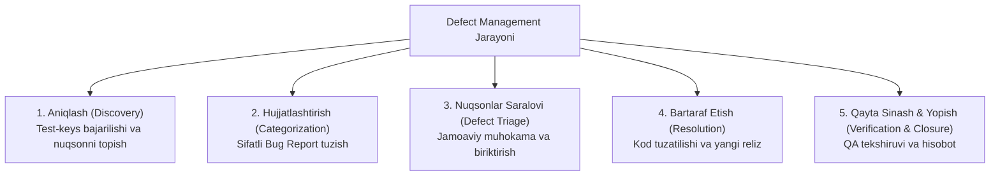

import { Callout } from 'nextra/components'

# Defect Management & Triage Jarayoni

**Defect Management Process** — dasturiy ta'minotda aniqlangan barcha nuqsonlarni tizimli tarzda aniqlash, ro'yxatga olish, ustuvorligini saralash (Triage), dasturchilarga biriktirish, tuzatilishini nazorat qilish va yakuniy sifat metrikalarini hisoblash jarayonidir.

---

## Nuqsonlarni Boshqarishning 5 Bosqichi



---

## Bug Triage Yig'ilishi Nima?

**Bug Triage (Xatoliklarni saralash majlisi)** — bu QA Lead, Mahsulot Menejeri (Product Manager / Product Owner) va Bosh Dasturchi (Tech Lead) ishtirokida muntazam (haftada 1-2 marta yoki har kuni) o'tkaziladigan tezkor yig'ilishdir.

### Triage Yig'ilishining Maqsadlari:
- Har bir yangi kelib tushgan "New" holatidagi xatolikni birgalikda ko'rib chiqish.
- Xatolikning haqiqatan ham nuqson ekanligini tasdiqlash (yoki *Not a Bug* / *Duplicate* sifatida yopish).
- Uning aniq **Severity** va **Priority** darajasini o'zaro kelishilgan holda tasdiqlash.
- Xatolikni aynan qaysi dasturchiga biriktirish va qaysi relizda tuzatish lozimligini belgilash (*Fix Version*).

---

## Defektlarga Oid Asosiy Metrikalar

Sifat darajasini raqamlarda baholash uchun QA jamoasi quyidagi metrikalardan foydalanadi:

1. **Defekt zichligi (Defect Density):**
   ```text
   Defect Density = Aniqlangan jami defektlar soni / Kod hajmi (KLOC — ming satr kod)
   ```
2. **Defektni bartaraf etish samaradorligi (Defect Removal Efficiency — DRE):**
   ```text
   DRE = (QA topgan nuqsonlar / (QA topgan nuqsonlar + Productionda chiqqan nuqsonlar)) * 100%
   ```
   DRE qanchalik 100% ga yaqin bo'lsa, sinov jamoasining faoliyati shunchalik mukammal hisoblanadi!
