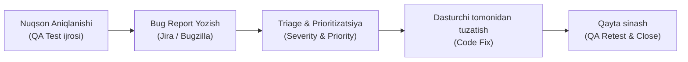

import { Cards, Callout } from 'nextra/components'

# Nuqsonlar va Xatoliklar Hayot Sikli (Defect Tracking & Management)

Dasturiy ta'minotni sinashning bosh vazifasi — dasturdagi nosozliklarni imkon qadar erta aniqlash, ularni to'g'ri hujjatlashtirish va bartaraf etilgunga qadar nazorat qilib borishdir.

Ushbu modulda xatoliklarning nazariy tushunchalari, xatolikning paydo bo'lishidan to yopilishigacha bo'lgan to'liq hayotiy sikli (**Bug Life Cycle**), shuningdek, nuqsonlarni jiddiyligi va tuzatilish ustuvorligi bo'yicha tasniflash qoidalari o'rganiladi.

---

## Nuqsonlarni Boshqarish Zanjiri

---

## Modul Bo'limlari

<Cards num={2}>
  <Cards.Card
    title="▶️ Bug vs Defect vs Error vs Failure"
    href="/docs/defect-tracking/bug-vs-defect-vs-error"
  >
    Xatolik terminologiyasi: Inson adashishi, kod nuqsoni va ishlab chiqarishdagi fojiali buzilishlar farqi.
  </Cards.Card>
  <Cards.Card
    title="▶️ Bug Life Cycle (Hayot Sikli)"
    href="/docs/defect-tracking/bug-life-cycle"
  >
    Xatolikning barcha holatlari: New, Assigned, Open, Fixed, Retest, Closed, Reopened, Rejected va Deferred.
  </Cards.Card>
  <Cards.Card
    title="▶️ Severity vs Priority"
    href="/docs/defect-tracking/severity-vs-priority"
  >
    Texnik jiddiylik (Severity) va biznes ustuvorligi (Priority) o'rtasidagi 2x2 matrisa va amaliy misollar.
  </Cards.Card>
  <Cards.Card
    title="▶️ Test Environment (Sinov Muhiti)"
    href="/docs/defect-tracking/test-environment"
  >
    Sinov serverlari, ma'lumotlar bazasi, tarmoq parametrlari va ishlab chiqarish muhitiga moslik.
  </Cards.Card>
  <Cards.Card
    title="▶️ Defect Management & Triage"
    href="/docs/defect-tracking/defect-management-process"
  >
    Bug Triage yig'ilishlari, defektlarni saralash, yopish mezonlari va sifat metrikalari.
  </Cards.Card>
</Cards>
