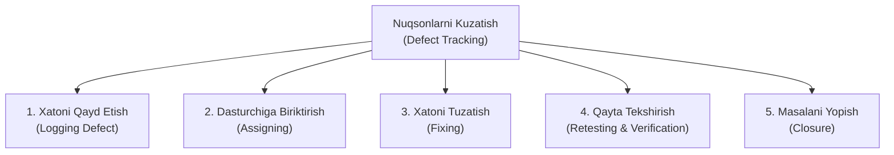
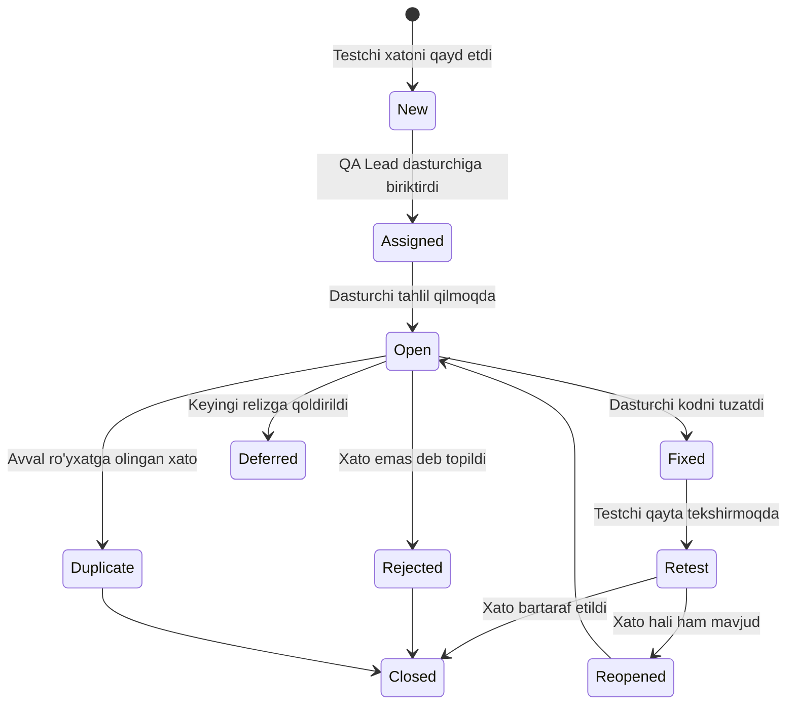

import { Callout } from 'nextra/components'

# Nuqsonlarni Kuzatish (Defect Tracking in Software Testing)

> Oxirgi yangilanish: 25-iyul, 2026

Dasturiy ta'minotni ishlab chiqish jarayonida xatoliklar yuzaga kelishi tabiiy holatdir. Biroq, aniqlangan xatoliklar o'z vaqtida qayd etilmasa, ularning holati kuzatib borilmasa va tuzatilishi nazorat qilinmasa, dastur jiddiy muammolar bilan bozorga chiqib ketishi mumkin.

Bunday salbiy oqibatlarning oldini olish, har bir nosozlikni aniqlangan paytidan to to'liq bartaraf etilguncha tizimli boshqarish uchun **Nuqsonlarni Kuzatish (Defect Tracking / Bug Tracking)** jarayoni qo'llaniladi.

---

## Nuqsonlarni Kuzatish Nima? (What is Defect Tracking?)

**Nuqsonlarni Kuzatish (Defect Tracking)** — dasturiy ta'minotda aniqlangan barcha nuqsonlar, nosozliklar va talablardan chetga chiqishlarni (*Bugs / Defects*) tizimli ro'yxatga olish, ularning tuzatilish jarayonini monitoring qilish hamda to'liq bartaraf etilishini nazorat qilish usulidir.

Ushbu jarayon test muhandislari, dasturchilar va loyiha menejerlari o'rtasida shaffoflikni ta'minlaydi: har bir nuqson kimga biriktirilganligi, hozirda qaysi bosqichda ekanligi va uning qanchalik xavfliligi doimiy ko'rinib turadi.

<Callout type="info">
**Defect Tracking va Defect Management farqi:**  
- **Defect Tracking (Taktik daraja):** Har bir alohida xatolikni ro'yxatga olish, unga status berish va yopilishini kuzatish.  
- **Defect Management (Strategik daraja):** Xatoliklarning asosiy sabablarini tahlil qilish (*Root Cause Analysis*), xatolar statistikasini o'rganish va kelajakda bunday nuqsonlarning oldini olish strategiyasini ishlab chiqish.
</Callout>

---

## Nega Defect Tracking Zarur?

1. **Birorta ham xato e'tibordan chetda qolmasligi uchun:** Qog'ozda yoki og'zaki aytilgan xatolar unutilishi mumkin, maxsus kuzatuv tizimida esa har bir xatolik o'z raqamiga (ID) ega bo'ladi.
2. **Jamoaviy javobgarlik:** Har bir nuqson uchun aniq bir dasturchi yoki jamoa javobgar etib belgilanadi.
3. **Ustuvorlikni to'g'ri belgilash:** Qaysi xatolik dasturning chiqarilishiga xavf tug'dirayotgani va birinchi navbatda tuzatilishi lozimligi aniq ko'rinadi.
4. **Sifat metrikalari va hisobotlar:** Tizimda qancha ochiq va yopiq xatolar borligi, dasturchilar qanchalik tez xatolarni tuzatayotgani haqida raqamli ko'rsatkichlar beradi.
5. **Bilimlar bazasi (*History & Knowledge Base*):** Kelajakda shunga o'xshash muammolar uchrasa, avval qanday yechilganini ko'rish imkonini yaratadi.

---

## Nuqsonning Hayotiy Sikli (Defect Life Cycle / Bug Life Cycle)

Nuqson aniqlangan paytdan boshlab to to'liq yopilguncha bir necha standart holatlardan (*Statuses*) o'tadi:

### Holatlarning (Status) tavsifi:
- **New (Yangi):** Test muhandisi xatolikni aniqladi va tizimga birinchi marta kiritdi.
- **Assigned (Biriktirildi):** Mas'ul rahbar (QA Lead) ushbu xatoni bartaraf etish uchun muayyan dasturchiga topshirdi.
- **Open (Ochiq):** Dasturchi xatolik ustida tahlilni boshladi.
- **Rejected (Rad etildi):** Dasturchi yoki tahlilchi bu xatolik emas, balki tizimning belgilangan talabi deb topdi.
- **Duplicate (Takroriy):** Ushbu nuqson tizimda boshqa bir xatolik bilan aynan bir xil bo'lib, avval ro'yxatga olingan.
- **Deferred (Kechiktirildi):** Xatolik tan olindi, ammo u muhim bo'lmaganligi sababli keyingi relizlarda tuzatish uchun kechiktirildi.
- **Fixed (Tuzatildi):** Dasturchi kodni to'g'riladi va sinov uchun yangi build chiqardi.
- **Retest (Qayta tekshirish):** Test muhandisi tuzatilgan qismni amalda qaytadan tekshirib ko'rmoqda.
- **Reopened (Qayta ochildi):** Agar qayta tekshirish paytida xato hali ham saqlanib qolgan bo'lsa, masala yana ochiladi.
- **Closed (Yopildi):** Xato to'liq bartaraf etilganligi tasdiqlangach, muammo yakuniy yopiladi.

---

## Nuqson Hisoboti Tarkibi (Defect Report Attributes)

Mukammal yozilgan nuqson hisoboti dasturchiga xatoni qidirishga vaqt sarflamasdan darhol tuzatish imkonini beradi. U quyidagi parametrlardan iborat:

1. **Defect ID:** Unikal identifikator (masalan: `BUG-1042`);
2. **Sarlavha (Title / Summary):** Muammoning qisqa va aniq ifodasi (masalan: *"Login tugmasi bosilganda 500 server xatoligi yuz bermoqda"*);
3. **Jiddiylik (Severity):** Xatoning tizim ishlashiga yetkazadigan texnik ta'siri darajasi;
4. **Ustuvorlik (Priority):** Ushbu xatoni biznes nuqtai nazaridan qanchalik zudlik bilan tuzatish zarurligi;
5. **Sinov muhiti (Environment):** Operatsion tizim, brauzer, qurilma modeli, dasturiy versiya (Build number);
6. **Takrorlash qadamlari (Steps to Reproduce):** Xatoni takrorlash uchun qadamma-qadam ketma-ketlik:
   - 1. Saytga kiring (`/login`);
   - 2. Parol maydoniga bo'sh joy qoldiring;
   - 3. "Kirish" tugmasini bosing;
7. **Kutilgan natija (Expected Result):** Tizim qanday javob qaytarishi kerak edi;
8. **Amaldagi natija (Actual Result):** Haqiqatda nima yuz berdi;
9. **Dalillar (Attachments):** Skrinshotlar, video yozuvlar va server loglari.

---

## Jiddiylik va Ustuvorlik (Severity vs Priority)

Ko'pincha boshlovchilar bu ikki tushunchani chalkashtiradilar. Ularning asosiy farqlari quyidagicha:

| Xususiyati | Jiddiylik (Severity) | Ustuvorlik (Priority) |
| :--- | :--- | :--- |
| **Mohiyati** | Xatoning **texnik tizimga** yetkazgan zararining og'irligi. | Xatoni **biznes nuqtai nazaridan** tuzatish shoshilinchligi. |
| **Kim belgilaydi?** | Asosan **Test Muhandisi (Tester)** tomonidan. | Asosan **Loyiha Menejeri / Product Owner** tomonidan. |
| **Darajalari** | *Critical*, *Major*, *Moderate*, *Minor*. | *High*, *Medium*, *Low*. |

### 4 Ta Asosiy Kombinatsiya Misoli:
1. **Yuqori Jiddiylik va Yuqori Ustuvorlik (High Severity & High Priority):** Foydalanuvchi to'lov qila olmayapti, butun tizim qulamoqda. (Darhol tuzatilishi shart).
2. **Yuqori Jiddiylik va Past Ustuvorlik (High Severity & Low Priority):** Juda eski, hech kim ishlatmaydigan brauzerda (masalan, IE 8) ilova ochilmay qolishi. (Texnik xavfi katta, lekin mijozlar ishlatmaydi).
3. **Past Jiddiylik va Yuqori Ustuvorlik (Low Severity & High Priority):** Kompaniya bosh sahifasida brend logotipi yoki kompaniya nomida qo'pol orfografik xato ketgan. (Tizim buzilmagan, lekin brend obro'siga jiddiy putur yetadi).
4. **Past Jiddiylik va Past Ustuvorlik (Low Severity & Low Priority):** Sozlamalar ichidagi yordamchi sahifada matn shriftining 1 pikselga siljib qolishi.

---

## Ommabop Defect Tracking Vositalari (Tools)

Bugungi kunda xatoliklarni ro'yxatga olish va kuzatish uchun quyidagi yetakchi dasturiy ta'minotlar qo'llaniladi:

- **Jira:** Dunyo bo'ylab eng ko'p qo'llaniladigan vazifalar va nuqsonlarni kuzatish platformasi. Moslashuvchan ish oqimlari (Workflow) va kuchli hisobot tizimiga ega.
- **Bugzilla:** Mozilla tomonidan yaratilgan klassik, ishonchli va ochiq manbali (*Open Source*) bug tracking tizimi.
- **GitHub / GitLab Issues:** Dasturchilar va QA muhandislari uchun kod ombori (repository) bilan bevosita integratsiyalangan qulay kuzatuv vositasi.
- **MantisBT:** PHP da yozilgan, o'rnatish oson va qulay ochiq manbali nuqsonlarni kuzatish vositasi.
- **Redmine:** Loyihalarni boshqarish va xatoliklarni ro'yxatga olishni o'zida birlashtirgan erkin platforma.
