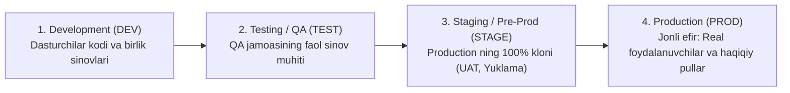

import { Callout } from 'nextra/components'

# Test Environment: Sinov Muhiti

**Test Environment (Sinov muhiti / Testbed)** — dasturiy ta'minotni sifatli va ishonchli sinovdan o'tkazish uchun maxsus tayyorlangan apparat vositalari (serverlar), operatsion tizimlar, dasturiy kutubxonalar, ma'lumotlar bazasi va tarmoq konfiguratsiyalarining yagona majmuidir.

Sinov muhiti ishlab chiqarish (Production) muhitiga qanchalik yaqin bo'lsa, sinov natijalari shunchalik haqqoniy va ishonchli bo'ladi.

---

## Standart Muhitlar Ierarxiyasi

Zamonaviy IT kompaniyalarida odatda 4 xil mustaqil muhit tashkil qilinadi:

---

## Sinov Muhitining Asosiy Tarkibiy Qismlari

1. **Apparat ta'minoti (Hardware):** Server quvvati (CPU yadrolari, RAM xotira hajmi, SSD disklar tezligi).
2. **Operatsion tizim va platforma:** Linux (Ubuntu/Debian), Windows Server, Docker konteynerlari va Kubernetes klasterlari.
3. **Ma'lumotlar bazasi (Test Database):** Haqiqiy mijozlar ma'lumotlari kiritilmagan, lekin hajmi va tuzilishi jihatidan real ma'lumotlarga to'liq mos keluvchi soxta (anomallashtirilgan / synthetic data) sinov bazasi.
4. **Tarmoq konfiguratsiyasi (Network):** Xavfsizlik devorlari (Firewall), SSL sertifikatlari, DNS sozlamalari va proksi-serverlar.
5. **Tashqi ulanishlar (Third-party Stubs/Mocks):** To'lov shlyuzlari (masalan, Click, Payme yoki Stripe) ning sinov uchun maxsus Sandbox rejimlari.

<Callout type="warning">
  **"Mening kompyuterimda ishlayapti-ku!" muammosi:** Agar sinov muhiti to'g'ri sozlanmagan bo'lsa, dasturchi kompyuterida ishlagan kod serverda ishlamay qoladi. Shuning uchun zamonaviy muhandislikda barcha muhitlar Docker konteynerlari yordamida bir xil qilib qoliplanadi.
</Callout>
