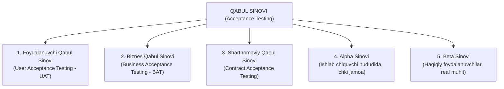
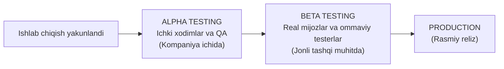

import { Callout } from 'nextra/components'

# Acceptance Testing: Qabul Sinovi (Alpha & Beta Testing)

**Acceptance Testing** (shuningdek, *Qabul sinovi* yoki **UAT — User Acceptance Testing**) — dasturiy ta'minotni sinashning eng yuqori, to'rtinchi darajasi bo'lib, uning asosiy maqsadi dastur buyurtmachi (mijoz) va yakuniy foydalanuvchilarning biznes ehtiyojlariga to'liq javob berishini va uni ishlab chiqarishga (Production) chiqarish mumkinligini rasman tasdiqlashdir.

Bu bosqichda "Dastur talabnomaga muvofiqmi va biznes ushbu mahsulotni qabul qilib, pul to'lashga tayyormi?" degan bosh strategik savol hal etiladi.

---

## Qabul Sinovi Turlari

---

## Alpha Testing va Beta Testing O'rtasidagi Asosiy Farqlar

TpointTech va ISTQB standartlarida Alpha va Beta sinovlari mahsulotni keng ommaga taqdim etishdan oldingi eng muhim ikki bosqich sifatida alohida o'rganiladi:

| Xususiyat | Alpha Testing | Beta Testing |
| :--- | :--- | :--- |
| **Qayerda o'tkaziladi?** | Ishlab chiquvchi kompaniya hududida (laboratoriyada) | Real dunyoda, yakuniy mijozlarning o'z muhitida |
| **Kimlar o'tkazadi?** | Kompaniyaning ichki xodimlari, biznes vakillari va ichki sinovchilar | Real oxirgi foydalanuvchilar (keng jamoatchilik yoki tanlangan guruh) |
| **Dasturchilar ishtiroki** | Dasturchilar doimo yonida turadi, xatolarni darhol qayd etadi | Dasturchilar jarayonda bevosita qatnashmaydi, xabarlar onlayn qabul qilinadi |
| **Muddati** | Tizimli sinovdan darhol keyin, mahsulot chiqishidan oldin | Alpha sinovidan keyin, ommaviy sotuvdan oldin |
| **Maqsadi** | Ichki kamchiliklar va qolgan nosozliklarni bartaraf etish | Real foydalanuvchilarning haqqoniy fikr-mulohazalarini yig'ish |

<Callout type="info">
  **Ochiq va Yopiq Beta:** Ko'plab zamonaviy dasturlar (masalan, Telegram yoki mobil o'yinlar) avval *Closed Beta* (faqat taklifnoma olgan 1000 kishi) orqali, so'ngra *Open Beta* (istalgan kishi sinab ko'rishi mumkin bo'lgan) bosqichidan o'tkaziladi.
</Callout>
