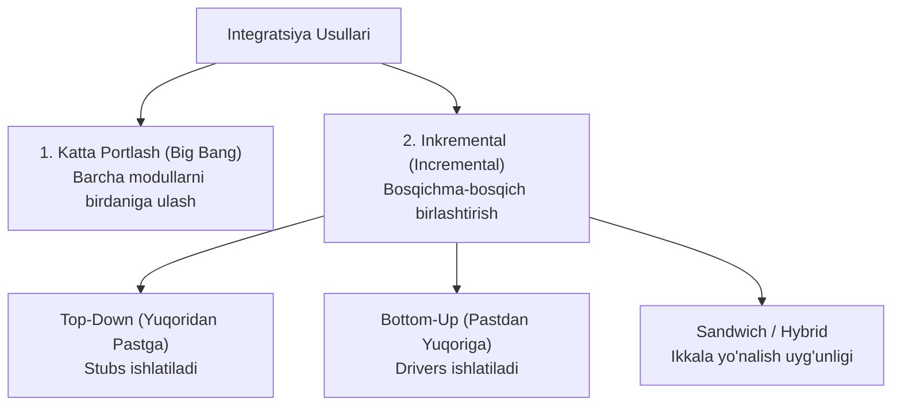

import { Callout } from 'nextra/components'

# Integration Testing: Integratsion Sinov

**Integration Testing** — alohida sinovdan o'tgan modullar, xizmatlar yoki kichik tizimlar o'zaro birlashtirilganda, ularning birgalikdagi ma'lumot almashinuvi, interfeyslari va aloqa protokollari to'g'ri ishlashini tekshirish jarayonidir.

Har bir modul alohida to'g'ri ishlashi mumkin, ammo ularni birlashtirganda parametrlarning nomuvofiqligi, formatlar farqi (JSON vs XML) yoki tarmoq uzilishlari tufayli tizim ishlamay qolishi mumkin.

---

## Integratsiyalash Yondashuvlari (Approaches)

---

## 1. Big Bang (Katta Portlash) Usuli

Barcha dasturiy modullar alohida yozib bo'lingach, birdaniga bir vaqtning o'zida yagona tizimga birlashtiriladi va sinovdan o'tkaziladi.
- **Kamchiligi:** Agar xatolik yuz bersa, uning aynan qaysi modul yoki qaysi ulanish sababli kelib chiqqanini aniqlash (lokalizatsiya qilish) o'ta mushkul bo'ladi. Faqat kichik loyihalarda qo'llaniladi.

---

## 2. Inkremental Yondashuvlar va Stubs vs Drivers

Modullar birma-bir, zanjir bo'yicha ulanadi. Agar kerakli modul hali ishlab chiquvchilar tomonidan tayyorlanmagan bo'lsa, sinovni to'xtatmaslik uchun maxsus dasturiy komponentlar qo'llaniladi:

### Top-Down (Yuqoridan-Pastga) Integratsiya:
- Tizimning yuqori darajadagi boshqaruvchi modullaridan boshlanadi va quyi yordamchi modullarga qarab boradi.
- Agar quyi modul hali tayyor bo'lmasa, uning o'rniga **Stub** qo'yiladi.

### Bottom-Up (Pastdan-Yuqoriga) Integratsiya:
- Eng quyi darajadagi asosiy operatsiyalarni bajaruvchi modullardan boshlanadi va yuqoriga harakatlanadi.
- Agar yuqori darajadagi chaqiruvchi modul hali tayyor bo'lmasa, quyi modulni ishga tushirish uchun **Driver** yoziladi.

### Stubs va Drivers O'rtasidagi Asosiy Farq:

| Xususiyat | Stub | Driver |
| :--- | :--- | :--- |
| **Qo'llaniladigan usul** | Top-Down integratsiyasida | Bottom-Up integratsiyasida |
| **Vazifasi** | Chaqiriluvchi (quyi) modul o'rnini bosadi | Chaqiruvchi (yuqori) modul o'rnini bosadi |
| **Hatti-harakati** | Quyi moduldan kutiladigan statik javobni qaytaradi | Quyi modulga parametrlarni uzatadi va uni chaqiradi |
| **Dasturlash murakkabligi** | Odatda sodda bo'ladi | Sinov ma'lumotlarini uzatuvchi murakkab skript bo'lishi mumkin |
