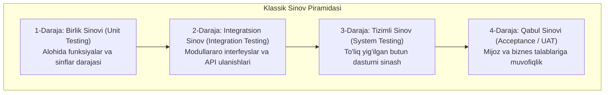

import { Cards, Callout } from 'nextra/components'

# Funksional Sinov va Sinov Darajalari (Functional Testing Levels)

**Funksional sinov** — dasturiy ta'minotning har bir funksiyasi va moduli biznes talablarida (SRS) belgilangan vazifalarni aynan kutilgandek to'g'ri bajarayotganligini tekshirish jarayonidir.

Funksional sinov "Tizim nima qiladi?" degan savolga javob beradi va u eng kichik kod birliklaridan tortib to butun biznes tizimining to'liq qabul qilinishigacha bo'lgan **4 ta asosiy darajada (Levels of Testing)** bosqichma-bosqich amalga oshiriladi.

---

## Sinov Piramidasi va Darajalari

---

## Modul Bo'limlari

<Cards num={2}>
  <Cards.Card
    title="▶️ Unit Testing (Birlik Sinovi)"
    href="/docs/functional-testing/unit-testing"
  >
    Dasturning eng kichik ajralmas qismlarini (funksiya, metod, klass) izolyatsiyalangan holda sinash.
  </Cards.Card>
  <Cards.Card
    title="▶️ Integration Testing"
    href="/docs/functional-testing/integration-testing"
  >
    Alohida modullarni birlashtirish: Big Bang, Top-Down, Bottom-Up uslublari hamda Stubs va Drivers tushunchalari.
  </Cards.Card>
  <Cards.Card
    title="▶️ System Testing (Tizimli Sinov)"
    href="/docs/functional-testing/system-testing"
  >
    Butun integratsiyalashgan tizimning yakuniy texnik talablarga (SRS) to'liq mosligini yaxlit tekshirish.
  </Cards.Card>
  <Cards.Card
    title="▶️ Acceptance Testing (Alpha & Beta)"
    href="/docs/functional-testing/acceptance-testing"
  >
    Mahsulotni foydalanishga qabul qilish: Ichki Alpha sinovlari va real mijozlar ishtirokidagi Beta sinovlari.
  </Cards.Card>
</Cards>
