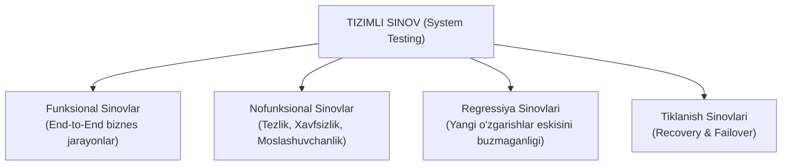

import { Callout } from 'nextra/components'

# System Testing: Tizimli Sinov

**System Testing** — to'liq yig'ilgan, barcha modullari va tashqi integratsiyalari yakunlangan yaxlit dasturiy tizimning dastlabki texnik talablarga (SRS — Software Requirements Specification) to'liq va beg'ubor muvofiqligini har tomonlama tekshirish jarayonidir.

Bu sinov darajasida tizim qora quti (Black Box) sifatida, real ishlab chiqarish (Production) sharoitiga maksimal darajada yaqinlashtirilgan muhitda tekshiriladi.

---

## Tizimli Sinovning Qamrovi

Tizimli sinov o'z ichiga ham funksional, ham nofunksional jihatlarni birlashtirgan holda olib boriladi:

---

## Tizimli Sinovning Asosiy Xususiyatlari

1. **Butunlik (End-to-End):** Bitta biznes ssenariy boshidan to oxirigacha sinovdan o'tkaziladi. Masalan: yangi foydalanuvchini ro'yxatdan o'tkazish, elektron pochta orqali tasdiqlash, buyurtma berish, to'lov qilish, ombor qoldig'ini yangilash va kvitansiya generatsiyasi.
2. **Haqiqiy muhit (Staging Environment):** Tizimli sinov ishlab chiqaruvchining lokal kompyuterida emas, balki real serverlar, real ma'lumotlar bazasi klasterlari va real tarmoq parametrlariga ega Staging muhitida bajariladi.
3. **Mustaqil QA jamoasi:** Bu sinov darajasini dasturchilar emas, balki professional va xolis QA muhandislari amalga oshiradi.

---

## Tizimli Sinov va Birlik Sinovi O'rtasidagi Farqlar

| Mezon | Unit Testing | System Testing |
| :--- | :--- | :--- |
| **Qamrovi** | Alohida funksiya yoki klass | Butun yaxlit tizim |
| **Bajaruvchi** | Dasturchi | QA Muhandisi |
| **Uslub** | White Box (Oq quti) | Asosan Black Box (Qora quti) |
| **Muhit** | Lokal dasturchi kompyuteri | Staging / Test serveri |
| **Fokus** | Kodning texnik to'g'riligi | Biznes talablariga to'liq javob berishi |

<Callout type="info">
  **Chiqish mezoni (Exit Criteria):** Tizimli sinovdan muvaffaqiyatli o'tmagan dastur hech qachon mijozga (UAT) yoki jonli efirga (Production) chiqarilmaydi. Odatda barcha Blocker va Critical darajadagi xatoliklar 100% yopilgan bo'lishi talab etiladi.
</Callout>
