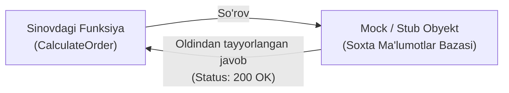

import { Callout } from 'nextra/components'

# Unit Testing: Birlik (Modul) Sinovi

**Unit Testing** — dasturiy ta'minotning eng kichik, mustaqil sinovdan o'tkazilishi mumkin bo'lgan bo'lagini (birlik / modul — odatda bitta alohida funksiya, metod, protsedura yoki sinf) tashqi bog'liqliklardan ajratilgan (izolyatsiyalangan) holda tekshirish jarayonidir.

Bu sinov piramidasining eng quyi poydevori bo'lib, xatoliklarni eng erta va eng arzon xarajat bilan bartaraf etishga xizmat qiladi.

---

## Kim Bajaradi va Qanday Asboblar Ishlatiladi?

Unit sinovlarini bevosita **Dasturchilar (Software Developers)** kod yozish jarayonining o'zida amalga oshiradilar.

### Ommabop Unit Sinov Freymvorklari:
- **JavaScript / TypeScript:** Jest, Vitest, Mocha
- **Python:** PyTest, Unittest
- **Java:** JUnit 5, TestNG
- **C# / .NET:** NUnit, xUnit

---

## Mock va Stub Tushunchalari (Izolyatsiya Qilish)

Haqiqiy loyihalarda bitta funksiya ma'lumotlar bazasiga, tashqi to'lov tizimiga yoki uchinchi tomon API ga murojaat qilishi mumkin. Unit test paytida haqiqiy ma'lumotlar bazasiga ulanish yoki haqiqiy pul yechish xavfli va sekindir.

Shuning uchun tashqi bog'liqliklar soxta namunalar (**Test Doubles**) bilan almashtiriladi:

- **Stub (Po'kak / Qo'zg'almas taqlidchi):** Funksiya so'rov yuborganida oldindan tayyorlab qo'yilgan qat'iy javobni qaytaradi (masalan: doimo balansda 1000 dollar bor deb javob berish).
- **Mock (Xulq-atvor taqlidchisi):** Funksiya tashqi obyektga to'g'ri parametrlar bilan murojaat qildimi-yo'qligini, chaqiruvlar sonini va xulq-atvorini tekshiradi.

---

## Unit Testingning Afzalliklari va Cheklovlari

| Afzalliklari | Cheklovlari |
| :--- | :--- |
| Nuqsonlar kod yozilgan daqiqadayoq aniqlanadi | Modullar o'rtasidagi integratsiya xatolarini aniqlay olmaydi |
| Refaktoring (kodni qayta ishlash) paytida xavfsizlik kafolatini beradi | Murakkab UI/UX xatolarini topa olmaydi |
| Dasturchilarni toza, modulli va kam bog'langan (loose coupling) kod yozishga majbur qiladi | Mock va Stub larni yaratish qo'shimcha vaqt oladi |

<Callout type="info">
  **Iqtisodiy samaradorlik:** Birlik sinovi bosqichida topilgan xatolikni tuzatish narxi 1 birlik bo'lsa, xuddi shu xatolik ishlab chiqarish (Production) bosqichida aniqlansa, uni tuzatish narxi 30 dan 100 baravargacha qimmatga tushadi.
</Callout>
