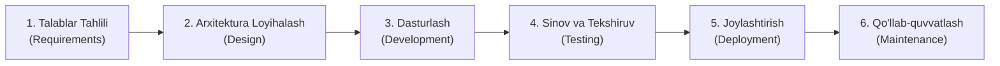
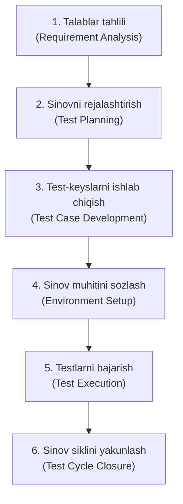

import { Callout } from 'nextra/components'

# SDLC va STLC: Dasturiy Ta'minot va Sinov Hayotiy Sikli

Zamonaviy dasturiy muhandislikda sifatli tizim yaratish rejasiz amalga oshirilmaydi. Mahsulot g'oya holatidan tortib to to'liq foydalanishga topshirilgunga qadar ikki muhim jarayondan o'tadi: **SDLC (Software Development Life Cycle)** va uning ajralmas qismi bo'lgan **STLC (Software Testing Life Cycle)**.

---

## 1. SDLC (Software Development Life Cycle) Nima?

**SDLC** — bu dasturiy ta'minotni eng yuqori sifat, minimal xarajat va belgilangan muddatda ishlab chiqishni ta'minlovchi bosqichma-bosqich jarayonlar majmuidir.

### SDLC Bosqichlari:
1. **Talablar tahlili (Requirement Analysis):** Buyurtmachi va biznes manfaatdor shaxslarining ehtiyojlari to'planadi hamda BRS (Business Requirement Specification) va SRS (Software Requirement Specification) hujjatlarida aks ettiriladi.
2. **Arxitekturaviy dizayn (System Design):** Tizim arxitekturasi, ma'lumotlar bazasi sxemalari, API interfeyslari (HLD — High-Level Design) va modullarning ichki mantiqlari (LLD — Low-Level Design) ishlab chiqiladi.
3. **Kod yozish (Implementation / Coding):** Dasturchilar belgilangan dasturlash tillari va freymvorklar yordamida texnik talablarni dasturiy kodga aylantiradi.
4. **Sinov (Testing):** QA muhandislari ishlab chiqilgan kodning dastlabki talablarga to'liq javob berishini, xavfsizligini va yuklamaga chidamliligini tekshiradi.
5. **Foydalanishga topshirish (Deployment):** Tizim ishlab chiqarish (Production) serverlariga joylashtiriladi va yakuniy foydalanuvchilar ixtiyoriga beriladi.
6. **Texnik xizmat ko'rsatish (Maintenance):** Foydalanish davrida yuzaga keladigan kamchiliklarni tuzatish, tizimni yangilash va unumdorligini oshirish ishlari bajariladi.

---

## 2. STLC (Software Testing Life Cycle) Nima?

**STLC** — dasturiy ta'minot sifatini kafolatlash maqsadida faqat sinov jarayoniga yo'naltirilgan aniq, tizimli qadamlar ketma-ketligidir. STLC har bir bosqichida aniq kirish (Entry Criteria) va chiqish (Exit Criteria) mezonlariga ega.

### STLC Bosqichlari Tahlili:

| STLC Bosqichi | Asosiy Faoliyat | Natijaviy Hujjat (Deliverable) |
| :--- | :--- | :--- |
| **1. Requirement Analysis** | Funksional va nofunksional talablarni tahlil qilish, noaniqliklarni aniqlash | RTM (Kuzatuvchanlik matrisasi qoralamasi), Talablar bo'yicha savol-javoblar |
| **2. Test Planning** | Resurslar, muddatlar, ko'lam (scope) va xatarlarni aniqlash | Test Plan, Test Strategiya, Baholash (Effort Estimation) |
| **3. Test Case Development** | Batafsil test ssenariylari, test-keyslar va test ma'lumotlarini (test data) tayyorlash | Test-keyslar, Test ssenariylari, Test ma'lumotlari |
| **4. Test Environment Setup** | Sinov serverlari, ma'lumotlar bazasi va tarmoq parametrlarini ishlab chiqarish muhitiga moslab sozlash | Tayyor sinov muhiti, Smoke-test natijalari |
| **5. Test Execution** | Test-keyslarni bajarish, xatoliklarni ro'yxatga olish (Bug Logging) va qayta tekshirish | Bajarilgan testlar hisoboti, Bug Reportlar |
| **6. Test Closure** | Sinov hisobotlarini tayyorlash, defektlar metrikasini tahlil qilish va darslarni jamlash | Test Summary Report, Sifat xulosasi |

---

## 3. SDLC va STLC O'rtasidagi Asosiy Farqlar

| Mezon | SDLC | STLC |
| :--- | :--- | :--- |
| **Asosiy maqsad** | Dasturiy ta'minotni noldan yaratish va foydalanuvchiga yetkazish | Dasturdagi nuqsonlarni erta aniqlash va sifatni ta'minlash |
| **Qamrovi** | Butun dasturiy mahsulot ishlab chiqish jarayonini qamrab oladi | Faqat sinov va tekshirish faoliyatini qamrab oladi |
| **Boshlanish vaqti** | Loyiha boshlanishi bilanoq start oladi | Talablar aniqlanishi bilan parallel boshlanadi |
| **Ijrochilari** | Biznes tahlilchilar, Arxitektorlar, Dasturchilar, DevOps va QA | Asosan QA muhandislari, Test Lead va Test Menejerlar |
| **Yakuniy mahsulot** | Ishlaydigan dasturiy ta'minot (mahsulot) | Sifat sertifikati, Test hisoboti va tuzatilgan tizim |

<Callout type="info">
  **Eslab qoling:** STLC alohida ajralgan orol emas, balki SDLC ichidagi o'ta muhim kichik tizimdir. Eng zamonaviy metodologiyalarda sinov dastur kodi yozilishidan ancha oldin — talablar tahlili bosqichidayoq boshlanadi.
</Callout>
