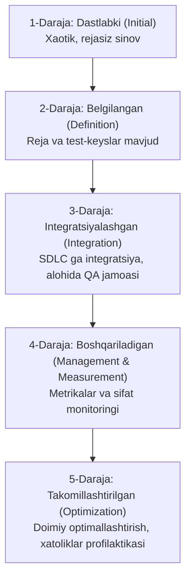
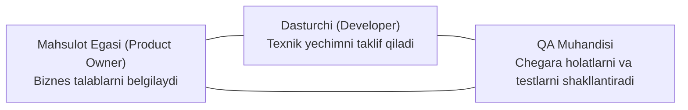

import { Callout } from 'nextra/components'

# Test Yetuklik Modeli (TMM) va ATDD

Kompaniyada dasturiy ta'minot sifatini ta'minlash darajasi tasodifiy harakatlardan tizimli, bashorat qilinadigan va avtomatlashtirilgan jarayongacha bo'lgan yo'lni bosib o'tadi. Ushbu rivojlanish darajasini baholash uchun **TMM (Test Maturity Model)** qo'llaniladi. Shuningdek, talablarni sifatli sinashda **ATDD (Acceptance Test Driven Development)** zamonaviy yondashuvi muhim o'rin tutadi.

---

## 1. Test Yetuklik Modeli (TMM) Nima?

**TMM (Test Maturity Model)** — tashkilotning dasturiy ta'minotni sinash jarayonlari qanchalik etuk, samarali va barqaror ekanligini baholovchi 5 bosqichli xalqaro modeldir (Illinois Institute of Technology tomonidan ishlab chiqilgan).

### TMM Bosqichlari Tafsiloti:

1. **1-Daraja: Dastlabki bosqich (Initial):**
   - Sinovlar xaotik va tizimsiz xarakterga ega.
   - Aniq test rejasi yoki hujjatlari mavjud emas. Sinov faqat dasturchi kod yozib bo'lganidan so'ng, tizimning umumiy ishlashini yuzaki ko'rishdan iborat.
   - Sinovning yagona maqsadi — dasturning ishga tushishini isbotlash.

2. **2-Daraja: Belgilangan bosqich (Definition / Phase Definition):**
   - Sinov dasturlashdan alohida mustaqil jarayon sifatida tan olinadi.
   - Test rejalari tuziladi, asosiy test-keyslar yoziladi.
   - Sinov faqat kod tayyor bo'lgandan keyin (reaktiv tarzda) boshlanadi.

3. **3-Daraja: Integratsiyalashgan bosqich (Integration):**
   - Sinov butun SDLC davomida amalga oshiriladi (Erta sinash tamoyili).
   - Mustaqil va professional QA jamoasi faoliyat yuritadi.
   - Dasturiy ta'minotning texnik talablari ham tekshiriladi (Verification).

4. **4-Daraja: Boshqariladigan va o'lchanadigan bosqich (Management and Measurement):**
   - Sinov jarayoni aniq metrikalar bilan o'lchanadi (Test qamrovi, Defekt zichligi, Sinov tezligi).
   - Tizimning sifat ko'rsatkichlari (ishonchlilik, qulaylik, unumdorlik) raqamli monitoring qilinadi.
   - Ko'rib chiqishlar (Review) va auditlar tizimli tus oladi.

5. **5-Daraja: Doimiy takomillashtiriladigan bosqich (Optimization):**
   - Asosiy e'tibor xatolarni topishga emas, balki ularning paydo bo'lishining oldini olishga (Defect Prevention) qaratiladi.
   - Jarayonlarni avtomatlashtirish, ilg'or asboblarni joriy etish va QA jarayonini doimiy tahlil qilish orqali xarajatlar keskin kamaytiriladi.

---

## 2. ATDD (Acceptance Test Driven Development) Nima?

**ATDD** — dasturiy ta'minot kodi yozilishidan oldin buyurtmachi (Mijoz / Mahsulot egasi), dasturchi va QA muhandisi birgalikda tizimning qabul mezonlarini (Acceptance Criteria) va qabul testlarini belgilaydigan hamkorlikka asoslangan rivojlantirish uslubidir.

Ushbu jarayon **"Uch do'st" (The Three Amigos)** hamkorligi deb ataladi:

### ATDD ning 4 Asosiy Bosqichi:

1. **Muhokama qilish (Discuss):** Uchlik (Biznes, Dev, QA) yangi funksionallik nima qilishi kerakligini real misollar orqali muhokama qiladi.
2. **Aniqlashtirish (Distill):** Muhokama qilingan misollar rasmiy qabul test-keyslariga yoki Gherkin formatidagi (`Given-When-Then`) ssenariylarga aylantiriladi.
3. **Ishlab chiqish (Develop):** Dasturchilar ushbu qabul testlaridan muvaffaqiyatli o'tuvchi kodni yozadilar.
4. **Namoyish qilish (Demo):** Ishlab chiqilgan tayyor funksionallik qabul testlari asosida buyurtmachiga namoyish qilinadi.

<Callout type="info">
  **TDD vs ATDD farqi:** TDD (Test Driven Development) quyi darajadagi dasturchi kodi birliklarini (Unit Test) yozishga qaratilgan bo'lsa, ATDD biznes talablarining to'liq va to'g'ri bajarilishini foydalanuvchi nigohi bilan tekshirishga xizmat qiladi.
</Callout>
