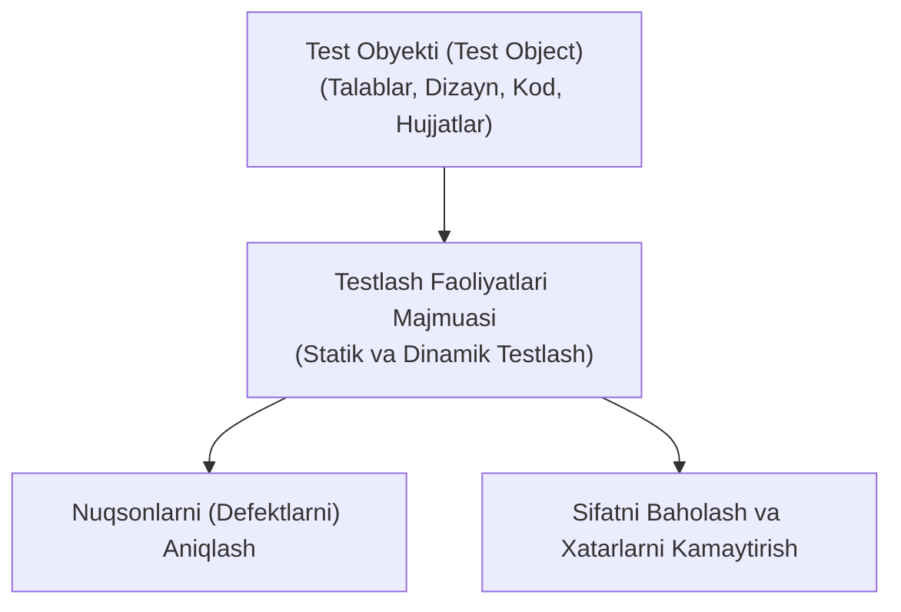
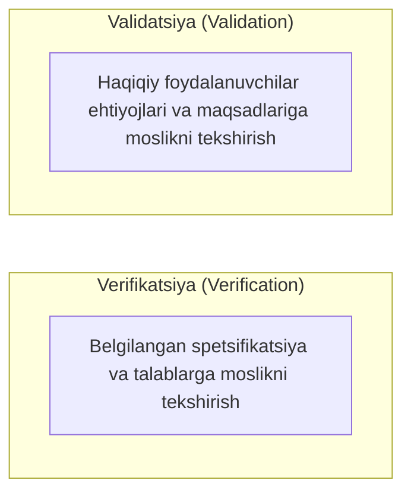
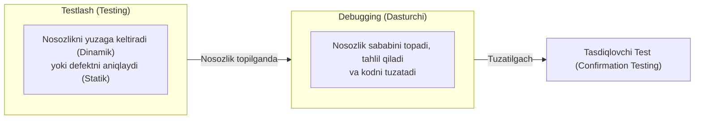
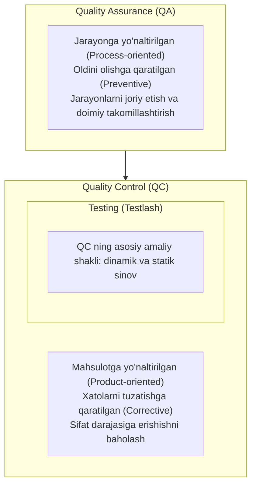
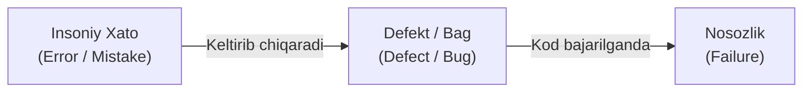
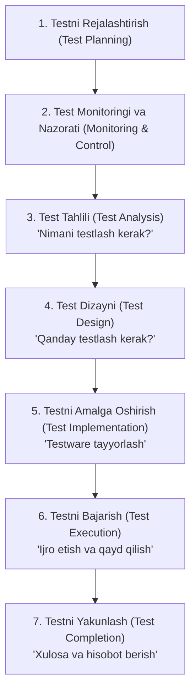
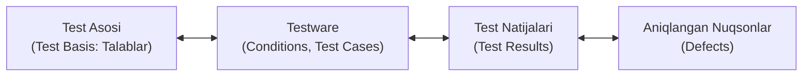
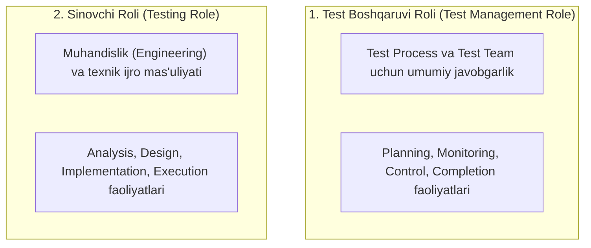
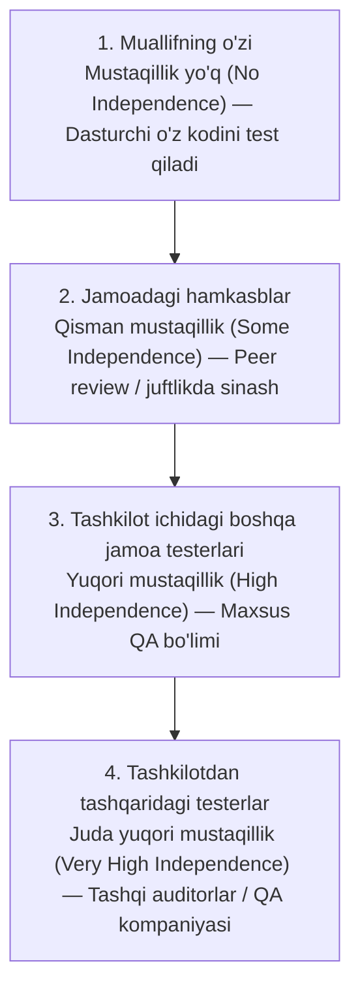

import { Callout } from 'nextra/components'

# 1-bob: Sinov Asoslari (Fundamentals of Testing)

Dasturiy ta’minot tizimlari kundalik hayotimizning ajralmas qismiga aylangan. Ko‘pchilik kutilganidek ishlamagan dasturiy ta’minot bilan duch kelgan. To‘g‘ri ishlamaydigan dasturiy ta’minot ko‘plab muammolarga sabab bo‘lishi mumkin, jumladan:
- Pul yo‘qotish;
- Vaqt yo‘qotish;
- Biznes obro‘siga putur yetkazish;
- Hatto eng og‘ir holatlarda jarohatlanish yoki o‘limga ham olib kelishi mumkin.

Dasturiy ta’minotni testlash dasturiy ta’minot sifatini baholaydi va undan foydalanish jarayonida yuzaga kelishi mumkin bo‘lgan nosozliklar xavfini kamaytirishga yordam beradi.

---

## 1.1. Testlash Nima? (What is Testing?)

**Dasturiy ta’minotni testlash** — bu nuqsonlarni (defektlarni) aniqlash va dasturiy ta’minot ish mahsulotlari (*work products*) sifatini baholashga qaratilgan faoliyatlar majmuasidir. Testlanayotgan ushbu ish mahsulotlari **test obyekti (test object)** deb ataladi.

### Keng Tarqalgan Noto‘g‘ri Tushunchalar

1. **"Testlash faqat testlarni bajarishdan iborat" degan noto‘g‘ri qarash:**  
   Ko‘pchilik testlashni faqat dasturiy ta’minotni ishga tushirish va test natijalarini tekshirish deb hisoblaydi. Aslida esa, dasturiy ta’minotni testlash bundan ancha kengroq bo‘lib, boshqa ko‘plab faoliyatlarni (rejalashtirish, tahlil, dizayn, monitoring) ham o‘z ichiga oladi hamda dasturiy ta’minotni ishlab chiqish hayotiy sikli (SDLC) bilan uyg‘un holda olib borilishi kerak.

2. **"Testlash faqat verifikatsiyadan iborat" degan noto‘g‘ri qarash:**  
   Aslida testlash verifikatsiyani o‘z ichiga olishi bilan birga validatsiyani ham to‘liq qamrab oladi:
   - **Verifikatsiya (Verification):** Tizim belgilangan talablarni bajarayotganligini tekshirish (*"Mahsulotni to‘g‘ri quryapmizmi?"*).
   - **Validatsiya (Validation):** Tizim foydalanuvchilar va boshqa manfaatdor tomonlarning ehtiyojlarini haqiqiy ish muhitida qondirayotganligini tekshirish (*"To‘g‘ri mahsulotni quryapmizmi?"*).

### Dinamik va Statik Testlash

Testlash dinamik yoki statik bo‘lishi mumkin:
- **Dinamik testlash (Dynamic Testing):** Dasturiy ta’minotni ishga tushirish orqali amalga oshiriladi. Unda test holatlarini (*test cases*) yaratish uchun turli test texnikalari (*test techniques*) va test yondashuvlari (*test approaches*) qo‘llaniladi.
- **Statik testlash (Static Testing):** Dasturiy ta’minotni ishga tushirmasdan bajariladi. U ko‘rib chiqish (*review*) va statik tahlil (*static analysis*) ni o‘z ichiga oladi.

### Testlash — Intellektual Faoliyat

Testlash faqat texnik faoliyat emas. Uni to‘g‘ri rejalashtirish (*planning*), boshqarish (*management*), baholash (*estimation*), monitoring qilish (*monitoring*) va nazorat qilish (*control*) ham zarur.

Testerlar turli vositalardan (*tools*) foydalanadilar, biroq testlash asosan intellektual faoliyat ekanligini unutmaslik kerak. U testerlardan maxsus bilimlarga ega bo‘lishni, tahliliy fikrlash (*analytical skills*), tanqidiy fikrlash (*critical thinking*) va tizimli fikrlash (*systems thinking*) ko‘nikmalarini qo‘llashni talab qiladi *(Myers 2011, Roman 2018)*.

---

### 1.1.1. Testlashning Maqsadlari (Test Objectives)

Testlashning asosiy maqsadlari quyidagilardan iborat:
- Talablar (*requirements*), foydalanuvchi hikoyalari (*user stories*), dizaynlar (*designs*) va kod (*code*) kabi ish mahsulotlarini baholash;
- Tizimda nosozliklarni (*failures*) yuzaga keltirish va defektlarni (*defects*) aniqlash;
- Test obyektining talab etilgan qamrov darajasi (*test coverage*) ga erishilganligini ta’minlash;
- Dasturiy ta’minot sifati yetarli bo‘lmasligi bilan bog‘liq xavf darajasini kamaytirish;
- Belgilangan talablar bajarilganligini verifikatsiya qilish;
- Test obyektining shartnoma (*contractual*), huquqiy (*legal*) va me’yoriy (*regulatory*) talablarga mosligini tekshirish;
- Manfaatdor tomonlarga (*stakeholders*) asosli qaror qabul qilishlari uchun zarur ma’lumotlarni taqdim etish;
- Test obyektining sifatiga nisbatan ishonchni oshirish;
- Test obyekti to‘liq ekanligini va manfaatdor tomonlar kutganidek ishlashini validatsiya qilish.

#### Maqsadlarning Vaziyatga Bog‘liqligi
Testlash maqsadlari vaziyatga qarab farq qilishi mumkin. Bu vaziyat quyidagi omillarni o‘z ichiga oladi:
- Testlanayotgan ish mahsuloti (*work product*);
- Test darajasi (*test level*);
- Xavflar (*risks*);
- Qo‘llanilayotgan dasturiy ta’minotni ishlab chiqish hayotiy sikli (SDLC);
- Biznes muhitiga oid omillar:
  - Kompaniya tuzilmasi (*corporate structure*);
  - Raqobat sharoiti (*competitive considerations*);
  - Mahsulotni bozorga chiqarish muddati (*time to market*).

---

### 1.1.2. Testlash va Debugging (Testing and Debugging)

Testlash (Testing) va Debugging — bu bir-biridan alohida faoliyatlardir.

Testlash quyidagilarni amalga oshirishi mumkin:
- **Dinamik testlash:** Dasturdagi defektlar (*defects*) sababli yuzaga keladigan nosozliklarni (*failures*) keltirib chiqarish;
- **Statik testlash:** Test obyektidagi defektlarni bevosita aniqlash.

#### Dinamik Testlashda Debugging
Agar dinamik testlash natijasida nosozlik (*failure*) yuzaga kelsa, debugging ushbu nosozlikning sababini (ya'ni defektni) topish, uni tahlil qilish va bartaraf etish bilan shug‘ullanadi.

Bunday holatda debugging jarayoni odatda quyidagi bosqichlardan iborat bo‘ladi:
1. **Nosozlikni qayta yuzaga keltirish (*Reproduction of a failure*);**
2. **Tashxis qo‘yish (*Diagnosis*) — defektni topish;**
3. **Defektni tuzatish (*Fixing the defect*).**

Shundan so‘ng:
- **Tasdiqlovchi test (*Confirmation Testing / Re-testing*):** Kiritilgan tuzatish muammoni bartaraf etganligini tekshiradi. Imkon qadar, tasdiqlovchi testni dastlabki testni bajargan testerning o‘zi bajarishi tavsiya etiladi.
- **Regressiya testi (*Regression Testing*):** Kiritilgan tuzatishlar test obyektining boshqa qismlarida yangi nosozliklarni yuzaga keltirmaganligini tekshirish uchun bajariladi.

#### Statik Testlashda Debugging
Agar statik testlash defektni aniqlasa, debugging uning o‘zini to‘g‘ridan-to‘g‘ri bartaraf etish bilan shug‘ullanadi.

Bu holatda:
- Nosozlikni qayta hosil qilish (*reproduction*) talab qilinmaydi;
- Tashxis qo‘yish (*diagnosis*) ham zarur emas;
- Chunki statik testlash defektlarni bevosita aniqlaydi va u nosozliklarni (*failures*) keltirib chiqarmaydi.

---

## 1.2. Nima Uchun Testlash Zarur?

Testlash — bu **sifat nazorati (Quality Control — QC)**ning bir shakli bo‘lib, belgilangan:
- Test maqsadlariga;
- Test doirasiga (*scope*);
- Vaqt cheklovlariga;
- Sifat talablariga;
- Byudjet cheklovlariga amal qilgan holda ularga erishishga yordam beradi.

Loyihaning muvaffaqiyatiga testlashning hissasi faqat test jamoasi faoliyati bilan cheklanmaydi. Har qanday manfaatdor tomon (*stakeholder*) o‘zining testlash bo‘yicha bilim va ko‘nikmalaridan foydalanib, loyihaning muvaffaqiyatiga hissa qo‘shishi mumkin.

Dasturiy ta’minotning komponentlarini, tizimlarini va ularga tegishli ish mahsulotlarini (masalan, hujjatlar) testlash orqali dasturdagi defektlarni aniqlash mumkin.

---

### 1.2.1. Testlashning Muvaffaqiyatga Qo‘shadigan Hissasi

1. **Iqtisodiy samaradorlik:** Testlash defektlarni iqtisodiy jihatdan samarali usulda aniqlash imkonini beradi. Keyinchalik ushbu defektlar debugging orqali bartaraf etiladi va testlash bilvosita test obyekti sifatini oshirishga xizmat qiladi.
2. **SDLC da sifatni baholash:** SDLC ning turli bosqichlarida test obyekti sifatini bevosita baholash imkonini beradi. Bu natijalar loyiha boshqaruvining bir qismi sifatida quyidagi qarorlarni qabul qilishga yordam beradi:
   - Keyingi SDLC bosqichiga o‘tish;
   - Mahsulotni chiqarish (*release*) yoki chiqarmaslik.
3. **Foydalanuvchilar manfaatlarini ifodalash:** Testerlar foydalanuvchilarning ehtiyojlarini to‘g‘ri tushungan holda, ushbu ehtiyojlar butun hayotiy sikl davomida hisobga olinishini ta’minlaydilar. Foydalanuvchilar vakillarini loyihaga doimiy jalb qilish ko‘pincha xarajatlarning yuqoriligi va mos nomzodlarni topish qiyinligi tufayli amaliy jihatdan imkonsiz bo‘ladi.
4. **Muvofiqlikni ta'minlash:** Shartnomaviy (*contractual*) yoki huquqiy (*legal*) talablarni bajarish, shuningdek tartibga soluvchi standartlar (*regulatory standards*) ga muvofiqlikni ta’minlash uchun xizmat qiladi.

---

### 1.2.2. Testlash va Sifatni Ta’minlash (Quality Assurance — QA)

Ko‘pincha odamlar "testlash (Testing)" va "sifatni ta’minlash (Quality Assurance – QA)" atamalarini bir xil ma’noda ishlatadilar. Aslida esa, ular bir xil tushuncha emas.

| Xususiyat | Testlash (Testing) va QC | Sifatni Ta’minlash (QA) |
| :--- | :--- | :--- |
| **Yo‘nalishi** | Mahsulotga yo‘naltirilgan (*product-oriented*) | Jarayonga yo‘naltirilgan (*process-oriented*) |
| **Yondashuvi** | Xatolarni tuzatishga qaratilgan (*corrective*) | Xatolarning oldini olishga qaratilgan (*preventive*) |
| **Asosiy vazifasi** | Mahsulot talab etilgan sifat darajasiga yetishini tekshirish | Jarayonlarni to‘g‘ri joriy etish va ularni doimiy takomillashtirish |
| **Tamoyili** | Nuqsonlarni fosh etish va sifatni baholash | *"Agar yaxshi ishlab chiqilgan jarayon to‘g‘ri bajarilsa, natijada sifatli mahsulot yaratiladi"* |
| **Qo‘llanilishi** | Sifat nazorati (QC) shakli | Butun ishlab chiqish va testlash jarayonlariga tegishli |

#### Sifat Nazorati (QC) ning Boshqa Usullari:
- **Formal metodlar (*Formal Methods*):** Model checking, to‘g‘riligini isbotlash (*proof of correctness*);
- **Simulyatsiya (*Simulation*);**
- **Prototiplash (*Prototyping*).**

#### Test Natijalarining Roli:
Test natijalaridan ham Testing, ham QA foydalanadi:
- **Testing:** Test natijalaridan defektlarni tuzatish uchun foydalanadi;
- **QA:** Test natijalari orqali ishlab chiqish va testlash jarayonlari qanchalik samarali ishlayotganini baholaydi va ularni yaxshilash uchun fikr-mulohaza (*feedback*) oladi.

---

### 1.2.3. Xatolar (Errors), Defektlar (Defects), Nosozliklar (Failures) va Asosiy Sabablar (Root Causes)

Odamlar xatolar (*errors* yoki *mistakes*) qiladi. Bu xatolar natijasida defektlar (*defects*, *faults* yoki *bugs*) yuzaga keladi. Defektlar esa o‘z navbatida nosozliklar (*failures*) ga sabab bo‘lishi mumkin.

#### Inson Xatolarining Sabablari:
- Vaqt bosimi (*time pressure*);
- Ish mahsulotlarining murakkabligi;
- Jarayonlarning murakkabligi;
- Infratuzilmaning murakkabligi;
- Tizimlar yoki odamlar o‘rtasidagi murakkab o‘zaro aloqalar;
- Charchoq;
- Yetarli tayyorgarlik yoki bilimning yo‘qligi.

#### Defektlar Qayerlarda Bo‘lishi Mumkin?
Defektlar quyidagi ish mahsulotlarida uchrashi mumkin:
- Talablar hujjati (*Requirements Specification*);
- Test skriptlari (*Test Scripts*);
- Dastur manba kodi (*Source Code*);
- Build fayllari kabi yordamchi ish mahsulotlari.

Agar SDLC ning dastlabki bosqichlarida yaratilgan ish mahsulotlaridagi defektlar vaqtida aniqlanmasa, ular keyingi bosqichlarda yangi defektlarning paydo bo‘lishiga sabab bo‘ladi.

#### Defekt Bajarilganda Nima Sodir Bo‘ladi?
Agar koddagi defekt bajarilsa (*execute qilinsa*), tizim:
- Bajarishi kerak bo‘lgan vazifani bajarmasligi;
- Yoki bajarishi kerak bo‘lmagan ishni bajarishi mumkin. Natijada nosozlik (*failure*) yuzaga keladi.

*Eslatma:* Ba'zi defektlar har safar bajarilganda nosozlikni keltirib chiqaradi. Boshqalari esa faqat ma'lum sharoitlarda nosozlikka olib keladi. Ayrim defektlar esa umuman nosozlikni keltirib chiqarmasligi ham mumkin.

#### Nosozliklarning Boshqa Sabablari:
Nosozliklar faqat inson xatolari yoki defektlar tufayli yuzaga kelmaydi. Ular tashqi muhit omillari sababli ham sodir bo‘lishi mumkin (masalan: radiatsiya yoki elektromagnit maydonlar firmware'da defektlarni keltirib chiqarishi mumkin).

#### Asosiy Sabab (Root Cause):
**Root Cause** — muammoning yuzaga kelishiga sabab bo‘lgan eng asosiy omildir (masalan: inson xatosiga olib kelgan vaziyat, noto‘g‘ri jarayon, yetarli treningning yo‘qligi).

Root Cause odatda **Root Cause Analysis (RCA)** orqali aniqlanadi. Bu tahlil odatda nosozlik (*failure*) sodir bo‘lganda yoki defekt aniqlanganda amalga oshiriladi. Asosiy sababni aniqlab va bartaraf etib, shunga o‘xshash nosozliklarning oldini olish yoki ularning takrorlanish sonini kamaytirish mumkin.

---

## 1.3. Testlash Tamoyillari (Testing Principles)

Yillar davomida barcha turdagi testlashlarda qo‘llanilishi mumkin bo‘lgan 7 ta umumiy testlash tamoyili ishlab chiqilgan:

### 1-tamoyil. Testlash defektlarning mavjudligini ko‘rsatadi, ularning yo‘qligini emas
*(Testing shows the presence, not the absence of defects)*  
Testlash test obyektida defektlar mavjudligini ko‘rsatishi mumkin, ammo unda hech qanday defekt yo‘qligini isbotlay olmaydi *(Buxton, 1970)*. Testlash test obyektida aniqlanmay qolgan defektlar ehtimolini kamaytiradi. Biroq, hech qanday defekt topilmagan bo‘lsa ham, bu test obyektining mutlaqo to‘g‘ri yoki xatosiz ekanligini isbotlamaydi.

### 2-tamoyil. To‘liq (Exhaustive) testlashning imkoni yo‘q
Barcha mumkin bo‘lgan holatlarni testlash amalda imkonsiz, faqat juda oddiy holatlar bundan mustasno *(Manna, 1978)*. Shuning uchun barcha narsani testlashga urinish o‘rniga quyidagilar qo‘llaniladi:
- Test texnikalari (*Test Techniques*);
- Test holatlarini ustuvorlashtirish (*Test Case Prioritization*);
- Xavfga asoslangan testlash (*Risk-Based Testing*).  
Ularning maqsadi test resurslarini eng muhim joylarga yo‘naltirishdir.

### 3-tamoyil. Erta testlash vaqt va mablag‘ni tejaydi
Jarayonning dastlabki bosqichlarida aniqlanib tuzatilgan defektlar keyingi ish mahsulotlarida yangi defektlarning paydo bo‘lishiga sabab bo‘lmaydi. Natijada:
- Sifat xarajatlari (*Cost of Quality*) kamayadi;
- SDLC ning keyingi bosqichlarida nosozliklar (*Failures*) kamroq uchraydi *(Boehm, 1981)*.  
Shu sababli Statik testlash va Dinamik testlash imkon qadar erta boshlanishi kerak.

### 4-tamoyil. Defektlar odatda bir joyga to‘planadi (Defect Clustering)
Odatda tizimning kam sonli komponentlari aniqlangan defektlarning katta qismini o‘z ichiga oladi yoki ishlash vaqtida yuz beradigan nosozliklarning aksariyatiga sabab bo‘ladi *(Enders, 1975)*. Bu holat Pareto tamoyili (80/20 qoidasi) ning amaliy ko‘rinishidir. Aniqlangan defektlar klasteri xavfga asoslangan testlash uchun muhim ma'lumot hisoblanadi.

### 5-tamoyil. Testlar eskiradi (Tests Wear Out)
Bir xil testlar qayta-qayta bajarilaversa, ular yangi defektlarni topish qobiliyatini asta-sekin yo‘qotadi *(Beizer, 1990)*. Buni oldini olish uchun:
- Mavjud testlar yangilanadi;
- Test ma'lumotlari o‘zgartiriladi;
- Yangi testlar yaratiladi.  
*Istisno:* Ayrim holatlarda bir xil testlarni takrorlash foydali hisoblanadi, masalan avtomatlashtirilgan regressiya testlarida (*Automated Regression Testing*).

### 6-tamoyil. Testlash kontekstga bog‘liq (Testing is Context Dependent)
Testlashning hamma vaziyatlarga mos keladigan yagona universal usuli mavjud emas. Turli loyihalar, mahsulotlar va sohalarda testlash turlicha tashkil etiladi *(Kaner, 2011)*.

### 7-tamoyil. Defektlar yo‘qligi muvaffaqiyatni kafolatlamaydi (Absence-of-Defects Fallacy)
Dasturiy ta’minotda defektlar yo‘qligi tizim muvaffaqiyatli bo‘lishini anglatmaydi. Barcha talablar to‘liq tekshirilib, topilgan barcha defektlar tuzatilgan bo‘lsa ham, tizim:
- Foydalanuvchilarning ehtiyojlarini qondirmasligi;
- Foydalanuvchilarning kutgan natijalarini bermasligi;
- Mijozning biznes maqsadlariga erishishiga yordam bermasligi;
- Yoki raqobatchilar mahsulotidan yomonroq bo‘lishi mumkin.  
Shuning uchun faqat Verification (Verifikatsiya) emas, balki Validation (Validatsiya) ham bajarilishi zarur *(Boehm, 1981)*.

---

## 1.4. Test Faoliyatlari, Testware va Test Rollari

Testlash har bir loyiha yoki vaziyatga bog‘liq bo‘lsa-da, yuqori darajada barcha loyihalarda uchraydigan umumiy test faoliyatlari mavjud. Ushbu faoliyatlar yig‘indisi **Test Jarayoni (Test Process)** ni tashkil qiladi.

Test rejalashtirish (*Test Planning*) jarayonida qaysi test faoliyatlari bajarilishi, ular qanday va qachon amalga oshirilishi belgilanadi.

---

### 1.4.1. Test Faoliyatlari va Vazifalari (Test Activities and Tasks)

Test faoliyatlari ketma-ket bajarilgandek ko‘rinsa-da, amalda ko‘pincha parallel ravishda yoki iterativ tarzda amalga oshiriladi:

1. **Testni Rejalashtirish (Test Planning):**
   - Test maqsadlarini belgilash;
   - Mavjud cheklovlar (vaqt, byudjet, resurs va boshqalar) doirasida ushbu maqsadlarga eng yaxshi erishadigan test yondashuvini tanlash.
2. **Test Monitoringi va Nazorati (Test Monitoring and Test Control):**
   - *Test monitoringi:* Test faoliyatlarini doimiy kuzatish hamda amaldagi natijalarni reja bilan solishtirish;
   - *Test nazorati:* Test maqsadlariga erishish uchun zarur choralarni ko‘rish.
3. **Test Tahlili (Test Analysis):**
   - Test bazasini (*Test Basis*) tahlil qilish;
   - Testlanishi mumkin bo‘lgan funksiyalarni aniqlash;
   - Test shartlarini (*Test Conditions*) belgilash va ularni xavf darajasiga qarab ustuvorlashtirish;
   - Test bazasi va test obyektidagi defektlarni aniqlash hamda ularning testlashga yaroqliligini (*Testability*) baholash;
   - *"Nimani testlash kerak?" (What to Test?)* savoliga o‘lchanadigan Qamrov Mezonlari (*Coverage Criteria*) orqali javob beradi.
4. **Test Dizayni (Test Design):**
   - Test shartlarini test holatlariga (*Test Cases*) aylantirish;
   - Boshqa test hujjatlarini (*Testware*), masalan Test Charter yaratish;
   - Coverage Items aniqlash (kirish ma'lumotlarini yaratish uchun);
   - Test ma'lumotlariga talablarni belgilash;
   - Test muhitini loyihalashtirish, zarur infratuzilma va vositalarni aniqlash;
   - *"Qanday testlash kerak?" (How to Test?)* savoliga javob beradi.
5. **Testni Amalga Oshirish (Test Implementation):**
   - Testni bajarish uchun zarur barcha Testware (test ma'lumotlari, test skriptlari, test protseduralari) ni yaratish;
   - Test holatlarini Test Procedures ga, ularni esa Test Suites ga birlashtirish;
   - Manual va avtomatlashtirilgan test skriptlarini yaratish;
   - Test protseduralarini ustuvorlashtirib, Test Execution Schedule ga joylashtirish;
   - Test muhitini (*Test Environment*) yaratish va to‘g‘ri sozlanganligini tekshirish.
6. **Testni Bajarish (Test Execution):**
   - Testlarni Test Execution Schedule asosida qo‘lda (*Manual*) yoki avtomatlashtirilgan (*Automated*) tarzda bajarish;
   - Continuous Testing va Pair Testing shakllarini qo‘llash;
   - Amaldagi natijalarni (*Actual Results*) kutilgan natijalar (*Expected Results*) bilan solishtirish;
   - Barcha natijalarni qayd etish (*Logging*);
   - G‘ayritabiiy holatlarni (*Anomalies*) tahlil qilish va aniqlangan nosozliklar bo‘yicha xatolik hisoboti (*Bug Report*) tayyorlash.
7. **Testni Yakunlash (Test Completion):**
   - Release, iteratsiya yoki test darajasi yakunida o‘tkaziladi;
   - Hal qilinmagan defektlar uchun Change Request yoki Product Backlog Item yaratish;
   - Kelajakda foydali bo‘lgan Testware ni arxivlash yoki topshirish;
   - Test muhitini kelishilgan holatga qaytarish yoki o‘chirish;
   - Bajarilgan test faoliyatlarini tahlil qilish, olingan saboqlar (*Lessons Learned*) va takomillashtirish vazifalarini aniqlash;
   - **Test Completion Report** tayyorlash va manfaatdor tomonlarga taqdim etish.

---

### 1.4.2. Kontekstga Bog‘liq Test Jarayoni (Test Process in Context)

Testlash manfaatdor tomonlar (*stakeholders*) tomonidan moliyalashtiriladi va uning asosiy maqsadi ularning biznes ehtiyojlarini qondirishdir. Shuning uchun testlash quyidagi kontekst omillariga bog‘liq:

| Kontekst Omili | Tarkibi va Ta'siri |
| :--- | :--- |
| **Manfaatdor tomonlar (Stakeholders)** | Ehtiyojlari, kutilayotgan natijalar, talablar va hamkorlikka tayyorligi |
| **Jamoa a'zolari (Team Members)** | Bilim, ko‘nikma, tajriba, mavjudlik va o‘qitishga bo‘lgan ehtiyoj |
| **Biznes sohasi (Business Domain)** | Test obyektining muhimligi (*criticality*), xavflar, bozor va qonunchilik talablari |
| **Texnik omillar (Technical Factors)** | Dastur turi, mahsulot arxitekturasi va texnologiyalar |
| **Loyiha cheklovlari (Project Constraints)** | Qamrov (*scope*), vaqt, byudjet va resurslar |
| **Tashkiliy omillar (Organizational Factors)** | Tashkilot tuzilmasi, siyosatlari va amaldagi ish uslublari |
| **SDLC Modeli** | Muhandislik amaliyotlari va ishlab chiqish metodologiyasi (Agile, Waterfall) |
| **Vositalar (Tools)** | Mavjudligi, qulayligi va standartlarga mosligi |

Ushbu omillar test strategiyasiga, texnikalariga, avtomatlashtirish darajasiga, test qamroviga va test hisobotlariga bevosita ta'sir qiladi.

---

### 1.4.3. Testware

**Testware** — test faoliyatlari natijasida yaratiladigan barcha ish mahsulotlari yig‘indisidir. Konfiguratsiyani boshqarish (*Configuration Management*) test hujjatlarining yaxlitligi va izchilligini ta'minlaydi.

| Test Faoliyati | Testware Ishchi Mahsulotlari |
| :--- | :--- |
| **Test Planning** | **Test Plan**, Test Schedule, **Risk Register** (xavf ehtimoli, ta'siri, choralari), Entry Criteria, Exit Criteria |
| **Test Monitoring & Control** | **Test Progress Reports**, Control Directives hujjatlari, Xavflarga oid yangilangan ma'lumotlar |
| **Test Analysis** | Ustuvorlashtirilgan **Test Conditions**, Acceptance Criteria, Test Basisdagi defektlar bo‘yicha Defect Reports |
| **Test Design** | Ustuvorlashtirilgan **Test Cases**, **Test Charters**, Coverage Items, Test Data Requirements, Test Environment Requirements |
| **Test Implementation** | **Test Procedures**, Manual / Automated Test Scripts, **Test Suites**, Test Data, Test Execution Schedule, Test muhiti elementlari (*Stubs, Drivers, Simulators, Service Virtualization*) |
| **Test Execution** | **Test Logs**, **Defect Reports** |
| **Test Completion** | **Test Completion Report**, Takomillashtirish vazifalari, **Lessons Learned**, Change Requests (*Product Backlog Item*) |

---

### 1.4.4. Test Basis va Testware O‘rtasidagi Kuzatuvchanlik (Traceability)

Samarali monitoring va nazorat uchun test jarayonining barcha bosqichlarida **Traceability (kuzatuvchanlik)** yaratish va saqlash juda muhim.

#### Kuzatuvchanlik Misollari:
- **Test Cases $\leftrightarrow$ Requirements:** Talablarning barcha qismi test holatlari bilan qamrab olinganligini tekshiradi.
- **Test Results $\leftrightarrow$ Risks:** Test obyektida qolgan (*Residual*) xavf darajasini baholash imkonini beradi.

#### Traceability ning Afzalliklari:
- O‘zgarishlarning ta'sirini aniqlashni osonlashtiradi;
- Auditlarni soddalashtiradi;
- IT Governance talablarini bajarishga yordam beradi;
- Test Progress Report va Test Completion Reportni tushunarli qiladi;
- Texnik ma'lumotlarni manfaatdor tomonlarga sodda shaklda yetkazishga yordam beradi;
- Mahsulot sifati, jarayon samaradorligi va biznes maqsadlariga qanchalik yaqinlashayotganini baholash imkonini beradi.

---

### 1.4.5. Testlashdagi Rollar (Roles in Testing)

ISTQB Foundation doirasida ikkita asosiy rol ko‘rib chiqiladi:

1. **Test Boshqaruvi Roli (Test Management Role):**  
   Test jarayoni, test jamoasi va faoliyatlarni boshqarish uchun umumiy javobgarlikni oladi. Asosan rejalashtirish, monitoring, nazorat va yakunlashga e'tibor qaratadi.
   - Agile loyihalarda bu vazifalarning bir qismini Agile jamoasining o‘zi bajaradi;
   - Bir nechta jamoaga tegishli vazifalarni esa tashqi Test Manager bajarishi mumkin.
2. **Sinovchi Roli (Testing Role):**  
   Testlashning texnik (*engineering*) tomoniga javob beradi: test tahlili, dizayni, amalga oshirish va ijro etish bilan shug‘ullanadi.

*Izoh:* Ushbu rollar turli lavozimlar (Team Leader, Test Manager, Development Manager, QA Engineer) tomonidan bajarilishi mumkin. Ba'zan bitta odam bir vaqtning o‘zida ham Testing Role, ham Test Management Role ni bajarishi mumkin.

---

## 1.5. Testlashdagi Muhim Ko‘nikmalar va Yaxshi Amaliyotlar

Ko‘nikma (*Skill*) — bilim, amaliy tajriba va qobiliyat natijasida biror ishni yaxshi bajara olish salohiyatidir.

---

### 1.5.1. Testlash Uchun Zarur Umumiy Ko‘nikmalar

- **Testlash bo‘yicha bilimlar (*Testing Knowledge*):** Test texnikalaridan to‘g‘ri foydalanish orqali sinov samaradorligini oshirish;
- **Sinchkovlik, ehtiyotkorlik, qiziquvchanlik, detallarga e'tibor va tizimli ishlash:** Ayniqsa topilishi qiyin bo‘lgan yashirin defektlarni fosh etishda hal qiluvchi ahamiyatga ega;
- **Yaxshi muloqot ko‘nikmalari (*Good Communication Skills*), faol tinglash va jamoada ishlash:** Manfaatdor tomonlar bilan samarali muloqot qilish, defektlar haqida to‘g‘ri axborot berish;
- **Tahliliy, tanqidiy va ijodiy fikrlash (*Analytical, Critical & Creative Thinking*);**
- **Texnik bilimlar (*Technical Knowledge*):** Zamonaviy test vositalaridan foydalanish orqali unumdorlikni oshirish;
- **Soha bo‘yicha bilim (*Domain Knowledge*):** Yakuniy foydalanuvchilar va biznes vakillari bilan ularning tilida muloqot qilish hamda ehtiyojlarini to‘g‘ri tushunish.

#### Tester va Muloqot Psixologiyasi
Testerlar ko‘pincha "yomon xabar yetkazuvchi" bo‘ladilar. Inson tabiatida esa yomon xabarni olib kelgan odamni ayblashga moyillik mavjud.

Test natijalari ba'zan mahsulotni yoki uning muallifini tanqid qilish sifatida qabul qilinishi mumkin. Bundan tashqari, **tasdiqlashga moyillik (Confirmation Bias)** tufayli odamlar o‘zlarining mavjud fikrlariga zid bo‘lgan ma'lumotlarni qabul qilishda qiynaladilar.

Ayrimlar testlashni buzuvchi (*destructive*) faoliyat deb hisoblasa-da, aslida u mahsulot sifati va loyiha muvaffaqiyatiga xizmat qiladi. Shuning uchun defektlar haqidagi ma'lumotlar **konstruktiv** — ya'ni muammoni hal qilishga yordam beradigan uslubda yetkazilishi shart.

---

### 1.5.2. Butun Jamoa Yondashuvi (Whole Team Approach)

Extreme Programming (XP) metodologiyasidan kelib chiqqan bu yondashuvda:
- Kerakli bilim va ko‘nikmaga ega bo‘lgan har qanday jamoa a'zosi istalgan vazifani bajarishi mumkin;
- **Mahsulot sifati uchun barcha jamoa a'zolari birgalikda javob beradi.**

Jamoa odatda bir xil ofisda yoki bitta umumiy virtual ish muhitida ishlaydi. Bu muloqotni osonlashtiradi, hamkorlikni kuchaytiradi va o‘zaro ishonchni oshiradi.

#### Testerning Roli:
- Biznes vakillari bilan birgalikda Acceptance Testlarni tayyorlash;
- Dasturchilar bilan Test Strategy va Test Automation yondashuvlarini kelishish;
- Testlash bo‘yicha bilimlarni boshqa jamoa a'zolari bilan ulashish.

*Qachon mos kelmasligi mumkin?* Hayot uchun muhim bo‘lgan tizimlarda (*Safety-Critical Systems*) yuqori darajadagi test mustaqilligi talab qilinishi mumkin.

---

### 1.5.3. Testlashning Mustaqilligi (Independence of Testing)

Ma'lum darajadagi mustaqillik testerga defektlarni samaraliroq topishga yordam beradi, chunki dastur muallifi va tester turlicha fikrlaydi hamda turli kognitiv og‘ishlar (*Cognitive Biases*) ga ega bo‘ladi *(Salman, 1995)*.

Biroq mustaqillik tajriba va mahsulotni yaxshi bilishning o‘rnini bosa olmaydi (masalan, dasturchilar o‘z kodlaridagi ko‘plab defektlarni tezroq topishi mumkin).

#### Test Mustaqilligi Darajalari:

Loyihalarda bir nechta mustaqillik darajasining uyg‘unligi eng yaxshi natijani beradi:
- **Dasturchi:** Component Testing va Component Integration Testing;
- **QA jamoasi:** System Testing va System Integration Testing;
- **Biznes vakillari:** Acceptance Testing.

#### Mustaqillikning Afzalliklari va Kamchiliklari:

| Afzalliklari | Potensial Kamchiliklari |
| :--- | :--- |
| Muammolarga boshqa nuqtai nazardan qarash | Ishlab chiqish jamoasidan ajralib qolish xavfi |
| Boshqa turdagi defekt va nosozliklarni fosh etish | Jamoalar o‘rtasida aloqa muammolari va qarama-qarshilik |
| Manfaatdor tomonlarning taxminlariga shubha bilan qarab, noaniqliklarni isbotlash | Dasturchilar sifat uchun o‘z mas'uliyatini kamroq his qilishi |
| Talablarning aniqlashishiga ko‘maklashish | Testerni relizni kechiktirayotgan "to‘siq" sifatida ko‘rish |
