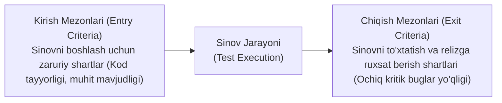
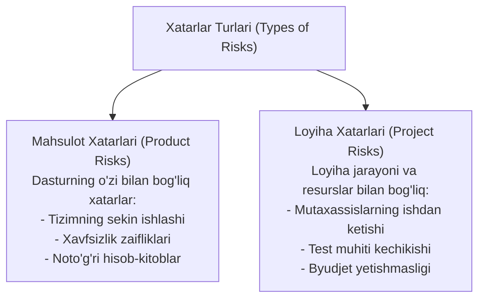
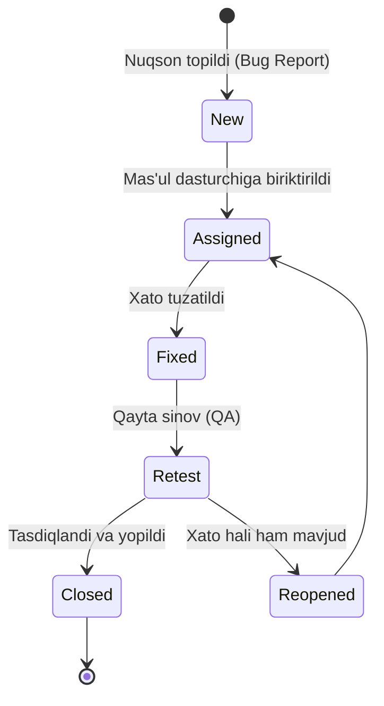

import { Callout } from 'nextra/components'

# 5-bob: Sinov Faoliyatlarini Boshqarish (Managing the Test Activities)

Sinov faoliyatini to'g'ri tashkil etmasdan turib yuqori sifatga erishib bo'lmaydi. Ushbu bob sinovni rejalashtirish, xatarlarni baholash, monitoring qilish hamda nuqsonlarni boshqarish masalalariga bag'ishlangan.

---

## 5.1. Sinovni Rejalashtirish va Baholash (Test Planning & Estimation)

**Test Plan (Sinov Rejasi)** — sinov faoliyatining maqsadlari, ko'lami, resurslari, muddatlari va mezonlarini belgilab beruvchi asosiy hujjatdir.

### Sinov Mehnatini Baholash Usullari (Estimation Techniques):
- **Metrikalarga asoslangan (Metrics-Based):** Avvalgi loyihalardagi o'xshash vazifalar ma'lumotlari asosida hisoblash.
- **Ekspert bahosi (Expert-Based):** Tajribali mutaxassislar (Delphi usuli, Planning Poker) fikriga tayanish.

---

## 5.2. Xatarlarni Boshqarish (Risk Management)

Xatar (*Risk*) — bu kelajakda sodir bo'lishi mumkin bo'lgan va loyihaga salbiy ta'sir ko'rsatuvchi ehtimoliy hodisadir.

### Xatarlarga Asoslangan Sinov (Risk-Based Testing - RBT):
Xatarlar ikki parametr bo'yicha baholanadi:

> **Xatar Darajasi (Risk Level)** = **Ehtimollik (Likelihood)** × **Ta'sir (Impact)**

Eng yuqori xatar darajasiga ega bo'lgan funksiyalar birinchi navbatda va eng chuqur usullar bilan sinovdan o'tkaziladi.

---

## 5.3. Monitoring, Nazorat va Yakunlash (Test Monitoring, Control & Completion)

- **Test Monitoring:** Sinov ko'rsatkichlari (bajarilgan testlar foizi, topilgan buglar soni, test qamrovi) doimiy ravishda kuzatib boriladi va **Test Progress Report** shakllantiriladi.
- **Test Control:** Agar haqiqiy jarayon rejadan orqada qolsa, boshqaruv choralari ko'riladi (masalan, ustuvorliklarni o'zgartirish yoki qo'shimcha resurs ajratish).
- **Test Completion:** Sinov yakunida barcha ochiq masalalar baholanadi, natijalar tahlil qilinadi va **Test Summary / Completion Report** tuziladi.

---

## 5.4. Nuqsonlarni Boshqarish (Defect Management)

Nuqson aniqlangan paytdan boshlab to to'liq yopilguniga qadar qat'iy nazorat qilinishi shart:

### Sifatli Bug Report Tarkibi:
1. **Unikal ID va Sarlavha (Summary):** Muammoning qisqa va tushunarli bayoni;
2. **Takrorlash Qadamlari (Steps to Reproduce):** Bosqichma-bosqich harakatlar ketma-ketligi;
3. **Kutilgan Natija (Expected Result):** Tizim qanday ishlashi kerak edi;
4. **Amaldagi Natija (Actual Result):** Haqiqatda nima yuz berdi;
5. **Jiddiylik (Severity):** Xatoning tizim ishlashiga texnik ta'siri (*Blocker, Critical, Major, Minor*);
6. **Ustuvorlik (Priority):** Xatoni biznes nuqtai nazaridan qanchalik tez tuzatish zarurligi (*High, Medium, Low*);
7. **Qo'shimcha dalillar:** Skrinshotlar, video yozuvlar va server loglari.
