import { Callout } from 'nextra/components'

# 5-bob: Sinov Faoliyatlarini Boshqarish (Managing the Test Activities)

Sinov faoliyatini to'g'ri tashkil etmasdan turib yuqori sifatga erishib bo'lmaydi. Ushbu bob sinovni rejalashtirish, xatarlarni baholash, monitoring qilish hamda nuqsonlarni boshqarish masalalariga bag'ishlangan.

---

## 5.1. Test Planning (Testni Rejalashtirish)

Test Planning — bu dasturiy ta'minotni sinash faoliyatining poydevori hisoblanadi. U test maqsadlariga erishish uchun barcha qadamlar, resurslar, muddatlar va yondashuvlarni tizimli ravishda belgilab beradi.

---

### 5.1.1. Test Plan'ning maqsadi va mazmuni (Purpose and Content of a Test Plan)

#### Test Plan nima?
**Test Plan (Sinov Rejasi)** — bu test loyihasi uchun:
- **Test maqsadlarini (*Test Objectives*)**;
- **Resurslarni (*Resources*)**;
- **Test jarayonlarini (*Processes*)** tavsiflovchi rasmiy boshqaruv hujjatidir.

> **Oddiy qilib aytganda:**  
> **Test Plan** — bu test jarayonini qanday tashkil qilish, qachon o'tkazish, kim bajarishi va qanday maqsadga erishishni ko'rsatadigan keng qamrovli reja hujjati.

#### Test Plan nima uchun kerak?
Test Plan test loyihasida quyidagi 4 ta muhim vazifani bajaradi:

1. **Test maqsadlariga qanday erishishni hujjatlashtiradi:**
   - Test qanday o'tkaziladi;
   - Qanday usullar va texnikalar ishlatiladi;
   - Qachon va qaysi muddatlarda o'tkaziladi.
   - *Ya'ni, test maqsadlariga erishish yo'li va aniq bajarilish jadvali hujjatlashtiriladi.*
2. **Test faoliyati belgilangan mezonlarga mos bajarilishini ta'minlaydi:**
   - Test jarayonining oldindan belgilangan standartlar, mezonlar va qoidalarga qat'iy mos ravishda amalga oshirilishini nazorat qiladi.
3. **Jamoa va barcha stakeholderlar bilan aloqa vositasi bo'ladi:**
   - Quyidagi barcha ishtirokchilar uchun yagona, umumiy ma'lumot manbai hisoblanadi:
     - **Tester / QA Engineer**
     - **Test Lead / QA Lead**
     - **Developer**
     - **Product Owner**
     - **Project Manager**
     - **Mijoz (*Customer*)**
   - Hamma test qanday tashkil etilishi, uning borishi va talablarini bitta rasmiy hujjat orqali bilib oladi.
4. **Test Policy va Test Strategy'ga mosligini ko'rsatadi:**
   - Test faoliyati kompaniyaning umumiy **Test Policy** (Sinov siyosati) va **Test Strategy** (Sinov strategiyasi) hujjatlariga muvofiq olib borilishini tasdiqlaydi;
   - Agar ulardan chetga chiqish (*deviation*) mavjud bo'lsa, buning sababi va asosi aynan Test Plan'da ko'rsatib o'tiladi.

#### Test Planning nima beradi?
Test Planning jarayoni testchilarni va jamoani kelajakdagi ehtimoliy muammolar haqida oldindan o'ylashga va ularga yechim topishga majbur qiladi:
- Qanday xavflar (*Risks*) mavjud?
- Ajratilgan vaqt yetadimi?
- Nechta tester kerak bo'ladi?
- Qanday vositalar (*Tools*) talab etiladi?
- Qancha xarajat (*Budget*) bo'ladi?
- Qancha insoniy mehnat (*Effort*) talab qilinadi?

Shunday qilib, Test Plan tayyorlash jarayoni test maqsadlariga o'z vaqtida va samarali erishish uchun zarur ishlarni oldindan puxta loyihalashga imkon beradi.

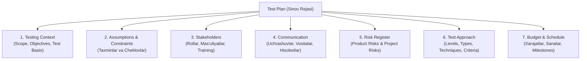

#### Test Plan tarkibi (Typical Content of a Test Plan)
ISTQB CTFL v4.0 standarti bo'yicha namunaviy Test Plan quyidagi 7 ta asosiy bo'limdan tashkil topadi:

1. **Testing Context (Test konteksti):**
   - Testning umumiy ma'lumotlarini o'z ichiga oladi:
     - **Test Scope:** Test doirasi (qaysi funksiyalar va modullar test qilinadi, qaysilari doiradan tashqarida);
     - **Test Objectives:** Testning aniq maqsadlari;
     - **Test Basis:** Test uchun asos bo'ladigan hujjatlar (biznes talablar, User Story'lar, tizim arxitekturasi va dizayn hujjatlari).
2. **Assumptions and Constraints (Taxminlar va cheklovlar):**
   - Test faoliyatiga bevosita ta'sir qiluvchi tashqi omillar:
     - **Assumptions (Taxminlar):** Masalan: Test muhiti belgilangan sanada tayyor bo'ladi; tashqi API xizmatlari barqaror ishlaydi; test ma'lumotlari taqdim etiladi.
     - **Constraints (Cheklovlar):** Masalan: Muddat (vaqt) juda qisqa; byudjet cheklangan; test serveri faqat ish vaqtida ochiq bo'ladi.
3. **Stakeholders (Manfaatdor tomonlar):**
   - Test jarayoniga jalb qilingan barcha ishtirokchilar (Tester, Test Lead, Developer, Product Owner, Project Manager, Customer). Har biri uchun:
     - Loyihadagi roli (*Role*);
     - Aniq mas'uliyati (*Responsibility*);
     - Testdagi ishtirok darajasi;
     - Zarur hollarda qo'shimcha o'qitish (*Training*) yoki yangi xodimlarni yollash (*Hiring*) ehtiyojlari ko'rsatiladi.
4. **Communication (Aloqa va axborot almashish):**
   - Test davomida jamoa o'rtasida ma'lumot almashish tartibi:
     - Muloqot kanallari va uchrashuvlar: Daily Standup / Meeting, haftalik hisobotlar, Email, Jira, Slack, Microsoft Teams;
     - Qanday rasmiy hujjatlar va hisobot shablonlari (*Templates*) ishlatiladi;
     - Aloqa va hisobot berish qanchalik tez-tez amalga oshirilishi (chastotasi).
5. **Risk Register (Xavflar ro'yxati):**
   - Loyiha davomida yuzaga kelishi mumkin bo'lgan xatarlarni qayd etish:
     - **Product Risks (Mahsulot xatarlari):** Dasturning funksional sifati bilan bog'liq (masalan, to'lov tranzaksiyasi noto'g'ri hisoblanishi, login autentifikatsiyasi ishlamay qolishi).
     - **Project Risks (Loyiha xatarlari):** Loyihani boshqarish va jarayon bilan bog'liq (masalan, yetakchi testchining to'satdan kasal bo'lishi, muddatning qisqarishi, test serveri kechikishi).
6. **Test Approach (Test yondashuvi):**
   - Test Plan'ning eng markaziy va amaliy bo'limi:
     - **Test Levels:** Qaysi darajalar qamrab olinadi (Unit, Integration, System, Acceptance);
     - **Test Types:** Qanday turlar o'tkaziladi (Functional, Performance, Security, Usability va h.k.);
     - **Test Techniques:** Qaysi test dizayn usullari qo'llaniladi (EP, BVA, Decision Table, State Transition, Error Guessing va h.k.);
     - **Test Deliverables:** Ish mahsulotlari (Test Plan, Test Case, Test Data, Test Execution Log, Bug Report, Test Summary Report);
     - **Entry Criteria:** Testni boshlash shartlari;
     - **Exit Criteria:** Testni yakunlangan deb hisoblash mezonlari;
     - **Testing Independence:** Sinovchilarning mustaqillik darajasi;
     - **Metrics:** Yig'iladigan sifat ko'rsatkichlari (masalan, Test Coverage %, Defect Density, Passed/Failed nisbati);
     - **Test Data & Test Environment Requirements:** Qanday test ma'lumotlari va texnik server muhiti talab qilinadi;
     - Test Policy yoki Test Strategy'dan chetga chiqish holatlari va ularning asosi.
7. **Budget and Schedule (Byudjet va jadval):**
   - **Budget:** Test uchun ajratilgan moliyaviy mablag' va inson resurslari hajmi.
   - **Schedule:** Test boshlanish va tugash sanalari, oraliq nazorat nuqtalari (*Milestones*) hamda reliz (*Release*) sanasi.

#### Amaliy misol: Internet banking loyihasi Test Plani
Faraz qilaylik, siz Internet Banking loyihasida QA Engineer sifatida ishlayapsiz. Ushbu loyiha uchun qisqacha Test Plan quyidagicha shakllanadi:
- **Scope:** Login va Pul o'tkazish (*Transfer Money*) modullari;
- **Objective:** Yangilangan funksiyalarning to'g'ri ishlashini va xavfsizligini tekshirish;
- **Stakeholders:** QA Team, Backend & Frontend Developers, Product Owner;
- **Risks:** Tranzaksiya summasi noto'g'ri hisoblanishi yoki valyuta konvertatsiyasida xatolik yuz berishi;
- **Approach:** System Testing + Functional Testing + BVA va EP texnikalari;
- **Entry Criteria:** Yangi build test serverga muvaffaqiyatli deploy qilingan va Smoke Test muvaffaqiyatli o'tgan;
- **Exit Criteria:** Hech qanday Blocker/Critical xato ochiq qolmagan (`Critical Bugs = 0`), kamida 95% test-keyslar *"Passed"* holatida;
- **Schedule:** 1-iyul – 10-iyul;
- **Budget:** 2 nafar QA mutaxassisining 10 ish kunlik mehnat sarfi.

<Callout type="info">
**ISTQB Imtihonidagi Namunaviy Savol:**

**Savol:** What is the main purpose of a Test Plan?
- **A)** To describe how the software is implemented.
- **B)** To document the objectives, resources, schedule and processes for testing. ✅
- **C)** To replace the Test Strategy.
- **D)** To record all defects found during testing.

**Yechish:**  
✅ **To'g'ri javob: B**  
**Tushuntirish:** Test Plan'ning asosiy maqsadi — test faoliyatining maqsadlari (*objectives*), zarur resurslar (*resources*), bajarilish jadvali (*schedule*) va qo'llaniladigan test jarayonlarini (*processes*) rasmiylashtirish va hujjatlashtirishdir.
</Callout>

#### Eslab qolish uchun asosiy xulosa:
- **Test Plan nima qiladi?**
  - ✅ Test maqsadlari, resurslari, jadvali va jarayonlarini tavsiflaydi;
  - ✅ Test qanday, kim tomonidan va qachon bajarilishini rejalashtiradi;
  - ✅ Jamoa va barcha manfaatdor tomonlar uchun yagona aloqa vositasi bo'lib xizmat qiladi;
  - ✅ Tashkilotning Test Policy va Test Strategy hujjatlariga muvofiqlikni ta'minlaydi.
- **Test Plan tarkibiy qismlari (7 ta):**
  1. *Testing Context*
  2. *Assumptions & Constraints*
  3. *Stakeholders*
  4. *Communication*
  5. *Risk Register*
  6. *Test Approach*
  7. *Budget & Schedule*

<Callout type="warning">
**ISTQB uchun muhim eslatma:**  
**Test Plan** — bu operatsion (loyiha darajasidagi) hujjat bo'lib, aynan bitta loyiha yoki reliz uchun test ishlari qanday tashkil etilishini belgilaydi.  
**Test Strategy** esa tashkilot yoki dasturiy mahsulotlar qatori uchun umumiy, yuqori darajadagi test qoidalarini belgilovchi strategik hujjatdir. Test Plan Test Strategiyaning o'rnini bosa olmaydi, balki unga asoslanadi!
</Callout>

---

### 5.1.2. Testerning Iteration va Release Planningdagi hissasi (Tester's Contribution to Iteration and Release Planning)

#### Iterative SDLC'da rejalashtirish
Iterative SDLC (Agile, Scrum kabi moslashuvchan hayotiy sikllar) doirasida rejalashtirish odatda ikki asosiy bosqichda amalga oshiriladi:
1. **Release Planning (Relizni rejalashtirish)**
2. **Iteration Planning (Iteratsiyani rejalashtirish)**

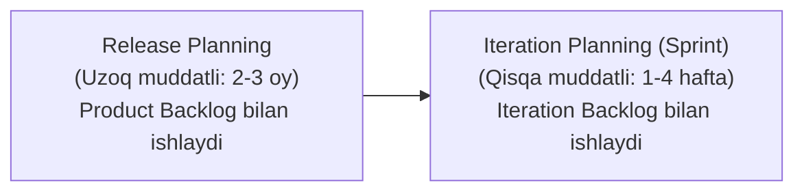

#### 1. Release Planning (Relizni rejalashtirish)
**Release Planning** — bu mahsulotning keyingi yirik relizi (foydalanuvchilarga taqdim etiladigan versiyasi) uchun oldindan rejalashtirish jarayonidir.
- Bu rejalashtirishda mahsulotning keyingi relizi qanday ko'rinishda bo'lishi va qaysi funksiyalar kirishi belgilanadi;
- **Product Backlog** to'liq ko'rib chiqiladi va yangilanadi;
- Katta User Story'lar kichikroq User Story'larga bo'linadi (*Story Splitting*).

> **Product Backlog nima?**  
> **Product Backlog** — bu butun mahsulot bo'yicha bajarilishi kerak bo'lgan barcha ishlar (yangi User Story'lar, tuzatilishi kerak bo'lgan Bug'lar, takomillashtirishlar va texnik qarzlar) ning ustuvorlik tartibida tuzilgan yagona ro'yxatidir.

**Katta User Story'ni kichik User Story'larga bo'lish (Misol):**  
- *Katta User Story (Epic):* "Customer sifatida onlayn bank xizmatlaridan to'liq foydalanmoqchiman."  
  Bu juda katta va noaniq talab bo'lgani sababli, Release Planningda u quyidagi kichik hikoyalarga bo'linadi:
  1. *Login (Tizimga kirish)*
  2. *Logout (Tizimdan chiqish)*
  3. *Balance Check (Balansni tekshirish)*
  4. *Transfer Money (Pul o'tkazish)*
  5. *Transaction History (Tranzaksiyalar tarixi)*  
Shunday qilib, har bir funksiyani ishlab chiqish va test qilish ancha osonlashadi.

**Release Planning nimaga asos bo'ladi?**  
Release Planning bo'lajak barcha iteratsiyalar (sprintlar) uchun **Test Approach**ni va reliz doirasidagi umumiy **Test Plan**ni tayyorlashga mustahkam asos bo'ladi.

##### Release Planningda tester nima qiladi? (6 ta asosiy vazifa):
1. **Test qilinadigan User Story yozishda qatnashadi:** Tester talablarni tahlil qilib, ularni aniq test qilish mumkin bo'lgan (*Testable*) ko'rinishda ifodalashga yordam beradi.
2. **Acceptance Criteria yozishda qatnashadi:** Tester Product Owner bilan birgalikda hikoyaning qabul mezonlarini aniq, bir ma'noli va tushunarli yozishda faol qatnashadi.
3. **Project Risk va Quality (Product) Risk tahlilida qatnashadi:**
   - *Project Risks:* Vaqt yetishmasligi, sinovchilar yetishmasligi, test muhiti kechikishi kabi xatarlarni baholaydi;
   - *Product Risks:* Login ishlamay qolishi, to'lov tizimida uzilish bo'lishi, ma'lumotlar yo'qolishi kabi sifat xatarlarini aniqlaydi.
4. **Test Effort'ni baholaydi:** Har bir User Story uchun test qilishga qancha inson-soati yoki mehnati talab qilinishini hisoblab chiqadi:

| User Story | Test Effort |
| :--- | :--- |
| Login & Autentifikatsiya | 6 soat |
| Payment (To'lov) | 12 soat |
| Reports (Hisobotlar) | 8 soat |

5. **Test Approach'ni aniqlaydi:** Ushbu reliz uchun qanday test turlari kerakligini (masalan: *Functional Testing, Regression Testing, Automation Testing, Exploratory Testing*) rejalashtiradi.
6. **Release uchun testlarni rejalashtiradi:** Qaysi iteratsiyada nima test qilinishi, Regressiya qachon o'tkazilishi va Yakuniy Tizimli Sinov (*End-to-End System Test*) qachon boshlanishini belgilaydi.

---

#### 2. Iteration Planning (Iteratsiyani rejalashtirish)
**Iteration Planning** — bu faqat bitta iteratsiya (masalan, 2 haftalik Sprint 5) uchun test faoliyatlarini batafsil rejalashtirish jarayonidir.
- Agar Release Planning butun relizni (bir necha oyni) qamrab olsa, Iteration Planning faqat bitta yaqin sprint doirasida ish olib boradi.
- Unda **Iteration Backlog** bilan ishlanadi.

> **Iteration Backlog nima?**  
> **Iteration Backlog** — bu aynan shu joriy sprint davomida jamoa tomonidan bajarilishi va yetkazib berilishi rejalashtirilgan User Story'lar va texnik vazifalar to'plamidir.

##### Iteration Planningda tester nima qiladi? (5 ta asosiy vazifa):
1. **User Story bo'yicha batafsil Risk Analysis qiladi:**  
   Masalan, "Payment" User Story uchun:
   - Summani validatsiya qilish ishlamay qolishi mumkin;
   - Valyuta kursi noto'g'ri hisoblanishi mumkin;
   - Tranzaksiya bank shlyuzida vaqt tugashi (*timeout*) tufayli osilib qolishi mumkin.
2. **User Story test qilinishi mumkinmi yoki yo'qligini tekshiradi (Testability):**  
   Tester talabning tekshiriluvchanligini baholaydi. Masalan, agar talabda *"System should work better"* (Tizim yaxshiroq ishlashi kerak) deb yozilgan bo'lsa, bu o'lchab bo'lmaydigan va test qilib bo'lmaydigan talabdir. Tester Product Owner'dan aniq metrika va parametrlar bilan ifodalashni so'raydi.
3. **User Story'ni kichik sinov vazifalariga ajratadi:**  
   Masalan, "Login Story" sprintga qabul qilinganda, tester o'zi uchun quyidagi amaliy vazifalarni (*Testing Tasks*) yaratadi:
   - *Test Case yozish*
   - *Test Data tayyorlash*
   - *Manual Testing*
   - *Automation Testing*
   - *Regression Testing*
4. **Har bir Testing Task uchun Test Effort baholaydi:**  

| Task (Vazifa) | Ajratilgan vaqt |
| :--- | :--- |
| Test Case yozish | 2 soat |
| Test Data tayyorlash | 1 soat |
| Manual Test | 3 soat |
| Automation Test | 5 soat |

5. **Functional va Non-Functional jihatlarni aniqlaydi:**  
   Tester nafaqat dasturning to'g'ri ishlashini, balki uning sifat xususiyatlarini ham aniqlab test rejasiga kiritadi:
   - *Functional:* Login to'g'ri ishlayaptimi? To'lov amalga oshyaptimi?
   - *Non-Functional:* Performance (yuklama ostida tezlik), Security (parollarni shifrlash), Usability (qulaylik), Reliability (barqarorlik).

#### Release Planning va Iteration Planning taqqoslash:

| Xususiyat | Release Planning | Iteration Planning |
| :--- | :--- | :--- |
| **Qamrov ko'lami** | Butun reliz (bir nechta sprintlar, oylar) | Faqat bitta sprint (1-4 hafta) |
| **Foydalaniladigan Backlog** | Product Backlog | Iteration Backlog |
| **User Story darajasi** | Katta User Story'lar (*Epics*) kichiklarga bo'linadi | Sprint ichidagi aniq vazifalar (*Tasks*) aniqlanadi |
| **Sinov rejalashtirish** | Umumiy Test Approach va Release Test Plan belgilanadi | Sprintdagi har bir sinov vazifasi (*Testing Tasks*) rejalashtiriladi |
| **Vaqt ufqini belgilash** | Uzoq muddatli strategik reja | Qisqa muddatli operatsion reja |

#### Amaliy misol:
- **Release Planning:** Reliz 2 oy davom etadi. Unda 4 ta asosiy modul bor: `Login`, `Register`, `Payment`, `Reports`.  
  Tester umumiy risk tahlilini qiladi, har bir modul uchun Acceptance Criteria yozishga yordam beradi, test strategiyasini tanlaydi va umumiy test kuchini baholaydi.
- **Iteration Planning (Sprint 1):** Birinchi sprintda faqat `Login` va `Register` hikoyalari bajariladi.  
  Tester aynan shu ikki hikoya uchun batafsil risk tahlilini qiladi, aniq test-keyslar yozadi, test ma'lumotlarini tayyorlaydi va avtomatlashtirish tasklarini soatlar bo'yicha baholaydi.

<Callout type="info">
**ISTQB Imtihonidagi Namunaviy Savol:**

**Savol:** Which planning activity focuses on a single iteration backlog?
- **A)** Release Planning
- **B)** Test Strategy
- **C)** Iteration Planning ✅
- **D)** Test Monitoring

**Yechish:**  
✅ **To'g'ri javob: C**  
**Tushuntirish:** Iteration Planning faqat bitta iteratsiyaning (sprintning) Iteration Backlog'ida mavjud bo'lgan User Story'lar va ularning sinov vazifalari bilan ishlaydi. Release Planning esa butun Product Backlog'ga e'tibor qaratadi.
</Callout>

#### Eslab qolish uchun:
- **Release Planning:**
  - ✅ Butun reliz uchun uzoq muddatli rejalashtirish;
  - ✅ Product Backlog bilan ishlaydi;
  - ✅ Katta User Story'larni kichiklarga ajratadi;
  - ✅ Tester: testable talablar, Acceptance Criteria, umumiy risk tahlili, reliz test strategiyasi va test effortni baholashda qatnashadi.
- **Iteration Planning:**
  - ✅ Faqat bitta sprint uchun qisqa muddatli rejalashtirish;
  - ✅ Iteration Backlog bilan ishlaydi;
  - ✅ Tester: batafsil risk tahlili, talablarning testabilligi, sinov vazifalariga (*Testing Tasks*) bo'lish, har bir task sarfini baholash, Functional va Non-Functional talablarni aniqlash bilan shug'ullanadi.

> **ISTQB uchun muhim farq:**  
> - **Release Planning** → *"Keyingi relizda nimalar bo'ladi va ularni qanday test qilamiz?"*  
> - **Iteration Planning** → *"Ushbu sprint davomida qaysi User Story'lar ustida ishlaymiz va ularni qanday test qilamiz?"*

---

### 5.1.3. Entry Criteria va Exit Criteria (Boshlash mezonlari va Yakunlash mezonlari)

#### Entry Criteria nima?
**Entry Criteria (Boshlash mezonlari)** — bu ma'lum bir sinov faoliyatini yoki test darajasini rasman boshlashdan oldin bajarilishi shart bo'lgan dastlabki shartlardir.

> **Oddiy qilib aytganda:**  
> Testni boshlash uchun oldindan tayyor bo'lishi kerak bo'lgan barcha talablar **Entry Criteria** hisoblanadi.

**Agar Entry Criteria bajarilmagan bo'lsa:**
- Test jarayoni ancha qiyinlashadi;
- Keraksiz to'siqlar tufayli ko'proq vaqt sarflanadi;
- Kutilmagan moliyaviy xarajatlar ko'payadi;
- Butun loyiha xatarga (*Risk*) yuz tutadi.

#### Exit Criteria nima?
**Exit Criteria (Yakunlash mezonlari)** — bu ma'lum bir test bosqichini yoki butun sinov faoliyatini muvaffaqiyatli yakunlangan deb hisoblash uchun erishilishi shart bo'lgan mezonlardir.

> **Oddiy qilib aytganda:**  
> Qachon va qaysi shartlar bajarilganda "test tugadi" deb e'lon qilish mumkinligini belgilaydigan mezonlar **Exit Criteria** hisoblanadi.

#### Entry va Exit Criteria qayerda belgilanadi?
ISTQB qoidalariga ko'ra, har bir **Test Level** (Unit, Integration, System, Acceptance) uchun alohida Entry va Exit Criteria belgilanishi shart. Har bir darajaning o'ziga xos maqsadlari (*Test Objectives*) bo'lgani bois, ularning boshlash va tugash mezonlari ham bir-biridan farq qiladi.

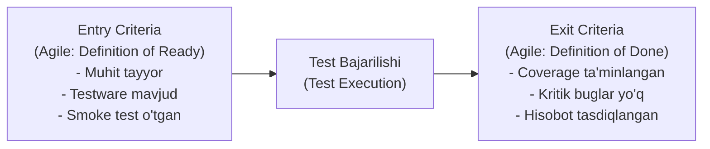

#### Odatdagi Entry Criteria (Boshlash mezonlari):
1. **Resurslar mavjudligi:**
   - Testerlar yetarli va tayyor;
   - Sinov vositalari (*Tools*) o'rnatilgan va sozlangan;
   - Test muhiti (*Test Environment*) to'liq ishchi holatda;
   - Test ma'lumotlari (*Test Data*) yaratilgan va bazaga yuklangan;
   - Yetarli vaqt va byudjet mavjud.
2. **Testware tayyorligi:**
   - Test Basis (talablar, spetsifikatsiyalar, dizaynlar) mavjud va tasdiqlangan;
   - User Story'lar yozilgan va Acceptance Criteria aniqlangan;
   - Dastlabki Test Case'lar tayyorlangan.
3. **Test obyektining dastlabki sifat darajasi:**
   - Yangi dasturiy yig'ma (*Build*) test muhitiga muvaffaqiyatli deploy qilingan;
   - **Smoke Test** yoki **Build Verification Test** muvaffaqiyatli o'tgan (tizim qulab tushmayapti).  
   *Shundan keyingina keng ko'lamli System Testing boshlanishi mumkin.*

#### Odatdagi Exit Criteria (Yakunlash mezonlari):
1. **Test qamrovini o'lchovchi mezonlar:**
   - Belgilangan **Test Coverage** darajasiga erishilgan (masalan, 100% talablar qamrovi, 80% Branch Coverage);
   - Ochiq (hal qilinmagan) nuqsonlar soni belgilangan me'yordan oshmaydi;
   - **Defect Density** (nuqsonlar zichligi) ruxsat etilgan chegarada;
   - Qolgan muvaffaqiyatsiz (*Failed*) test-keyslar soni belgilangan limitdan kam.
2. **Ha / Yo'q (Yes / No) mezonlari:**
   - Rejalashtirilgan barcha test-keyslar to'liq bajarilgan;
   - Talab qilingan barcha Statik Sinovlar (*Static Testing / Reviews*) o'tkazilgan;
   - Aniqlangan barcha nuqsonlar bug-tracking tizimida to'g'ri qayd etilgan;
   - Barcha muhim Regressiya testlari avtomatlashtirilgan yoki tekshirilgan.

#### Vaqt yoki byudjet tugashi ham Exit Criteria bo'lishi mumkinmi?
ISTQB standartiga muvofiq: **Ha, ba'zan ajratilgan vaqt yoki byudjetning tugashi ham testni yakunlash uchun asos bo'lishi mumkin.**  
Bunday holatda, hatto barcha rejalashtirilgan testlar bajarilmagan yoki ba'zi Exit Criteria to'liq qanoatlantirilmagan bo'lsa ham test to'xtatiladi.  
Biroq, buning uchun:
- Manfaatdor tomonlar (*Stakeholders*) va loyiha rahbariyati mavjud qoldiq xatarlarni (*Residual Risks*) chuqur tahlil qilishi;
- Tizimni qo'shimcha testlarsiz reliz qilish (*Go Live*) xavfini rasman qabul qilishi (*Risk Acceptance*) shart.

#### Agile muhitida Entry va Exit Criteria:
Agile (Scrum) loyihalarida ushbu tushunchalar keng tarqalgan atamalar bilan ataladi:

| Klassik ISTQB | Agile (Scrum) ekvivalenti | Ma'nosi va vazifasi |
| :--- | :--- | :--- |
| **Entry Criteria** | **Definition of Ready (DoR)** | *"User Story ustida ishlashni boshlash uchun nimalar tayyor bo'lishi kerak?"* |
| **Exit Criteria** | **Definition of Done (DoD)** | *"User Story to'liq tugallangan va relizga tayyor deb hisoblanishi uchun nimalar bajarilgan bo'lishi kerak?"* |

##### Definition of Ready (DoR) Misol:
- User Story INVEST mezonlariga mos yozilgan;
- Acceptance Criteria aniq belgilangan;
- Hikoya jamoa tomonidan baholangan (*Estimated*);
- UI/UX dizayni tayyor;
- Kerakli backend API mavjud.  
*Shundan keyingina User Story sprintga olinadi.*

##### Definition of Done (DoD) Misol:
- Kod ishlab chiqilgan va dasturlash standartlariga mos;
- Code Review o'tkazilgan va tasdiqlangan;
- Barcha Unit testlar muvaffaqiyatli o'tgan;
- Qabul testlari (Acceptance / System Tests) bajarilgan;
- Hech qanday Blocker yoki Critical bug mavjud emas;
- Product Owner natijani ko'rib chiqib qabul qilgan.  
*Shundan keyingina Story rasman "Done" holatiga o'tadi.*

#### Amaliy misol: Login moduli
- **Entry Criteria:**
  - Build test serverga muvaffaqiyatli o'rnatilgan;
  - Test ma'lumotlari (foydalanuvchi akkauntlari) tayyorlangan;
  - Login talablari tasdiqlangan;
  - Smoke test muvaffaqiyatli yakunlangan.  
  *(Endi chuqur testni boshlash mumkin).*
- **Exit Criteria:**
  - Login bo'yicha 100% test-keyslar bajarilgan;
  - Kritik xatolar soni: `0`;
  - Talablar qamrovi: `≥ 95%`;
  - Test Summary Report tayyorlanib, Test Lead tomonidan tasdiqlangan.  
  *(Endi test yakunlandi deb hisoblanadi).*

<Callout type="info">
**ISTQB Imtihonidagi Namunaviy Savol:**

**Savol:** What do Entry Criteria define?
- **A)** Conditions that must be met before starting a testing activity. ✅
- **B)** Conditions required to release the product.
- **C)** Conditions for closing all defects.
- **D)** The number of executed test cases.

**Yechish:**  
✅ **To'g'ri javob: A**  
**Tushuntirish:** Entry Criteria — bu test faoliyatini yoki ma'lum bir sinov darajasini boshlashdan oldin bajarilishi shart bo'lgan talab va shartlarni belgilaydi.
</Callout>

#### Eslab qolish uchun:
- **Entry Criteria:**
  - ✅ Testni boshlashdan oldingi shartlar;
  - ✅ Resurslar va test muhiti tayyor;
  - ✅ Testware mavjud;
  - ✅ Smoke test muvaffaqiyatli o'tgan;
  - ✅ Agile'da: **Definition of Ready (DoR)**.
- **Exit Criteria:**
  - ✅ Testni tugatish mezonlari;
  - ✅ Test Coverage ta'minlangan;
  - ✅ Ochiq nuqsonlar ruxsat etilgan limitdan oshmaydi;
  - ✅ Barcha testlar bajarilgan va hisobot tayyorlangan;
  - ✅ Agar manfaatdor tomonlar xavfni qabul qilsa, vaqt yoki byudjet tugashi ham Exit Criteria bo'lishi mumkin;
  - ✅ Agile'da: **Definition of Done (DoD)**.

---

### 5.1.4. Baholash usullari (Estimation Techniques)

#### Test Effort Estimation nima?
**Test Effort Estimation (Sinov mehnatini baholash)** — bu test loyihasining maqsadlariga erishish uchun zarur bo'lgan ish hajmini, ya'ni qancha vaqt, qancha inson kuchi va qanday resurslar talab qilinishini oldindan hisoblash jarayonidir.

> **Oddiy qilib aytganda:**  
> **Test Effort Estimation** — testni to'liq va sifatli bajarish uchun qancha vaqt va mehnat ketishini ilmiy va tajribaviy asosda oldindan taxmin qilishdir.

#### Estimation haqida muhim eslatma:
Stakeholderlar va loyiha rahbarlariga doimo quyidagilarni ochiq tushuntirish kerak:
- Har qanday baholash ma'lum taxminlarga (*assumptions*) asoslanadi;
- Har qanday baholashda xatolik ehtimoli (*estimation error*) mavjud bo'ladi.  
Shu sababli, baholash — mutlaq o'zgarmas raqam emas, balki mavjud ma'lumotlarga tayangan holda berilgan **eng yaxshi asoslangan taxmindir**.

#### Kichik vazifalarni baholash osonroq:
- Katta vazifalarni birdaniga baholash juda qiyin va katta xatolikka olib keladi;
- Kichik, aniq vazifalarni baholash esa ancha oson va aniqroq bo'ladi.  
Shuning uchun yirik vazifa avval kichik mantiqiy qismlarga bo'linadi (*Work Breakdown Structure*), so'ng har biri alohida baholanib, umumiy baho jamlanadi.

*Misol:* Katta vazifa — *"Payment modulini test qilish"*.  
Uni quyidagi kichik vazifalarga bo'lish mumkin:
1. *Login Test*
2. *Validation Test*
3. *API Test*
4. *UI Test*
5. *Regression Test*  
Har bir qism alohida baholanadi, natijada umumiy Test Effort hosil bo'ladi.

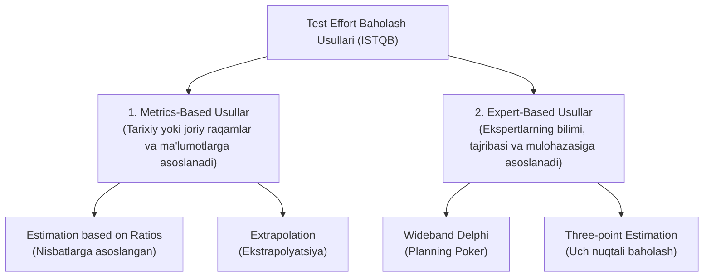

#### ISTQB bo'yicha 4 ta asosiy baholash usuli:

ISTQB test baholash usullarini ikkita katta toifaga ajratadi:
1. **Metrics-Based (Metrikalarga asoslangan):**
   - *Estimation based on Ratios*
   - *Extrapolation*
2. **Expert-Based (Mutaxassis fikriga asoslangan):**
   - *Wideband Delphi*
   - *Three-point Estimation*

---

#### 1. Estimation based on Ratios (Nisbatlar asosida baholash)
Bu **Metrics-Based** usul bo'lib, tashkilotning avvalgi muvaffaqiyatli loyihalaridagi statistik ma'lumotlarga asoslanadi.
- Unda oldingi loyihalarda kuzatilgan **Development Effort** (Dasturlash mehnati) va **Test Effort** (Sinov mehnati) nisbati olinadi;
- Yangi loyihaning dasturlash hajmi ma'lum bo'lganda, shu nisbat qo'llanilib test mehnati hisoblanadi.

**Formula va Misol:**
- Oldingi loyihalarda doimiy ravishda nisbat:  
  `Development : Testing = 3 : 2` bo'lgan.
- Yangi loyihada dasturlash mehnati bahosi:  
  `Development Effort = 600 person-days`
- Test mehnati hisob-kitobi:  
  > **Test Effort** = 600 × (2 / 3) = **400 person-days**

- **Afzalliklari:** Oddiy, tez hisoblanadi, tashkilotning real tajribasiga tayanadi.
- **Kamchiliklari:** Faqat texnologiyasi, jamoasi va jarayoni o'xshash loyihalarda to'g'ri ishlaydi; agar oldingi ma'lumotlar xato bo'lsa, yangi baho ham butkul xato chiqadi.

---

#### 2. Extrapolation (Ekstrapolyatsiya)
Bu ham **Metrics-Based** usul bo'lib, u joriy loyihaning boshlang'ich bosqichlarida to'plangan amaliy ma'lumotlarga asoslanadi.
- Dastlabki olingan natijalarga (masalan, dastlabki bir necha sprintlar sarfiga) qarab, loyihaning qolgan qismidagi ish hajmi matematik model orqali taxmin qilinadi;
- ISTQB bo'yicha: Ushbu usul **Iterative SDLC (Agile)** uchun juda mos keladi.

**Misol:**  
Agile loyihada oxirgi 3 ta sprintda sarflangan test vaqti:
- Sprint 1 = 30 soat
- Sprint 2 = 28 soat
- Sprint 3 = 32 soat  
O'rtacha sarf:
> **O'rtacha sarf** = (30 + 28 + 32) / 3 = **30 soat**

Demak, keyingi Sprint 4 uchun taxminiy Test Effort: **≈ 30 soat** deb baholanadi.

- **Afzalliklari:** Joriy jamoaning aynan shu loyihadagi real tezligi (*Velocity*) va ma'lumotlariga tayanadi; Agile uchun juda qulay.
- **Kamchiliklari:** Agar boshlang'ich sprintlar nostandart yoki g'ayrioddiy kechgan bo'lsa, keyingi sprintlar bahosi noto'g'ri chiqishi mumkin.

---

#### 3. Wideband Delphi
Bu **Expert-Based** usul bo'lib, unda bir nechta mustaqil ekspertlarning bilimi va mulohazasidan foydalaniladi. Jarayon iterativ ravishda, bir necha qadamda amalga oshiriladi:

**Jarayon qadamlari:**
1. **1-qadam (Mustaqil baholash):** Har bir ekspert topshiriqni o'rganib, boshqalarga bildirmasdan, mustaqil ravishda o'z bahosini yozadi.
2. **2-qadam (Natijalarni to'plash):** Moderator barcha baholarni yig'adi va anonim tarzda umumiy ko'rsatkichlarni taqdim etadi.
3. **3-qadam (Muhokama):** Agar ekspertlarning baholari o'rtasida katta tafovut bo'lsa, sabablar ochiq muhokama qilinadi (eng past va eng yuqori baho berganlar o'z dalillarini tushuntirib beradi).
4. **4-qadam (Qayta baholash):** Muhokamadan so'ng, har bir ekspert yana mustaqil ravishda yangi baho beradi.
5. **5-qadam (Kelishuv / Consensus):** Bu jarayon barcha ekspertlar deyarli bir xil to'xtamga kelguniga qadar takrorlanadi.

##### Planning Poker (Agile'dagi Wideband Delphi):
**Planning Poker** — bu Wideband Delphi usulining Agile jamoalarida keng qo'llaniladigan amaliy ko'rinishidir.
- Unda har bir jamoa a'zosi (Developer, Tester va h.k.) qo'liga maxsus raqamli kartalarni oladi (Fibonachchi sonlari: `1, 2, 3, 5, 8, 13, 21...`);
- Vazifa o'qib eshittirilgach, hamma bir vaqtda kartasini ochadi;
- Agar raqamlar farq qilsa, muhokama qilinib, qayta kartalar tashlanadi va umumiy kelishuvga erishiladi.

- **Afzalliklari:** Bir nechta tajribali mutaxassislarning umumiy guruh aqli va fikridan foydalaniladi; shaxsiy tarafkashlik kamayadi.
- **Kamchiliklari:** Bir nechta ekspertlarni yig'ish talab etiladi; uzoq muhokamalar ko'p vaqt olishi mumkin.

---

#### 4. Three-point Estimation (Uch nuqtali baholash)
Bu ham **Expert-Based** usul bo'lib, noaniqlik va xavflarni hisobga olish maqsadida mutaxassislar uch xil ssenariy bo'yicha baho beradilar:

1. **Optimistic Estimation (*a*):** Eng yaxshi holat (hech qanday to'siq, xatolik yoki muammo bo'lmasa).
2. **Most Likely Estimation (*m*):** Eng katta ehtimolli holat (odatdagi normal ish sharoitida).
3. **Pessimistic Estimation (*b*):** Eng yomon holat (kutilmagan ko'plab muammolar, nosozliklar va qiyinchiliklar yuz berganda).

**Yakuniy baholash formulasi (PERT taqsimoti):**
> **E = (a + 4m + b) / 6**

Bu yerda:
- *a* — optimistik baho;
- *m* — eng ehtimolli baho;
- *b* — pessimistik baho.

**Baholashdagi xatolik / Standart og'ish (Measurement Error / SD):**  
Three-point usulining ulkan afzalligi shundaki, u natijaning qanchalik noaniqligini ham hisoblab beradi:
> **SD = (b - a) / 6**

##### Amaliy hisoblash misoli:
Topshiriq uchun ekspert baholari:
- *a* = 6 soat (Optimistik)
- *m* = 9 soat (Eng ehtimolli)
- *b* = 18 soat (Pessimistik)

1. **Yakuniy bahoni hisoblash (*E*):**  
   > **E = (6 + 4 × 9 + 18) / 6 = (6 + 36 + 18) / 6 = 60 / 6 = 10 soat**  
   Demak: **Final Estimate (*E*) = 10 kishi-soati**.

2. **Xatolikni / Standart og'ishni hisoblash (*SD*):**  
   > **SD = (18 - 6) / 6 = 12 / 6 = 2 soat**  
   Demak: **Natija: 10 ± 2 soat** (ya'ni test sarfi taxminan **8 soatdan 12 soatgacha** bo'lgan oraliqda bo'ladi).

- **Afzalliklari:** Noaniqlik va xavf-xatarlarni matematik tarzda mukammal hisobga oladi; pessimistik va optimistik ehtimollarni birlashtiradi.
- **Kamchiliklari:** Ekspertlarning subyektiv fikriga bog'liq; 3 xil ko'rsatkichni aniqlash qo'shimcha vaqt oladi.

---

#### 4 ta usulning amaliy qiyosiy misoli (Login moduli):
- **Ratio usuli:** Oldingi loyihada `Dev : Test = 2 : 1`. Yangi modulda `Dev = 200 soat` → `Test = 100 soat`.
- **Extrapolation usuli:** Oxirgi sprintlar: `20`, `22`, `18` soat → Keyingi sprint: `O'rtacha = 20 soat`.
- **Wideband Delphi:** 4 ta ekspert dastlab `18, 20, 19, 21` baho berdi, muhokamadan so'ng barchasi `20` soatlik umumiy kelishuvga erishdi.
- **Three-point usuli:** *a* = 8, *m* = 10, *b* = 20 → **E = (8 + 40 + 20) / 6 ≈ 11.3 soat** (taxminan 11 soat).

<Callout type="info">
**ISTQB Imtihonidagi Namunaviy Savol:**

**Savol:** Which estimation technique uses historical project ratios?
- **A)** Wideband Delphi
- **B)** Three-point Estimation
- **C)** Ratio-based Estimation ✅
- **D)** Planning Poker

**Yechish:**  
✅ **To'g'ri javob: C**  
**Tushuntirish:** Ratio-based Estimation (nisbatlarga asoslangan baholash) o'tmishdagi loyihalarning dasturlash va sinov nisbatlaridan foydalanadigan Metrics-based usuldir.
</Callout>

#### Eslab qolish uchun:
1. **Ratio-based Estimation:**
   - Oldingi loyihalarning statistik nisbatlariga asoslanadi;
   - *Metrics-based* usul.
2. **Extrapolation:**
   - Joriy loyiha yoki dastlabki sprintlar natijalariga tayanadi;
   - Agile va Iterative SDLC uchun juda mos;
   - *Metrics-based* usul.
3. **Wideband Delphi:**
   - Ekspertlar mustaqil baho beradi, muhokama qiladi, qayta baholaydi va yakunda konsensusga (*Consensus*) erishadi;
   - Planning Poker — uning Agile varianti;
   - *Expert-based* usul.
4. **Three-point Estimation:**
   - Optimistic (*a*), Most Likely (*m*), Pessimistic (*b*);
   - E = (a + 4m + b) / 6;
   - Xatolik: SD = (b - a) / 6;
   - *Expert-based* usul.

> **ISTQB uchun muhim eslatma:**  
> - **Metrics-based usullar (Ratio-based, Extrapolation):** Tarixiy yoki joriy loyiha ma'lumotlariga, raqamlarga tayanadi.  
> - **Expert-based usullar (Wideband Delphi, Three-point):** Mutaxassis va ekspertlarning tajribasi va fikriga asoslanadi.

---

### 5.1.5. Test Case Prioritization (Test Case'larni ustuvorlik bo'yicha tartiblash)

#### Test Case Prioritization nima?
Test-keyslar va Test protseduralari ishlab chiqilib, Test Suite'larga birlashtirilgach, ularning aynan qaysi tartibda ishga tushirilishi rejalashtirilishi kerak. Bu tartib **Test Execution Schedule (Testni bajarish jadvali)** orqali belgilanadi.

> **Oddiy qilib aytganda:**  
> **Test Case Prioritization** — test-keyslarni ularning muhimligi, xavf darajasi yoki maqsadiga qarab aynan qaysi ketma-ketlikda bajarishni belgilash jarayonidir.

#### Test Case Prioritization nima uchun kerak?
Barcha testlarni birdaniga yoki tasodifiy tartibda bajarish amalda har doim ham to'g'ri emas:
- Vaqt juda kam bo'lishi mumkin;
- Test muhiti yoki inson resurslari yetarli bo'lmasligi mumkin;
- Reliz sanasi yaqinlashgan bo'lishi mumkin.  
Shu sababli, dasturdagi eng muhim va eng xavfli nuqsonlarni imkon qadar erta aniqlash maqsadida testlar ma'lum qoidalar asosida tartiblanadi.

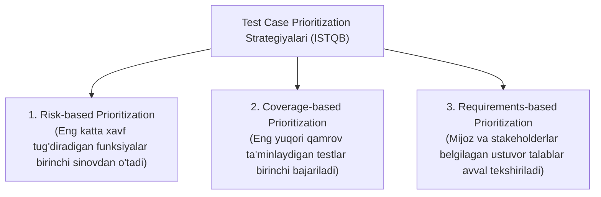

#### ISTQB bo'yicha 3 ta asosiy ustuvorlashtirish usuli:

---

#### 1. Risk-based Prioritization (Xavfga asoslangan ustuvorlashtirish)
Bu usulda testlarni bajarish tartibi **Risk Analysis** (Xatarlarni tahlil qilish) natijalariga asoslanadi:
- Eng katta salbiy oqibat yoki yuqori ehtimolli xavf (*Risk*) tug'diradigan funksiyalar va modullar birinchi navbatda test qilinadi;
- Kichik xavfga ega funksiyalar keyinroqqa qoldiriladi.

**Misol (Internet Banking tizimi):**

| Modul | Xavf darajasi (Risk) | Bajarilish tartibi |
| :--- | :--- | :--- |
| **Payment (Pul o'tkazish)** | Yuqori (*High*) | 1-o'rinda |
| **Login (Autentifikatsiya)** | Yuqori (*High*) | 2-o'rinda |
| **Profile (Profil ma'lumotlari)**| O'rta (*Medium*) | 3-o'rinda |
| **Theme (Tungi/kunduzgi rejim)**| Past (*Low*) | 4-o'rinda |

*Sababi:* Payment moduli ishlamasa, foydalanuvchilar pul yo'qotishi va bank ulkan moliyaviy va obro' talafotiga uchrashi mumkin. Theme moduli ishlamasa esa hech kim katta zarar ko'rmaydi.

- **Afzalligi:** Eng muhim va xavfli defektlar loyihaning erta bosqichida topiladi; qoldiq risk keskin kamayadi.

---

#### 2. Coverage-based Prioritization (Qamrovga asoslangan ustuvorlashtirish)
Bu usulda test-keyslarning bajarilish tartibi ularning **Test Coverage (Qamrov)** ko'rsatkichiga qarab belgilanadi (masalan, *Statement Coverage, Branch Coverage* yoki *Requirements Coverage*):
- Eng katta kod qamrovini ta'minlaydigan test-keys birinchi navbatda ishga tushiriladi;
- Keyin kamroq qamrovlilari bajariladi.

**Misol:**
- TC1 → 70% kod qamrovi
- TC2 → 30% kod qamrovi
- TC3 → 10% kod qamrovi  
*Bajarilish tartibi:* 1. `TC1` → 2. `TC2` → 3. `TC3`.

##### Additional Coverage Prioritization (Qo'shimcha qamrov usuli):
Bu Coverage-based yondashuvining yanada takomillashgan ko'rinishidir:
1. Dastlab eng katta umumiy qamrovga ega bo'lgan Test Case bajariladi;
2. Keyingi qadamda esa hali tekshirilmagan, **yangi (qo'shimcha) qamrovni eng ko'p oshiradigan** Test Case tanlanadi;
3. Bu bir xil kod qismlarini qayta-qayta test qilib vaqt yo'qotmaslik va qisqa vaqtda maksimal yangi qamrovga erishish imkonini beradi.

**Misol:**
- `TC1` → `A`, `B`, `C` kod qismlarini qamrab oladi;
- `TC2` → `C`, `D` qismlarini qamrab oladi (`C` allaqachon TC1'da bor, faqat `D` yangi);
- `TC3` → `E`, `F` qismlarini qamrab oladi (ikkalasi ham butkul yangi).  
*Bajarilish tartibi:*  
1. Avval `TC1` bajariladi;  
2. Keyin `TC3` bajariladi (chunki u ikkita butkul yangi `E` va `F` qismlarni qamrab oladi);  
3. Oxirida `TC2` bajariladi.

- **Afzalligi:** Kod qamrovi juda tez ko'tariladi; takroriy sinovlar soni qisqaradi.

---

#### 3. Requirements-based Prioritization (Talablarga asoslangan ustuvorlashtirish)
Bu usulda test-keyslarni bajarish tartibi biznes talablari (*Requirements*) ning muhimlik darajasiga asoslanadi:
- Talablarning ustuvorligini bevosita **Stakeholderlar, Mijoz va Product Owner** belgilaydi;
- Eng yuqori biznes qiymatiga ega bo'lgan talablar bilan bog'liq test-keyslar birinchi navbatda bajariladi.

**Misol:**

| Talab (Requirement) | Biznes ustuvorligi (Priority) | Bajarilish tartibi |
| :--- | :--- | :--- |
| **Login** | High (Yuqori) | 1-o'rinda |
| **Payment** | High (Yuqori) | 2-o'rinda |
| **Reports** | Medium (O'rta) | 3-o'rinda |
| **Theme** | Low (Past) | 4-o'rinda |

- **Afzalligi:** Mijoz va biznes uchun eng muhim va qimmatli bo'lgan funksiyalar birinchi bo'lib tekshiriladi.

---

#### Ideal holat va amaliyotdagi cheklovlar:

Nazariy jihatdan test-keyslar faqat ularning ustuvorligi bo'yicha ketma-ket bajarilishi kerak (`High` → `Medium` → `Low`).  
Biroq, amaliyotda har doim ham bunga to'liq amal qilib bo'lmaydi. Quyidagi ikki omil bajarilish tartibini o'zgartiradi:

##### 1. Test-keyslar o'rtasidagi bog'liqlik (Dependencies):
Agar yuqori ustuvorlikdagi Test Case texnik jihatdan pastroq ustuvorlikdagi Test Case'ga bog'liq bo'lsa, **avval past ustuvorlikdagi test bajarilishi shart**.

*Misol:*
- `TC1` — Login Test (*Priority: Medium*)
- `TC2` — Payment Test (*Priority: High*)  
Foydalanuvchi tizimga kirmasdan (Login qilmasdan) turib Payment qila olmaydi. Shuning uchun, garchi Payment ustuvorligi ancha yuqori bo'lsa ham, texnik bog'liqlik sababli:
1. `TC1` (Login) birinchi bajariladi;
2. `TC2` (Payment) ikkinchi bajariladi.

##### 2. Resurslar mavjudligi (Resource Availability):
Testlarni rejalashtirishda zarur resurslarning qachon va qancha vaqt mavjud bo'lishi ham inobatga olinadi:
- Maxsus avtomatlashtirish vositasi (*Test Tool*) faqat muayyan soatlarda ishlatilishi mumkin;
- Test serveri yoki tashqi API muhiti faqat kechqurun test uchun ajratilishi mumkin;
- Muayyan modulni sinovdan o'tkazuvchi mutaxassis faqat seshanba kuni mavjud bo'lishi mumkin.  
Bunday hollarda **Test Execution Schedule** aynan resurslar mavjudligi jadvaliga moslashtiriladi.

#### Amaliy misol:

| Modul | Risk darajasi | Talab ustuvorligi | Mantiqiy bog'liqlik |
| :--- | :--- | :--- | :--- |
| **Login** | High | High | Boshlang'ich qadam |
| **Payment** | High | High | Login'ga bog'liq |
| **Reports** | Medium | Medium | Payment tranzaksiyalariga bog'liq |
| **Settings** | Low | Low | Mustaqil |

Risk-based tartiblash bo'yicha:  
1. `Login` (chunki u birinchi bo'lishi shart)  
2. `Payment`  
3. `Reports`  
4. `Settings`

<Callout type="info">
**ISTQB Imtihonidagi Namunaviy Savol:**

**Savol:** In Risk-based Prioritization, which test cases are executed first?
- **A)** Test cases with the lowest coverage.
- **B)** Test cases related to the least important requirements.
- **C)** Test cases covering the highest risks. ✅
- **D)** Randomly selected test cases.

**Yechish:**  
✅ **To'g'ri javob: C**  
**Tushuntirish:** Risk-based Prioritization usulida eng yuqori xavf darajasiga (*highest risks*) ega bo'lgan funksiyalar va test-keyslar birinchi navbatda bajariladi.
</Callout>

#### Eslab qolish uchun:
- **Test Case Prioritization:** Test-keyslarni qaysi tartibda bajarishni ularning muhimligiga qarab belgilash jarayoni.
- **3 ta asosiy usul:**
  1. **Risk-based Prioritization:** Risk tahlili asosida — eng katta xavf tug'diradigan funksiyalar birinchi sinovdan o'tadi.
  2. **Coverage-based Prioritization:** Qamrov asosida — eng yuqori kod qamrovini beradigan testlar avval bajariladi (*Additional Coverage* yangi qamrovni oshiradi).
  3. **Requirements-based Prioritization:** Biznes talablari asosida — stakeholderlar belgilagan eng muhim talablar avval tekshiriladi.
- **Muhim amaliy eslatmalar:**
  - Test-keyslar orasidagi **bog'liqlik (*Dependencies*)** ustuvorlik tartibini o'zgartirishi mumkin;
  - **Resurslar mavjudligi** (muhit, asboblar, odamlar) bajarilish jadvaliga bevosita ta'sir qiladi.

> **ISTQB uchun muhim farq:**  
> - **Risk-based** → xavf va uning ehtimoliy zarari bo'yicha;  
> - **Coverage-based** → kod yoki test qamrovi ko'lami bo'yicha;  
> - **Requirements-based** → stakeholderlar belgilagan biznes talablari ahamiyati bo'yicha.

---

### 5.1.6. Test Pyramid (Test Piramidasi)

#### Test Pyramid nima?
**Test Pyramid (Test Piramidasi)** — bu dasturiy ta'minotdagi turli xil test darajalarining qanchalik batafsil (*granularity*) ekanligini va ularning hajmiy nisbatini ko'rsatadigan muhim modeldir.

Ushbu model jamoaga quyidagi muhim vazifalarda yordam beradi:
- **Test Automation (Testlarni avtomatlashtirish)ni to'g'ri rejalashtirish;**
- **Test Effort (Test uchun sarflanadigan mehnat va vaqt)ni oqilona taqsimlash.**

> **Asosiy qoida:**  
> Turli test maqsadlari (*Test Objectives*) uchun turli darajadagi test avtomatlashtirish usullari mos keladi.

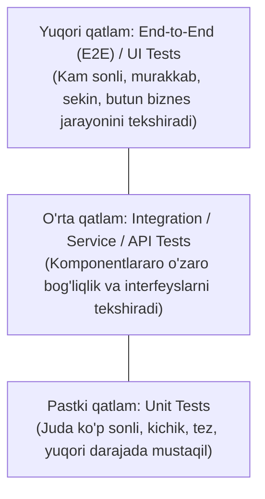

#### Test Pyramid qanday tuzilgan?
Test Pyramid bir necha **qatlam (*layers*)**lardan iborat bo'ladi. Har bir qatlam ma'lum bir turdagi testlarni ifodalaydi:
- **Pastki qatlam:** Ko'p sonli, kichik, arzon va juda tez ishlaydigan testlar;
- **Yuqori qatlam:** Kam sonli, murakkab, qimmat va sekin ishlaydigan testlar.

#### Piramidaning yuqorisiga chiqqan sari nima o'zgaradi?
ISTQB standarti bo'yicha, qatlam yuqorilagan sari quyidagi 3 ta asosiy o'zgarish yuz beradi:
1. **Test Granularity (batafsillik) kamayadi;**
2. **Test Isolation (mustaqillik / ajratilganlik) kamayadi;**
3. **Test Execution Time (bajarilish vaqti) ortadi.**

##### 1. Test Granularity kamayadi
*Granularity* — testning qanchalik kichik yoki katta funksional bo'lakni tekshirayotganini bildiradi:
- **Pastki qatlamda:** Juda kichik kod bo'lagi (alohida funksiya yoki metod) tekshiriladi;
- **Yuqori qatlamda:** Katta va murakkab butun biznes jarayoni tekshiriladi.

##### 2. Test Isolation kamayadi
*Isolation* — testning boshqa tashqi komponentlar va muhitga qanchalik bog'liq emasligini bildiradi:
- **Pastki qatlamdagi testlar:** Deyarli to'liq mustaqil (izolyatsiyalangan) holda, tashqi servislar mocks/stubs bilan almashtirilib ishlaydi;
- **Yuqori qatlamdagi testlar:** Ma'lumotlar bazasi, tashqi API'lar, UI interfeyslari, tarmoq va uchinchi tomon servislari kabi ko'plab qismlarga bevosita bog'liq bo'ladi.

##### 3. Test Execution Time ortadi
- **Pastki qatlam:** Testlar millisoniyalar ichida juda tez bajariladi;
- **Yuqori qatlam:** UI render bo'lishi, tarmoq so'rovlari va baza operatsiyalari sababli testlar ancha sekin ishlaydi.

---

#### Pastki qatlam (Bottom Layer):
- Kichik, mustaqil, tezkor va faqat kichik funksiyani tekshiradi;
- Shuning uchun jamoada bunday testlardan **juda ko'p bo'lishi kerak**, chunki ular eng keng kod qamrovini (*Coverage*) ta'minlaydi;
- *Misol:* `Calculator` klassidagi `add(a, b)` funksiyasini tekshiruvchi Unit Test.

#### Yuqori qatlam (Top Layer):
- Murakkab, yuqori darajadagi **End-to-End (E2E)** yoki UI testlar hisoblanadi;
- Ular sekin ishlaydi va butun tizim bo'ylab to'liq biznes jarayonini tekshiradi;
- Shuning uchun bunday testlar soni **kam bo'lishi lozim**;
- *Misol:* Internet Banking tizimida: *Login qilish → Pul o'tkazish → SMS kod bilan tasdiqlash → Hisobdan pul yechilganini ko'rish* jarayonini boshidan oxirigacha brauzerda tekshiruvchi avtomatlashtirilgan test.

#### Test Pyramid qatlamlari:
ISTQB shuni ta'kidlaydiki, qatlamlarning soni va nomlari turli tashkilotlarda farq qilishi mumkin:

1. **Original Test Pyramid (Mike Cohn, 2009):**
   - *1. Unit Tests* (eng pastki qatlam)
   - *2. Service Tests* (API yoki servis darajasi)
   - *3. UI Tests* (eng yuqori foydalanuvchi interfeysi qatlami)
2. **Keng qo'llaniladigan muqobil model:**
   - *1. Unit (Component) Tests*
   - *2. Integration (Component Integration) Tests*
   - *3. End-to-End Tests*
3. **Boshqa Test Level'lar ham kiritilishi mumkin:**  
   Zaruratga qarab piramidaga *Component Testing, Integration Testing, System Testing, Acceptance Testing* kabi boshqa darajalar ham integratsiya qilinishi mumkin.

#### Amaliy misol (Internet-do'kon):
- **Unit Tests (Pastki qatlam):** Price Calculator, Discount Function, Tax Calculation — juda tez ishlaydi (jami **~1000 ta**);
- **Integration Tests (O'rta qatlam):** API → Database, Payment Gateway → Bank API, Order Service → Inventory Service (**~100 ta**);
- **End-to-End Tests (Yuqori qatlam):** Saytga kirish → Mahsulotni savatga qo'shish → Karta bilan to'lash → Buyurtmani tasdiqlash (**10–20 ta**).

<Callout type="info">
**ISTQB Imtihonidagi Namunaviy Savol:**

**Savol:** Which tests are located at the bottom of the Test Pyramid?
- **A)** End-to-End Tests
- **B)** UI Tests
- **C)** Unit Tests ✅
- **D)** Acceptance Tests

**Yechish:**  
✅ **To'g'ri javob: C**  
**Tushuntirish:** Test Piramidasining eng quyi (asos) qatlamida har doim eng kichik, tez ishlovchi va ko'p sonli bo'lgan **Unit Tests** joylashadi.
</Callout>

#### Eslab qolish uchun:
- **Pastki qatlam (Unit):** Kichik, tez, mustaqil, juda ko'p bo'ladi;
- **O'rta qatlam (Integration / Service):** Komponentlararo o'zaro ishlashni tekshiradi;
- **Yuqori qatlam (E2E / UI):** Murakkab, sekin, butun biznes jarayonini tekshiradi, kam sonli bo'ladi;
- **Yuqoriga chiqqan sari:**
  - ❌ Granularity kamayadi;
  - ❌ Isolation kamayadi;
  - ✅ Execution Time ortadi.

---

### 5.1.7. Testing Quadrants (Test Kvadrantlari)

#### Testing Quadrants nima?
**Testing Quadrants (Test Kvadrantlari)** — bu dastlab Brian Marick tomonidan taklif qilingan va keyinchalik Lisa Crispin hamda Janet Gregory tomonidan rivojlantirilgan Agile testlash modelidir.

Ushbu model dasturiy ta'minotni ishlab chiqishda:
- Test darajalari (*Test Levels*);
- Test turlari (*Test Types*);
- Test faoliyatlari (*Test Activities*);
- Test texnikalari (*Test Techniques*);
- Test ish mahsulotlari (*Work Products*)
ni mantiqiy **to'rtta kvadrantga** ajratadi.

#### Testing Quadrants nima uchun kerak?
- SDLC davomida barcha kerakli test darajalari va turlari qamrab olinganini tekshirish;
- Qaysi test turi qaysi test darajasiga ko'proq mos ekanligini anglash;
- Testlarni dasturchilar, testchilar va biznes vakillari (Product Owner, foydalanuvchilar) o'rtasida o'zaro tushunarli tarzda tasniflash.

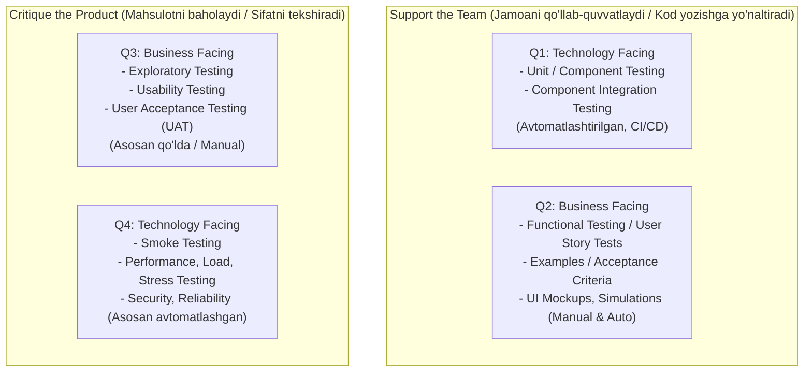

#### Model qanday ishlaydi? (2 ta o'q):
Model ikkita asosiy o'q kesishuvida qurilgan:

##### 1-o'q: Test kimga qaratilgan? (Orientation)
- **Business Facing (Biznesga qaratilgan):** Biznes talablari va foydalanuvchi maqsadlariga mosligi (foydalanuvchi uchun to'g'ri ishlayaptimi? biznes qoidalari bajarilyaptimi?);
- **Technology Facing (Texnologiyaga qaratilgan):** Ichki texnik kod, API, ma'lumotlar bazasi, arxitektura va apparat ta'minotiga yo'naltirilgan testlar.

##### 2-o'q: Testning maqsadi nima? (Purpose)
- **Support the Team (Jamoani qo'llab-quvvatlaydi):** Dasturchilarga to'g'ri kod yozishda yo'l-yo'riq ko'rsatadi (*Test-First, TDD, ATDD*);
- **Critique the Product (Mahsulotni baholaydi):** Tayyor mahsulotni foydalanuvchi kutganidek ishlayotganini va talablarga javob berishini tekshiradi.

---

#### 4 ta Kvadrant tavsifi:

#### Q1 – Technology Facing + Support the Team
- **Test turlari:** Component Testing (Unit Test), Component Integration Testing;
- **Xususiyatlari:** Dasturchilar tomonidan yoziladi, 100% avtomatlashtirilgan bo'lishi shart va **Continuous Integration (CI)** pipeline'iga integratsiya qilinadi;
- *Misol:* Developer yangi metod yozganda CI tizimida avtomatik ishga tushadigan Unit testlar.

#### Q2 – Business Facing + Support the Team
- **Test turlari:** Functional Testing, Examples (misollar), User Story Tests, User Experience Prototype, API Testing, Simulation;
- **Xususiyatlari:** User Story'dagi Acceptance Criteria'ni tekshiradi. Qo'lda (*manual*) yoki avtomatlashtirilgan (*automated*) bo'lishi mumkin;
- *Misol:* Login sahifasining qabul mezonlari bo'yicha to'g'ri va noto'g'ri kiritish holatlarini tekshirish.

#### Q3 – Business Facing + Critique the Product
- **Test turlari:** Exploratory Testing, Usability Testing, User Acceptance Testing (UAT), Alpha/Beta Testing;
- **Xususiyatlari:** Mahsulotni real foydalanuvchi nigohi bilan baholaydi. Odatda qo'lda (*manual*) bajariladi;
- *Misol:* Testchining ilovani erkin o'rganib sinashi yoki mijozning tizimni qulayligini amalda tekshirib ko'rishi.

#### Q4 – Technology Facing + Critique the Product
- **Test turlari:** Smoke Testing, Non-functional Testing (Performance, Load, Stress, Security, Reliability, Maintainability, Compatibility);
- <Callout type="warning">
  **Muhim ISTQB istisnosi:** Usability Testing bu kvadrantga KIRMMAYDI! Usability biznes va foydalanuvchiga yo'naltirilgani uchun **Q3** ga tegishli.
  </Callout>
- **Xususiyatlari:** Tizimning barqarorligi va texnik sifatini baholaydi. Ko'pincha maxsus vositalar (JMeter, OWASP ZAP) orqali avtomatlashtiriladi;
- *Misol:* Serverga 10 000 ta bir vaqtda so'rov yuborib yuklamani sinash (*Stress test*).

#### Testing Quadrants qiyosiy jadvali:

| Kvadrant | Yo'nalish | Maqsad | Odatdagi test turlari | Bajarilish usuli |
| :--- | :--- | :--- | :--- | :--- |
| **Q1** | Technology Facing | Support the Team | Component Test, Component Integration Test | Avtomatlashtirilgan (CI/CD) |
| **Q2** | Business Facing | Support the Team | Functional Test, API Test, User Story Test, Examples | Manual yoki Automated |
| **Q3** | Business Facing | Critique the Product | Exploratory Test, Usability Test, UAT | Asosan Manual |
| **Q4** | Technology Facing | Critique the Product | Smoke Test, Performance, Security, Load, Stress | Asosan Automated |

<Callout type="info">
**ISTQB Imtihonidagi Namunaviy Savol:**

**Savol:** Which quadrant contains Component Tests?
- **A)** Q2
- **B)** Q3
- **C)** Q1 ✅
- **D)** Q4

**Yechish:**  
✅ **To'g'ri javob: C**  
**Tushuntirish:** Component Tests (Unit testlar) texnologiyaga qaratilgan (*Technology Facing*) va dasturchilarni qo'llab-quvvatlovchi (*Support the Team*) bo'lgani uchun aynan **Q1** kvadrantiga kiradi.
</Callout>

#### Eslab qolish uchun:
Kvadrantlarni eslab qolish uchun 2 ta savolga javob bering:
1. *Business* yoki *Technology*?
2. *Support the Team* yoki *Critique the Product*?

- **Q1** → Technology + Support  
- **Q2** → Business + Support  
- **Q3** → Business + Critique  
- **Q4** → Technology + Critique  

---

## 5.2. Risk Management (Risklarni Boshqarish)

### Risk nima?
Har qanday tashkilot va dasturiy loyiha o'z maqsadlariga erishish jarayonida ichki (*internal*) va tashqi (*external*) omillarga duch keladi. Bu omillar sababli maqsadlarga erishish-erishmaslik va uning qachon yuz berishi noaniq bo'lib qoladi.

> **Risk (Xavf)** — bu kelajakda sodir bo'lishi mumkin bo'lgan, noaniqlik bilan tavsiflanuvchi va agar yuz bersa loyihaga yoki mahsulotga salbiy ta'sir ko'rsatuvchi ehtimoliy hodisadir.

**Risk Management (Risklarni boshqarish)** — ushbu xavflarni tizimli ravishda aniqlash, baholash va nazorat qilish jarayonidir.
- **Nima uchun kerak?** Maqsadlarga erishish ehtimolini oshirish, mahsulot sifatini yaxshilash va manfaatdor tomonlarning ishonchini qozonish uchun.

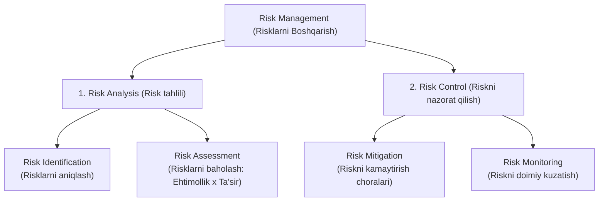

#### Risk Managementning 2 ta asosiy faoliyati:
1. **Risk Analysis (Risk tahlili):**
   - **Risk Identification:** Loyiha yoki mahsulotga zarar yetkazishi mumkin bo'lgan barcha xavflarni aniqlash;
   - **Risk Assessment:** Aniqlangan risklarning ehtimolligi va ta'sirini baholab, ustuvorlik darajasini belgilash.
2. **Risk Control (Riskni nazorat qilish):**
   - **Risk Mitigation:** Risk yuz berish ehtimolini yoki uning oqibatlarini kamaytirish uchun profilaktik choralar ko'rish (masalan, test yozish, zaxira reja tuzish);
   - **Risk Monitoring:** Loyiha davomida xatarlarni doimiy kuzatib borish, yangi risklarni aniqlash va o'zgarganlarini qayta baholash.

#### Risk-Based Testing (RBT)
> **Risk-Based Testing** — bu sinov faoliyatlari (rejalashtirish, loyihalash, bajarish) Risk Analysis va Risk Control natijalariga asoslangan holda tanlanadigan, ustuvorlashtiriladigan va boshqariladigan test yondashuvidir.

**Oddiy qilib aytganda:** Eng katta xavf tug'diradigan funksiyalar va modullar birinchi navbatda va eng chuqur usullar bilan test qilinadi.

<Callout type="info">
**ISTQB Imtihonidagi Namunaviy Savol:**

**Savol:** Which are the two main activities of Risk Management?
- **A)** Test Planning and Test Monitoring
- **B)** Risk Analysis and Risk Control ✅
- **C)** Risk Reporting and Risk Closure
- **D)** Test Design and Test Execution

**Yechish:**  
✅ **To'g'ri javob: B**  
**Tushuntirish:** ISTQB bo'yicha risklarni boshqarish ikkita yirik faoliyatdan iborat: **Risk Analysis** (tahlil) va **Risk Control** (nazorat).
</Callout>

---

### 5.2.1. Risk ta'rifi va Risk atributlari (Risk Definition and Risk Attributes)

ISTQB bo'yicha har qanday risk **ikkita asosiy atribut** bilan tavsiflanadi:

1. **Risk Likelihood (Risk yuz berish ehtimoli):**
   - Riskning qanchalik ehtimol bilan sodir bo'lishini bildiradi;
   - Qiymati odatda 0 dan katta va 1 dan kichik bo'lgan son (`0 < Likelihood < 1`) yoki foiz (masalan, 20%, 50%, 90%) bilan ifodalanadi;
   - Ehtimollik qanchalik yuqori bo'lsa, xavfga shunchalik katta e'tibor qaratiladi.
2. **Risk Impact (Harm / Oqibat va zarar):**
   - Agar risk sodir bo'lsa, uning loyihaga, biznesga yoki foydalanuvchiga yetkazadigan zarari va salbiy ta'siri darajasi (*Past, O'rta, Yuqori, Halokatli*).

#### Risk Level (Risk darajasi):
> **Risk Level (Xatar darajasi)** = **Risk Likelihood (Ehtimollik)** × **Risk Impact (Ta'sir)**

Risk Level xatarning umumiy xavflilik darajasini ifodalaydi. Risk Level qanchalik yuqori bo'lsa, unga eng birinchi navbatda ishlov berilishi shart.

| Xavf | Likelihood (Ehtimollik) | Impact (Ta'sir) | Risk Level |
| :--- | :--- | :--- | :--- |
| **Payment xatosi** | O'rta | Juda yuqori | **Yuqori** |
| **Login ishlamasligi** | Yuqori | Yuqori | **Juda yuqori** |
| **Report noto'g'ri chiqishi** | Past | Past | **Past** |

<Callout type="info">
**ISTQB Imtihonidagi Namunaviy Savol:**

**Savol:** Which two factors characterize a risk?
- **A)** Cost and Schedule
- **B)** Likelihood and Impact ✅
- **C)** Scope and Budget
- **D)** Severity and Priority

**Yechish:**  
✅ **To'g'ri javob: B**  
**Tushuntirish:** Risk doimo ikki omil bilan belgilanadi: **Likelihood** (yuz berish ehtimoli) va **Impact** (yuz bergandagi zarari).
</Callout>

---

### 5.2.2. Project Risks va Product Risks (Loyiha risklari va Mahsulot risklari)

ISTQB dasturiy ta'minotdagi risklarni ikkita katta toifaga ajratadi:

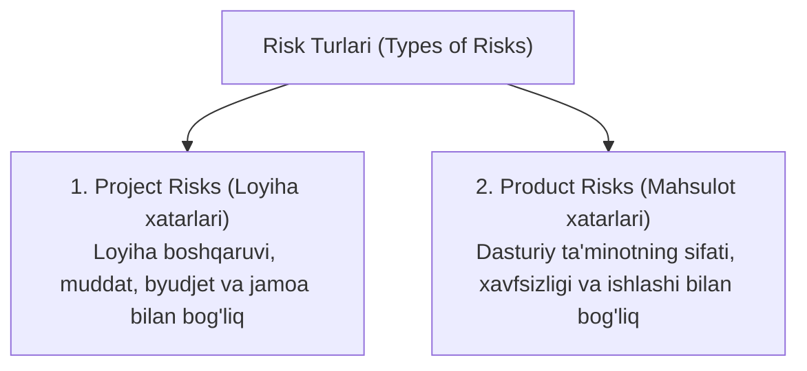

#### 1. Project Risks (Loyiha risklari)
Loyiha boshqaruvi, resurslar, muddat va tashkiliy jarayonlar bilan bog'liq xatarlar.

##### Project Risk toifalari:
1. **Organizational Issues (Tashkiliy muammolar):** Ish natijalari kech topshirilishi, noto'g'ri baholashlar (*inaccurate estimates*), byudjetning qisqartirilishi;
2. **People Issues (Odamlar bilan bog'liq muammolar):** Xodimlarning yetarli tajribaga ega emasligi, jamoaviy nizolar, aloqa muammolari, testchilar yoki dasturchilarning yetishmasligi / kasal bo'lib qolishi;
3. **Technical Issues (Texnik muammolar):** Loyiha doirasining nazoratsiz kengayib ketishi (*Scope Creep*), test vositalarining yetarli emasligi;
4. **Supplier Issues (Yetkazib beruvchilar muammolari):** Uchinchi tomon komponentlarining kechikishi, autsorsing kompaniyaning majburiyatlarini bajarmasligi yoki bankrot bo'lishi.

**Project Risk oqibatlari:** Muddat (*Schedule*), Byudjet (*Budget*) va Loyiha hajmi (*Scope*) ga bevosita zarba beradi.

---

#### 2. Product Risks (Mahsulot risklari)
Mahsulotning sifati va uning ISO 25010 sifat modeli xususiyatlariga javob bermasligi bilan bog'liq xatarlar.

##### Product Risk misollari:
- Kerakli funksiyaning mavjud emasligi (*Missing Functionality*);
- Funksiyaning noto'g'ri ishlashi (*Wrong Functionality*);
- Noto'g'ri moliyaviy yoki matematik hisob-kitoblar;
- Dastur ishlashi paytida qulab tushishi (*Runtime Errors / Crashes*);
- Yomon arxitektura va samarasiz algoritmlar;
- Javob berish vaqtining juda sekinligi (*Inadequate Response Time*);
- Yomon foydalanuvchi tajribasi (*Poor User Experience*);
- Xavfsizlik zaifliklari (*Security Vulnerabilities* — masalan, SQL Injection).

##### Product Risk oqibatlari:
1. **Foydalanuvchilar noroziligi** (*User Dissatisfaction*);
2. **Moliyaviy yo'qotishlar va obro'ga putur yetishi** (*Loss of Revenue, Trust, Reputation*);
3. **Uchinchi tomonlarga zarar yetishi**;
4. **Texnik qo'llab-quvvatlash xarajatlarining keskin oshishi**;
5. **Qonuniy jarimalar va sud da'volari** (*Criminal Penalties*);
6. **Jismoniy shikastlanish, jarohat yoki o'lim holatlari** (ayniqsa aviatsiya, tibbiyot, atom va avtomobil boshqaruv tizimlarida).

#### Project Risk va Product Risk taqqoslash:

| Xususiyat | Project Risks | Product Risks |
| :--- | :--- | :--- |
| **Nima bilan bog'liq?** | Loyiha boshqaruvi va tashkiliy jarayonlar | Dasturiy ta'minotning texnik sifati |
| **Nimaga ta'sir qiladi?** | Muddat (*Schedule*), Byudjet (*Budget*), Ko'lam (*Scope*) | Foydalanuvchi tajribasi, xavfsizlik, tizim barqarorligi |
| **Oddiy misol** | QA yetishmasligi, server kechikishi | Pul noto'g'ri hisoblanishi, login ishlamasligi |

---

### 5.2.3. Mahsulot Riski Tahlili (Product Risk Analysis)

Mahsulot riski tahlilining maqsadi — barcha mahsulot xatarlari haqida aniq tasavvur hosil qilish va sinov ishlarini shunday yo'naltirishki, natijada mahsulotda qoladigan **qoldiq xavf (*Residual Risk*)** darajasini imkon qadar kamaytirishdir.
- **Qachon boshlanadi?** Ideal holatda SDLC ning dastlabki bosqichlaridayoq boshlanishi shart.

#### 1. Risk Identification (Risklarni aniqlash)
Yuzaga kelishi mumkin bo'lgan barcha xatarlarning to'liq ro'yxatini tuzish.
- **Usullari:** Brainstorming (aqliy hujum), Workshop'lar, Intervyular, Sabab-oqibat diagrammalari (*Cause-Effect / Ishikawa / Fishbone Diagram*).

#### 2. Risk Assessment (Risklarni baholash)
- Aniqlangan risklarni kategoriyalarga ajratish (*Categorization*);
- Riskning yuz berish ehtimoli (*Likelihood*) va ta'sirini (*Impact*) aniqlash;
- Risk darajasini (*Risk Level*) hisoblash va ustuvorlashtirish (*Prioritization*).

##### Baholash yondashuvlari:
- **Quantitative Approach (Miqdoriy yondashuv):** Aniq raqamlar va formulalar orqali: `Risk Level = Likelihood × Impact`.
- **Qualitative Approach (Sifat yondashuvi):** Maxsus **Risk Matrix (Risk matritsasi)** orqali (*Juda yuqori, Yuqori, O'rta, Past*).

##### Natijalar testda qanday ishlatiladi?
- Test doirasi (*Test Scope*) ni aniqlash;
- Kerakli Test darajalari (*Test Levels*) va turlarini (*Test Types*) belgilash;
- Mos Test texnikalari va zaruriy Coverage foizini tanlash;
- Test mehnati (*Test Effort*) ni to'g'ri baholash;
- Test-keyslarni xavf darajasiga qarab tartiblash (Prioritization).

---

### 5.2.4. Mahsulot Riskini Nazorat Qilish (Product Risk Control)

Aniqlangan va baholangan mahsulot xatarlariga javoban ko'riladigan barcha amaliy choralarni o'z ichiga oladi:

#### 1. Riskka javob berishning 4 xil strategiyasi:
1. **Risk Mitigation (Riskni kamaytirish):** Sinov o'tkazish, arxitekturani yaxshilash yoki kodni refaktoring qilish orqali xavfni pasaytirish;
2. **Risk Acceptance (Riskni qabul qilish):** Agar xavf ta'siri juda past bo'lsa yoki uni bartaraf etish xarajati juda qimmat bo'lsa, xavfni boricha qabul qilish;
3. **Risk Transfer (Riskni boshqa tomonga o'tkazish):** Sug'urtalash yoki uchinchi tomon servisiga javobgarlikni yuklash;
4. **Contingency Plan (Favqulodda vaziyat rejasi):** Agar xavf yuz bersa, tizimni qanday saqlab qolish bo'yicha zaxira reja.

#### 2. Test orqali mahsulot riskini kamaytirish choralari:
- Malakali va tajribali testchilarni tanlash;
- Test mustaqilligi darajasini oshirish (*Independence of Testing*);
- Talablar va kodni Review qilish hamda Statik tahlil (*Static Analysis*) o'tkazish;
- Mos test dizayn texnikalarini qo'llash va yuqori Coverage darajasiga erishish;
- Tegishli funksional va nofunksional test turlarini chuqur o'tkazish;
- Regressiya testlarini muntazam bajarish.

#### 3. Risk Monitoring (Riskni kuzatish):
- Ko'rilgan choralarning samaradorligini tekshirish;
- Loyiha davomida yangi paydo bo'layotgan risklarni o'z vaqtida aniqlash.

---

## 5.3. Test monitoringi, test nazorati va testni yakunlash (Test Monitoring, Control & Completion)

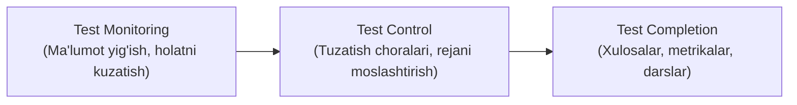

- **Test Monitoring (Sinov monitoringi):** Test jarayoni haqida doimiy ma'lumot yig'ish, rejaning bajarilishini kuzatish hamda Exit Criteria mezonlariga erishilganligini tekshirish faoliyatidir.
- **Test Control (Sinov nazorati):** Monitoring ma'lumotlari asosida testlarni samarali o'tkazish uchun boshqaruv ko'rsatmalari (*Control Directives*) berish va tuzatish choralarini ko'rish.
  - *Misollar:* Yangi paydo bo'lgan risk tufayli ustuvorliklarni o'zgartirish; test serveri kechikkanida jadvalni moslashtirish; qo'shimcha testchilarni jalb qilish.
- **Test Completion (Sinovni yakunlash):** Barcha test faoliyatlari tugaganda ma'lumotlarni, testware artefaktlarini umumlashtirish va tajribani hujjatlashtirish jarayoni.
  - *Qachon amalga oshiriladi?* Test darajasi tugaganda, Agile iteratsiyasi (sprint) yakunida, mahsulot reliz qilinganda yoki texnik xizmat ko'rsatish yakunlanganda.

---

### 5.3.1. Testlashda qo'llaniladigan metrikalar (Test Metrics)

Test metrikalari loyiha holatini, dastur sifatini va test faoliyatining samaradorligini o'lchash uchun xizmat qiladi:

1. **Project Progress Metrics (Loyiha rivojlanish metrikalari):** Vazifalarning bajarilish holati, resurslardan foydalanish, sarflangan test mehnati (*Effort*);
2. **Test Progress Metrics (Test jarayoni metrikalari):** Test-case'lar tayyorligi, muhit tayyorligi, bajarilgan/bajarilmagan testlar soni, Passed/Failed testlar foizi, bajarilish vaqti;
3. **Product Quality Metrics (Mahsulot sifati metrikalari):** Tizim mavjudligi (*Availability*), javob berish tezligi (*Response Time*), o'rtacha nosozliksiz ishlash davomiyligi (*Mean Time to Failure - MTTF*);
4. **Defect Metrics (Nuqson metrikalari):** Aniqlangan va tuzatilgan buglar soni, jiddiylik darajalari, Defect Density (KLOC yoki modulga to'g'ri keluvchi xatolar), Defect Detection Percentage (DDP);
5. **Risk Metrics (Xavf metrikalari):** Qoldiq (*Residual*) xavf darajasi;
6. **Coverage Metrics (Qamrov metrikalari):** Talablar qamrovi (*Requirements Coverage*), Kod qamrovi (*Statement / Branch Coverage*);
7. **Cost Metrics (Xarajat metrikalari):** Testlash xarajatlari, umumiy sifat xarajatlari (*Cost of Quality - CoQ*).

---

### 5.3.2. Test hisobotlarining maqsadi, mazmuni va auditoriyasi

Test hisobotlari test jarayoni davomida va yakunida barcha ma'lumotlarni umumlashtirib manfaatdor tomonlarga taqdim etish uchun xizmat qiladi:

#### 1. Test Progress Report (Test jarayoni hisoboti):
Muntazam ravishda (kunlik yoki haftalik) tayyorlanadi.
- **Mazmuni:** Hisobot davri, testlarning borishi (rejadan oldinda yoki orqada), to'siq bo'layotgan muammolar va ularning vaqtinchalik yechimlari (*workarounds*), test metrikalari, yangi paydo bo'lgan risklar va keyingi davr rejalari.

#### 2. Test Completion Report (Testni yakunlash hisoboti):
Loyiha, reliz yoki test darajasi yakunlanganda tayyorlanadi.
- **Mazmuni:** Testning umumiy xulosasi, dastlabki maqsadlar va Exit Criteria'ga nisbatan baho, rejadan og'ishlar sababi, yechilmay qolgan muammolar, qoldiq xavflar va tuzatilmagan nuqsonlar, kelajak uchun olingan saboqlar (*Lessons Learned*).

> **Auditoriya farqlari:** Jamoa ichidagi jarayon hisobotlari tez-tez va norasmiy (chat, email, stendap) tarzda taqdim etiladi. Rahbariyat va mijoz uchun esa yakuniy hisobot rasmiy shablon asosida tuziladi.

---

### 5.3.3. Test holatini (Statusini) yetkazish usullari

Manfaatdor tomonlarga test natijalarini yetkazishning bir necha samarali yo'llari mavjud:
- **Og'zaki muloqot:** Daily standup, yuzma-yuz uchrashuvlar;
- **Dashboardlar:** Real vaqt rejimida yangilanuvchi CI/CD dashboardlari, Task Board (Jira/Trello), Burndown Chart'lar;
- **Elektron aloqa:** Email, Slack, Teams chatlari;
- **Onlayn hujjatlar:** Confluence, Notion yoki umumiy vikilar;
- **Rasmiy test hisobotlari:** Test Progress va Test Completion hisobotlari.

*Tarqalgan (*distributed*) jamoalarda, turli vaqt zonalarida ishlanganda rasmiy, yozma va avtomatlashtirilgan dashboardlar eng ishonchli aloqa vositasi hisoblanadi.*

---

## 5.4. Konfiguratsiyani boshqarish (Configuration Management – CM)

**Configuration Management (CM)** — test jarayonidagi barcha ish mahsulotlarini identifikatsiya qilish, versiyalarini nazorat qilish va ularning o'zaro bog'liqligini ta'minlash faoliyatidir.

### Configuration Items (Konfiguratsiya elementlari):
Testda quyidagi barcha obyektlar CM nazoratida bo'ladi:
- Test rejalari (*Test Plans*) va strategiyalari (*Test Strategies*);
- Test shartlari (*Test Conditions*) va Test-keyslar (*Test Cases*);
- Avtomatlashtirilgan test skriptlari (*Test Scripts*);
- Test natijalari (*Test Results*) va jurnallari (*Test Logs*);
- Test hisobotlari (*Test Reports*);
- Test muhiti konfiguratsiyasi (*Test Environment*).

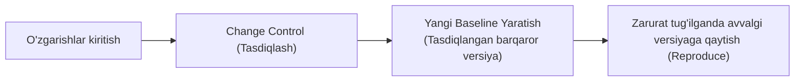

#### Baseline tushunchasi:
- Agar biror konfiguratsiya elementi tasdiqlansa, u **Baseline (asosiy tasdiqlangan versiya)** ga aylanadi;
- Baseline faqat rasmiy **Change Control (O'zgarishlarni boshqarish)** jarayoni orqali o'zgartirilishi mumkin;
- Yangi baseline yaratilganda avvalgi versiyalar saqlanadi, bu esa zarurat tug'ilganda eski xatoliklarni qayta tiklash (*Reproduce*) imkonini beradi.

#### CM nimalarni ta'minlaydi?
- Barcha elementlar unikal identifikatorga ega bo'lishi;
- Versiyalar to'liq boshqarilishi;
- Butun jarayon davomida **izchillik va bog'liqlik (*Traceability*)** saqlanishi;
- Zamonaviy DevOps / CI/CD pipeline'larida CM avtomatlashtirilgan tarzda amalga oshiriladi.

---

## 5.5. Nuqsonlarni boshqarish (Defect Management)

Testning asosiy maqsadlaridan biri nuqsonlarni aniqlash ekan, sifatli **Defect Management (Nuqsonlarni boshqarish)** jarayoni o'ta muhimdir.

### Xabar qilingan anomaliya har doim ham nuqson bo'lavermaydi:
Anomaliya aniqlanganda u quyidagilardan biri bo'lishi mumkin:
1. **Haqiqiy nuqson (*Real Defect*):** Dasturdagi haqiqiy xatolik;
2. **Noto'g'ri ijobiy natija (*False Positive*):** Test muhiti xatosi, noto'g'ri test ma'lumotlari yoki tester tushunmovchiligi tufayli xato deb o'ylangan to'g'ri holat;
3. **O'zgarish so'rovi (*Change Request*):** Tizim talabga mos ishlayapti, lekin talabning o'zini o'zgartirish taklif qilinmoqda.

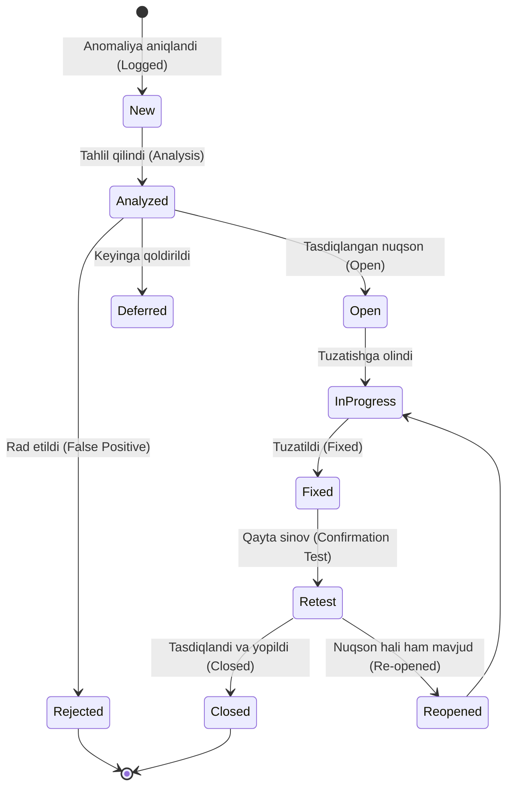

#### Nuqsonlar hayotiy sikli (Defect Workflow):
1. **Ro'yxatga olish (*Logging*):** Anomaliya aniqlangach tizimga kiritiladi;
2. **Tahlil qilish (*Analysis*):** Muammoning sababi va xarakteri o'rganiladi;
3. **Tasniflash (*Classification*):** Haqiqiy bug, false positive yoki change request ekani belgilanadi;
4. **Qaror qabul qilish (*Decision*):** Tuzatish, rad etish yoki keyingi relizga qoldirish (*Deferred*) bo'yicha qaror olinadi;
5. **Yopish (*Closure*):** Qayta sinov (*Confirmation Testing / Retesting*) muvaffaqiyatli o'tgach bug rasman yopiladi.

*Eslatma: Statik sinovlar (Reviews, Static Analysis) davomida topilgan nuqsonlar ham aynan shu tizimli tartibda boshqarilishi lozim.*

---

### Defect Reportning 3 ta asosiy maqsadi:
1. Nuqsonni tuzatuvchi dasturchiga muammoni to'liq tushunish va tuzatish uchun yetarli ma'lumot berish;
2. Mahsulot sifatini doimiy kuzatib borish imkonini yaratish;
3. Dasturiy ta'minotni ishlab chiqish va sinash jarayonlarini takomillashtirish uchun g'oyalar shakllantirish.

---

### Sifatli Defect Report tarkibi (Dynamic Testing):
- **Yagona identifikator (*Unique Identifier*):** Masalan: `BUG-1042`;
- **Sarlavha (*Title / Summary*):** Muammoning qisqa, aniq va lo'nda bayoni;
- **Aniqlangan sana va Tashkilot;**
- **Muallif va uning roli (*Author & Role*);**
- **Test obyekti va muhiti (*Test Object & Environment*):** Build versiyasi, operatsion tizim, brauzer, qurilma;
- **Nuqson konteksti:** Bajarilgan Test Case, SDLC bosqichi, qo'llanilgan test texnikasi va test ma'lumotlari;
- **Nosozlik tavsifi va Takrorlash qadamlari (*Steps to Reproduce*):** Dasturchi xatoni o'zida qayta hosil qilishi uchun bosqichma-bosqich yo'riqnoma;
- **Qo'shimcha dalillar:** Skrinshotlar, video yozuvlar, server loglari, ma'lumotlar bazasi ko'chirmalari (*dump*);
- **Kutilgan natija (*Expected Result*):** Spetsifikatsiya bo'yicha tizim qanday ishlashi kerak edi;
- **Haqiqiy natija (*Actual Result*):** Amalda qanday xatolik yuz berdi;
- **Nuqsonning og'irlik darajasi (*Severity*):** Xatoning tizimga texnik ta'siri (*Blocker, Critical, Major, Minor*);
- **Tuzatish ustuvorligi (*Priority*):** Xatoni biznes nuqtai nazaridan qanchalik tez tuzatish zarurligi (*High, Medium, Low*);
- **Holat (*Status*):** *New, Open, In Progress, Fixed, Deferred, Closed, Re-opened, Rejected*;
- **Bog'lanishlar (*References*):** Tegishli User Story yoki Test Case havolasi.

> **Avtomatlashtirish qulayligi:** Zamonaviy Bug Tracking tizimlarida (Jira, Azure DevOps, Bugzilla) identifikator, sana, muallif va dastlabki status kabi maydonlar avtomatik ravishda to'ldiriladi.

