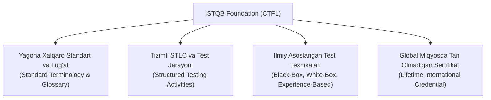
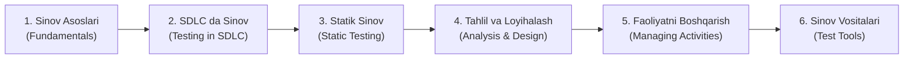

import { Cards, Callout } from 'nextra/components'
import {
  SoftwareTestingIcon,
  SdlcIcon,
  ExploratoryTestIcon,
  TestTechniquesIcon,
  TestManagementIcon,
  ToolsIcon
} from '@/components/icons'

# ISTQB Foundation (Certified Tester Foundation Level — CTFL)

**ISTQB (International Software Testing Qualifications Board)** — dasturiy ta'minotni sinash bo'yicha dunyodagi eng nufuzli va xalqaro miqyosda tan olingan sertifikatlashtirish tashkilotidir. Uning poydevor darajasi bo'lgan **ISTQB Certified Tester Foundation Level (CTFL)** har qanday professional QA muhandisi uchun xalqaro standartlar, umumiy terminologiya va tizimli sinov metodologiyasini o'zlashtirishning asosiy standarti hisoblanadi.

2023-yilda qabul qilingan eng so'nggi **ISTQB CTFL v4.0** dasturi zamonaviy Agile, DevOps va doimiy yetkazib berish (CI/CD) amaliyotlariga to'liq moslashtirilgan.

---

## ISTQB CTFL Nima va U Nega Muhim?

Dasturiy sinov sohasida har bir kompaniya yoki mutaxassis atamalarni turlicha tushunishi mumkin. ISTQB barcha sinovchilar, dasturchilar va biznes egalari uchun yagona "til" — **standart terminologiya (Glossary)** hamda xalqaro sinov mezonlarini taqdim etadi.

### ISTQB Sertifikatining Asosiy Afzalliklari:
1. **Xalqaro Tan Olinish:** Sertifikat butun dunyoda (AQSh, Yevropa, Osiyo va h.k.) muddatsiz amal qiladi.
2. **Karyera O'sishi:** Xalqaro IT kompaniyalar va autsorsing loyihalarida ISTQB sertifikatiga ega mutaxassislarga ustunlik beriladi.
3. **Chuqur Tizimli Bilim:** Shunchaki dasturni bosib ko'rish emas, balki sifatni rejalashtirishdan to hisobot berishgacha bo'lgan to'liq STLC siklini qamrab oladi.

---

## ISTQB CTFL v4.0 Sillabusining 6 ta Asosiy Bobi

Quyidagi 6 ta asosiy bob orqali ISTQB Foundation darajasini to'liq va tizimli o'rganishingiz mumkin:

<Cards num={2}>
  <Cards.Card
    icon={<SoftwareTestingIcon />}
    title="1. Sinov Asoslari (Fundamentals of Testing)"
    href="/docs/istqb-foundation/fundamentals-of-testing"
  >
    Sinovning mohiyati, QA vs QC, xatoliklar zanjiri (Error-Defect-Failure) va 7 ta oltin tamoyil.
  </Cards.Card>
  <Cards.Card
    icon={<SdlcIcon />}
    title="2. SDLC da Sinov (Testing in SDLC)"
    href="/docs/istqb-foundation/testing-throughout-the-sdlc"
  >
    SDLC modellari, 4 ta sinov darajasi, sinov turlari hamda qayta sinov va regressiya farqlari.
  </Cards.Card>
  <Cards.Card
    icon={<ExploratoryTestIcon />}
    title="3. Statik Sinov (Static Testing)"
    href="/docs/istqb-foundation/static-testing"
  >
    Statik sinovning ahamiyati, ko'rib chiqish (Reviews) turlari va avtomatlashtirilgan statik tahlil.
  </Cards.Card>
  <Cards.Card
    icon={<TestTechniquesIcon />}
    title="4. Sinov Tahlili va Loyihalash (Test Analysis and Design)"
    href="/docs/istqb-foundation/test-analysis-and-design"
  >
    Qora quti (EP, BVA, Decision Table, State Transition), Oq quti va tajribaga asoslangan texnikalar.
  </Cards.Card>
  <Cards.Card
    icon={<TestManagementIcon />}
    title="5. Sinov Faoliyatlarini Boshqarish (Managing Test Activities)"
    href="/docs/istqb-foundation/managing-the-test-activities"
  >
    Sinovni rejalashtirish, xatarlarni boshqarish (RBT), monitoring va nuqsonlarni kuzatish.
  </Cards.Card>
  <Cards.Card
    icon={<ToolsIcon />}
    title="6. Sinov Vositalari (Test Tools)"
    href="/docs/istqb-foundation/test-tools"
  >
    Sinov vositalari tasnifi, avtomatlashtirishning foydalari, xatarlari va pilot loyihalar.
  </Cards.Card>
</Cards>

### 1-bob: Sinov Asoslari (Fundamentals of Testing)
- Sinov nima va u nima uchun zarur?
- Sinovning asosiy maqsadlari (nuqsonlarni topish, sifat darajasini baholash, xatarlarni kamaytirish).
- **QA va QC farqi:** Quality Assurance (jarayonni to'g'irlash) va Quality Control (mahsulotdagi nuqsonni aniqlash).
- Xatolik zanjiri: **Insoniy Xato (Error/Mistake) $\rightarrow$ Nuqson (Defect/Bug) $\rightarrow$ Tizimdagi Nosozlik (Failure)**.
- **Sinovning 7 ta oltin tamoyili**.

### 2-bob: Dasturiy Ta'minotni Ishlab Chiqish Hayotiy Siklida Sinov (Testing Throughout the SDLC)
- SDLC modellarida sinovning o'rni (Sequential vs Iterative/Agile).
- Sinov darajalari (*Test Levels*): **Unit, Integration, System, Acceptance (UAT)**.
- Sinov turlari (*Test Types*): **Funksional, Nofunksional, Black-Box, White-Box**.
- **Tasdiqlash va Regressiya sinovi:** Qayta sinov (*Confirmation Testing / Re-testing*) va buzilmaslikni tekshirish (*Regression Testing*).

### 3-bob: Statik Sinov (Static Testing)
- Kodni ishga tushirmasdan tekshirish usullari.
- Sharhlar (*Reviews*) turlari: **Informal Review, Walkthrough, Technical Review, Inspection**.
- Statik tahlil vositalari orqali kod va hujjatlardagi xatoliklarni erta bosqichda aniqlash.

### 4-bob: Sinov Tahlili va Loyihalash (Test Analysis and Design)
- **Qora quti texnikalari (Black-Box):** Ekvivalentlik sinflari (EP), chegaraviy qiymatlar tahlili (BVA), qarorlar jadvali (Decision Table), holatlar o'tishi (State Transition).
- **Oq quti texnikalari (White-Box):** Operatorlar qamrovi (Statement Coverage), shartlar/tarmoqlar qamrovi (Branch Coverage).
- **Tajribaga asoslangan texnikalar:** Xatolarni taxmin qilish (Error Guessing), Tadqiqiy sinov (Exploratory Testing), Cheklistga asoslangan sinov.
- **Kollaborativ yondashuvlar:** Qabul mezonlari (Acceptance Criteria), ATDD (Acceptance Test-Driven Development).

### 5-bob: Sinov Faoliyatlarini Boshqarish (Managing the Test Activities)
- Sinovni rejalashtirish va baholash (*Test Planning & Estimation*).
- Xatarlarni boshqarish (*Risk Management*): Mahsulot xatarlari va loyiha xatarlari.
- Sinov monitoringi, nazorati va yakuniy xulosa hisoboti (*Test Completion*).
- Konfiguratsiyani boshqarish va **Nuqsonlarni boshqarish (Defect Management)**.

### 6-bob: Sinov Vositalari (Test Tools)
- Sinov faoliyatini qo'llab-quvvatlovchi vositalar tasnifi (Test Management, Defect Tracking, Performance, Automation).
- Testlarni avtomatlashtirishning foydalari va potentsial xatarlari.

---

## ISTQB Bo'yicha Sinovning 7 ta Oltin Tamoyili

Har qanday sinov faoliyatining asosi ushbu 7 ta qoidaga tayanadi:

1. **Sinov nuqsonlar borligini ko'rsatadi, ularning yo'qligini emas:** Sinov dasturda xatolar borligini isbotlaydi, ammo uning 100% nuqsonsiz ekanligini hech qachon kafolatlay olmaydi.
2. **Mukammal (to'liq) sinovning imkonsizligi:** Har qanday dasturning barcha kiruvchi ma'lumotlar kombinatsiyasini sinash cheksiz vaqt talab qiladi. Shuning uchun sinov risklar va ustuvorliklarga asoslanadi.
3. **Erta sinov vaqt va mablag'ni tejaydi:** Talablar va loyihalash bosqichidayoq boshlangan statik sinov xatoliklarni eng kam xarajat bilan bartaraf etadi (*Shift-Left yondashuvi*).
4. **Nuqsonlarning to'planishi (Defect Clustering):** Dasturdagi nosozliklarning 80%i odatda kodning 20% murakkab modullarida jamlanadi (Pareto qoidasi).
5. **Pestitsid paradoksi (Pesticide Paradox):** Agar bir xil testlar qayta-qayta takrorlansa, ular vaqt o'tishi bilan yangi xatolarni topa olmay qoladi. Test-keyslar muntazam yangilanib turishi shart.
6. **Sinov kontekstga bog'liqdir:** Bank ilovasi, tibbiy apparat va oddiy o'yin dasturi mutlaqo boshqacha uslub va mezonlar bilan sinovdan o'tkaziladi.
7. **Xatoliklarning yo'qligi haqidagi yanglishish (Absence-of-errors fallacy):** Dasturda birorta ham nuqson topilmagan taqdirda ham, agar u foydalanuvchining real biznes talablariga javob bermasa, u baribir yaroqsiz hisoblanadi.

---

## ISTQB Bo'yicha Rasmiy Test Hujjatlari (Test Work Products)

ISTQB Foundation standarti bo'yicha sinov jarayonida shakllanadigan barcha rasmiy hujjatlar test faoliyatlari bo'yicha qat'iy tizimlashtiriladi:

| ISTQB Faoliyati | Rasmiy Hujjat / Ishchi Mahsulot (Work Product) | Asosiy Vazifasi |
| :--- | :--- | :--- |
| **Test Planning** | **Test Plan (Sinov Rejasi)** | Sinov doirasi, maqsadlari, resurslari va jadvalini belgilovchi bosh hujjat |
| **Test Monitoring & Control** | **Test Progress Report & Metrics** | Oraliq holat, reja bilan haqiqiy ko'rsatkichlar tafovuti va metrikalar |
| **Test Analysis** | **Test Conditions & Test Charter** | Nimani sinash kerakligi hamda tadqiqiy sinovlar uchun topshiriqnomalar |
| **Test Design** | **Test Cases & Test Data Requirements** | Kiruvchi ma'lumotlar, old shartlar va kutilayotgan natijalar majmuasi |
| **Test Implementation** | **Test Procedures, Test Suites & Schedule** | Testlarni bajarish tartibi, skriptlar to'plami va ijro jadvali |
| **Test Execution** | **Test Logs & Defect Reports** | Amaldagi natijalar jurnali va topilgan nuqsonlar tafsiloti |
| **Test Completion** | **Test Summary / Completion Report** | Chiqarilish mezonlarini (Exit Criteria) baholash va saboqlar (*Lessons Learned*) |

---

## ISTQB CTFL Imtihon Formati

ISTQB Certified Tester Foundation Level imtihoniga tayyorgarlik ko'rayotgan mutaxassislar quyidagi xususiyatlarni bilishi lozim:

- **Format:** 40 ta ko'p tanlovli (Multiple Choice) savol;
- **Davomiyligi:** 60 daqiqa (ingliz tili ona tili bo'lmagan nomzodlar uchun +15 daqiqa qo'shib beriladi: jami 75 daqiqa);
- **O'tish bali:** 65% (kamida 26 ta to'g'ri javob);
- **Noto'g'ri javoblar uchun jarima:** Yo'q (har bir to'g'ri javob 1 ball beradi);
- **Kognitiv darajalar (K-Levels):**
  - **K1 (Remember):** Eslab qolish va ta'riflarni bilish (Glossary);
  - **K2 (Understand):** Tushunish, tushuntirib berish va solishtirish;
  - **K3 (Apply):** Amaliyotda qo'llash (test texnikalari bo'yicha masalalar yechish).

<Callout type="tip">
  **Tavsiya:** ISTQB CTFL imtihoniga tayyorlanishda rasmiy **ISTQB Syllabus v4.0** va **ISTQB Glossary** hujjatlarini to'liq o'qib chiqish hamda rasmiy namunaviy test savollarini (*Mock Exams*) ishlab chiqish eng yaxshi natijani beradi.
</Callout>
