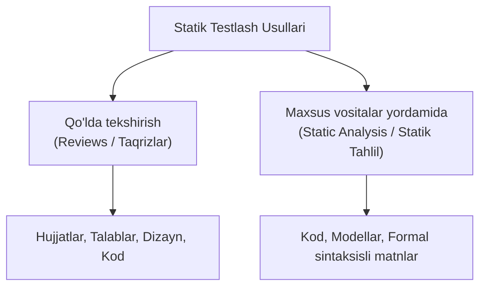
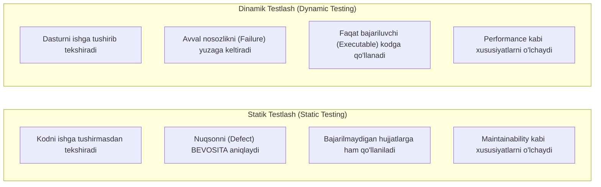
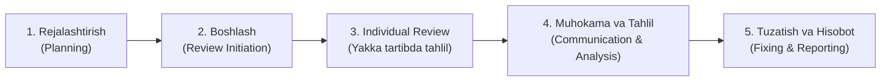
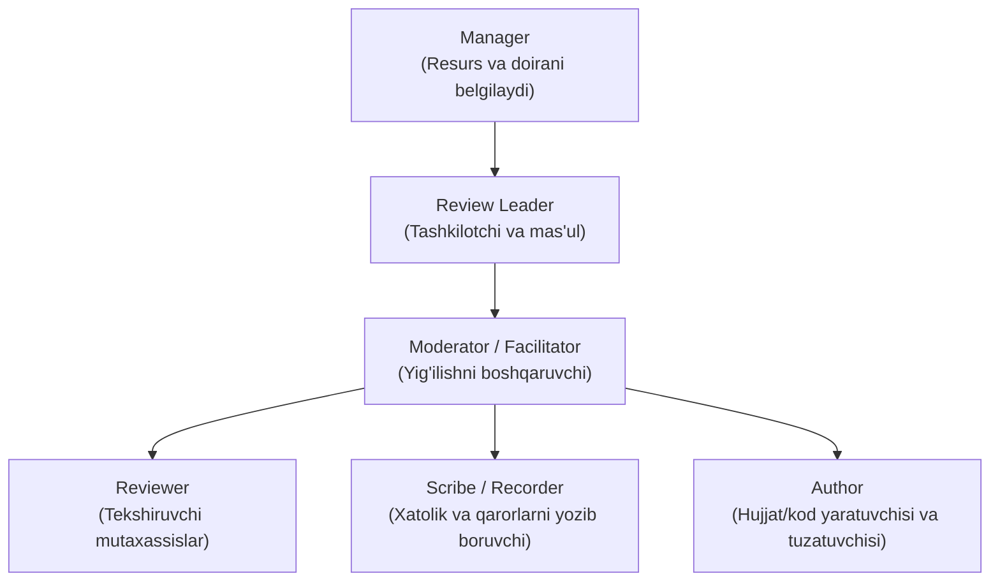
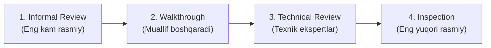

import { Callout } from 'nextra/components'

# 3-bob: Statik Sinov (Static Testing)

Dasturiy ta’minot sifatini ta’minlash faqat kodni kompyuter xotirasida ishga tushirib sinash bilan cheklanmaydi. Dastur kodini ishga tushirmasdan turib talablar, dizayn, arxitektura va manba kodini tahlil qilish **Statik testlash (Static Testing)** deb ataladi. Ushbu bobda statik testlash asoslari, ko‘rib chiqish (*Review*) jarayoni, rollar va turlari hamda muvaffaqiyat omillari batafsil bayon etiladi.

---

## 3.1. Statik testlash asoslari (Static Testing Basics)

Dinamik testlashdan farqli o‘laroq, statik testlashda test qilinayotgan dasturiy ta’minotni ishga tushirish (*execute* qilish) talab etilmaydi.

Kod, jarayon spetsifikatsiyasi (*Process Specification*), tizim arxitekturasi spetsifikatsiyasi (*System Architecture Specification*) yoki boshqa ish mahsulotlari quyidagi usullar orqali baholanadi:
- **Qo‘lda tekshirish** (masalan, *Review* — ko‘rib chiqish);
- **Maxsus vositalar yordamida** (masalan, *Static Analysis* — statik tahlil).

### Statik testlashning asosiy maqsadlari:
- Mahsulot sifatini yaxshilash;
- Nuqsonlarni (*defects*) aniqlash;
- Quyidagi sifat xususiyatlarini baholash:
  - **O‘qilishi osonligi (*Readability*)**;
  - **To‘liqligi (*Completeness*)**;
  - **To‘g‘riligi (*Correctness*)**;
  - **Test qilish qulayligi (*Testability*)**;
  - **Izchilligi (*Consistency*)**.

<Callout type="info">
Statik testlash **Verifikatsiya (*Verification*)** va **Validatsiya (*Validation*)** maqsadlarida ham teng qo‘llanilishi mumkin.
</Callout>

### Jamoaviy hamkorlik va User Story tahlili
Testerlar, biznes vakillari (*Product Owner*, *Business Analyst* va boshqalar) hamda dasturchilar quyidagi faoliyatlarda birgalikda ishlaydilar:
- **Example Mapping**;
- **User Story yozish**;
- **Backlog Refinement** sessiyalari.

Ularning asosiy maqsadi User Story va unga bog‘liq ish mahsulotlari belgilangan mezonlarga, masalan **Definition of Ready (DoR)** talablariga mos kelishini ta’minlashdir.

Review texnikalari yordamida quyidagilar tekshiriladi:
- User Story to‘liq yozilganmi?
- Tushunarli va bir ma’noli yozilganmi?
- Test qilinadigan Qabul mezonlari (*Acceptance Criteria*) mavjudmi?

Testerlar to‘g‘ri savollar berish orqali *User Story*larni tahlil qiladilar, ulardagi noaniqlik va kamchiliklarni aniqlab, ularni yaxshilashga yordam beradilar.

### Statik tahlil vositalari (Static Analysis Tools)
- *Static Analysis* dinamik testlash boshlanishidan oldin muammolarni aniqlashi mumkin va odatda kamroq mehnat talab qiladi, chunki bunda oldindan *Test Case* yozish talab etilmaydi. Buning uchun maxsus dasturiy vositalardan foydalaniladi.
- *Static Analysis* ko‘pincha **Continuous Integration (CI)** tizimlariga integratsiya qilinadi.
- U nafaqat koddagi ayrim nuqsonlarni topish, balki quyidagilarni baholash uchun ham qo‘llaniladi:
  - **Maintainability** (Qo‘llab-quvvatlash va o‘zgartirish qulayligi);
  - **Security** (Xavfsizlik zaifliklari).
- Masalan, imlo tekshiruvchi (*Spelling Checker*) va matn o‘qilishi qulayligini baholovchi vositalar ham *Static Analysis* vositalari turkumiga kiradi.

---

### 3.1.1. Statik testlash orqali tekshirilishi mumkin bo‘lgan ish mahsulotlari

Deyarli har qanday ish mahsuloti (*work product*) statik testlash orqali tekshirilishi mumkin:
- Talablar spetsifikatsiyasi (*Requirement Specification*);
- Dastur manba kodi (*Source Code*);
- Test rejasi (*Test Plan*);
- Test holatlari (*Test Cases*);
- Mahsulot backlog elementlari (*Product Backlog Items*);
- Test nizomi (*Test Charter*);
- Loyiha va arxitektura hujjatlari;
- Shartnomalar (*Contracts*);
- Tizim va ma’lumotlar modellari (*Models*).

<Callout type="info">
**Asosiy qoida:** O‘qish va inson tomonidan tushunish mumkin bo‘lgan har qanday ish mahsuloti **Review** obyekti bo‘lishi mumkin.
</Callout>

Lekin **Static Analysis** (vositalar yordamida tahlil qilish) uchun ish mahsuloti ma’lum bir qat’iy tuzilishga ega bo‘lishi kerak:
- Tizimli modellar;
- Dasturlash kodi;
- Formal sintaksisga ega bo‘lgan matnlar.

#### Statik testlash uchun mos bo‘lmagan ish mahsulotlari:
- Inson tomonidan tushunilishi juda qiyin bo‘lgan murakkab mahsulotlar;
- Huquqiy sabablar yoki format cheklovlari tufayli vositalar yordamida tahlil qilinishi mumkin bo‘lmagan obyektlar (masalan, uchinchi tomonning yopiq bajariluvchi — `.exe` dasturlari).

---

### 3.1.2. Statik testlashning ahamiyati (Value of Static Testing)

Statik testlash SDLC ning eng dastlabki bosqichlaridayoq nuqsonlarni aniqlash imkonini beradi. Bu **Erta testlash (*Early Testing*)** tamoyiliga to‘la mos keladi.

Bundan tashqari, u dinamik testlash orqali aniqlab bo‘lmaydigan ayrim nuqsonlarni ham topadi:
- Hech qachon bajarilmaydigan kod (*Unreachable Code / Dead Code*);
- Noto‘g‘ri qo‘llanilgan loyihalash shablonlari (*Design Patterns*);
- Ishga tushirilmaydigan (*Non-executable*) hujjatlardagi noaniqlik va qarama-qarshiliklar.

#### Statik testlash quyidagi imkoniyatlarni yaratadi:
- Ish mahsulotlari sifatini baholash va ularga bo‘lgan ishonchni oshirish;
- Hujjatlashtirilgan talablarni tekshirish orqali manfaatdor tomonlar ularning haqiqiy biznes ehtiyojlarini aks ettirayotganiga ishonch hosil qilish;
- Barcha ishtirokchilar orasida **umumiy tushuncha (*Shared Understanding*)** shakllantirish:
  - Muloqot yaxshilanadi;
  - Jamoalararo hamkorlik kuchayadi;
  - Shu sababli statik testlash jarayonlariga imkon qadar ko‘proq manfaatdor tomonlarni jalb qilish tavsiya etiladi.
- **Xarajatlarni tejash:** Review jarayonlarini tashkil etish ma’lum vaqt va xarajat talab qilsa ham, loyiha yakunidagi umumiy xarajat odatda ancha kam bo‘ladi, chunki keyingi bosqichlarda va ishlab chiqarishda nuqsonlarni tuzatishga ancha kam vaqt va mablag‘ sarflanadi.
- Static Analysis vositalari yordamida koddagi ko‘plab xatolar dinamik testlashga qaraganda tezroq va ancha arzon aniqlanadi. Natijada koddagi nuqsonlar kamayadi va ishlab chiqish uchun umumiy mehnat hajmi qisqaradi.

---

### 3.1.3. Statik va dinamik testlash o‘rtasidagi farqlar

Statik va dinamik testlash bir-birini inkor etmaydi, balki to‘ldiradi. Ularning umumiy maqsadi — ish mahsulotlaridagi nuqsonlarni aniqlashdir.

| Solishtirish Mezoni | Statik Testlash (*Static Testing*) | Dinamik Testlash (*Dynamic Testing*) |
| :--- | :--- | :--- |
| **Kodni ishga tushirish** | Dastur ishga tushirilmaydi | Dastur albatta ishga tushirilishi kerak |
| **Nuqsonni aniqlash usuli** | Nuqsonni bevosita ko‘rib chiqish yoki vosita orqali aniqlaydi | Avval nosozlik (*Failure*) yuzaga keltiriladi, so‘ng debugging orqali nuqson topiladi |
| **Erishish qiyin bo‘lgan kod** | Kam bajariladigan yoki chekka kod yo‘llaridagi xatolarni oson topadi | Maxsus shartlar va murakkab test-keyslar talab qilinadi |
| **Qo‘llaniladigan obyektlar** | Bajarilmaydigan (*Non-executable*) hujjatlar (talablar, dizayn, spetsifikatsiyalar) va kod | Faqat bajariladigan (*Executable*) dasturiy mahsulotlar |
| **Baholanadigan sifatlar** | Kodni ishga tushirmay o‘lchanadigan sifatlar (masalan, *Maintainability*) | Kod ishlash jarayonida namoyon bo‘ladigan sifatlar (masalan, *Performance Efficiency*) |

#### Statik testlash orqali topish osonroq va arzonroq bo‘lgan nuqsonlar:
1. **Talablardagi nuqsonlar:**
   - Mos kelmasliklar (*Inconsistencies*);
   - Noaniqliklar (*Ambiguities*);
   - Qarama-qarshiliklar (*Contradictions*);
   - Yetishmayotgan ma’lumotlar (*Omissions*);
   - Noto‘g‘ri ma’lumotlar (*Inaccuracies*);
   - Takrorlangan talablar (*Duplications*).
2. **Dizayndagi nuqsonlar:**
   - Samarasiz ma’lumotlar bazasi jadvallari va tuzilmalari;
   - Yomon modullashtirish (*Poor Modularization*).
3. **Koddagi ayrim nuqsonlar:**
   - Qiymati belgilanmagan yoki e’lon qilinmagan o‘zgaruvchilar;
   - Hech qachon bajarilmaydigan kod (*Unreachable Code*);
   - Takrorlangan kod (*Duplicated Code*);
   - Haddan tashqari murakkab kod bloklari.
4. **Standartlardan chetga chiqish:**
   - Kodlash standartlari va nomlash qoidalariga (*Naming Conventions*) amal qilinmasligi.
5. **Interfeys spetsifikatsiyasidagi xatolar:**
   - Parametrlar sonining mos kelmasligi;
   - Parametr turlarining mos kelmasligi;
   - Parametrlar tartibining xato bo‘lishi.
6. **Ayrim xavfsizlik zaifliklari:**
   - Buferning to‘lib ketishi (*Buffer Overflow*) va boshqa zaifliklar.
7. **Test qamrovidagi kamchiliklar:**
   - Qabul mezonlari (*Acceptance Criteria*) uchun kerakli testlarning yetishmasligi;
   - Test asoslaridagi (*Test Basis*) qamrovning to‘liq emasligi.

---

## 3.2. Fikr-mulohaza (Feedback) va Review jarayoni

---

### 3.2.1. Manfaatdor tomonlarning erta va tez-tez fikr-mulohaza bildirishining afzalliklari

Erta va muntazam (tez-tez) fikr-mulohaza (*Feedback*) mahsulot sifati bilan bog‘liq muammolarni dastlabki bosqichlardayoq aniqlash va ular haqida xabar berish imkonini beradi.

<Callout type="warning">
Agar SDLC davomida manfaatdor tomonlar (*Stakeholders*) yetarlicha ishtirok etmasa, ishlab chiqilayotgan mahsulot ularning dastlabki yoki hozirgi biznes ehtiyojlariga mos kelmay qolishi mumkin.
</Callout>

#### Manfaatdor tomon kutgan mahsulotni yetkazib bermaslikning salbiy oqibatlari:
- Qimmatga tushadigan qayta ishlash ishlari (*Rework*);
- Belgilangan reliz muddatlarining o‘tkazib yuborilishi;
- Jamoa a’zolarining bir-birini ayblashi (*Blame Game*);
- Hatto butun loyihaning muvaffaqiyatsizlikka uchrashi (*Project Failure*).

#### Tez-tez olinadigan fikr-mulohazalar quyidagilarga xizmat qiladi:
- Talablar bo‘yicha tushunmovchiliklarning oldini olish;
- Talablardagi o‘zgarishlarni erta tushunish va tizimga o‘z vaqtida tatbiq etish;
- Dasturchilar jamoasining yaratilayotgan mahsulot mohiyatini yaxshiroq anglashiga erishish;
- Manfaatdor tomonlar uchun eng katta biznes qiymat yaratadigan funksiyalarga diqqat qaratish;
- Aniqlangan biznes va texnik xavflarni kamaytirishga eng katta ta’sir ko‘rsatadigan sohalarni birinchi navbatda ishlab chiqish.

---

### 3.2.2. Review jarayonining bosqichlari (Review Process Activities)

**ISO/IEC 20246 standarti** umumiy (*Generic*) Review jarayonini belgilaydi. Ushbu standart turli vaziyatlarga moslashtirilishi mumkin bo‘lgan tizimli va moslashuvchan asosni taqdim etadi.

Agar Review jarayoni rasmiyroq (*Formal Review*) o‘tkazilishi kerak bo‘lsa, quyidagi barcha 5 ta bosqich to‘liq bajariladi. Ko‘pgina ish mahsulotlari katta hajmli bo‘lganligi bois, ularni bitta yig‘ilishda to‘liq ko‘rib chiqib bo‘lmaydi — shu sababli jarayon bir necha marta takrorlanishi mumkin.

#### 1. Rejalashtirish (Planning)
Rejalashtirish bosqichida quyidagilar qat’iy belgilanadi:
- Review maqsadi;
- Tekshiriladigan ish mahsuloti;
- Baholanadigan sifat xususiyatlari;
- Alohida e’tibor qaratiladigan sohalar;
- Chiqish mezonlari (*Exit Criteria*);
- Qo‘llaniladigan standartlar va yordamchi ma’lumotlar;
- Zarur mehnat hajmi va resurslar;
- Review o‘tkazish muddati.

#### 2. Reviewni boshlash (Review Initiation)
Maqsad — jarayonni boshlash uchun barcha ishtirokchilar va resurslar tayyorligini ta’minlash:
- Har bir ishtirokchining tekshirilayotgan ish mahsulotiga kirish huquqiga ega bo‘lishi;
- Har bir ishtirokchi o‘z vazifasi va javobgarligini aniq tushunishi;
- Review o‘tkazish uchun barcha zarur materiallarni to‘liq qabul qilib olishi.

#### 3. Individual Review (Yakka tartibda ko‘rib chiqish)
Har bir Reviewer mustaqil ravishda ish mahsulotini ko‘rib chiqadi va quyidagi vazifalarni bajaradi:
- Mahsulot sifatini baholash;
- Anomaliyalarni aniqlash;
- Tavsiyalar shakllantirish;
- Savollar tayyorlash.

Bunda quyidagi Review texnikalaridan biri yoki bir nechtasi qo‘llaniladi (*ISO/IEC 20246*):
- **Checklist-Based Reviewing** (Tekshiruv ro‘yxatiga asoslangan);
- **Scenario-Based Reviewing** (Ssenariylarga asoslangan).

Reviewer barcha topilgan **anomaliyalar**, **tavsiyalar** va **savollarni** yozma ravishda qayd etib boradi.

#### 4. Muhokama va tahlil (Communication and Analysis)
Review davomida topilgan barcha anomaliyalar ham haqiqiy nuqson (*Defect*) bo‘lavermaydi. Shu sababli ular birgalikda tahlil qilinadi va muhokama qilinadi.
- Har bir anomaliya uchun quyidagilar belgilanadi:
  - Holati (*Status*);
  - Mas’ul shaxs (*Owner*);
  - Bajarilishi kerak bo‘lgan tuzatish choralari.
- Bu jarayon odatda **Review Meeting** (Ko‘rib chiqish yig‘ilishi) davomida hal etiladi.
- Yig‘ilishda ish mahsulotining sifat darajasi baholanadi va keyingi qadamlar belgilanadi (zarur hollarda takroriy Review tayinlanadi).

#### 5. Tuzatish va hisobot tayyorlash (Fixing and Reporting)
- Har bir aniqlangan haqiqiy nuqson uchun **Defect Report** shakllantiriladi va tuzatish ishlari kuzatib boriladi;
- Chiqish mezonlari (*Exit Criteria*) to‘liq bajarilgach, ish mahsuloti qabul qilinadi;
- Review natijalari rasmiy hisobot shaklida taqdim etiladi.

---

### 3.2.3. Reviewdagi rollar va javobgarliklar

Review jarayonida quyidagi asosiy rollar ishtirok etadi:

| Rol | Asosiy Javobgarliklari |
| :--- | :--- |
| **Manager (Menejer)** | Qaysi ish mahsuloti ko‘rib chiqilishini belgilaydi; ko‘rib chiqish uchun zarur resurslarni (mutaxassislar va vaqt) ajratadi. |
| **Author (Muallif)** | Ish mahsulotini yaratadi; aniqlangan nuqsonlarni to‘g‘rilaydi va tuzatishlar kiritadi. |
| **Moderator (Facilitator)** | Review yig‘ilishining samarali va nizolarsiz o‘tishini ta’minlaydi; bahslar va vaqtni boshqaradi; har bir ishtirokchi o‘z fikrini erkin bildira oladigan ochiq muhit yaratadi. |
| **Scribe (Recorder / Kotib)** | Reviewerlar topgan anomaliyalarni to‘playdi; yig‘ilishda qabul qilingan qarorlar va yangi aniqlangan muammolarni aniq yozib boradi. |
| **Reviewer (Taqrizchi)** | Mahsulotni tahlil qiladi va anomaliyalarni topadi. U loyiha a’zosi, sohaviy ekspert (*Subject Matter Expert*) yoki boshqa manfaatdor tomon bo‘lishi mumkin. |
| **Review Leader (Review rahbari)** | Kimlar qatnashishini belgilash, ko‘rib chiqish qachon va qayerda o‘tkazilishini tashkil etish uchun umumiy javobgardir. |

---

### 3.2.4. Review turlari

Reviewlar o‘zining rasmiylik darajasiga ko‘ra **norasmiy (*Informal*)** ko‘rinishdan tortib **juda rasmiy (*Formal*)** shaklgacha bo‘lishi mumkin.

#### Reviewning qanchalik rasmiy bo‘lishiga ta’sir qiluvchi omillar:
- Qo‘llanilayotgan SDLC modeli;
- Dastur ishlab chiqish jarayonining yetukligi;
- Ish mahsulotining muhimligi va xavflilik darajasi;
- Mahsulotning ichki arxitekturaviy murakkabligi;
- Qonuniy yoki me’yoriy talablar;
- Audit izini (*Audit Trail*) saqlash zarurati.

Bitta ish mahsulotining o‘zi avval norasmiy, keyin esa rasmiy Review orqali bosqichma-bosqich tekshirilishi mumkin.

#### 1. Informal Review (Norasmiy ko‘rib chiqish)
- Belgilangan qat’iy rasmiy jarayon mavjud emas;
- Rasmiy hujjatlar talab qilinmaydi;
- Asosiy maqsad — anomaliyalarni tezkor topish va muhokama qilish (masalan, *Pair Programming*, hamkasb bilan ko‘rib chiqish).

#### 2. Walkthrough (Muallif boshchiligidagi ko‘rib chiqish)
- Muallif (*Author*) tomonidan olib boriladi va taqdim etiladi;
- **Maqsadlari:** Mahsulot sifatini baholash, ishonch hosil qilish, reviewerlarni o‘qitish, umumiy kelishuvga erishish, yangi g‘oyalarni o‘rtaga tashlash, muallifni mahsulotni yaxshilashga undash, anomaliyalarni aniqlash;
- Reviewerlar oldindan mustaqil ravishda *Individual Review* o‘tkazishlari mumkin, lekin bu majburiy emas.

#### 3. Technical Review (Texnik ko‘rib chiqish)
- Maxsus texnik malakaga ega bo‘lgan mutaxassislar tomonidan o‘tkaziladi;
- Malakali Moderator tomonidan boshqariladi;
- **Maqsadlari:** Texnik muammolar bo‘yicha umumiy kelishuvga (konsensusga) erishish, asosli qaror qabul qilish, anomaliyalarni topish, sifatni baholash, yangi g‘oyalarni yaratish, muallifga mahsulotni optimallashtirishga ko‘maklashish.

#### 4. Inspection (Inspeksiya — Rasmiy tekshiruv)
- Reviewning eng rasmiy turi bo‘lib, ISO/IEC 20246 standartidagi barcha 5 ta bosqichni to‘liq qamrab oladi;
- **Asosiy maqsadi:** Imkon qadar ko‘p anomaliya va nuqsonlarni qat’iy mezonlar bo‘yicha aniqlash;
- **Qo‘shimcha maqsadlari:** Mahsulot sifatini baholash, ishonchni oshirish, muallifga ish mahsulotini takomillashtirishga yordam berish;
- Jarayon davomida qat’iy metrikalar yig‘iladi va bu ma’lumotlar kelajakda butun SDLC hamda Inspection jarayonini yaxshilash uchun tahlil qilinadi;
- <Callout type="error">
  **Muhim qoida:** Inspeksiyada xolislikni ta’minlash maqsadida **Muallif (Author)** hech qachon *Review Leader*, *Moderator* yoki *Scribe* rolini bajara olmaydi.
  </Callout>

---

### 3.2.5. Review muvaffaqiyatining omillari

Review kutilgan natijani berishi va samarali o‘tishi uchun quyidagi omillar muhim hisoblanadi:

1. **Aniq maqsadlar va o‘lchab bo‘ladigan mezonlar:** Har bir Review uchun aniq maqsad va o‘lchanadigan Chiqish mezonlari (*Exit Criteria*) belgilanishi lozim. Ishtirokchilarning shaxsiy ishini baholash hech qachon Reviewning maqsadi bo‘lmasligi kerak.
2. **Mos Review turini tanlash:** Review maqsadlari, ish mahsuloti turi, loyiha talablari va ishtirokchilar malakasiga to‘liq mos keladigan Review turini to‘g‘ri belgilash.
3. **Kichik qismlarga bo‘lish:** Ish mahsulotini kichik hajmli qismlarga bo‘lib ko‘rib chiqish, bu orqali Reviewerlarning charchab qolishi va diqqatini yo‘qotishining oldi olinadi.
4. **Fikr-mulohazalarni yetkazish:** Natijalar haqida muallif va manfaatdor tomonlarga muntazam xabar berish (bu mahsulot va ish jarayonlarini yaxshilashga xizmat qiladi).
5. **Yetarli vaqt ajratish:** Ishtirokchilarga ko‘rib chiqishga tayyorgarlik ko‘rish va *Individual Review* o‘tkazish uchun yetarli vaqt taqdim etish.
6. **Rahbariyat ko‘magi:** Loyiha va korxona rahbariyati tomonidan Review jarayonini to‘liq qo‘llab-quvvatlash.
7. **Tashkiliy madaniyat:** Reviewni kompaniya madaniyatining ajralmas qismiga aylantirish (bu uzluksiz o‘rganish va o‘sishni rag‘batlantiradi).
8. **Treninglar va o‘qitish:** Barcha ishtirokchilar o‘z rollarini to‘g‘ri va professional bajarishlari uchun zaruriy treninglar tashkil qilish.
9. **Samarali moderatsiya:** Yig‘ilishlarni professional va xolislik bilan boshqarish (*Facilitating Meetings*).
