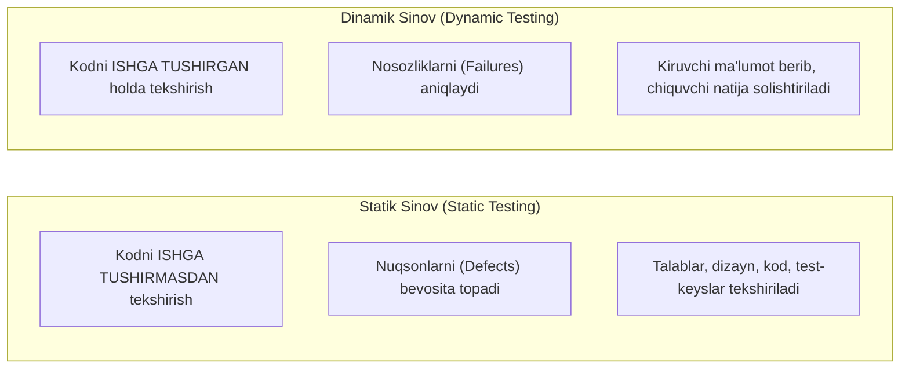
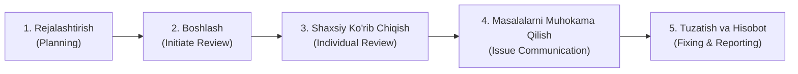

import { Callout } from 'nextra/components'

# 3-bob: Statik Sinov (Static Testing)

Dasturiy ta'minotni sinash faqat kodni kompyuter xotirasida ishga tushirish (dinamik sinov) bilan cheklanmaydi. Dastur kodini ishlatmasdan turib hujjatlar, talablar, dizayn va manba kodining o'zini tahlil qilish **Statik Sinov (Static Testing)** deb ataladi.

Statik sinov xatoliklarni tizim ishga tushirilmasidanoq, eng erta bosqichlarda topish imkonini beradi.

---

## 3.1. Statik va Dinamik Sinovning Solishtirmasi

### Statik Sinovning Afzalliklari:
- **Iqtisodiy tejamkorlik:** Talablar bosqichidagi 1 ta xatoni tuzatish ishlab chiqarishdagi xatoni tuzatishdan o'nlab barobar arzonga tushadi.
- **Dinamik sinov qamrovini yengillashtirish:** Dasturchi kod yozishidan oldin mantiqiy xatolar bartaraf etiladi.
- **Kuzatuvchanlikni ta'minlash:** Talablar to'liq va bir ma'noli ekanligiga kafolat beradi.

---

## 3.2. Taqriz Jarayoni Bosqichlari (Review Process Phases)

Rasmiy ko'rib chiqish jarayoni quyidagi ketma-ketlikda tashkil etiladi:

1. **Rejalashtirish (Planning):** Taqriz doirasini belgilash, mezonlar, rollar va vaqt chegarasini tayinlash.
2. **Boshlash (Initiate Review):** Hujjatlarni ishtirokchilarga tarqatish, maqsad va ko'rsatkichlarni tushuntirish.
3. **Shaxsiy ko'rib chiqish (Individual Review):** Har bir ishtirokchi hujjatni mustaqil o'rganib, topilgan nuqson va noaniqliklarni qayd etadi.
4. **Masalalarni muhokama qilish (Issue Communication / Meeting):** Yig'ilish o'tkazilib, topilgan kamchiliklar tahlil qilinadi va qarorlar qabul qilinadi.
5. **Tuzatish va hisobot (Fixing & Reporting):** Muallif aniqlangan xatoliklarni tuzatadi, moderator natijalarni tekshiradi va sifat hisoboti tayyorlanadi.

---

## 3.3. Taqriz Turlari (Types of Review)

ISTQB taqrizlarni rasmiylik darajasiga qarab 4 toifaga ajratadi:

| Taqriz Turi | Rasmiylik Darajasi | Asosiy Maqsadi | Yetakchi / Ishtirokchilar |
| :--- | :--- | :--- | :--- |
| **Norasmiy ko'rib chiqish (Informal Review)** | Juda past | Kichik xatolarni tezkor topish, g'oyalarni muhokama qilish | Hamkasblar (Peer review, Pair programming) |
| **Tushuntirib ko'rsatish (Walkthrough)** | O'rtacha | Hujjatni boshqalarga tushuntirish, umumiy konsensusga kelish | Hujjat muallifi boshchiligida o'tkaziladi |
| **Texnik taqriz (Technical Review)** | Yuqori | Texnik yechimning to'g'riligini va standartlarga mosligini baholash | Mustaqil texnik ekspertlar, arxitektorlar |
| **Inspeksiya (Inspection)** | Eng yuqori (formal) | Mumkin bo'lgan barcha nuqsonlarni qat'iy mezonlar bo'yicha fosh etish | Moderator boshqaradi, qat'iy qoidalar, metrikalar yuritiladi |

---

## 3.4. Avtomatlashtirilgan Statik Tahlil (Static Analysis by Tools)

Statik tahlil faqat inson ko'zi bilan emas, balki maxsus dasturiy vositalar (masalan, SonarQube, ESLint, Checkstyle) yordamida ham avtomatlashtirilgan tarzda o'tkaziladi:

- **Sintaktik xatolar:** Kodlash qoidalariga rioya qilinganligini tekshirish;
- **Ishlatilmagan kod (Dead Code):** Dasturda hech qachon chaqirilmaydigan o'zgaruvchi va funksiyalarni aniqlash;
- **Murakkablik tahlili (Cyclomatic Complexity):** Kodning haddan tashqari tarmoqlanib ketgan qismlarini fosh etish;
- **Xavfsizlik zaifliklari:** SQL Injection yoki parolning ochiq saqlanishi kabi xavflarni oldindan belgilash.
