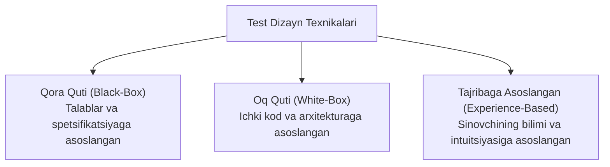
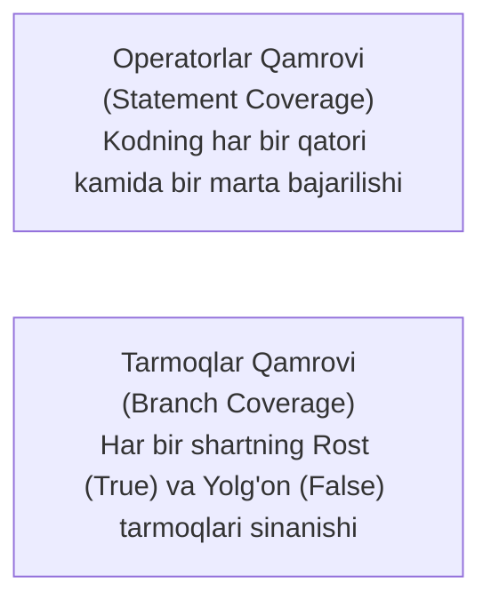

import { Callout } from 'nextra/components'

# 4-bob: Sinov Tahlili va Loyihalash (Test Analysis and Design)

Sinov tahlili va loyihalash bosqichida test muhandisi *"Nimani sinash kerak?"* (*Test Conditions*) va *"Qanday qilib samarali sinash mumkin?"* (*Test Cases*) degan savollarga javob topadi.

ISTQB test dizayn texnikalarini uchta asosiy toifaga ajratadi: **Qora quti (Black-box)**, **Oq quti (White-box)** va **Tajribaga asoslangan (Experience-based)** texnikalar.

---

## 4.1. Test Dizayn Texnikalarining Tasnifi

---

## 4.2. Qora Quti Texnikalari (Black-Box Techniques)

Dastur kodini ko'rmasdan, faqat tashqi xulq-atvoriga asoslanib test-keyslar ishlab chiqish texnikalari:

### 1. Ekvivalentlik Sinflariga Bo'lish (Equivalence Partitioning - EP)
Kiruvchi ma'lumotlar to'plamini tizim tomonidan bir xil qabul qilinadigan teng sinflarga ajratish. Har bir sinfdan faqat bitta qiymat olib sinash kifoya.
- **Yaroqli sinflar (*Valid*):** Tizim qabul qilishi kerak bo'lgan qiymatlar;
- **Yaroqsiz sinflar (*Invalid*):** Tizim xatolik bilan rad etishi kerak bo'lgan qiymatlar.

### 2. Chegaraviy Qiymatlar Tahlili (Boundary Value Analysis - BVA)
Xatoliklarning aksariyati sinflar oralig'ining chekkalarida (chegaralarida) yuzaga keladi.
- **2-nuqtali BVA:** Chegara nuqtasi va unga eng yaqin tashqi nuqta;
- **3-nuqtali BVA:** Chegaradan oldingi nuqta, chegara nuqtasining o'zi va chegaradan keyingi nuqta.

### 3. Qarorlar Jadvali Sinovi (Decision Table Testing)
Tizimdagi murakkab biznes mantiqlar, shartlar va bir nechta parametrlar kombinatsiyasini jadvallashtirish:
- Shartlar qatori (Conditions — Masalan: Foydalanuvchi tizimga kirganmi? Hisobida mablag' yetarlimi?);
- Harakatlar qatori (Actions — Masalan: Tranzaksiyani tasdiqlash yoki Xatolik xabarini chiqarish).

### 4. Holatlar O'tishi Sinovi (State Transition Testing)
Tizimning ma'lum bir voqea (*Event*) yuz berganda bir holatdan (*State*) ikkinchi holatga o'tishini tekshirish.
- Masalan: Buyurtma holati: `Yaratildi` $\rightarrow$ `To'landi` $\rightarrow$ `Yetkazilmoqda` $\rightarrow$ `Topshirildi`.

---

## 4.3. Oq Quti Texnikalari (White-Box Techniques)

Dasturning ichki mantiqiy tuzilmasi va kod qatorlarini qamrab olishga qaratilgan usullar:

- **Operatorlar Qamrovi (Statement Coverage):**  
  > **Qamrov (%)** = (Bajarilgan operatorlar soni / Jami operatorlar soni) × 100%
- **Tarmoqlar Qamrovi (Branch Coverage):**  
  Har bir shartli o'tish (masalan `if-else`) ning har ikkala natijasi sinovdan o'tishini talab qiladi. Tarmoqlar qamrovi 100% bo'lganda, operatorlar qamrovi ham avtomatik 100% ga teng bo'ladi (lekin aksincha emas!).

---

## 4.4. Tajribaga Asoslangan Texnikalar (Experience-Based Techniques)

Spetsifikatsiya yetarli bo'lmaganda yoki vaqt tanqisligida testchining shaxsiy tajribasi va sinovchilik mahoratiga asoslanadi:

1. **Xatolarni Taxmin Qilish (Error Guessing):**  
   O'tmishdagi tajribalar asosida dasturchilar qayerda xato qilish ehtimoli yuqoriligini oldindan bilish (masalan, 0 ga bo'lish, bo'sh maydon qoldirish, maxsus belgilar kiritish).
2. **Tadqiqiy Sinov (Exploratory Testing):**  
   Oldindan tayyorlangan test-keyslarsiz, tizimni bevosita o'rganish, sinash va natijalarni parallel qayd etish. Unda **Test Charter** (vazifa maqsadi va vaqt chegarasi — Timebox) asosida harakat qilinadi.
3. **Cheklistga Asoslangan Sinov (Checklist-Based Testing):**  
   Muhim tekshiruv bandlari ro'yxati asosida sinovni tashkil etish.

---

## 4.5. Kollaborativ Yondashuvlar (Collaborative Approaches)

Zamonaviy Agile jamoalarda test faqat sinovchining ishi emas, balki butun jamoaning umumiy mas'uliyati hisoblanadi:
- **User Stories va Acceptance Criteria:** Biznes egasi, dasturchi va QA talablarni birgalikda muhokama qiladi (*Three Amigos*);
- **ATDD (Acceptance Test-Driven Development):** Kod yozishdan oldin qabul testlari va kutilayotgan natijalar kelishib olinadi.
