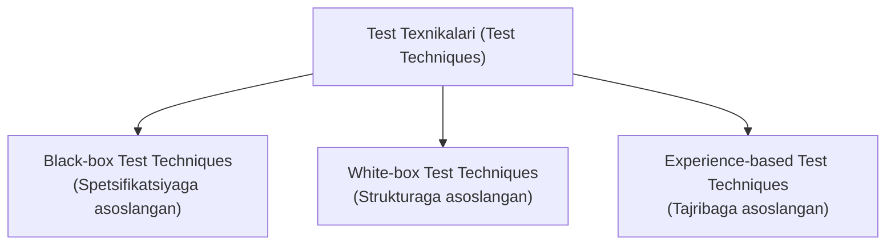
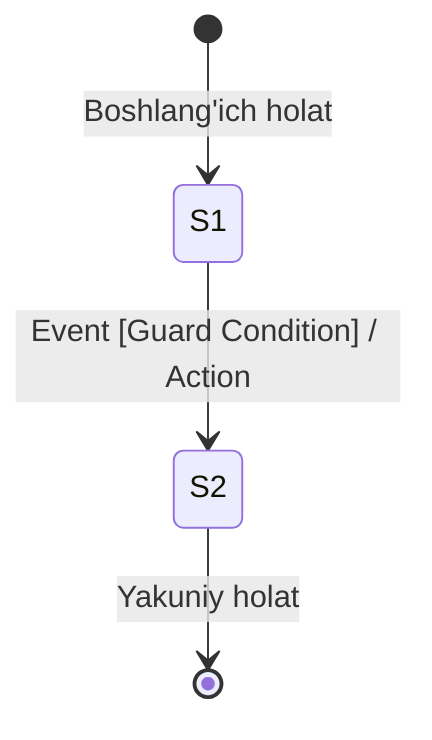
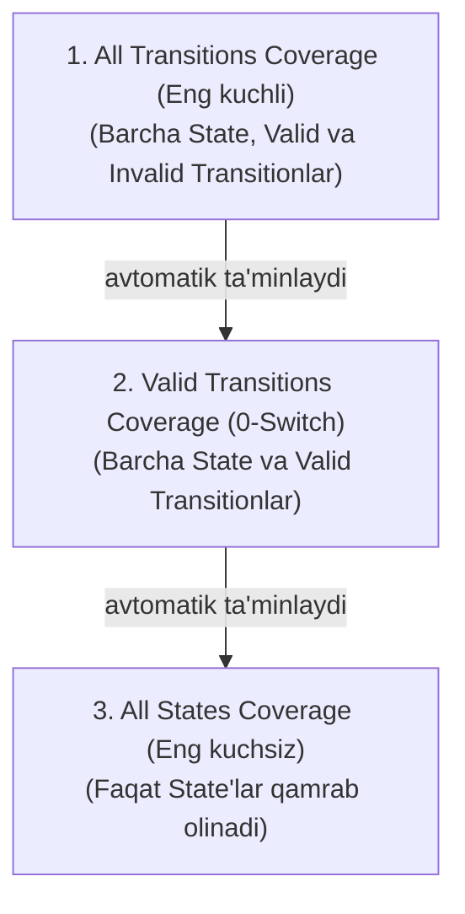
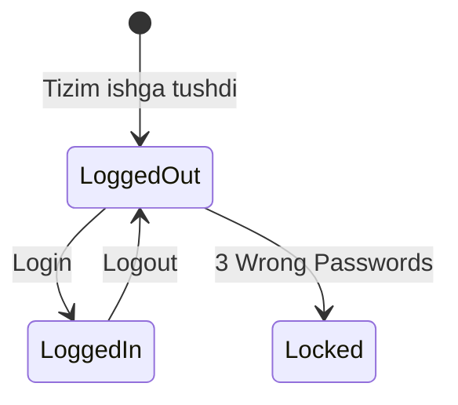
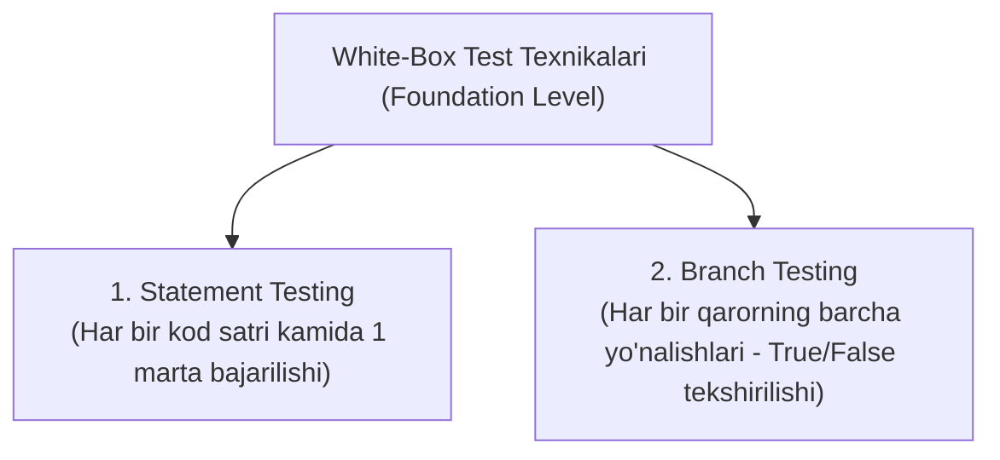
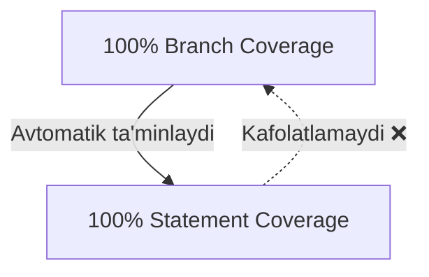
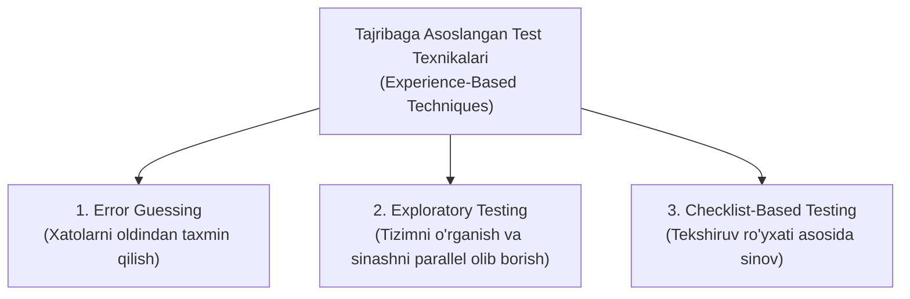
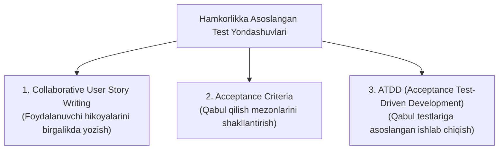
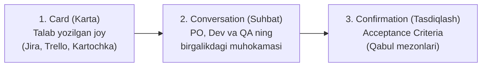
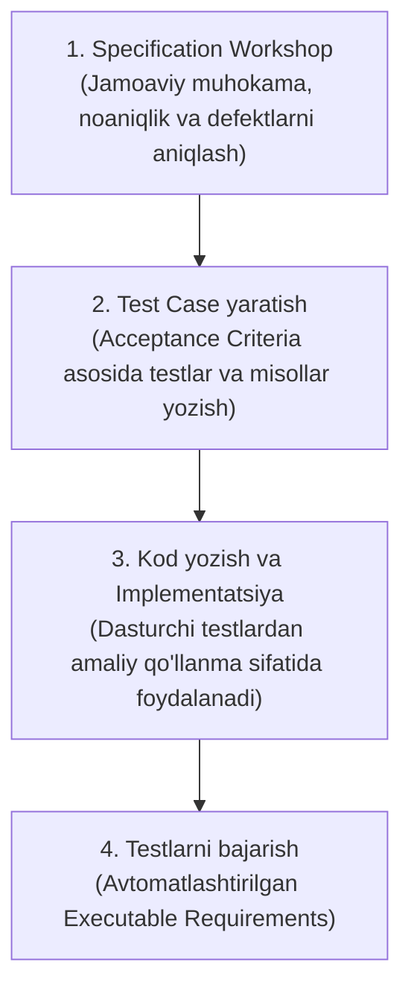

import { Callout } from 'nextra/components'

# 4-bob: Sinov Tahlili va Loyihalash (Test Analysis and Design)

Sinov tahlili va loyihalash bosqichida test muhandisi *"Nimani sinash kerak?"* (*Test Conditions*) va *"Qanday qilib samarali sinash mumkin?"* (*Test Cases*) degan savollarga javob topadi.

ISTQB test dizayn texnikalarini uchta asosiy toifaga ajratadi: **Qora quti (Black-box)**, **Oq quti (White-box)** va **Tajribaga asoslangan (Experience-based)** texnikalar.

---

## 4.1. Test texnikalariga umumiy nazar (Test Techniques Overview)

Test texnikalari (*Test Techniques*) testchiga quyidagi ikki asosiy jarayonda yordam beradi:
- **Test tahlili (*Test Analysis*)** — nimani test qilish kerakligini aniqlash (*Test Conditions*);
- **Test dizayni (*Test Design*)** — qanday test qilish kerakligini aniqlash (*Test Cases*).

Test texnikalari tizimli (*systematic*) tarzda nisbatan kam sonli, ammo yetarli miqdordagi samarali Test Caselarni yaratishga yordam beradi.

Shuningdek, ular test tahlili va test dizayni jarayonida quyidagilarni aniqlashga xizmat qiladi:
- **Test shartlari (*Test Conditions*)**
- **Qamrov elementlari (*Coverage Items*)**
- **Test ma'lumotlari (*Test Data*)**



Test texnikalari uchta asosiy toifaga bo'linadi:

### 1. Black-box Test Techniques (Qora quti test texnikalari)
Black-box test texnikalari (*Specification-based Techniques* deb ham ataladi) test qilinayotgan obyektning ichki tuzilishiga e'tibor bermasdan, faqat uning talab qilingan (spetsifikatsiyada ko'rsatilgan) xatti-harakatini (*Behavior*) tahlil qilishga asoslanadi.

Shuning uchun:
- Test Caselar dastur kodi qanday yozilganiga bog'liq bo'lmaydi.
- Agar dastur implementatsiyasi (*Implementation*) o'zgarsa, lekin uning tashqi xatti-harakati o'zgarmasa, mavjud Test Caselarni qayta ishlatish mumkin bo'ladi.

### 2. White-box Test Techniques (Oq quti test texnikalari)
White-box test texnikalari (*Structure-based Techniques* deb ham ataladi) test qilinayotgan obyektning:
- Ichki tuzilishi (*Internal Structure*);
- Ichki ishlash jarayoni (*Processing*) asosida yaratiladi.

Bu texnikalarda Test Caselar dastur qanday loyihalashtirilgani yoki kodi qanday yozilganiga bog'liq bo'ladi. Shu sababli White-box testlari faqat:
- Dizayn tayyor bo'lgandan keyin;
- yoki dastur kodi yozilgandan keyin yaratilishi mumkin.

### 3. Experience-based Test Techniques (Tajribaga asoslangan test texnikalari)
Experience-based test texnikalari testlarni yaratish va bajarishda testerning:
- **Bilimi**;
- **Tajribasi**;
- **Intuitsiyasi** dan samarali foydalanishga asoslanadi.

Bu texnikalarning samaradorligi testerning malakasi va amaliy tajribasiga bevosita bog'liq.

Experience-based texnikalar:
- Black-box texnikalari o'tkazib yuborishi mumkin bo'lgan nuqsonlarni topishi mumkin;
- White-box texnikalari aniqlay olmagan nuqsonlarni ham aniqlashi mumkin.

Shuning uchun Experience-based test texnikalari Black-box va White-box test texnikalarini to'ldiruvchi (*Complementary*) texnika hisoblanadi.

---

## 4.2. Qora quti test texnikalari (Black-box Test Techniques)

Keyingi bo'limlarda eng ko'p qo'llaniladigan Black-box test texnikalari ko'rib chiqiladi:
1. **Equivalence Partitioning (Ekvivalent sinflarga ajratish)** — Kiruvchi ma'lumotlarni bir xil xatti-harakatga ega bo'lgan guruhlarga (ekvivalent sinflarga) ajratish va har bir guruhdan bittadan vakil qiymatni test qilish usuli.
2. **Boundary Value Analysis (Chegara qiymatlari tahlili)** — Xatolar ko'pincha chegaralarda uchrashi sababli kiruvchi qiymatlarning minimal, maksimal va ularga yaqin qiymatlarini tekshirish usuli.
3. **Decision Table Testing (Qarorlar jadvali bo'yicha testlash)** — Turli shartlar (*Conditions*) va ularga mos natijalar (*Actions*) kombinatsiyasini jadval ko'rinishida ifodalab, barcha muhim kombinatsiyalarni test qilish usuli.
4. **State Transition Testing (Holatlar o'tishi bo'yicha testlash)** — Tizimning turli holatlari (*States*) va bir holatdan boshqasiga o'tish jarayonlarini tekshirish usuli. Bu texnika holatga bog'liq ishlaydigan tizimlar (masalan, login jarayoni, bankomat, lift, buyurtma holatlari va boshqalar) uchun ayniqsa foydalidir.

---

### 4.2.1. Ekvivalent sinflarga ajratish (Equivalence Partitioning – EP)

**Ekvivalent sinflarga ajratish (EP)** — bu ma'lumotlarni ekvivalent sinflar (*Equivalence Partitions*) ga bo'lish usuli bo'lib, bunda bir sinfga kiruvchi barcha qiymatlar test qilinayotgan tizim (*test object*) tomonidan bir xil tarzda qayta ishlanishi kutiladi.

Ushbu usulning asosiy g'oyasi shundan iboratki, agar ekvivalent sinfdagi bitta qiymatni tekshiruvchi test holati (*Test Case*) nuqsonni aniqlasa, xuddi shu sinfdagi boshqa istalgan qiymatni tekshiruvchi testlar ham aynan shu nuqsonni aniqlashi kerak. Shu sababli, har bir ekvivalent sinf uchun bitta test o'tkazish odatda yetarli hisoblanadi.

Ekvivalent sinflar test qilinayotgan obyektga tegishli istalgan ma'lumot elementi uchun aniqlanishi mumkin:
- Kirish (*Input*) ma'lumotlari;
- Chiqish (*Output*) ma'lumotlari;
- Konfiguratsiya elementlari;
- Ichki qiymatlar;
- Vaqtga bog'liq qiymatlar;
- Interfeys parametrlari.

Bu sinflar quyidagi xususiyatlarga ega bo'lishi mumkin:
- Uzluksiz yoki diskret;
- Tartiblangan yoki tartiblanmagan;
- Cheklangan yoki cheksiz.

<Callout type="warning">
**Ekvivalent sinflar qoidalari:**
- Sinflar bir-biri bilan ustma-ust tushmasligi (*overlap* qilmasligi) kerak;
- Bo'sh to'plam bo'lmasligi kerak.
</Callout>

Oddiy test obyektlari uchun EP usulini qo'llash oson bo'lishi mumkin. Ammo amaliyotda tizimning turli qiymatlarni qanday qayta ishlashini tushunish ko'pincha murakkab bo'ladi. Shu sababli, ekvivalent sinflarni aniqlash jarayoni ehtiyotkorlik bilan bajarilishi lozim.

#### Valid va Invalid sinflar

- **Valid partition (Yaroqli ekvivalent sinf)** — tizim tomonidan qabul qilinishi va qayta ishlanishi kerak bo'lgan qiymatlar to'plami.
- **Invalid partition (Yaroqsiz ekvivalent sinf)** — tizim tomonidan qabul qilinmasligi yoki rad etilishi kerak bo'lgan qiymatlar to'plami.

<Callout type="info">
Valid va Invalid qiymatlarning aniq ta'rifi tashkilot yoki jamoaga qarab farq qilishi mumkin:
- **Valid qiymatlar:** tizim tomonidan qayta ishlanishi kerak bo'lgan yoki spetsifikatsiyada qanday qayta ishlanishi belgilangan qiymatlar.
- **Invalid qiymatlar:** tizim tomonidan e'tiborga olinmasligi yoki rad etilishi kerak bo'lgan, yoxud spetsifikatsiyada qayta ishlanishi umuman ko'rsatilmagan qiymatlar.
</Callout>

#### EP usulida qamrov (Coverage)

EP usulida *Coverage Item* sifatida ekvivalent sinflarning o'zi olinadi.

**100% qamrovga erishish uchun:** Aniqlangan barcha ekvivalent sinflar (shu jumladan invalid sinflar ham) kamida bir martadan test qilinishi kerak.

> **Coverage (%)** = (Kamida bitta test bilan tekshirilgan ekvivalent sinflar soni / Aniqlangan jami ekvivalent sinflar soni) × 100%

#### Bir nechta parametr mavjud bo'lsa (Each Choice Coverage)

Ko'pgina test obyektlarida bir nechta kirish parametrlari bo'ladi. Natijada har bir parametr uchun alohida ekvivalent sinflar to'plami mavjud bo'ladi. Bunday holatda bitta test holati bir vaqtning o'zida turli parametrlarning turli ekvivalent sinflarini qamrab olishi mumkin.

Bir nechta ekvivalent sinflar to'plami mavjud bo'lganda eng oddiy qamrov mezoni **Each Choice Coverage** deb ataladi.

- **Each Choice Coverage talabi:** Har bir parametrning har bir ekvivalent sinfi kamida bir marta test qilinishi kerak.
- *Eslatma:* Each Choice Coverage turli parametrlar ekvivalent sinflarining kombinatsiyalarini hisobga olmaydi. Ya'ni, u faqat har bir sinfning alohida tekshirilishini talab qiladi, ularning barcha mumkin bo'lgan kombinatsiyalarini emas.

#### Amaliy misol 1 (Bitta parametr):
**Talab:** Yosh (*Age*) maydoni faqat 18 dan 60 gacha (ikkalasi ham kiradi) bo'lgan qiymatlarni qabul qiladi.

**1-qadam. Ekvivalent sinflarni ajratamiz:**
| Partition | Qiymatlar | Holati |
| :--- | :--- | :--- |
| **EP1** | 18–60 | Valid |
| **EP2** | 18 dan kichik (`< 18`) | Invalid |
| **EP3** | 60 dan katta (`> 60`) | Invalid |

*Demak, jami 3 ta partition bor.*

**2-qadam. Har bir partition uchun bitta test tanlaymiz:**
| Test Case | Qiymat (Value) | Partition | Kutilgan natija |
| :--- | :--- | :--- | :--- |
| **TC1** | 25 | Valid (EP1) | Qabul qilinadi (Accepted) |
| **TC2** | 15 | Invalid (EP2) | Rad etiladi (Rejected) |
| **TC3** | 70 | Invalid (EP3) | Rad etiladi (Rejected) |

*Bu yerda 3 ta test 100% EP qamrovi uchun to'liq yetarli.*

#### Amaliy misol 2 (Bir nechta parametr):
**Talab:**
- **Age:** 18–60
- **Country:** UZ, US, UK

**Partitionlar:**
- **Age:**
  - EP1 = 18–60 (Valid)
  - EP2 = `< 18` (Invalid)
  - EP3 = `> 60` (Invalid)
- **Country:**
  - EP4 = UZ / US / UK (Valid)
  - EP5 = Boshqa mamlakatlar (Invalid)

*Jami: 5 ta partition.*

**Each Choice Coverage bo'yicha minimal testlar:**
| Test | Age | Country | Qamrov tekshiruvi |
| :--- | :--- | :--- | :--- |
| **TC1** | 30 | UZ | Age valid (EP1) ✔, Country valid (EP4) ✔ |
| **TC2** | 15 | France | Age invalid (`< 18`, EP2) ✔, Country invalid (EP5) ✔ |
| **TC3** | 70 | US | Age invalid (`> 60`, EP3) ✔, Country valid (EP4) ✔ |

Bu 3 ta test barcha 5 ta ekvivalent sinfni qamrab olib, **100% Each Choice coverage** beradi.

<Callout type="info">
**ISTQB imtihonida EP savollarini yechish qoidasi:**
1. Talabdagi valid diapazonni aniqlang.
2. Undan kichik qiymatlar uchun bitta invalid partition yarating.
3. Undan katta qiymatlar uchun yana bitta invalid partition yarating.
4. Har bir partition uchun kamida bitta test case tanlang.
5. Agar bir nechta input bo'lsa, Each Choice Coverage bo'yicha har bir inputning barcha partitionlari kamida bir marta qamrab olinganini tekshiring.
</Callout>

---

### 4.2.2. Chegara Qiymatlari Tahlili (Boundary Value Analysis – BVA)

**Boundary Value Analysis (BVA)** — bu ekvivalent sinflarning (*Equivalence Partitions*) chegara qiymatlarini test qilishga asoslangan test dizayni usulidir.

Shuning uchun BVA faqat **tartiblangan (*ordered*)** ekvivalent sinflar uchun qo'llanilishi mumkin.

Har bir ekvivalent sinfning:
- Eng kichik qiymati (*minimum*) va
- Eng katta qiymati (*maximum*) uning chegara qiymatlari (*Boundary Values*) hisoblanadi.

> **BVA asosiy qoidasi:** Agar ikkita qiymat bir xil ekvivalent sinfga tegishli bo'lsa, ular orasidagi barcha qiymatlar ham aynan shu sinfga tegishli bo'lishi kerak.

#### Nima uchun BVA muhim?
BVA aynan chegara qiymatlariga e'tibor qaratadi, chunki dasturchilar aynan shu joylarda ko'proq xatolarga yo'l qo'yishadi.

**BVA yordamida aniqlanadigan odatiy nuqsonlar:**
- Chegara noto'g'ri belgilangan bo'lishi;
- Chegara kerakli joydan yuqoriga yoki pastga siljib qolishi;
- Chegara umuman hisobga olinmagan bo'lishi.

*Masalan:*
- Talab: `18 ≤ Age ≤ 60`
- Lekin dasturchi quyidagicha yozgan: `19 ≤ Age ≤ 60`
- Bu yerda `18` qiymati noto'g'ri rad etiladi. Bunday xatolarni BVA juda yaxshi aniqlaydi.

#### BVA ning ikki turi

ISTQB Foundation dasturida BVA ning ikki xil ko'rinishi o'rganiladi:
1. **2-value BVA**
2. **3-value BVA**

Farqi — har bir chegara uchun nechta qiymat test qilinishida.

#### 1. 2-value Boundary Value Analysis
Har bir chegara uchun 2 ta qiymat olinadi:
- Chegaraning o'zi;
- Unga qo'shni bo'lgan boshqa partitiondagi eng yaqin qiymat.

100% qamrovga erishish uchun barcha chegaralar tekshirilishi kerak.

> **Coverage (%)** = (Tekshirilgan chegara qiymatlari soni / Jami chegara qiymatlari soni) × 100%

**Misol:**
- Talab: `Age = 18–60`
- Partitionlar: `< 18` (Invalid) | `18–60` (Valid) | `> 60` (Invalid)
- Chegaralar: `18` va `60`

| Test qiymati | Sababi |
| :--- | :--- |
| **17** | 18 ning chap qo'shnisi |
| **18** | Chegara |
| **60** | Chegara |
| **61** | 60 ning o'ng qo'shnisi |

Demak, 2-value BVA testlari: **17, 18, 60, 61**.

#### 2. 3-value Boundary Value Analysis
Bu usul yanada qat'iyroq hisoblanadi. Har bir chegara uchun 3 ta qiymat olinadi:
- Chegaraning o'zi;
- Undan oldingi qiymat;
- Undan keyingi qiymat.

*Eslatma: Bu holatda qo'shni qiymatlar har doim ham chegara bo'lmasligi mumkin.*

100% coverage uchun barcha chegaralar va ularning ikkala qo'shnisi ham test qilinishi kerak.

> **Coverage (%)** = (Tekshirilgan chegaralar va ularning qo'shnilari soni / Jami chegaralar va qo'shnilar soni) × 100%

**Misol:**
- Talab: `18–60`
- 18 chegarasi uchun: **17, 18, 19**
- 60 chegarasi uchun: **59, 60, 61**
- Jami 3-value BVA test to'plami: **17, 18, 19, 59, 60, 61**.

#### Nima uchun 3-value yaxshiroq?
3-value BVA ba'zi yashirin xatolarni aniqlaydi, 2-value esa ularni o'tkazib yuborishi mumkin.

**Misol:**
- Talab: `if (x <= 10)`
- Dasturchi xato yozgan: `if (x == 10)`

- **2-value BVA testlari (10, 11):**
  - `10` → to'g'ri ishlaydi
  - `11` → to'g'ri ishlaydi
  - *Xato topilmaydi!*
- **3-value BVA testlari (9, 10, 11):**
  - `9` → noto'g'ri ishlaydi (talab bo'yicha qabul qilinishi kerak edi, lekin `9 == 10` false bo'lib rad etiladi) ❌
  - `10` → to'g'ri ishlaydi
  - `11` → to'g'ri ishlaydi
  - **Shunday qilib, `9` qiymati xatoni fosh qiladi!**

<Callout type="info">
**ISTQB Namunaviy Savoli:**

**Savol:** Dastur faqat 1 dan 10 gacha bo'lgan sonlarni qabul qiladi (1 va 10 ham kiradi — *inclusive*). Ushbu talab uchun 3-value Boundary Value Analysis test to'plamini aniqlang:
- **A)** 0, 1, 2, 9, 10, 11 ✅
- **B)** 1, 10
- **C)** 0, 1, 10, 11
- **D)** 2, 5, 9

**Yechish:**  
1 chegarasi uchun: `0, 1, 2`  
10 chegarasi uchun: `9, 10, 11`  
Shuning uchun to'g'ri javob: **A (0, 1, 2, 9, 10, 11)**.
</Callout>

#### EP va BVA o'rtasidagi farq

| Xususiyat | Equivalence Partitioning (EP) | Boundary Value Analysis (BVA) |
| :--- | :--- | :--- |
| **Tanlov usuli** | Har bir ekvivalent sinfdan bitta vakil qiymat tanlanadi. | Aynan chegaradagi va unga yaqin qiymatlar tanlanadi. |
| **Asosi** | Sinflar (*Partitions*) asosida ishlaydi. | Chegara (*Boundary*) qiymatlari asosida ishlaydi. |
| **Testlar soni** | Kamroq testlar talab qiladi. | Ko'proq testlar talab qiladi. |
| **Maqsadi** | Umumiy funksionallikni tekshiradi. | Chegara bilan bog'liq xatolarni topishda samaraliroq. |

**Eslab qolish oson:**
- **EP** → *"Har bir sinfdan bitta qiymat yetarli."*
- **2-value BVA** → *"Chegara va uning tashqi qo'shnisi."*
- **3-value BVA** → *"Oldingi qiymat + chegara + keyingi qiymat."*

ISTQB Foundation imtihonida eng ko'p uchraydigan BVA savollari aynan 2-value va 3-value test to'plamlarini tanlash, chegara qiymatlarini aniqlash yoki minimal test case sonini topishga qaratilgan bo'ladi.

---

### 4.2.3. Qaror Jadvali Bo'yicha Testlash (Decision Table Testing)

**Decision Table Testing (Qaror jadvali bo'yicha testlash)** — bu turli shartlarning (*Conditions*) kombinatsiyalari turli natijalarga (*Outcomes*) olib keladigan talablarni tekshirish uchun qo'llaniladigan test dizayni usulidir.

Qaror jadvallari, ayniqsa, biznes qoidalari (*Business Rules*) kabi murakkab mantiqni ifodalash va test qilishda juda samarali hisoblanadi.

#### Qaror jadvali qanday tuziladi?
Qaror jadvalini tuzishda avvalo quyidagilar aniqlanadi:
- **Conditions (Shartlar)** — tizim qaror qabul qilishda tekshiradigan shartlar.
- **Actions (Harakatlar / Natijalar)** — shartlarga qarab tizim bajaradigan amallar.

Bu elementlar jadvalning qatorlari (*rows*) ni tashkil qiladi. Har bir ustun (*column*) esa bitta **Decision Rule (Qaror qoidasi)** hisoblanadi. Ya'ni, har bir ustunda shartlarning yagona kombinatsiyasi va unga mos harakatlar ko'rsatiladi.

#### Qaror jadvallarining turlari

1. **Limited-entry Decision Table:**  
   Bu turdagi jadvalda shartlar va natijalar faqat ikkita qiymatga ega bo'ladi:
   - `True (T)` — Ha
   - `False (F)` — Yo'q  
   Ya'ni, barcha shartlar mantiqiy (*Boolean*) qiymatlar bilan ifodalanadi.

2. **Extended-entry Decision Table:**  
   Bu turdagi jadvalda ayrim yoki barcha shartlar faqat ikki qiymat bilan cheklanmaydi:
   - Sonlar oralig'i (masalan, 18–60);
   - Ekvivalent sinflar;
   - Diskret qiymatlar (masalan, *Gold, Silver, Bronze*).

#### Jadvaldagi belgilar

**Shartlar (Conditions):**
| Belgi | Ma'nosi |
| :--- | :--- |
| **T** | Shart bajarilgan (*True*) |
| **F** | Shart bajarilmagan (*False*) |
| **–** | Ushbu shart natijaga ta'sir qilmaydi (*Irrelevant*) |
| **N/A** | Ushbu kombinatsiya mumkin emas (*Infeasible*) |

**Natijalar (Actions):**
| Belgi | Ma'nosi |
| :--- | :--- |
| **X** | Amal bajariladi |
| *(bo'sh katak)* | Amal bajarilmaydi |

*Boshqa belgilar ham ishlatilishi mumkin, ammo ISTQB odatda shu belgilarni qo'llaydi.*

#### Full Decision Table (To'liq qaror jadvali)
To'liq qaror jadvali (*Full Decision Table*) barcha mumkin bo'lgan shart kombinatsiyalarini o'z ichiga oladi:
- 2 ta shart bo'lsa: $2^2 = 4$ ta qoida (`TT, TF, FT, FF`)
- 3 ta shart bo'lsa: $2^3 = 8$ ta qoida
- 4 ta shart bo'lsa: $2^4 = 16$ ta qoida

Shartlar soni oshgani sari qoidalar soni geometrik ravishda ($2^n$) ortadi.

#### Jadvalni soddalashtirish
Qaror jadvali quyidagi usullar bilan kichraytirilishi mumkin:
1. **Imkonsiz (*Infeasible*) kombinatsiyalarni olib tashlash:**  
   Masalan, foydalanuvchi bir vaqtning o'zida:
   - Login qilgan
   - Login qilmagan bo'lishi mumkin emas.  
   Bunday mantiqsiz ustunlar olib tashlanadi.
2. **Birlashtirish (*Merge*):**  
   Ba'zi shartlar natijaga ta'sir qilmasa, bir nechta ustun bitta ustunga birlashtiriladi. Bu jarayon **Decision Table Minimization** deyiladi.  
   *(ISTQB Foundation rejasida minimization algoritmlari chuqur o'rganilmaydi).*

#### Decision Table qamrovi (Coverage)
Decision Table Testing'da *Coverage Item* sifatida **mumkin bo'lgan (*feasible*) har bir qaror qoidasi (ustun)** olinadi.

**100% Coverage olish uchun:** Har bir mumkin bo'lgan qaror qoidasi (ustun) kamida bir marta test qilinishi kerak.

#### Decision Table Testing afzalliklari va kamchiliklari

**Afzalliklari:**
- Barcha mumkin bo'lgan shart kombinatsiyalarini tizimli ravishda aniqlaydi;
- Ko'zdan qochib ketishi mumkin bo'lgan kombinatsiyalarni topishga yordam beradi;
- Talablar (*Requirements*) dagi bo'shliqlar va noaniqliklarni aniqlaydi;
- Talablar orasidagi qarama-qarshiliklarni topishga ko'maklashadi.

**Kamchiligi:**
- Agar shartlar soni ko'p bo'lsa, qaror qoidalari soni juda tez ortadi:

| Conditions (Shartlar) | Rules (Qoidalar soni — $2^n$) |
| :---: | :---: |
| 2 | 4 |
| 3 | 8 |
| 4 | 16 |
| 5 | 32 |
| 6 | 64 |

Shuning uchun barcha kombinatsiyalarni test qilish juda ko'p vaqt va resurs olishi mumkin. Bunday holatda:
- Soddalashtirilgan jadval (**Minimized Decision Table**);
- Yoki risklarga asoslangan testlash (**Risk-Based Testing**) qo'llaniladi.

#### ISTQB uslubidagi amaliy misol

**Talab:**
Internet do'konda:
- Agar foydalanuvchi tizimga login qilgan bo'lsa;
- va mahsulot omborda mavjud bo'lsa;
- unda xarid qilish mumkin. Aks holda xarid amalga oshirilmaydi.

**Qaror jadvali:**
| Shartlar va Harakatlar (Conditions / Actions) | Rule 1 | Rule 2 | Rule 3 | Rule 4 |
| :--- | :---: | :---: | :---: | :---: |
| **Login qilinganmi?** | T | T | F | F |
| **Mahsulot omborda bormi?** | T | F | T | F |
| **Xarid qilishga ruxsat berish** | X | | | |

**Test Caselar:**
| Test Case | Login | Mahsulot | Kutilgan natija (Expected Result) |
| :--- | :---: | :---: | :--- |
| **TC1** | T | T | Xarid tasdiqlandi (Purchase Allowed) |
| **TC2** | T | F | Xarid rad etildi (Purchase Rejected) |
| **TC3** | F | T | Xarid rad etildi (Purchase Rejected) |
| **TC4** | F | F | Xarid rad etildi (Purchase Rejected) |

*Bu yerda 100% Decision Table Coverage ga erishish uchun 4 ta test case talab qilinadi.*

<Callout type="info">
**ISTQB Imtihonidagi Namunaviy Savol:**

**Savol:** A system has two Boolean conditions:
- User is logged in
- User has administrator rights  
How many rules does a full decision table contain?

- **A)** 2
- **B)** 3
- **C)** 4 ✅
- **D)** 8

**Yechish:**  
Tizimda 2 ta Boolean shart mavjud ($n = 2$). To'liq jadvaldagi qoidalar soni:  
$2^n = 2^2 = 4$.  
✅ **To'g'ri javob: C (4 ta qoida)**
</Callout>

#### Imtihon uchun eng muhim qoidalar:
- **Qoidalar sonini hisoblash formulasi:**
  - 1 ta Boolean shart → 2 ta qoida ($2^1$)
  - 2 ta Boolean shart → 4 ta qoida ($2^2$)
  - 3 ta Boolean shart → 8 ta qoida ($2^3$)
  - 4 ta Boolean shart → 16 ta qoida ($2^4$)
- **Qatorlar (*rows*)** → Conditions va Actions.
- **Ustunlar (*columns*)** → Decision Rules.
- Har bir ustun alohida test case bilan tekshiriladi.
- 100% Coverage olish uchun barcha mumkin bo'lgan (*feasible*) ustunlar kamida bir marta test qilinishi kerak.

---

### 4.2.4. Holatlar o'tishi bo'yicha testlash (State Transition Testing)

**State Transition Testing (Holatlar o'tishi bo'yicha testlash)** — bu tizimning turli holatlar (*States*) orasida qanday o'tishini tekshiradigan test dizayni usulidir.

Bu usul ayniqsa quyidagi holatga bog'liq tizimlarda keng qo'llaniladi:
- Login tizimlari;
- Bankomat (ATM);
- Lift boshqaruvi;
- Svetofor tizimlari;
- Buyurtma (*Order*) jarayoni;
- Savdo avtomatlari (*Vending Machines*);
- Onlayn to'lov tizimlari.

Ushbu tizimlarda foydalanuvchi yoki tizimning ma'lum bir harakatiga qarab joriy holat (*State*) o'zgaradi.

#### State Diagram nima?

**State Diagram (Holatlar diagrammasi)** — tizimning barcha mumkin bo'lgan holatlari (*States*) va ular orasidagi o'tishlarni (*Transitions*) ko'rsatadigan ko'rgazmali diagramma.

Har bir Transition (O'tish) quyidagi elementlar orqali amalga oshadi:
- **Event (Hodisa)** — o'tishni boshlaydigan voqea.
- **Guard Condition (Shart)** — agar mavjud bo'lsa, o'tish sodir bo'lishi uchun bajarilishi shart bo'lgan qo'shimcha mantiqiy shart.
- **Action (Amal / Harakat)** — o'tish yuz berganda tizim tomonidan bajariladigan harakat.



#### Transition yozilish formati (ISTQB standarti)
ISTQB da o'tishlar quyidagi formatda ifodalanadi:
> **`Event [Guard Condition] / Action`**

*Masalan:*
`Insert Card [PIN Correct] / Show Menu`
- **Event** → Karta kiritildi (*Card inserted*)
- **Guard Condition** → PIN kod to'g'ri (*PIN Correct*)
- **Action** → Asosiy menyu ko'rsatilsin (*Show Menu*)

*Eslatma: Agar Guard Condition yoki Action mavjud bo'lmasa, ular yozilmaydi.*

#### State Table nima?

**State Table (Holatlar jadvali)** — bu State Diagramning jadval ko'rinishidagi ifodasidir.

Unda:
- **Qatorlar (*Rows*)** → Tizim holatlari (*States*)
- **Ustunlar (*Columns*)** → Hodisalar (*Events*)
- **Kataklar** → Qaysi yangi holatga o'tilishi va qanday amal (*Action*) bajarilishini ko'rsatadi.

State Table ning asosiy afzalligi shundaki, u nafaqat to'g'ri, balki **noto'g'ri (*Invalid*) o'tishlarni** ham aniq ko'rsatib beradi (bunday ruxsat etilmagan o'tishlar odatda bo'sh kataklar yoki xatolik xabarlari bilan belgilanadi).

#### Test Case qanday yoziladi?
State Transition Testing da test case odatda **Eventlar ketma-ketligi** sifatida shakllantiriladi:
- Natijada tizim holati (*State*) ketma-ket o'zgaradi;
- Zarur bo'lsa har bir qadamdagi harakat (*Action*) ham tekshiriladi;
- *Bitta test case odatda bir nechta transitionlarni qamrab oladi.*

#### ISTQB da qamrov darajalari (Coverage)

ISTQB da holatlar o'tishi bo'yicha 3 xil asosiy qamrov mezoni mavjud:
1. **All States Coverage**
2. **Valid Transitions Coverage (0-Switch Coverage)**
3. **All Transitions Coverage**

##### 1. All States Coverage
- **Coverage Item:** State (Holat)
- **100% Coverage olish uchun:** Har bir holat (*State*) kamida bir marta test qilinishi kerak.

##### 2. Valid Transitions Coverage (0-Switch Coverage)
Bu ISTQB'da eng ko'p ishlatiladigan qamrov mezoni hisoblanadi.
- **Coverage Item:** Har bir to'g'ri (*Valid*) Transition;
- **100% Coverage uchun:** Barcha Valid Transitionlar kamida bir marta bajarilishi kerak.

> **Coverage (%)** = (Bajarilgan Valid Transitions / Jami Valid Transitions) × 100%

**Misol:**
`Locked` → `Insert PIN` → `Unlocked` → `Logout` → `Locked`
- Valid Transitionlar:
  1. `Locked` → `Unlocked`
  2. `Unlocked` → `Locked`
- Ikkalasini ham test qilsak: **Coverage = 100%**.

##### 3. All Transitions Coverage
Bu eng kuchli qamrov darajasi hisoblanadi.
- **Coverage Item:**
  - Valid Transitionlar;
  - Invalid Transitionlar.
- **100% Coverage uchun:**
  - Barcha Valid Transitionlar bajarilishi kerak;
  - Barcha Invalid Transitionlarni ham sinab ko'rish kerak.

<Callout type="warning">
**Muhim qoida:** Invalid Transitionlarni odatda har bir test case ichida **bittadan** sinash tavsiya qilinadi.

**Sababi:** Aks holda **Defect Masking** yuz berishi mumkin.  
- **Defect Masking nima?** Bir nuqson boshqa bir nuqsonni yashirib yuborishi.  
*Masalan:* Birinchi xato sababli dastur to'xtab qoladi (crash bo'ladi), natijada keyingi nuqsonlar umuman tekshirilmay qoladi. Shuning uchun bitta testda ko'p Invalid Transition ishlatish tavsiya qilinmaydi.
</Callout>

> **Coverage (%)** = (Tekshirilgan Valid + Invalid Transitionlar / Jami Valid + Invalid Transitionlar) × 100%

#### Qamrov darajalari kuchi (Coverage Hierarchy)



- **All States Coverage:** Faqat State'larni tekshiradi. Ba'zi o'tishlar (*Transitions*) umuman tekshirilmay qolishi mumkin. Shuning uchun bu eng kuchsiz Coverage hisoblanadi.
- **Valid Transitions Coverage:** State'lardan kuchliroq. Barcha to'g'ri o'tishlar tekshiriladi. **100% Valid Transition Coverage** avtomatik ravishda **100% All States Coverage**ni ham beradi.
- **All Transitions Coverage:** Eng kuchli Coverage. U barcha holatlar, to'g'ri va noto'g'ri o'tishlarni tekshiradi. Shu sababli:  
  **100% All Transitions Coverage** $\rightarrow$ **100% Valid Transition Coverage** $\rightarrow$ **100% All States Coverage** ham avtomatik hosil bo'ladi.
- *Mission-critical* yoki *Safety-critical* tizimlarda (masalan, aviatsiya, tibbiyot, atom energetikasi) kamida **All Transitions Coverage** talab qilinadi.

#### ISTQB uslubidagi amaliy misol (Login tizimi)

**Holatlar (*States*):**
- `Logged Out`
- `Logged In`
- `Locked`

**O'tishlar (*Transitions*):**
- `Login`
- `Logout`
- `3 Wrong Passwords`



**Test Caselar:**
- **TC1:** `Logged Out` → `Login` → `Logged In` → `Logout` → `Logged Out`
  - *Qamrab olingan holatlar:* `Logged Out`, `Logged In`
  - *Qamrab olingan o'tishlar:* `Login`, `Logout`
- **TC2:** `Logged Out` → `Wrong Password` → `Wrong Password` → `Wrong Password` → `Locked`
  - *Qamrab olingan holatlar:* `Locked`
  - *Qamrab olingan o'tishlar:* `3 Wrong Passwords`

**Natijada:**
- **All States Coverage = 100%**
- **Valid Transitions Coverage = 100%**

<Callout type="info">
**ISTQB Imtihonidagi Namunaviy Savol:**

**Savol:** Which coverage criterion guarantees full All States Coverage?
- **A)** All States Coverage
- **B)** Valid Transitions Coverage ✅
- **C)** Decision Table Coverage
- **D)** Equivalence Partitioning

**Yechish:**  
✅ **To'g'ri javob: B (Valid Transitions Coverage)**  
**Tushuntirish:** Valid Transitions Coverage ga erishish uchun barcha to'g'ri o'tishlar bajariladi. Barcha o'tishlarni bajarish jarayonida esa tizim barcha holatlarga kirib chiqadi. Demak, 100% Valid Transitions Coverage avtomatik ravishda 100% All States Coverage'ni ta'minlaydi.
</Callout>

#### Imtihon uchun eslab qolish:

| Coverage turi | Nima tekshiriladi? |
| :--- | :--- |
| **All States Coverage** | Barcha holatlar (*States*) |
| **Valid Transitions Coverage (0-Switch)** | Barcha to'g'ri o'tishlar (*Valid Transitions*) |
| **All Transitions Coverage** | Barcha to'g'ri va noto'g'ri o'tishlar (*Valid + Invalid Transitions*) |

> **Muhim qoida:**  
> **All Transitions Coverage** $\rightarrow$ **Valid Transitions Coverage** $\rightarrow$ **All States Coverage**

---

## 4.3. Oq Quti (White-Box) Test Texnikalari

Ularning keng qo'llanilishi va oddiyligi sababli, ushbu bo'limda kodga asoslangan ikkita asosiy White-Box test texnikasi ko'rib chiqiladi:
- **Statement Testing (Operatorlar bo'yicha testlash)**
- **Branch Testing (Tarmoqlar / Shoxlanishlar bo'yicha testlash)**

### White-Box Testing nima?
**White-Box Testing (Oq quti testlash)** — bu dasturning ichki tuzilishi, kodi va mantiqini bilgan holda testlarni ishlab chiqish usulidir.

Ya'ni, tester dastur kodini ko'radi va kodning qaysi qismlari bajarilganini (*Coverage*) tekshiradi.

Masalan:
```java
if (age >= 18) {
    print("Allowed");
} else {
    print("Not Allowed");
}
```

White-Box Testing'da tester quyidagi savollarga javob izlaydi:
- `if` qismi bajarildimi?
- `else` qismi bajarildimi?
- Kodning barcha satrlari ishladimi?



### Ushbu bo'limda o'rganiladigan 2 ta asosiy texnika:

1. **Statement Testing:**  
   Koddagi har bir operator (*Statement*) kamida bir marta bajarilganini tekshiradi.  
   *Misol:*
   ```java
   int x = 5;
   x++;
   print(x);
   ```
   Bu yerda uchta statement mavjud:
   1. `int x = 5;`
   2. `x++;`
   3. `print(x);`  
   100% Statement Coverage olish uchun uchala satr ham kamida bir marta bajarilishi kerak.

2. **Branch Testing:**  
   Koddagi har bir qaror (*Decision*) ning barcha yo'nalishlari (*Branches*) bajarilganini tekshiradi.  
   *Misol:*
   ```java
   if (age >= 18)
       print("Adult");
   else
       print("Child");
   ```
   Bu yerda ikkita branch mavjud:
   - True branch (`age >= 18`)
   - False branch (`age < 18`)  
   100% Branch Coverage uchun ikkala yo'nalish ham test qilinishi kerak.

### White-Box'ning boshqa texnikalari va qo'llanish sohalari

White-Box Testing faqat Statement va Branch Testing bilan cheklanmaydi. Bundan ham qat'iyroq (*rigorous*) usullar mavjud. Ular odatda quyidagi yuqori xavfli tizimlarda qo'llaniladi:
- **Safety-critical systems:** Xatolik inson hayotiga xavf tug'diradigan tizimlar (masalan, aviatsiya boshqaruvi, tibbiy uskunalar);
- **Mission-critical systems:** Xatolik katta moliyaviy yoki operatsion zarar keltiradigan tizimlar (masalan, bank, moliya, kosmik tizimlar);
- **High-integrity systems:** Juda yuqori ishonchlilik va xavfsizlik talab qilinadigan tizimlar.

Bu usullar kodning yanada chuqurroq qamrab olinishini (*Code Coverage*) ta'minlaydi.

#### White-Box yuqori test darajalarida ham ishlatiladi
White-Box texnikalari faqat birlik (*Unit*) testlarida emas, balki yuqori test darajalarida ham qo'llanilishi mumkin:
- **API Testing**;
- **Integration Testing**.

*Eslatma: Ba'zi White-Box texnikalari dastur kodiga emas, balki boshqa qamrov turlariga asoslanadi. Masalan:*
- **Neuron Coverage** — sun'iy neyron tarmoqlarini (*Neural Networks / AI*) test qilishda ishlatiladigan qamrov usuli.

<Callout type="info">
**ISTQB Foundation (CTFL) uchun muhim eslatma:**

Ushbu Foundation Level dasturida:
- ✅ **Statement Testing**
- ✅ **Branch Testing** o'rganiladi.

Quyidagilar esa imtihon doirasiga kirmaydi (*Out of Scope*):
- Murakkab White-Box test texnikalari (masalan, *MC/DC, Path Testing*);
- API darajasidagi White-Box texnikalari;
- *Neuron Coverage* kabi kodga bog'liq bo'lmagan qamrov usullari.
</Callout>

---

### 4.3.1. Statement Testing va Statement Coverage

**Statement Testing (Operatorlar bo'yicha testlash)** — bu White-Box test texnikasi bo'lib, unda *Coverage Item* sifatida **bajarilishi mumkin bo'lgan kod satrlari (*Executable Statements*)** olinadi.

Ushbu usulning maqsadi — test-keyslarni shunday yaratishki, koddagi barcha bajarilishi mumkin bo'lgan operatorlar (*Statements*) belgilangan qamrov darajasigacha bajarilsin.

#### Statement Coverage qanday hisoblanadi?

> **Statement Coverage (%)** = (Test davomida bajarilgan statementlar soni / Jami bajarilishi mumkin bo'lgan statementlar soni) × 100%

#### 100% Statement Coverage nimani anglatadi?
Agar 100% Statement Coverage ga erishilgan bo'lsa, bu koddagi barcha bajarilishi mumkin bo'lgan satrlar (*executable statements*) kamida bir marta bajarilganini anglatadi.

Natijada, agar biror statement ichida nuqson (*Defect*) bo'lsa, u bajariladi va bu nuqson xatolik (*Failure*) sifatida namoyon bo'lishi mumkin.

<Callout type="warning">
**Muhim cheklov 1: Ma'lumotga bog'liq nuqsonlar (Data-dependent defects)**  
Statement bajarilgani har doim ham nuqson topildi degani emas! Ba'zi nuqsonlar faqat ma'lum kiruvchi qiymatlar bilan ishlaganda yuzaga chiqadi. Bunday nuqsonlar **Data-dependent defects** deyiladi.

*Misol:*
```java
int result = 100 / x;
```
Bu statement bajarilishi mumkin. Ammo:
- Agar `x = 10` bo'lsa: `100 / 10 = 10` (hammasi to'g'ri ishlaydi);
- Lekin `x = 0` bo'lsa: `100 / 0` → **Division by Zero** xatosi yuz beradi!

Demak, statement bajarilgan bo'lsa ham, barcha nuqsonlar aniqlanmay qolishi mumkin.
</Callout>

<Callout type="warning">
**Muhim cheklov 2: Statement Coverage Branch Coverage degani emas!**  
**100% Statement Coverage $\ne$ 100% Branch Coverage!**  
Ya'ni, koddagi barcha satrlar bajarilgan bo'lishi mumkin, lekin barcha qaror yo'nalishlari (True va False tarmoqlar) tekshirilmagan bo'lishi mumkin.

*Misol:*
```java
if (age >= 18)
    System.out.println("Adult");
System.out.println("Finish");
```
Bu yerda bajarilishi mumkin bo'lgan 2 ta statement bor:
1. `System.out.println("Adult");`
2. `System.out.println("Finish");`

Agar test qiymati sifatida `age = 20` berilsa:
- `System.out.println("Adult");` bajariladi ✔
- `System.out.println("Finish");` bajariladi ✔
- **Statement Coverage = 100%!**

Ammo `age < 18` bo'lgan holat (**False branch**) umuman tekshirilmadi!  
Shuning uchun: **Statement Coverage = 100%**, lekin **Branch Coverage = faqat 50%**.
</Callout>

#### ISTQB imtihonidagi namunaviy savol:
> **Savol:** Which statement is TRUE about 100% Statement Coverage?  
> - A) It guarantees that all branches have been tested.  
> - B) It guarantees that all executable statements have been executed at least once. ✅  
> - C) It guarantees that all defects will be found.  
> - D) It guarantees that all paths have been tested.  
> 
> **To'g'ri javob:** **B**  
> *Chunki 100% Statement Coverage faqat koddagi barcha bajarilishi mumkin bo'lgan satrlar kamida bir marta bajarilganini kafolatlaydi. U barcha branchlar, barcha nuqsonlar yoki barcha execution pathlar tekshirilganini kafolatlamaydi.*

---

### 4.3.2. Branch Testing va Branch Coverage

#### Branch (Tarmoq / Shoxlanish) nima?
**Branch (Tarmoq)** — bu **Control Flow Graph (Boshqaruv oqimi grafigi)** dagi ikki tugun (*Node*) orasidagi boshqaruvning o'tishidir. Control Flow Graph dastur kodidagi operatorlar qanday ketma-ketlikda bajarilishi mumkinligini ko'rsatadi.

Har bir boshqaruv o'tishi (*Transfer of Control*) ikki xil bo'lishi mumkin:
- **Unconditional Branch (Shartsiz o'tish):** Hech qanday shartsiz keyingi kod satriga o'tish (oddiy ketma-ket bajariluvchi kod).
- **Conditional Branch (Shartli o'tish):** Qaror (*Decision*) natijasiga qarab turli yo'nalishlarga o'tish.

#### Branch Testing nima?
**Branch Testing** — bu White-Box test texnikasi bo'lib, unda *Coverage Item* sifatida **branchlar (tarmoqlar)** olinadi.  
**Maqsad:** Koddagi barcha branchlarni belgilangan qamrov darajasigacha test qilish.

#### Branch Coverage qanday hisoblanadi?

> **Branch Coverage (%)** = (Test qilingan branchlar soni / Jami branchlar soni) × 100%

#### 100% Branch Coverage nimani anglatadi?
Agar 100% Branch Coverage ga erishilgan bo'lsa, koddagi barcha branchlar (ham *Conditional*, ham *Unconditional Branch*lar) kamida bir marta bajarilgan bo'ladi.

**Conditional Branch misollari (odatda branch hosil qiluvchi konstruksiyalar):**
1. **`if / else`:**
   ```java
   if (age >= 18)
       print("Adult");
   else
       print("Child");
   ```
   *Bu yerda 2 ta branch: True branch (`age >= 18`) va False branch (`age < 18`).*
2. **`switch / case`:**
   ```java
   switch(day) {
       case 1: ...
       case 2: ...
   }
   ```
   *Har bir case va default alohida branch hisoblanadi.*
3. **Sikllar (`while`, `for`, `do-while`):**
   ```java
   while(i < 5) {
       ...
   }
   ```
   *Bu yerda 2 ta branch: Sikl davom etishi (True branch) va Sikl tugashi (False branch).*

#### Muhim cheklov
100% Branch Coverage ham barcha nuqsonlarni topishni kafolatlamaydi.  
**Sababi:** Ba'zi nuqsonlar faqat kodning ma'lum yo'li (*Path*) bo'ylab bajarilgandagina yuzaga chiqadi:
```java
if (A) {
    if (B) {
        Error();
    }
}
```
Bu yerda faqat `A = True` va `B = True` bo'lgandagina nuqson yuzaga chiqishi mumkin. Faqat Branch Coverage bunday kombinatsion yo'llarning barchasini to'liq tekshirib berolmaydi (buning uchun *Path Testing* kerak bo'ladi).

#### Branch Coverage Statement Coverage'ni to'liq o'z ichiga oladi (Subsumes)
Bu juda muhim ISTQB qoidasidir:
> **Branch Coverage subsumes Statement Coverage.**

Bu degani:
- Agar **100% Branch Coverage** olinsa, unda avtomatik ravishda **100% Statement Coverage ham olinadi**.
- Lekin aksincha (teskarisi) to'g'ri emas: **100% Statement Coverage $\ne$ 100% Branch Coverage**.



**Amaliy misol:**
```java
if (x > 0) {
    print("Positive");
}
print("Done");
```
- **1-test (`x = 5`):**  
  Bajariladi: `print("Positive")` va `print("Done")`.  
  $\rightarrow$ **Statement Coverage = 100%**, lekin **Branch Coverage = faqat 50%** (False branch ishlamadi).
- **2-test qo'shamiz (`x = -5`):**  
  False branch ham bajariladi.  
  $\rightarrow$ Endi: **Statement Coverage = 100%** va **Branch Coverage = 100%**.

#### ISTQB imtihonidagi namunaviy savol:
> **Savol:** Which statement is TRUE?  
> - A) 100% Statement Coverage always guarantees 100% Branch Coverage.  
> - B) 100% Branch Coverage guarantees 100% Statement Coverage. ✅  
> - C) Statement Coverage is stronger than Branch Coverage.  
> - D) Branch Coverage guarantees all execution paths have been tested.  
> 
> **Yechish:**  
> - A ❌ Noto'g'ri. Statement Coverage barcha branchlarni qamrab olmasligi mumkin.  
> - B ✅ To'g'ri. Branch Coverage barcha branchlarni bajaradi, shu sababli barcha statementlar ham bajariladi.  
> - C ❌ Noto'g'ri. Aksincha, Branch Coverage kuchliroq.  
> - D ❌ Noto'g'ri. Barcha execution pathlarni tekshirish uchun Path Coverage kerak.  
> 
> **To'g'ri javob: B**

#### Statement va Branch Coverage farqi:

| Xususiyat | Statement Coverage | Branch Coverage |
| :--- | :--- | :--- |
| **Coverage item** | Statement (kod satri) | Branch (True/False tarmoq, Case va h.k.) |
| **Talabi** | Har bir kod satri kamida bir marta bajariladi. | Har bir branch kamida bir marta bajariladi. |
| **Qamrov darajasi** | Branchlarni to'liq tekshirishni kafolatlamaydi. | Statementlarni ham avtomatik to'liq qamrab oladi. |
| **Kuchi** | Kuchsizroq. | Kuchliroq. |

---

### 4.3.3. White-Box Testingning Ahamiyati (The Value of White-Box Testing)

#### White-Box Testingning asosiy afzalligi
Barcha White-Box test texnikalarining eng katta afzalligi shundaki, test o'tkazishda dastur kodining to'liq ichki tuzilishi (*Software Implementation*) hisobga olinadi.

Bu quyidagi holatlarda ham koddagi nuqsonlarni aniqlashga yordam beradi:
- Talablar (*Requirements*) noaniq bo'lsa;
- Talablar eskirgan (*Outdated*) bo'lsa;
- Talablar to'liq bo'lmasa (*Incomplete*).

Ya'ni, tester kodni bevosita ko'rib, uning qanday ishlashini tekshiradi va faqat hujjatlarga tayanib qolmaydi.

#### White-Box Testingning kamchiligi (Defects of Omission)
White-Box Testingning eng muhim cheklovi mavjud:
> Agar dastur spetsifikatsiyada ko'rsatilgan bir yoki bir nechta talablarni **umuman amalga oshirmagan bo'lsa**, White-Box Testing bu nuqsonni har doim ham aniqlay olmaydi.

Bunday nuqsonlar **Defects of Omission (Tushirib qoldirilgan nuqsonlar)** deb ataladi.

*Masalan:*
Talab bo'yicha foydalanuvchi parolini unutgan bo'lsa, *"Forgot Password"* funksiyasi mavjud bo'lishi kerak. Lekin dasturchi bu funksiyani umuman yozmagan va kodda bu funksiya mavjud emas. White-Box Testing faqat yozilgan kodni tekshiradi, ammo mavjud bo'lmagan kodni test qila olmaydi. Shu sababli bu talab bajarilmaganini White-box orqali aniqlash qiyin.  
*Bunday holatda Black-Box Testing yoki Requirements Review ancha samaraliroq bo'ladi.*

#### White-Box Testing statik testlashda ham qo'llaniladi
White-Box texnikalari faqat ishlayotgan dastur uchun emas, balki Static Testing (Statik testlash) jarayonida ham ishlatilishi mumkin:
- **Code Review:** Kodni qo'lda ko'rib chiqish;
- **Dry Run (Desk Check):** Kodni kompyuterda ishga tushirmasdan, qog'ozda yoki ko'z bilan mantiqan tahlil qilish.

Bu usullar yordamida kod hali kompilyatsiya qilinmagan yoki ishga tushirishga tayyor bo'lmagan bo'lsa ham tekshirilishi mumkin.

#### Qayerlarda qo'llaniladi?
White-Box texnikalari quyidagilarni tekshirish uchun juda mos keladi:
- **Source Code** (Dastur kodi);
- **Pseudocode** (Psevdokod — algoritmning soddalashtirilgan yozuvi);
- **High-Level Logic** (Yuqori darajadagi dastur mantiqi);
- **Top-Down Logic** (Yuqoridan pastga ishlab chiqilgan dastur mantiqi).

Bularning barchasi **Control Flow Graph** yordamida modellashtirilishi mumkin.

#### Nima uchun faqat Black-Box Testing yetarli emas?
Agar faqat Black-Box Testing bajarilsa, tester kodning qaysi qismi ishlaganini, qaysi satrlar umuman bajarilmaganini aniqlay olmaydi. Ya'ni, haqiqiy **Code Coverage (Kod qamrovi)** o'lchanmaydi.

**White-Box Coverage nima beradi?**
- Kodning qaysi qismi test qilinganini aniq ko'rsatadi;
- Coverage foizini xolis va obyektiv o'lchaydi;
- Qaysi kod qismlari hali test qilinmaganini aniqlashga yordam beradi;
- Qo'shimcha test caselar yaratish uchun aniq asos beradi;
- Kodning sifati va ishonchliligiga bo'lgan ishonchni oshiradi.

*Misol:*
```java
if (age >= 18) {
    print("Adult");
}
print("Finish");
```
Agar tester faqat `age = 25` bilan test qilsa, `if` ichidagi kod va `print("Finish")` bajariladi. Lekin `age = 15` holati umuman tekshirilmagan. Black-Box test orqali buni sezmaslik mumkin. Ammo White-Box Coverage quyidagini ko'rsatadi:
- True branch $\rightarrow$ bajarilgan;
- False branch $\rightarrow$ bajarilmagan.  
Shu orqali tester yana bitta test (`age = 15`) qo'shishi shartligini aniq ko'radi.

#### ISTQB imtihonidagi namunaviy savol:
> **Savol:** What is a major advantage of White-Box Testing?  
> - A) It guarantees that all requirements have been implemented.  
> - B) It measures actual code coverage and helps identify untested parts of the code. ✅  
> - C) It does not require knowledge of the source code.  
> - D) It can replace all Black-Box Testing.  
> 
> **Yechish:**  
> - A ❌ Noto'g'ri. White-Box talablarning barchasi amalga oshirilganini kafolatlamaydi.  
> - B ✅ To'g'ri. White-Box kod qamrovini o'lchaydi va test qilinmagan qismlarni aniqlashga yordam beradi.  
> - C ❌ Noto'g'ri. White-Box aynan kodni bilishni talab qiladi.  
> - D ❌ Noto'g'ri. White-Box Black-Box o'rnini bosa olmaydi; ular bir-birini to'ldiradi.  
> 
> **To'g'ri javob: B**

<Callout type="info">
**Xulosa va Eslab Qolish Uchun Asosiy Nuqtalar:**

**White-Box Testingning afzalliklari:**
- ✅ Kodning ichki tuzilishini tekshiradi;
- ✅ Code Coverage'ni aniq o'lchaydi;
- ✅ Test qilinmagan kod qismlarini ko'rsatadi;
- ✅ Qo'shimcha testlar yaratishga asos bo'ladi;
- ✅ Talablar noaniq yoki to'liq bo'lmaganda ham koddagi nuqsonlarni topishi mumkin.

**White-Box Testingning kamchiliklari:**
- ❌ Talab umuman implementatsiya qilinmagan bo'lsa (*Defect of Omission*), buni har doim ham aniqlay olmaydi;
- ❌ Manba kodi va dastur mantiqini chuqur tushunishni talab qiladi.

> **ISTQB oltin qoidasi:** White-Box Testing va Black-Box Testing bir-birining o'rnini bosmaydi. Ular turli turdagi nuqsonlarni aniqlaydi va birgalikda qo'llanilganda test qamrovi hamda dastur sifati maksimal darajaga ko'tariladi.
</Callout>

---

## 4.4. Tajribaga Asoslangan Test Texnikalari (Experience-based Test Techniques)

**Experience-based Test Techniques (Tajribaga asoslangan test texnikalari)** — bu testerning amaliy tajribasi, bilimi va oldingi loyihalarda uchragan xatolar asosida testlarni ishlab chiqish usullaridir.

Bu texnikalarda testlar faqat rasmiy talablar (*Requirements*) yoki kod strukturasi asosida emas, balki testerning shaxsiy tajribasi va intuitiv fikrlashi asosida yaratiladi.



ISTQB Foundation Level dasturida quyidagi uchta asosiy tajribaga asoslangan test texnikasi o'rganiladi:
1. **Error Guessing (Xatoni taxmin qilish)**
2. **Exploratory Testing (Tadqiqotga asoslangan testlash)**
3. **Checklist-based Testing (Tekshiruv ro'yxati asosida testlash)**

---

### 4.4.1. Error Guessing (Xatoni taxmin qilish)

**Error Guessing** — bu testerning tajribasi va bilimiga tayangan holda dasturda qayerda xatolar bo'lishi mumkinligini oldindan taxmin qilib, aynan shu joylarni maqsadli test qilish usulidir.

Boshqacha aytganda:
- *"Agar men dasturchi bo'lganimda, qayerda xato qilishim mumkin edi?"*
- yoki *"Oldingi shunga o'xshash loyihalarda qayerlarda xatolar ko'p uchragan edi?"*  
degan savollar asosida test-keyslar yaratiladi.

#### Error Guessing nimalarga asoslanadi?
Tester quyidagi bilim va manbalardan samarali foydalanadi:
1. **Ilova oldin qanday ishlagan (tarixiy ma'lumotlar):** Masalan, oldingi versiyada Login sahifasida xatolar ko'p bo'lgan bo'lsa, yangi versiyada ham birinchi navbatda Login qayta chuqur tekshiriladi.
2. **Dasturchilar odatda yo'l qo'yadigan odatiy xatolar:**
   - Chegarani noto'g'ri yozish (`>=` o'rniga `>`);
   - `null` qiymatni tekshirishni unutish;
   - `=` va `==` ni adashtirish;
   - Shartli mantiqdan biror holatni tushirib qoldirish.  
   Tester aynan shu nozik joylarni ko'proq tekshiradi.
3. **Shunga o'xshash tizimlarda uchragan xatolar:** Boshqa internet-do'konda chegirma noto'g'ri hisoblangan yoki mahsulot soni manfiyga tushib ketgan bo'lsa, tester yangi tizimda ham shu holatlarni sinab ko'radi.

#### Error Guessing yordamida qanday xatolar topiladi?

1. **Input (Kiritish) bilan bog'liq xatolar:**
   - To'g'ri qiymat qabul qilinmasligi;
   - Kerakli parametr yuborilmaganligi;
   - Parametr noto'g'ri formatda ekanligi.  
   *Misol:* Yosh maydoniga to'g'ri `25` kiritilganda tizim xatolik bilan *"Invalid Age"* deb qaytarishi.
2. **Output (Chiqarish) bilan bog'liq xatolar:**
   - Noto'g'ri format yoki noto'g'ri natija.  
   *Misol:* Talab bo'yicha `$100.00` chiqishi kerak bo'lgan joyda tizim `100$` ko'rsatishi.
3. **Logic (Mantiqiy) xatolar:**
   - Biror chekka holat umuman hisobga olinmaganligi yoki operator noto'g'ri ishlatilganligi (masalan, `age >= 18` o'rniga `if (age > 18)` yozilishi).
4. **Computation (Hisoblash) xatolari:**
   - Noto'g'ri formula, noto'g'ri operand yoki hisob-kitobdagi adashishlar (masalan, 10% chegirma o'rniga 1% hisoblab qo'yilishi).
5. **Interface (Interfeys / API) xatolari:**
   - API orqali `{"id": "100"}` (String) yuborilganda server Integer kutayotgani sababli *Type Mismatch* yuz berishi.
6. **Data (Ma'lumotlar) bilan bog'liq xatolar:**
   - O'zgaruvchining initsializatsiya qilinmaganligi yoki noto'g'ri data type ishlatilishi (masalan, `int age = null;` yoki `String age = "abc";`).

#### Fault Attack nima?

**Fault Attack** — bu Error Guessing texnikasini amalda tizimli qo'llash usulidir.

Bu usulda tester dasturda uchrashi mumkin bo'lgan:
- **Xatolar (*Errors*)**;
- **Nuqsonlar (*Defects*)**;
- **Nosozliklar (*Failures*)** ro'yxatini tuzadi yoki mavjud tayyor ro'yxatdan foydalanadi.

So'ngra har bir ehtimoliy xato uchun maxsus test-keyslar ishlab chiqadi.  
**Maqsad:** Nuqsonni topish, uni yuzaga chiqarish yoki nosozlikni (*Failure*) atayin keltirib chiqarish.

**Bu ro'yxat qayerdan shakllanadi?**
- Oldingi shaxsiy tajriba;
- Oldingi topilgan buglar;
- *Defect tracking* (Jira, Bugzilla va h.k.) tizimlari;
- *Failure* loglari;
- Dasturiy ta'minot nima sababdan ishdan chiqishi haqidagi umumiy bilimlar.

**Amaliy misol (Login formasi uchun Fault Attack):**

| Test harakati | Nima uchun tekshiriladi? |
| :--- | :--- |
| **Username maydoni bo'sh** | Foydalanuvchilar ko'p adashadigan holat |
| **Password maydoni bo'sh** | Dasturchilar ko'pincha tekshirishni unutadi |
| **500 belgili username kiritish** | Bufer to'lib ketishi (*Buffer overflow*) xavfi |
| **SQL Injection (`' OR 1=1 --`)** | Xavfsizlik zaifliklarini tekshirish |
| **Emoji kiritish (masalan: 😃)** | Unicode va kodlash bilan bog'liq muammolarni aniqlash |
| **Juda tez 20 marta Login bosish** | *Race condition* yoki *Rate limit* mavjud emasligini tekshirish |

<Callout type="info">
**ISTQB Imtihonidagi Namunaviy Savol:**

**Savol:** A tester designs test cases based on previous defects found in similar applications and knowledge of common programming mistakes. Which test technique is being used?
- **A)** Equivalence Partitioning
- **B)** Boundary Value Analysis
- **C)** Error Guessing ✅
- **D)** Statement Testing

**Yechish:**  
✅ **To'g'ri javob: C (Error Guessing)**  
**Tushuntirish:** Tester testlarni o'z tajribasi, shunga o'xshash dasturlardagi oldingi xatolar va dasturchilarning odatiy adashishlari asosida yaratmoqda.
</Callout>

#### Eslab qolish uchun:
- **Error Guessing:** Testerning tajribasi va bilimiga asoslanadi; qat'iy talab yoki kodga bog'liq emas; Login, to'lov, API va shakllarda juda samarali.
- **Fault Attack:** Error Guessing'ni tizimli qo'llash usuli bo'lib, mumkin bo'lgan *Error $\rightarrow$ Defect $\rightarrow$ Failure* ro'yxati asosida maqsadli test-keyslar yaratishdir.
- *ISTQB qoidasi:* Error Guessing da qat'iy matematik formula yo'q; test sifati bevosita testerning malakasi va sohaviy (*Domain*) bilimiga bog'liq.

---

### 4.4.2. Exploratory Testing (Tadqiqotga Asoslangan Testlash)

#### Exploratory Testing nima?
**Exploratory Testing (Tadqiqiy testlash)** — bu testlarni bir vaqtning o'zida loyihalash (*Design*), bajarish (*Execution*) va natijalarni baholash (*Evaluation*) usulidir.

Ya'ni, tester:
1. Test-keysni o'ylab topadi;
2. Darhol uni bajaradi;
3. Natijani tahlil qiladi;
4. Dastur haqida yangi ma'lumot oladi;
5. Va shu o'rganilgan ma'lumot asosida keyingi yangi testlarni yaratadi.

Bu jarayon test davomida uzluksiz takrorlanadi.  
> *"Test qilayotgan paytingizning o'zida tizimni o'rganasiz va shu o'rganish asosida yangi testlar yaratib borasiz."*

#### Exploratory Testingning asosiy maqsadi:
- Test qilinayotgan tizim (*Test Object*) haqida ko'proq va chuqurroq ma'lumot olish;
- Tizimning nozik tomonlarini o'rganish;
- Oldin test qilinmagan sohalarni fosh etish;
- Shu yangi qismlar uchun yangi test-keyslar yaratish.

#### Session-Based Exploratory Testing
Ko'pincha Exploratory Testing jarayonini tartibli va o'lchanadigan qilish uchun **Session-Based Testing** usulida tashkil qilinadi:

- **Time Box (Vaqt chegarasi):** Testerga ma'lum aniq vaqt ajratiladi (masalan: 30 daqiqa, 1 soat yoki 2 soat). Shu belgilangan vaqt ichida tester faqat berilgan aniq maqsad bo'yicha tizimni o'rganadi va sinaydi.
- **Test Charter (Test nizomi):** Sessiya boshlanishidan oldin testerga taqdim etiladigan qisqa ko'rsatma hujjati. U test sessiyasining maqsadini belgilaydi.  
  *Masalan:* *"Login modulidagi parolni tiklash (Forgot Password) funksiyasini 45 daqiqa davomida o'rganing va muammolarni toping."*
- **Test Session Sheet (Sessiya qaydnomasi):** Tester sessiya davomida qanday qadamlar bajarganini, qaysi sahifalarni ko'rganini, qanday xatolar topganini va qanday yangi g'oyalar paydo bo'lganini yozib boradi.
- **Debriefing (Hisobot yig'ilishi):** Sessiya tugagach tester va manfaatdor tomonlar (*Test Lead*, *Product Owner*) o'rtasida qisqa muhokama o'tkaziladi: nimalar test qilindi, qanday buglar topildi, qaysi xavflar aniqlandi va qaysi qismlar hali tekshirilmadi.

#### Exploratory Testing qachon ayniqsa foydali?
1. **Talablar (Requirements) yo'q yoki yetarli bo'lmaganda:** Startap yoki tezkor loyihalarda batafsil hujjatlar bo'lmaganda tester tizimni mustaqil o'rganadi.
2. **Vaqt juda oz bo'lganda:** Relizga oz vaqt qolganda formal test-keyslar yozishga ulgurilmasa, tester eng muhim joylarni tezkor tadqiq qiladi.
3. **Formal testlarni to'ldirish uchun:** EP, BVA va Decision Table bilan o'tkazilgan rasmiy testlardan keyin qolib ketgan nozik nuqsonlarni topish uchun.

#### Qanday tester samaraliroq bo'ladi?
Exploratory Testing tajribali, biznes sohasini (*Domain*) chuqur tushunadigan, analitik fikrlovchi, qiziquvchan va ijodkor (*Creative*) testerlar qo'lida eng yuqori samara beradi.

*Eslatma:* Exploratory Testing davomida tester boshqa test texnikalaridan (EP, BVA, Error Guessing) ham ongli ravishda foydalanadi.

**Amaliy misol:**  
Test Charter: *"Shopping Cart modulini 45 daqiqa davomida o'rganing va muammolarni toping."*  
Tester quyidagilarni sinab ko'radi: mahsulot qo'shish/o'chirish, sonini 0 qilish, manfiy son kiritish, juda katta son kiritish, brauzerni refresh qilish, bir nechta tab ochish, internetni uzib ko'rish. Har bir topilgan xatolik yangi test g'oyasini keltirib chiqaradi.

<Callout type="info">
**ISTQB Imtihonidagi Namunaviy Savol:**

**Savol:** A tester simultaneously designs, executes and evaluates tests while learning about the application. Which test technique is being used?
- **A)** Boundary Value Analysis
- **B)** Statement Testing
- **C)** Exploratory Testing ✅
- **D)** Decision Table Testing

**Yechish:**  
✅ **To'g'ri javob: C (Exploratory Testing)**  
**Tushuntirish:** Testlarni bir vaqtning o'zida loyihalash, bajarish va baholash hamda parallel ravishda tizimni o'rganish aynan Exploratory Testingning asosiy ta'rifidir.
</Callout>

#### Error Guessing va Exploratory Testing farqi:

| Xususiyat | Error Guessing | Exploratory Testing |
| :--- | :--- | :--- |
| **Asosi** | Oldingi tajriba va dasturchilarning odatiy xatolariga asoslanadi. | Test jarayonining o'zida tizimni tadqiq qilish va o'rganishga asoslanadi. |
| **Testlar yaratilishi** | Testlar oldindan taxmin qilinadi. | Testlar test jarayoni davomida ketma-ket shakllanadi. |
| **Asosiy maqsadi** | Ehtimoliy xatolarni fosh etish. | Tizimni chuqur o'rganish va yangi test-keyslarni yaratish. |

---

### 4.4.3. Checklist-Based Testing (Tekshiruv Ro'yxati Asosida Testlash)

**Checklist-Based Testing** — bu tester oldindan tayyorlangan tekshiruv ro'yxati (*Checklist*) asosida testlarni loyihalash, bajarish va tekshirish usulidir.

Bu usulda tester har safar alohida batafsil test-keys yozib o'tirmaydi. Buning o'rniga ro'yxatdagi bandlarni ketma-ket tekshirib, natijasini qayd etadi.  
> *"Qo'limda tekshirish kerak bo'lgan ro'yxat bor: har bir bandni tekshiraman va natijasini (Passed / Failed) belgilayman."*

#### Checklist qanday tuziladi?
1. **Tajriba (*Experience*):** Oldingi loyihalarda uchragan takroriy buglar ro'yxatga kiritiladi.
2. **Foydalanuvchi uchun eng muhim funksiyalar:** Masalan, bank ilovasida pul o'tkazish, balansni ko'rish, to'lov qilish kabi asosiy operatsiyalar.
3. **Dastur nima sababdan buzilishini bilish:** `Null` qiymatlar, juda uzun matnlar, maxsus belgilar kiritilgandagi xatolar.

<Callout type="warning">
**Checklist nimalarni O'Z ICHIGA OLMASLIGI kerak (ISTQB muhim talabi):**
1. **Avtomatik tekshiriladigan narsalar:** Code Formatter tekshiradigan qoidalar yoki Static Code Analysis vositalari topadigan xatolar;
2. **Entry Criteria:** Masalan, *"Test muhiti tayyormi?"* — bu checklist emas, kirish mezonidir;
3. **Exit Criteria:** Masalan, *"95% testlar muvaffaqiyatli o'tdi"* — bu chiqish mezonidir;
4. **Juda umumiy bandlar:** Masalan, ❌ *"Application works correctly"* — bu juda noaniq. Buning o'rniga aniq bandlar bo'lishi kerak: ✅ *"Login button is enabled"*, ✅ *"Password field hides entered characters"*.
</Callout>

#### Checklist bandlari qanday yoziladi?
Checklistdagi har bir band odatda **savol shaklida** yoziladi:
- *Login tugmasi ishlaydimi?*
- *Parol yulduzchalar bilan yashiriladimi?*
- *Email noto'g'ri formatda kiritilganda rad etiladimi?*
- *Cancel tugmasi formani tozalaydimi?*

*Qoida: Har bir band alohida tekshirilishi va mustaqil baholanishi lozim.*

#### Checklist nimalarni qamrab olishi mumkin?
- **Requirements:** Talablarga moslik (masalan: *"Forgot Password ishlaydimi?"*);
- **GUI (Grafik interfeys):** Tugmalar joylashuvi, shriftlar, ranglar, responsive dizayn;
- **Quality Characteristics:** Unumdorlik (*Performance*), xavfsizlik (*Security*), qulaylik (*Usability*);
- **Funksional va Nofunksional testlash:** Usability sohasidagi mashhur *Nielsenning 10 ta Heuristikasi* ham checklist ko'rinishida qo'llaniladi.

#### Checklistning yangilanib turishi
Vaqt o'tishi bilan dasturchilar bir xil xatoni takrorlamay qo'yadi va eski checklist bandlari o'z dolzarbligini yo'qotadi. Shuning uchun checklist muntazam ravishda **Defect Analysis (Nuqsonlar tahlili)** asosida yangi topilgan muhim xatolar bilan boyitib borilishi kerak.  
*Eslatma: Juda uzun checklist ham samarasiz — u qisqa, tushunarli va dolzarb bo'lishi zarur.*

#### Checklist yuqori darajada umumiy bo'lsa nima bo'ladi?
- **Afzalligi:** Tester o'z tasavvuriga ko'ra kengroq test qiladi, natijada ko'proq joylar qamrab olinadi (*Coverage ortadi*).
- **Kamchiligi:** Testning qayta takrorlanuvchanligi (*Repeatability*) kamayadi — boshqa bir tester aynan o'sha testni bir xil tarzda qaytara olmasligi mumkin.

#### Amaliy misol: Login Checklist

| № | Tekshiruv bandi | Holati |
| :---: | :--- | :---: |
| 1 | Username maydoni mavjudmi? | ✔ Passed |
| 2 | Password kiritilganda yashiriladimi? | ✔ Passed |
| 3 | Login tugmasi to'g'ri ishlaydimi? | ✔ Passed |
| 4 | Bo'sh Username rad etiladimi? | ✔ Passed |
| 5 | Bo'sh Password rad etiladimi? | ✔ Passed |
| 6 | Noto'g'ri parolda tushunarli xatolik chiqadimi? | ✔ Passed |
| 7 | Forgot Password havolasi ishlaydimi? | ✔ Passed |
| 8 | Remember Me funksiyasi to'g'ri ishlaydimi? | ❌ Failed |

<Callout type="info">
**ISTQB Imtihonidagi Namunaviy Savol:**

**Savol:** Which statement about Checklist-Based Testing is TRUE?
- **A)** Checklist items should be very general.
- **B)** Checklist items are usually phrased as questions and checked individually. ✅
- **C)** Checklists should never be updated.
- **D)** Checklist-Based Testing replaces all test cases.

**Yechish:**  
✅ **To'g'ri javob: B**  
**Tushuntirish:** Checklist bandlari odatda savol shaklida tuziladi va har bir band alohida, mustaqil ravishda tekshiriladi.
</Callout>

#### Experience-Based texnikalarini qiyosiy taqqoslash:

| Texnika | Asosiy g'oyasi | Amaliy misol |
| :--- | :--- | :--- |
| **Error Guessing** | Shaxsiy tajribaga tayanib, ehtimoliy xatolarni oldindan taxmin qilish. | *"Bu yerda null qiymat kiritilsa xato berishi mumkin."* |
| **Exploratory Testing** | Tizimni o'rganish, testlarni loyihalash va bajarishni parallel olib borish. | 45 daqiqalik sessiya davomida savat modulini o'rganib, yangi testlar yaratish. |
| **Checklist-Based Testing** | Oldindan tuzilgan tekshiruv savollari yoki ro'yxati asosida sinash. | Login shaklining barcha 8 ta bandini ro'yxat bo'yicha tekshirish. |

<Callout type="info">
**ISTQB Oltin Xulosasi:**
- **Error Guessing** $\rightarrow$ *"Tajribamga ko'ra bu yerda qanday xato bo'lishi mumkin?"*
- **Exploratory Testing** $\rightarrow$ *"Test qilaman, o'rganaman va yangi testlarni shu jarayonning o'zida yarataman."*
- **Checklist-Based Testing** $\rightarrow$ *"Oldindan tayyorlangan savollar ro'yxati bo'yicha tizimni tekshiraman."*

Uchala texnika ham **Experience-Based (Tajribaga asoslangan)** toifaga kiradi, ammo ularning qo'llanish uslubi va yondashuvi turlichadir.
</Callout>

---

## 4.5. Hamkorlikka Asoslangan Test Yondashuvlari (Collaboration-based Test Approaches)

Oldingi bo'limlarda ko'rib chiqilgan test texnikalari (4.2 Qora quti, 4.3 Oq quti va 4.4 Tajribaga asoslangan) asosan **nuqsonlarni (*Defects*) topishga** qaratilgan edi.

**Collaboration-based Test Approaches (Hamkorlikka asoslangan test yondashuvlari)** ning asosiy maqsadi esa nafaqat nuqsonlarni topish, balki:
- Jamoa a'zolari o'rtasidagi yaqin **hamkorlik (*Collaboration*)**;
- Samarali **muloqot (*Communication*)** orqali **nuqsonlarning oldini olish (*Defect Avoidance*)** dir.

Ya'ni, muammo kod yozilgandan keyin test qilish paytida emas, balki talablarni muhokama qilish va loyihalash bosqichidayoq aniqlanadi va bartaraf etiladi.



---

### 4.5.1. Collaborative User Story Writing (Foydalanuvchi Hikoyalarini Birgalikda Yozish)

#### User Story nima?
**User Story (Foydalanuvchi hikoyasi)** — bu oxirgi foydalanuvchi yoki mijoz uchun real qiymat yaratadigan bitta funksiyaning qisqa va tushunarli tavsifidir.

Agile (Scrum, Kanban) loyihalarida talablar odatda User Story ko'rinishida yoziladi.

*Inglizcha formati:*
> *"As a customer, I want to reset my password so that I can regain access to my account."*

*O'zbekcha tarjimasi:*
> *"Mijoz sifatida parolimni tiklamoqchiman, shunda o'z hisobimga yana qayta kira olaman."*

#### User Story ning "3 C" qoidasi (Ron Jeffries)
Agile metodologiyasi asoschilaridan biri Ron Jeffries User Story uchta muhim qismdan iboratligini ta'kidlagan:



1. **Card (Karta):**  
   User Story yoziladigan jismoniy yoki elektron vosita (masalan: indeks kartochkasi, Jira, Azure DevOps, Trello doskasi).
2. **Conversation (Suhbat — eng muhim qism):**  
   Jamoa a'zolari (**Product Owner**, **Developer**, **Tester**) birgalikda funksiya qanday ishlashi kerakligini og'zaki yoki yozma tarzda muhokama qiladilar. Asosiy maqsad — butun jamoa User Story'ni bir xil tushunishiga erishish.
3. **Confirmation (Tasdiqlash):**  
   Bu **Acceptance Criteria (Qabul mezonlari)** hisoblanadi. Ya'ni: *"Qachon va qanday shartlar bajarilganda ushbu User Story to'liq yakunlandi deb hisoblanadi?"*  
   *Masalan, Forgot Password hikoyasi uchun:*
   - Foydalanuvchiga elektron pochta orqali tasdiqlash havolasi yuborilishi kerak;
   - Havola 30 daqiqa davomida amal qilishi lozim;
   - Tizimda mavjud bo'lmagan email kiritilganda aniq xatolik xabari chiqishi shart.

#### User Story ning standart yozilish formati (ISTQB standarti)

ISTQB eng ko'p ishlatiladigan xalqaro formatni belgilaydi:
```text
As a [role],
I want [goal],
so that [business value]
```

*Amaliy misol:*
- **As a** Customer (Mijoz sifatida),
- **I want** to pay online (onlayn to'lov qilishni xohlayman),
- **So that** I don't have to visit the store (shunda do'konga jismonan bormasdan xaridni yakunlay olaman).

#### User Story qanday shakllantiriladi?
User Story bir kishi tomonidan alohida yozilmasdan, balki butun jamoa hamkorligida ishlab chiqiladi. Bunda quyidagi qulay usullar qo'llaniladi:
- **Brainstorming (Aqliy hujum):** Jamoa erkin fikr almashadi, har kim o'z g'oyasi va xavflarini o'rtaga tashlaydi.
- **Mind Mapping (Aql xaritasi):** User Story atrofida barcha mumkin bo'lgan foydalanish holatlari, chekka shartlar (*Edge cases*) va integratsiyalar ko'rgazmali tarzda chiziladi.

#### Hamkorlikning foydasi va "Shared Vision"
Birgalikda ishlash orqali jamoa nima ishlab chiqilishi, nima test qilinishi va mijoz aynan nimani xohlayotganini bir xil tushunadi. ISTQB buni **Shared Vision (Umumiy mushtarak qarash)** deb ataydi.

#### User Story muhokamasida 3 ta asosiy nuqtai nazar (Three Amigos):
1. **Business (Product Owner):** *"Mijoz nimani xohlayapti va bu biznesga qanday foyda keltiradi?"*
2. **Development (Developer):** *"Buni texnik arxitektura va kod orqali qanday amalga oshiramiz?"*
3. **Testing (Tester):** *"Buni qanday tekshiramiz, qanday nozik xatoliklar yuzaga kelishi mumkin?"*

#### INVEST qoidasi (Yaxshi User Story mezonlari)

Bill Wake tomonidan ishlab chiqilgan va ISTQB tomonidan qabul qilingan **INVEST** qoidasi sifatli User Story xususiyatlarini belgilaydi:

| Harf | Ma'nosi | Tavsifi |
| :---: | :--- | :--- |
| **I** | **Independent (Mustaqil)** | Boshqa User Story'larga qaram bo'lmasligi, alohida ishlab chiqilishi va yetkazilishi kerak. |
| **N** | **Negotiable (Muhokamaga ochiq)** | Qat'iy va o'zgarmas shartnoma emas; doimiy muhokama va takomillashtirishga ochiq bo'lishi kerak. |
| **V** | **Valuable (Qimmatli)** | Oxirgi foydalanuvchi yoki biznes uchun aniq va sezilarli qiymat yaratishi shart. |
| **E** | **Estimable (Baholab bo'ladigan)** | Hajmini va ketadigan vaqtni baholash mumkin bo'lishi kerak (masalan: 5 Story Point yoki 2 kunlik ish). |
| **S** | **Small (Kichik)** | Bir sprint (iteratsiya) ichida to'liq yakunlash uchun yetarlicha ixcham bo'lishi lozim. |
| **T** | **Testable (Sinovdan o'tkaziladigan)** | Tizimli tarzda test qilinadigan bo'lishi kerak. |

<Callout type="warning">
**Agar User Story test qilib bo'lmasa nima bo'ladi?**  
ISTQB ta'kidlashicha, agar tester yoki boshqa manfaatdor tomon: *"Bu Story'ni qanday test qilishni bilmayman"* desa, bu quyidagilardan birini anglatadi:
1. Story yetarlicha aniq va tushunarli yozilmagan;
2. Story foydalanuvchi uchun real qiymat bermaydi;
3. Manfaatdor tomonlar Acceptance Criteria yoki talablarni chuqurroq muhokama qilishga muhtoj.
</Callout>

#### Amaliy misol

**User Story:**  
*As a registered customer, I want to change my password, so that my account remains secure.*  
*(Ro'yxatdan o'tgan mijoz sifatida o'z parolimni o'zgartirmoqchiman, shunda hisobim xavfsiz saqlanadi.)*

**Acceptance Criteria (Qabul mezonlari):**
- Joriy (eski) parol to'g'ri kiritilishi kerak;
- Yangi parol kamida 8 ta belgidan iborat bo'lishi shart;
- Yangi va eski parol bir xil bo'lmasligi kerak;
- Parol muvaffaqiyatli yangilanganda ekranda tasdiqlovchi xabar paydo bo'lishi va foydalanuvchiga email bildirishnoma yuborilishi kerak.

<Callout type="info">
**ISTQB Imtihonidagi Namunaviy Savollar:**

**1-savol:** Which of the following is NOT one of the 3 C's of a User Story?
- **A)** Card
- **B)** Conversation
- **C)** Confirmation
- **D)** Coverage ✅

**Yechish:**  
✅ **To'g'ri javob: D (Coverage)**  
3 C — bu Card, Conversation va Confirmation dir. Coverage esa User Story ning 3 C elementiga kirmaydi.

---

**2-savol:** Which acronym describes the characteristics of a good User Story?
- **A)** SMART
- **B)** INVEST ✅
- **C)** FIRST
- **D)** CRUD

**Yechish:**  
✅ **To'g'ri javob: B (INVEST)**
</Callout>

#### Xulosa va Eslab Qolish Uchun:
- **User Story formati:** `As a [Role], I want [Goal], so that [Business Value]`.
- **3 C qoidasi:**
  - **Card** $\rightarrow$ User Story yozilgan vosita (Jira, Trello va h.k.);
  - **Conversation** $\rightarrow$ Jamoaning og'zaki/yozma muhokamasi;
  - **Confirmation** $\rightarrow$ Qabul mezonlari (*Acceptance Criteria*).
- **INVEST qoidasi:** Independent, Negotiable, Valuable, Estimable, Small, Testable.
- **ISTQB oltin xulosasi:** Collaboration-based yondashuvlarning bosh maqsadi — xatolarni kod yozilgach kechikib topish emas, balki jamoa ichidagi uzviy hamkorlik va ochiq muloqot orqali **nuqsonlarning oldini olishdir (*Defect Avoidance*)**.

---

### 4.5.2. Acceptance Criteria (Qabul Qilish Mezonlari)

#### Acceptance Criteria nima?
**Acceptance Criteria (Qabul qilish mezonlari)** — bu User Story muvaffaqiyatli bajarildi deb hisoblanishi uchun qanoatlantirilishi shart bo'lgan aniq shartlar to'plamidir.

Ya'ni, ishlab chiqilgan dasturiy ta'minot yoki yangi funksiya stakeholderlar (mijoz, Product Owner va boshqa manfaatdor tomonlar) tomonidan qabul qilinishi uchun aynan shu mezonlarga to'liq javob berishi kerak.

> **Tester nuqtai nazaridan:** Acceptance Criteria — bu sinovdan o'tkazilishi lozim bo'lgan asosiy **test shartlari (*Test Conditions*)** hisoblanadi.

Ko'pincha Acceptance Criteria jamoaviy **Conversation** (User Story muhokamasi) jarayonida shakllanadi va sayqallanadi.

#### Acceptance Criteria nima uchun ishlatiladi? (ISTQB bo'yicha asosiy maqsadlar)

1. **User Story chegarasini belgilash (*Scoping*):**  
   Acceptance Criteria User Story nimalarni o'z ichiga olishini va nimalarni o'z ichiga olmasligini aniq belgilab beradi.  
   *Misol:* User Story: *"Mijoz sifatida parolimni o'zgartirmoqchiman."*  
   *Acceptance Criteria:* Eski parol tekshirilishi, yangi parol kamida 8 ta belgidan iborat bo'lishi va eski parol bilan bir xil bo'lmasligi kerak. Demak, ushbu User Story doirasida faqat parolni o'zgartirish jarayoni tekshiriladi, boshqa noaloqador funksiyalar kiritilmaydi.

2. **Stakeholderlar o'rtasida umumiy kelishuvga erishish:**  
   Product Owner, Developer va Tester uchun bir xil tushunchani yaratadi. Natijada hamma: *"Qachon ushbu vazifa to'liq yakunlangan deb hisoblanadi?"* degan savolga bir xil javob beradi.

3. **Ijobiy va salbiy holatlarni tasvirlash (*Positive and Negative Scenarios*):**  
   Acceptance Criteria faqat muvaffaqiyatli stsenariyni emas, balki xatolik holatlarini ham qamrab olishi lozim:
   - **Positive Scenario:** To'g'ri login va parol bilan tizimga muvaffaqiyatli kirish;
   - **Negative Scenario:** Noto'g'ri parol kiritilganda tizim aniq xatolik xabarini chiqarishi.

4. **Acceptance Testing uchun asos bo'lish:**  
   Tester qabul testlarini (*Acceptance Tests*) aynan ushbu mezonlar asosida ishlab chiqadi. Agar barcha Acceptance Criteria bandlari muvaffaqiyatli o'tsa, User Story **"Accepted" (Qabul qilindi)** deb tasdiqlanadi.

5. **Rejalashtirish va baholashni osonlashtirish (*Estimation*):**  
   Acceptance Criteria aniq bo'lsa, dasturchi ish hajmini, tester esa zaruriy test hajmini to'g'ri baholay oladi (Story Point yoki ish kunlari aniqroq hisoblanadi).

#### Acceptance Criteria yozish usullari (ISTQB standart formatlari)

ISTQB ikkita eng keng tarqalgan formatni keltiradi:

##### 1. Scenario-Oriented Format (Ssenariyga asoslangan format)
Bu format odatda **BDD (Behavior-Driven Development)** yondashuvida qo'llaniladi.  
Tuzilishi: **Given / When / Then**

*1-misol (Ijobiy ssenariy):*
- **Given** foydalanuvchi Login sahifasida bo'lsa;
- **When** u to'g'ri username va to'g'ri parol kiritsa;
- **Then** tizim foydalanuvchini Asosiy (Home) sahifaga yo'naltirishi kerak.

*2-misol (Salbiy ssenariy):*
- **Given** Login sahifasi ochilgan bo'lsa;
- **When** noto'g'ri parol kiritilsa;
- **Then** ekranda *"Invalid password"* xatolik xabari chiqishi kerak.

##### 2. Rule-Oriented Format (Qoidalarga asoslangan format)
Bu formatda qabul mezonlari oddiy ro'yxat yoki jadval shaklida bayon etiladi.

*Misol (Parolni o'zgartirish uchun):*
- Eski parol to'g'ri kiritilishi kerak;
- Yangi parol kamida 8 ta belgidan iborat bo'lishi kerak;
- Parolda kamida bitta maxsus belgi bo'lishi shart;
- Eski va yangi parol bir xil bo'lmasligi kerak;
- Muvaffaqiyatli o'zgarish sodir bo'lganda *"Parol yangilandi"* xabari chiqishi kerak.

<Callout type="info">
**Eslatma:** ISTQB jamoa faqat shu ikki format bilan cheklanishi shart emasligini bildiradi. Jamoa o'ziga qulay bo'lgan maxsus (*Custom*) formatdan ham foydalanishi mumkin. Eng muhimi — Acceptance Criteria:
- **Aniq (*Well-defined*)**;
- **Tushunarli**;
- **Ikki xil talqin qilinmaydigan (*Unambiguous*)** bo'lishi shart.
</Callout>

#### Amaliy misol: Bankomatdan naqd pul yechish

**User Story:**  
*As a customer, I want to withdraw money from an ATM so that I can access cash.*  
*(Mijoz sifatida bankomatdan naqd pul yechishni xohlayman, shunda naqd puldan foydalana olaman.)*

- **Rule-Oriented formatda:**
  - Karta haqiqiy va bloklanmagan bo'lishi kerak;
  - PIN kod to'g'ri kiritilishi kerak;
  - Hisobda yetarli mablag' bo'lishi kerak;
  - Bankomatda naqd pul mavjud bo'lishi kerak;
  - Pul berilgandan so'ng hisob balansi yangilanishi kerak.

- **Scenario-Oriented formatda:**
  - **Given** foydalanuvchi kartani kiritgan;
  - **And** PIN kodi to'g'ri;
  - **And** hisobda yetarli mablag' mavjud;
  - **When** foydalanuvchi 100 000 so'm yechishni tanlasa;
  - **Then** bankomat 100 000 so'm naqd pul chiqarishi kerak;
  - **And** foydalanuvchi balansidan 100 000 so'm yechilishi kerak.

<Callout type="info">
**ISTQB Imtihonidagi Namunaviy Savol:**

**Savol:** Which of the following is NOT a purpose of Acceptance Criteria?
- **A)** Define the scope of the user story.
- **B)** Serve as a basis for acceptance testing.
- **C)** Describe positive and negative scenarios.
- **D)** Replace all system test cases. ✅

**Yechish:**  
✅ **To'g'ri javob: D**  
**Tushuntirish:** Acceptance Criteria foydalanuvchi qabul testlari uchun asos bo'ladi, biroq u barcha tizimli test-keyslarning (*System Test Cases*) o'rnini to'liq bosa olmaydi.
</Callout>

#### Eslab qolish uchun muhim nuqtalar:
- **User Story** $\rightarrow$ Foydalanuvchi istagan funksiyaning umumiy tavsifi.
- **Acceptance Criteria** $\rightarrow$ Funksiya qachon "tayyor" va qabul qilinadigan deb hisoblanishini ko'rsatuvchi aniq shartlar.
- **2 ta asosiy format:** Scenario-Oriented (`Given / When / Then`) va Rule-Oriented (qoidalar ro'yxati).

---

### 4.5.3. Qabul Testlariga Asoslangan Ishlab Chiqish (Acceptance Test-Driven Development – ATDD)

#### ATDD nima?
**Acceptance Test-Driven Development (ATDD)** — bu **Test-First (avval test, keyin kod yozish)** tamoyiliga asoslangan hamkorlikdagi ishlab chiqish yondashuvidir.

Ya'ni, dasturchi funksiya kodini yozishdan oldin uning qabul testlari (*Acceptance Test Cases*) ishlab chiqiladi.

> **TDD vs ATDD farqi:**  
> - **TDD (Test-Driven Development):** Dasturchi tomonidan asosan texnik kod darajasida **birlik (Unit) testlar** uchun qo'llaniladi.  
> - **ATDD:** Butun jamoa tomonidan biznes talablari va **User Story qabul testlari** darajasida qo'llaniladi.

#### ATDD qanday ishlaydi?
ATDDda test-keyslar kod yozilishidan oldin yaratiladi. Bu testlarni faqat tester emas, balki butun jamoa birgalikda shakllantiradi:
- **Customer (Mijoz)**;
- **Product Owner**;
- **Developer**;
- **Tester**.

Bu testlar kelajakda **qo'lda (*Manual*)** yoki **avtomatlashtirilgan (*Automated*)** tarzda bajarilishi mumkin.



#### 1-qadam: Specification Workshop (Spetsifikatsiya seminari)
ATDD jarayoni aynan **Specification Workshop** bilan boshlanadi:
- Jamoa User Story'ni birgalikda o'rganadi;
- Acceptance Criterialarni shakllantiradi yoki takomillashtiradi;
- Talablarni har tomonlama tahlil qiladi.

Agar User Story'da biror noaniqlik (*ambiguity*), yetishmovchilik (*incompleteness*) yoki nuqson (*defect*) bo'lsa, u aynan shu uchrashuvning o'zidayoq bartaraf etiladi.

*Misol:* Parol o'zgartirish muhokamasida quyidagi savollar tug'iladi va javob topiladi:
- Parolning minimal uzunligi qancha bo'lishi kerak?
- Maxsus belgilar majburiymi?
- Eski parolni takroran ishlatish mumkinmi?

#### 2-qadam: Test Case yaratish
Acceptance Criteria asosida aniq Test Caselar yoziladi.
- Bu testlar dasturchi uchun funksiyani qanday yozish kerakligini ko'rsatuvchi amaliy yo'riqnoma vazifasini bajaradi;
- ATDDda ko'pincha **Test** va **Example (Misol)** so'zlari bir xil ma'noda ishlatiladi, chunki keltirilgan real misollar keyinchalik test sifatida ishga tushiriladi;
- Testlarni loyihalashda boshqa Black-Box (EP, BVA, Decision Table, State Transition) va Experience-Based texnikalaridan ham unumli foydalaniladi.

#### Dastlab Positive testlar yoziladi:
ATDDda testlar odatda quyidagi tartibda ishlab chiqiladi:
1. **Positive Test:** Avval barcha to'g'ri ishlaydigan muvaffaqiyatli holatlar tekshiriladi (to'g'ri login va parol);
2. **Negative Test:** Keyin noto'g'ri holatlar va xatolik xabarlari tekshiriladi (noto'g'ri parol, bo'sh maydonlar);
3. **Non-Functional Test:** Yakunda sifat xususiyatlari tekshiriladi (*Performance*, *Usability*, *Security*, *Accessibility*).

#### Test Caselar qanday tuziladi va ISTQB qoidalari:
ATDDdagi testlar barcha manfaatdor tomonlar tushunadigan tabiiy tilda yoziladi va quyidagi qismlarni o'z ichiga oladi:
- **Preconditions (Boshlang'ich shartlar)**;
- **Inputs (Kiritiladigan ma'lumotlar)**;
- **Expected Result / Postconditions (Kutilgan natija)**.

<Callout type="warning">
**ISTQB Muhim Qoidalari:**
1. **Qamrov chegarasi:** Test Caselar User Story'dagi barcha xususiyatlarni qamrab olishi kerak, ammo User Story chegarasidan tashqariga chiqmasligi lozim (masalan, Login hikoyasiga Parolni tiklash testlarini aralashtirib yuborish noto'g'ri);
2. **Takrorlamaslik:** Ikki xil Test Case bir xil Acceptance Criteria yoki bir xil xususiyatni aynan takrorlamasligi lozim. Har bir test case yangi qiymat qo'shishi kerak.
</Callout>

#### Avtomatlashtirish va "Executable Requirements"
Agar test-keyslar maxsus BDD formatida (masalan, Gherkin sintaksisida) yozilsa, dasturchi ularni avtomatlashtirish frameworklari (Selenium, Playwright, Cypress va h.k.) orqali avtomatlashtiradi:

```gherkin
Given User is on Login page
When User enters valid username and password
Then Home page should be displayed
```

ATDDning eng katta yutug'i shundaki, Acceptance Testlar avtomatlashtirilgach, ular shunchaki statik hujjat bo'lib qolmay, **Executable Requirements (Bajarilishi mumkin bo'lgan talablar)** ga aylanadi.
- Har safar yangi reliz yoki kod yangilanganda ushbu testlar avtomatik ishga tushadi;
- Ular tizim talablarga hali ham to'la mos kelayotganini (regressiya yo'qligini) kafolatlaydi.

#### Amaliy misol: Login moduli ATDD

**User Story:**  
*As a customer, I want to log in so that I can access my account.*

**Acceptance Criteria:**
- To'g'ri username va password bilan login muvaffaqiyatli bo'lishi kerak;
- Noto'g'ri password kiritilganda tushunarli xatolik ko'rsatilishi kerak.

**Test Case 1 (Positive):**
- *Precondition:* Login sahifasi ochilgan.
- *Input:* Username = `Ali`, Password = `123456`
- *Expected Result:* Asosiy (Home) sahifa ochiladi.

**Test Case 2 (Negative):**
- *Precondition:* Login sahifasi ochilgan.
- *Input:* Username = `Ali`, Password = `654321`
- *Expected Result:* Ekranda *"Invalid password"* xabari chiqadi.

<Callout type="info">
**ISTQB Imtihonidagi Namunaviy Savol:**

**Savol:** What is the first activity in Acceptance Test-Driven Development (ATDD)?
- **A)** Implement the user story.
- **B)** Execute system tests.
- **C)** Conduct a specification workshop. ✅
- **D)** Automate all test cases.

**Yechish:**  
✅ **To'g'ri javob: C**  
**Tushuntirish:** ATDD jarayoni eng avvalo butun jamoa ishtirokidagi **Specification Workshop** (Spetsifikatsiya seminari) bilan boshlanadi.
</Callout>

#### Eslab qolish uchun asosiy xulosa:
- **ATDD:** *Test-First* yondashuvi — avval Acceptance Test, keyin kod yoziladi.
- **Jamoaviy hamkorlik:** Testlarni Customer, Product Owner, Developer va Tester birgalikda ishlab chiqadi.
- **Bosqichlar:** 1. *Specification Workshop* $\rightarrow$ 2. *Positive, Negative, Non-Functional Testlar* $\rightarrow$ 3. *Implementatsiya* $\rightarrow$ 4. *Executable Requirements (Avtomatlashtirish)*.
- **TDD vs ATDD:** TDD texnik kod va dasturchining unit testlariga yo'naltirilgan bo'lsa, ATDD butun jamoaning biznes talablari va foydalanuvchi qabul mezonlariga yo'naltirilgan.
