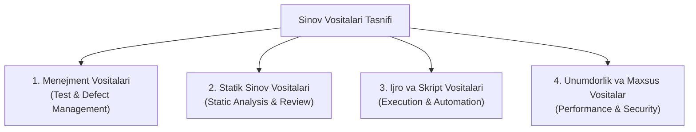
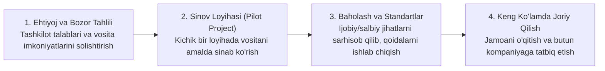

import { Callout } from 'nextra/components'

# 6-bob: Sinov Vositalari (Test Tools)

Dasturiy ta'minotni sinash jarayonida qo'lda bajariladigan ishlarni yengillashtirish, unumdorlikni oshirish va sinov aniqligini ta'minlash maqsadida turli dasturiy vositalardan foydalaniladi.

ISTQB sillabusining 6-bobi sinov vositalarining tasnifi, avtomatlashtirishning afzalliklari va xatarlari hamda yangi vositalarni jamoaga joriy etish tamoyillarini bayon qiladi.

---

## 6.1. Sinov Vositalarining Tasnifi (Classification of Test Tools)

Sinov vositalari qaysi faoliyatni qo'llab-quvvatlashiga qarab guruhlanadi:

1. **Sinov va Nuqsonlarni Boshqarish Vositalari (Management Tools):**
   - Test-keyslar bazasini yuritish va natijalarni hisobot qilish (TestRail, Qase, Zephyr, Jira);
   - Nuqsonlarni ro'yxatga olish va kuzatish (Jira, Bugzilla).
2. **Statik Sinov Vositalari (Static Testing Tools):**
   - Kod sintaksisi va standartlarini tekshirish (ESLint, SonarQube);
   - Qamrov va murakkablik tahlilchilari.
3. **Testni Bajarish va Avtomatlashtirish Vositalari (Test Execution Tools):**
   - Veb interfeyslarni avtomatlashtirish (Playwright, Selenium WebDriver, Cypress);
   - API sinov vositalari (Postman, REST Assured);
   - Mobil ilovalar sinovi (Appium).
4. **Unumdorlik va Maxsus Sinov Vositalari (Performance & Security Tools):**
   - Yuklama va stress sinovlari (Apache JMeter, k6, Gatling);
   - Xavfsizlik skanerlari (OWASP ZAP, Burp Suite).

---

## 6.2. Testlarni Avtomatlashtirishning Foydalari va Xatarlari

Avtomatlashtirish sinovchilarning ishini o'rnini to'liq bosmaydi, balki ularga ko'maklashadi.

| Afzalliklari (Benefits) | Potensial Xatarlari (Risks) |
| :--- | :--- |
| **Vaqtni tejash:** Takroriy regressiya testlarini soniyalar ichida bajarish | **Katta boshlang'ich xarajat:** Vositalar litsenziyasi va skript yozishga ko'p vaqt ketishi |
| **Inson omilini kamaytirish:** Charchoq yoki e'tiborsizlik oqibatidagi xatolarning oldini olish | **Qo'llab-quvvatlash yuki:** Interfeys yoki talablar o'zgarganda test kodlarini doimiy yangilash zarurati |
| **Muttasil integratsiya (CI/CD):** Har bir yangi kod commit qilinganda avtomatik sinov o'tkazish | **Noto'g'ri kutishlar:** Rahbariyat avtomatlashtirish barcha xatolarni o'zi topadi deb o'ylashi |

---

## 6.3. Yangi Vositalarni Joriy Qilish Bosqichlari

Yangi sinov vositasini tashkilotga olib kirishda quyidagi tamoyillarga amal qilinishi zarur:

<Callout type="warning">
  **Eslatma:** Yangi vositani hech qachon birdaniga butun tashkilot bo'ylab joriy qilib bo'lmaydi. Har doim avval **Pilot Project (Tajriba loyihasi)** orqali vositaning mavjud ekotizim bilan integratsiyasi tekshirilishi lozim.
</Callout>
