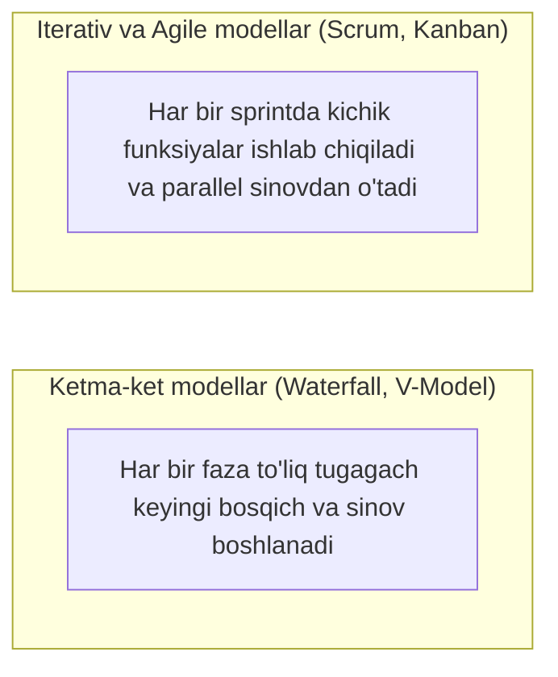
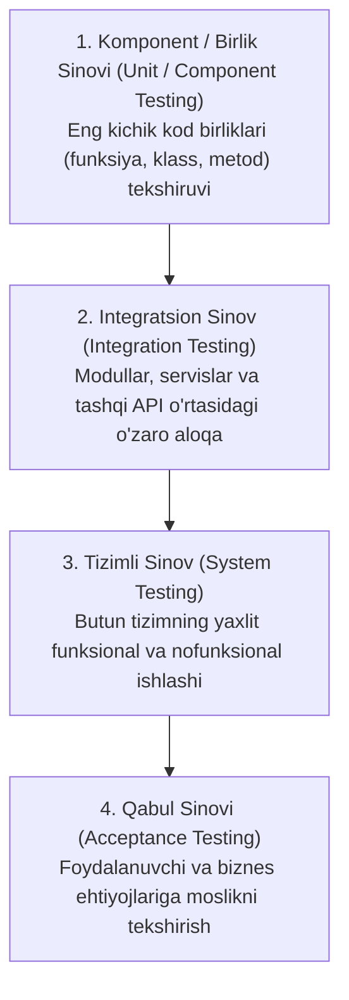
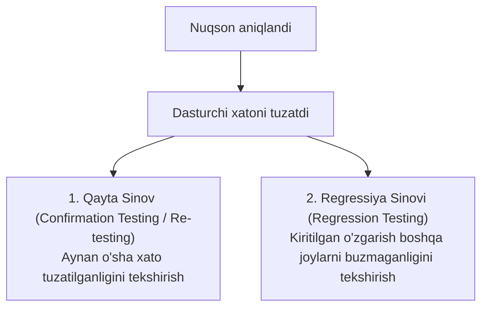

import { Callout } from 'nextra/components'

# 2-bob: SDLC da Sinov (Testing Throughout the SDLC)

Dasturiy ta'minotni sinash alohida ajratilgan bosqich emas, balki butun dasturiy ta'minotni ishlab chiqish hayotiy siklining (SDLC) ajralmas qismidir. Har bir ishlab chiqish faoliyati o'zining mos sinov faoliyatiga ega bo'lishi kerak.

ISTQB CTFL v4.0 sillabusining ushbu bobi sinov darajalari, turlari hamda regressiya va xizmat ko'rsatish sinovlarini qamrab oladi.

---

## 2.1. SDLC Modellarida Sinovning O'rni

Ishlab chiqish modellariga ko'ra sinov strategiyasi farqlanadi:

- **Ketma-ket modellar (Sequential):** Talablar oldindan qat'iy belgilanadi. Sinov bosqichlari (V-Model kabi) ishlab chiqish fazalari bilan parallel loyihalanadi.
- **Iterativ va Inkremental modellar (Agile):** Dastur kichik bo'laklarda (*User Stories*) yetkaziladi. Sinov har bir iteratsiya ichida bajariladi va avtomatlashtirish hal qiluvchi rol o'ynaydi.

---

## 2.2. Sinovning 4 Asosiy Darajasi (Test Levels)

ISTQB tizimni murakkablik darajasi bo'yicha 4 asosiy bosqichga ajratadi:

| Sinov Darajasi | Sinov Ob'yekti | Asosiy Bajaruvchi | Test Asosi (Test Basis) |
| :--- | :--- | :--- | :--- |
| **Komponent (Unit)** | Funksiyalar, modullar, klasslar | Dasturchi | Kod, batafsil texnik spetsifikatsiya |
| **Integratsiya** | Modullararo interfeyslar, API | Dasturchi / QA | Tizim arxitekturasi, API spetsifikatsiyalari |
| **Tizimli (System)** | Yaxlit integratsiyalangan tizim | Mustaqil QA jamoasi | Tizim talablari (SRS), foydalanish ssenariylari |
| **Qabul (Acceptance)** | Tayyor mahsulot biznes jarayonlari | Buyurtmachi, oxirgi foydalanuvchilar | Biznes talablari (BRD), foydalanuvchi hikoyalari |

---

## 2.3. Sinov Turlari (Test Types)

Sinov darajasidan qat'i nazar, sinov quyidagi toifalarga bo'linadi:

1. **Funksional Sinov (Functional Testing):**
   - *"Tizim NIMA qilishi kerak?"* degan savolga javob beradi.
   - Talablar spetsifikatsiyasiga asoslanadi.
2. **Nofunksional Sinov (Non-functional Testing):**
   - *"Tizim QANDAY ishlashi kerak?"* degan sifat mezonlarini tekshiradi.
   - Unumdorlik (*Performance*), yuklama (*Load*), xavfsizlik (*Security*), qulaylik (*Usability*) va moslashuvchanlik (*Compatibility*).
3. **Oq quti sinovi (White-Box Testing):**
   - Tizimning ichki tuzilishi va manba kodiga asoslangan sinov.
4. **Qora quti sinovi (Black-Box Testing):**
   - Ichki kodni bilmagan holda, faqat kiruvchi va chiquvchi ma'lumotlarga asoslangan sinov.

---

## 2.4. Tasdiqlash Sinovi vs Regressiya Sinovi

Bu ikki tushuncha o'rtasidagi farq ISTQB imtihonida eng ko'p so'raladigan savollardan biridir:

- **Tasdiqlash sinovi (Confirmation Testing / Re-testing):**  
  Nuqson tuzatilgandan so'ng, aynan o'sha nuqson haqiqatan bartaraf etilganligini tasdiqlash uchun avval yiqilgan test-keysni qayta bajarish.
- **Regressiya sinovi (Regression Testing):**  
  Dasturga o'zgartirish kiritilganda (bug tuzatilganda yoki yangi funksiya qo'shilganda) dasturning avval to'g'ri ishlab turgan boshqa qismlari buzilmaganligini tekshirish. Regressiya sinovlari odatda avtomatlashtirish uchun eng asosiy nomzod hisoblanadi.

---

## 2.5. Xizmat Ko'rsatish Sinovi (Maintenance Testing)

Mahsulot foydalanishga topshirilgandan (*Production*) keyin unga texnik xizmat ko'rsatish jarayonida o'tkaziladigan sinov:
- Yangilanishlar va yaxshilanishlar kiritilganda;
- Ma'lumotlar bazasi yoki operatsion tizim yangi platformaga ko'chirilganda (*Migration*);
- Tizim arxivlanganda yoki foydalanishdan chiqarilganda (*Retirement*).
