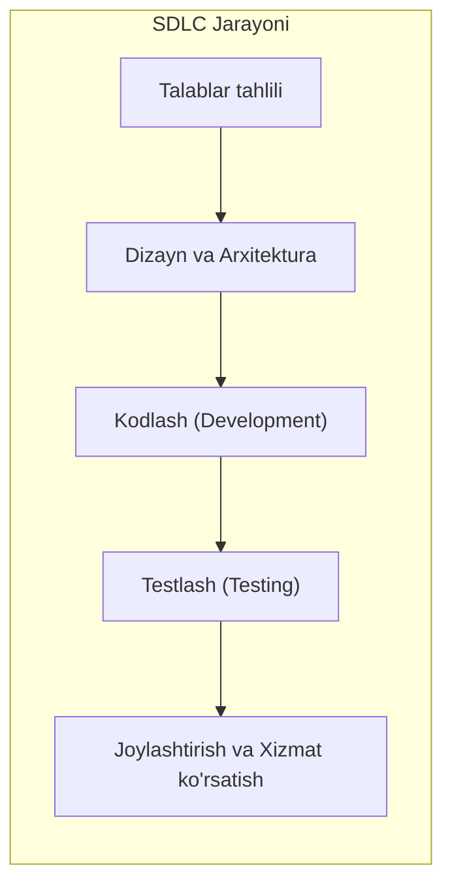
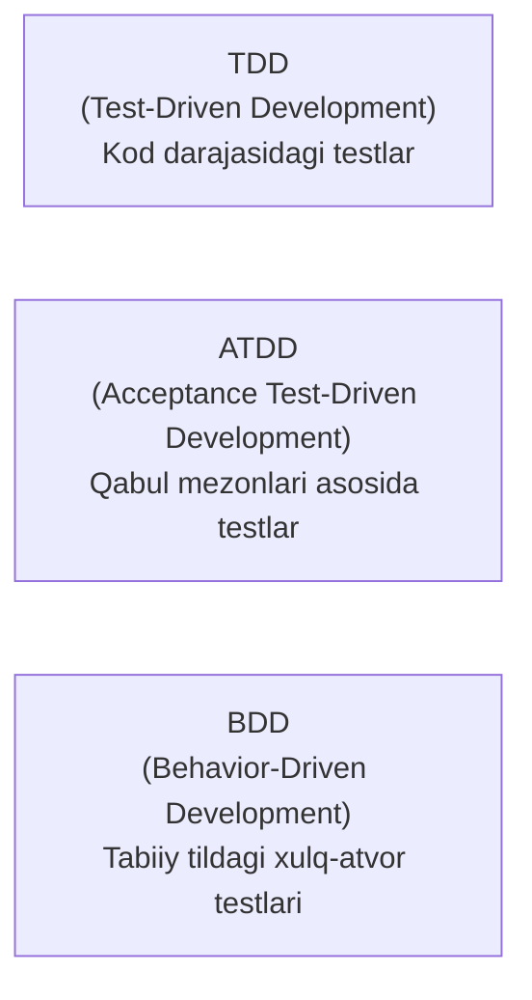
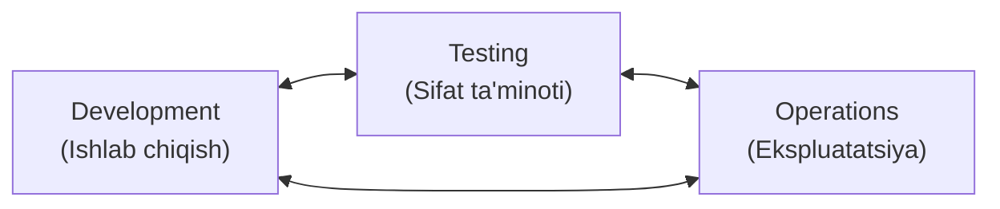
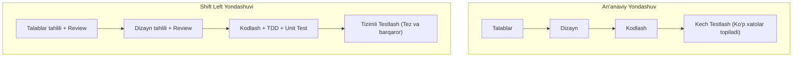
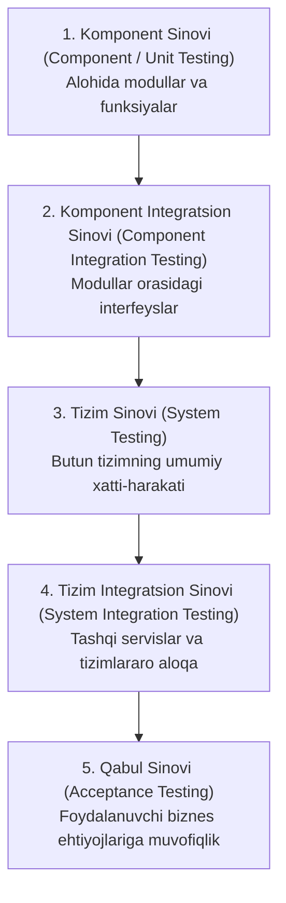
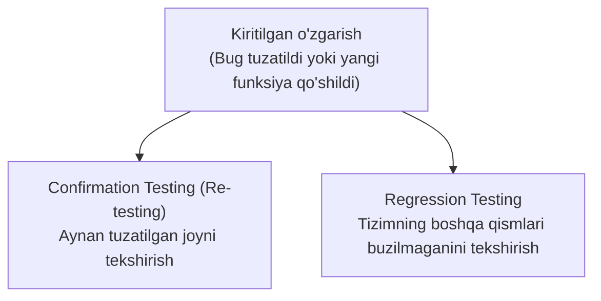
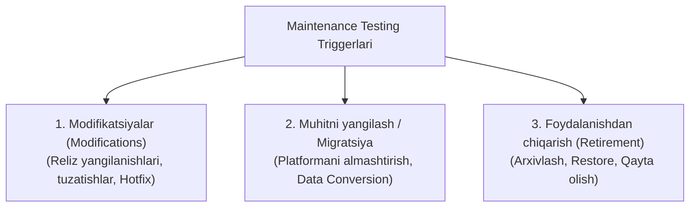

import { Callout } from 'nextra/components'

# 2-bob: SDLC da Sinov (Testing Throughout the SDLC)

Dasturiy ta’minotni testlash alohida yoki ajratilgan bosqich emas, balki butun dasturiy ta’minotni ishlab chiqish hayotiy siklining (SDLC) uzviy qismidir. Ushbu bobda SDLC kontekstida testlashning o‘rni, yaxshi testlash amaliyotlari, zamonaviy ishlab chiqish yondashuvlari (TDD, BDD, ATDD, DevOps), Shift Left konsepsiyasi, test darajalari, test turlari hamda texnik xizmat ko‘rsatish (Maintenance) testlari batafsil yoritiladi.

---

## 2.1. Dasturiy ta’minotni ishlab chiqish hayotiy sikli (SDLC) kontekstida testlash

**SDLC (Software Development Lifecycle) modeli** — bu dasturiy ta’minotni ishlab chiqish jarayonining abstrakt va yuqori darajadagi tavsifi hisoblanadi.

SDLC modeli ishlab chiqish jarayonidagi turli bosqichlar va faoliyatlarning mantiqiy (*logical*) hamda vaqt bo‘yicha (*chronological*) qanday bog‘langanligini belgilaydi.

### SDLC modellariga misollar

1. **Ketma-ket ishlab chiqish modellari (Sequential Development Models):**
   - **Waterfall Model** (Sharshara modeli)
   - **V-Model**
2. **Iterativ ishlab chiqish modellari (Iterative Development Models):**
   - **Spiral Model**
   - **Prototyping** (Prototiplash)
3. **Inkremental ishlab chiqish modellari (Incremental Development Models):**
   - **Unified Process** (UP)

Dasturiy ta’minotni ishlab chiqish jarayonidagi ayrim faoliyatlar yanada batafsil ishlab chiqish metodlari va Agile amaliyotlari orqali ham tavsiflanadi:
- **ATDD (Acceptance Test-Driven Development)** — Qabul qilish testlariga asoslangan ishlab chiqish
- **BDD (Behavior-Driven Development)** — Xulq-atvorga asoslangan ishlab chiqish
- **DDD (Domain-Driven Design)** — Soha (domen)ga asoslangan loyihalash
- **XP (Extreme Programming)** — Ekstremal dasturlash
- **FDD (Feature-Driven Development)** — Funksiyalarga asoslangan ishlab chiqish
- **Kanban**
- **Lean IT**
- **Scrum**
- **TDD (Test-Driven Development)** — Testlarga asoslangan ishlab chiqish

---

### 2.1.1. SDLC ning testlashga ta’siri

Testlash muvaffaqiyatli bo‘lishi uchun u tanlangan SDLC modeliga moslashtirilishi kerak. Tanlangan SDLC modeli quyidagi muhim jihatlarga bevosita ta’sir qiladi:
- **Test faoliyatlarining qamrovi va bajarilish vaqti** (masalan, test darajalari va test turlari);
- **Test hujjatlarining batafsillik darajasi;**
- **Test texnikalari va test yondashuvini tanlash;**
- **Testlarni avtomatlashtirish darajasi;**
- **Testerning roli va javobgarliklari.**

#### Ketma-ket (Sequential) modellarda
- Dastlabki bosqichlarda testerlar odatda quyidagi ishlarda qatnashadilar:
  - Talablarni ko‘rib chiqish (*Requirement Reviews*);
  - Test tahlili (*Test Analysis*);
  - Test dizayni (*Test Design*).
- Dastur kodi odatda keyingi bosqichlarda yoziladi.
- **Muhim jihat:** Dinamik testlashni (*Dynamic Testing*) SDLC ning dastlabki bosqichlarida bajarish odatda mumkin emas.

#### Iterativ va Inkremental modellarda
- Har bir iteratsiya yakunida:
  - Ishlaydigan prototip;
  - Yoki mahsulotning navbatdagi ishlaydigan qismi (*Product Increment*) yaratiladi.
- Shu sababli har bir iteratsiyada:
  - **Statik testlash (*Static Testing*);**
  - **Dinamik testlash (*Dynamic Testing*)** barcha test darajalarida bajarilishi mumkin.
- Mahsulotning tez-tez yangi versiyalarini chiqarish quyidagilarni talab qiladi:
  - Tezkor fikr-mulohaza (*Fast Feedback*);
  - Keng qamrovli regressiya testlari (*Extensive Regression Testing*).

#### Agile dasturiy ta’minotni ishlab chiqishda
- Agile yondashuvi loyiha davomida o‘zgarishlar doim yuz berishi mumkinligini hisobga oladi.
- Shuning uchun Agile loyihalarda:
  - Yengil (*lightweight*) hujjatlashtirish afzal ko‘riladi;
  - Keng ko‘lamli test avtomatlashtirish qo‘llaniladi, chunki bu regressiya testlarini osonlashtiradi;
  - Qo‘lda bajariladigan testlarning aksariyati **tajribaga asoslangan test texnikalari (*Experience-Based Test Techniques*)** asosida bajariladi (bu texnikalar katta hajmdagi oldindan test tahlilini va batafsil test dizaynini talab qilmaydi).

---

### 2.1.2. SDLC va yaxshi testlash amaliyotlari

Tanlangan SDLC modelidan qat’i nazar, quyidagi testlash amaliyotlari yaxshi amaliyot (*Good Practices*) hisoblanadi:

1. **Har bir ishlab chiqish faoliyatiga mos test faoliyati mavjud bo‘lishi kerak:**  
   Dasturiy ta’minotni ishlab chiqishdagi har bir bosqich sifat nazorati (*Quality Control*) orqali tekshirilishi shart:
   - Talablar yoziladi $\rightarrow$ **Requirement Review**
   - Dizayn yaratiladi $\rightarrow$ **Design Review**
   - Kod yoziladi $\rightarrow$ **Code Review**, **Component Testing**
   - Tizim yig‘iladi $\rightarrow$ **Integration Testing**
   - Tayyor mahsulot $\rightarrow$ **System Testing**  
   Shunday qilib, ishlab chiqishning har bir bosqichi testlash bilan qo‘llab-quvvatlanadi.

2. **Har bir test darajasining o‘ziga xos maqsadi mavjud:**  
   Turli test darajalari (*Test Levels*) turli maqsadlarga xizmat qiladi:
   - **Component Testing** — alohida modulni tekshiradi.
   - **Integration Testing** — modullar o‘rtasidagi o‘zaro ishlashni tekshiradi.
   - **System Testing** — butun tizimni tekshiradi.
   - **Acceptance Testing** — foydalanuvchi ehtiyojlari qondirilganini tekshiradi.  
   Bu yondashuv testlashning yetarlicha qamrovli bo‘lishini ta’minlaydi va bir xil narsani keraksiz takror testlashning (*redundancy*) oldini oladi.

3. **Erta tahlil va dizayn:**  
   Ma’lum bir test darajasi uchun *Test Analysis* va *Test Design* SDLC ning unga mos keladigan ishlab chiqish bosqichida boshlanishi kerak. Bu erta testlash (*Early Testing*) tamoyiliga amal qilish imkonini beradi.

4. **Dastlabki loyihalarni ko‘rib chiqishda ishtirok etish:**  
   Testerlar ish mahsulotlarining dastlabki loyihalari (*draftlari*) tayyor bo‘lishi bilanoq ularni ko‘rib chiqishda (*review*) ishtirok etishlari kerak. Bu defektlarni imkon qadar erta aniqlashga yordam beradi va *Shift Left* yondashuvini qo‘llab-quvvatlaydi.

---

### 2.1.3. Testlash — dasturiy ta’minotni ishlab chiqishni boshqaruvchi omil

TDD, ATDD va BDD — testlarni dasturiy ta’minotni ishlab chiqishga yo‘naltiruvchi vosita sifatida ishlatadigan o‘xshash yondashuvlardir.

#### Umumiy xususiyatlari:
- Testlar kod yozilishidan oldin yaratiladi;
- Erta testlash (*Early Testing*) tamoyiliga amal qiladi;
- *Shift Left* yondashuvini qo‘llaydi;
- Iterativ ishlab chiqish modelini qo‘llab-quvvatlaydi.

#### TDD (Test-Driven Development) — Testga asoslangan ishlab chiqish
- Dastur yozish test holatlari (*test cases*) orqali boshqariladi, ya’ni avval keng qamrovli dizayn emas, balki testlar yoziladi *(Beck, 2003)*.
- **Ishlash tartibi (Red - Green - Refactor):**
  1. Avval test yoziladi (muvaffaqiyatsiz test — Red).
  2. So‘ng testdan o‘tadigan minimal kod yoziladi (Green).
  3. Keyin kod va testlar refaktoring (*refactoring*) qilinadi, ya’ni funksionallikni o‘zgartirmagan holda kod sifati yaxshilanadi.

#### ATDD (Acceptance Test-Driven Development)
- Testlar qabul qilish mezonlari (*Acceptance Criteria*) asosida, tizimni loyihalash jarayonida yaratiladi *(Gärtner, 2011)*.
- Ilovaning tegishli qismi ishlab chiqilishidan oldin testlar yoziladi.

#### BDD (Behavior-Driven Development)
- Ilovaning kutilayotgan xatti-harakati (*behavior*) oddiy tabiiy tilda yozilgan test holatlari orqali ifodalanadi.
- Bu yozuv barcha manfaatdor tomonlar (biznes, dasturchilar, testerlar) uchun birdek tushunarli bo‘lishi kerak.
- Ko‘pincha quyidagi format qo‘llaniladi:
  - **Given** — Boshlang‘ich holat;
  - **When** — Harakat bajarilganda;
  - **Then** — Kutilayotgan natija.
- Keyinchalik ushbu test holatlari avtomatik ravishda bajariladigan testlarga aylantiriladi.

<Callout type="info">
**TDD, ATDD va BDD ning umumiy afzalligi:**  
Ushbu yondashuvlarda yozilgan testlar keyinchalik **avtomatlashtirilgan testlar** sifatida saqlanadi hamda kelajakdagi o‘zgarishlar va refaktoring vaqtida kod sifatini nazorat qilish uchun doimiy ishlatiladi.
</Callout>

---

### 2.1.4. DevOps va testlash

**DevOps** — bu ishlab chiqish (*Development*) va ekspluatatsiya (*Operations*) jamoalarini birgalikda ishlashga yo‘naltiruvchi tashkiliy yondashuvdir.

DevOpsning asosiy maqsadi — ishlab chiqish (*Development*), testlash (*Testing*) va ekspluatatsiya (*Operations*) jamoalari o‘rtasida samarali hamkorlikni yo‘lga qo‘yish va umumiy maqsadlarga birgalikda erishishdir.

DevOps tashkilot ichida madaniy o‘zgarishlarni talab qiladi. Unda Development, Testing va Operations bir xil darajada muhim deb qaraladi.

DevOps quyidagilarni qo‘llab-quvvatlaydi:
- Jamoalarning mustaqilligi;
- Tezkor qayta aloqa (*Fast Feedback*);
- Integratsiyalashgan vositalar zanjiri (*Integrated Toolchains*);
- Continuous Integration (CI);
- Continuous Delivery (CD).

Natijada jamoalar kod yozishi, testlashi va yuqori sifatli mahsulotni ancha tezroq chiqarishi mumkin.

#### Testlash nuqtai nazaridan DevOpsning afzalliklari:
- **Tezkor fikr-mulohaza:** Kod sifati va kiritilgan o‘zgarishlarning mavjud kodga ta’siri haqida darhol feedback beriladi.
- **CI orqali Shift Left:** Dasturchilar kod repozitoriyiga o‘zgartirish kiritganda uni sifatli kod, Component Testlar va Static Analysis natijalari bilan birga yuboradilar.
- **Barqaror test muhiti:** CI/CD yordamida test muhiti avtomatik ravishda yaratiladi va barqaror saqlanadi.
- **Non-functional sifat parametrlarining ko‘rinishi:** *Performance Efficiency*, *Reliability* kabi parametrlar doimiy nazorat ostida bo‘ladi.
- **Qo‘lda bajariladigan ishlarning kamayishi:** Delivery Pipeline orqali avtomatlashtirish takrorlanuvchi manual testlarni sezilarli darajada kamaytiradi.
- **Regressiya xavfining kamayishi:** Keng ko‘lamli avtomatlashtirilgan regressiya testlari har bir yangilanishda xavfni kamaytiradi.

#### DevOpsning qiyinchiliklari:
- DevOps Delivery Pipeline ni noldan ishlab chiqish va loyihaga joriy etish talab qilinadi;
- CI/CD vositalarini tanlash va ularni doimiy qo‘llab-quvvatlash zarur;
- Test avtomatlashtirish qo‘shimcha resurs talab qiladi, uni yaratish va saqlab turish murakkab bo‘lishi mumkin;
- **Muhim eslatma:** DevOpsda avtomatlashtirish keng qo‘llanilsa ham, foydalanuvchi nuqtai nazaridan qo‘lda bajariladigan (*manual*) testlar hali ham zarur bo‘lib qolaveradi.

---

### 2.1.5. Shift Left

Early Testing (erta testlash) tamoyili ko‘pincha **Shift Left** deb ham ataladi.

**Shift Left** — bu testlashni SDLC ning iloji boricha dastlabki bosqichlariga ko‘chirish yondashuvidir.

Bu quyidagilarni anglatadi:
- Kod yozilishini kutmaslik;
- Komponentlar to‘liq integratsiya qilinishini kutmaslik;
- Testlashni imkon qadar erta boshlash.

<Callout type="warning">
*Shift Left* keyingi bosqichlardagi testlarni (masalan, tizimli yoki qabul testlarini) bekor qilish kerak degani emas! U testlashni butun sikl bo‘ylab erta va izchil boshlashni taqozo etadi.
</Callout>

#### Shift Leftni amalga oshirishning yaxshi usullari:
1. **Talablarni tester nuqtai nazaridan ko‘rib chiqish:**  
   Spetsifikatsiya hujjatlarini review qilish orqali noaniqliklar (*ambiguities*), yetishmayotgan ma’lumotlar (*incompleteness*) va nomuvofiqliklar (*inconsistencies*) erta aniqlanadi.
2. **Kod yozilishidan oldin testlarni yozish:**  
   Kod yozish jarayonida u *Test Harness* yordamida darhol tekshiriladi.
3. **Continuous Integration va Continuous Delivery dan foydalanish:**  
   CI va CD tezkor fikr-mulohaza beradi, komponent testlarini avtomatik ishga tushiradi va kod repozitoriyga yuborilganda sifat nazoratini amalga oshiradi.
4. **Static Analysis ni Dynamic Testing dan oldin bajarish:**  
   Kodni kompilyatsiya yoki statik tahlil vositalari orqali tekshirishni avtomatlashtirilgan jarayonning doimiy qismiga aylantirish.
5. **Non-functional Testing ni erta boshlash:**  
   Imkon qadar *Performance*, *Reliability*, *Security* kabi testlarni tizim to‘liq tayyor bo‘lishini kutmasdan, komponentlar testlash bosqichidayoq boshlash.

#### Shift Leftning ta’siri:
- Dastlabki bosqichlarda ko‘proq trening, qo‘shimcha mehnat va xarajat talab qilishi mumkin.
- Biroq buning evaziga SDLC ning keyingi bosqichlarida **vaqt, xarajat va xatolarni tuzatish ishlari sezilarli darajada kamayadi**.
- *Shift Left* muvaffaqiyatli ishlashi uchun barcha manfaatdor tomonlar (*Stakeholders*) ushbu yondashuvning afzalliklarini to‘g‘ri tushunishlari va uni qo‘llab-quvvatlashlari shart.

---

### 2.1.6. Retrospektiva (Retrospectives) va jarayonni takomillashtirish (Process Improvement)

**Retrospektiva (Retrospective)** — bu loyiha yoki iteratsiya yakunida, mahsulot chiqarish (*release*) bosqichida yoki zarurat tug‘ilganda o‘tkaziladigan tahliliy yig‘ilishdir.

Retrospektivaning qachon va qanday o‘tkazilishi tanlangan SDLC modeliga bog‘liq. Ushbu yig‘ilishlarda faqat testerlar emas, balki butun jamoa ishtirok etishi maqsadga muvofiq:
- Dasturchilar (*Developers*);
- Arxitektorlar (*Architects*);
- Mahsulot egasi (*Product Owner*);
- Biznes tahlilchilar (*Business Analysts*);
- Va boshqa barcha manfaatdor tomonlar.

#### Yig‘ilish davomida muhokama qilinadigan 3 asosiy savol:
1. **Nima muvaffaqiyatli bo‘ldi va kelajakda ham saqlab qolish kerak?**
2. **Nima muvaffaqiyatsiz bo‘ldi va uni qanday yaxshilash mumkin?**
3. **Kelajakda muvaffaqiyatlarni saqlab qolish va takomillashtirishlarni qanday joriy etish mumkin?**

Retrospektiva natijalari rasman hujjatlashtiriladi va odatda **Test Completion Report** (Test yakuniy hisoboti) tarkibiga kiritiladi. U uzluksiz takomillashtirish (*Continuous Improvement*) jarayonining ajralmas qismidir. Eng muhimi, retrospektivada tavsiya qilingan yaxshilash choralari keyingi bosqichlarda amalda joriy etilishi kerak.

#### Retrospektivaning testlash uchun afzalliklari:
- **Testlash samaradorligi va unumdorligini oshirish** (jarayonni yaxshilash bo‘yicha takliflarni hayotga tatbiq etish orqali);
- **Testware sifatini oshirish** (test jarayonlari va test artefaktlarini birgalikda tahlil qilish orqali);
- **Jamoaning jipslashuvi va o‘rganishi** (muammolarni ochiq muhokama qilish imkoniyati tufayli);
- **Test Basis sifatini yaxshilash** (talablardagi kamchilik va bo‘shliqlarni aniqlash hamda bartaraf etish orqali);
- **Dasturchilar va testerlar o‘rtasidagi hamkorlikni yaxshilash** (o‘zaro aloqa muntazam tahlil qilinib, optimallashtirilgani sababli).

---

## 2.2. Test darajalari (Test Levels) va test turlari (Test Types)

**Test darajalari (*Test Levels*)** — bu birgalikda rejalashtiriladigan va boshqariladigan test faoliyatlari guruhidir.

Har bir test darajasi test jarayonining alohida bosqichi bo‘lib, dasturiy ta’minotning ma’lum rivojlanish bosqichidagi obyektini testlash uchun qo‘llaniladi.

Testlash quyidagi obyektlar uchun amalga oshirilishi mumkin:
- Alohida komponentlar;
- Butun tizim;
- Bir nechta tizimlardan iborat majmua (*System of Systems*).

### Test darajalari va SDLC
- **Ketma-ket (Sequential) SDLC modellarida:** Odatda bir test darajasining chiqish mezonlari (*Exit Criteria*) keyingi test darajasining kirish mezonlari (*Entry Criteria*) hisoblanadi.
- **Iterativ modellarda:** Ishlab chiqish faoliyatlari bir vaqtning o‘zida bir nechta test darajalarini qamrab olishi mumkin va test darajalari vaqt bo‘yicha bir-biri bilan parallel ravishda ustma-ust bajarilishi mumkin.

### Test turlari (Test Types)
**Test turlari** — bu ma’lum sifat xususiyatlarini tekshiruvchi test faoliyatlari guruhidir. Ko‘pchilik test turlari har qanday test darajasida qo‘llanilishi mumkin.

---

### 2.2.1. Test darajalari (Test Levels)

ISTQB sillabusida 5 ta asosiy test darajasi ajratiladi:

#### 1. Component Testing (Unit Testing)
- Alohida komponentlarni mustaqil holda testlashga qaratilgan.
- Vositalar: *Test Harness*, *Unit Test Framework*.
- Bajaruvchilar: Odatda dasturchilar tomonidan o‘z ishlab chiqish muhitida bajariladi.

#### 2. Component Integration Testing (Unit Integration Testing)
- Komponentlar orasidagi interfeyslarni va ularning o‘zaro ishlashini tekshiradi.
- Tanlangan integratsiya strategiyasiga (*Integration Strategy*) kuchli bog‘liq:
  - **Bottom-Up** (Pastdan yuqoriga)
  - **Top-Down** (Yuqoridan pastga)
  - **Big Bang** (Bir vaqtda barchasini birlashtirish)

#### 3. System Testing
- Butun tizim yoki mahsulotning umumiy ishlashini tekshiradi.
- Quyidagilarni o‘z ichiga oladi:
  - **End-to-End Functional Testing** (Yaxlit funksional testlash);
  - **Non-Functional Testing** (Nofunksional testlash).
- Ba’zi nofunksional xususiyatlarni (masalan, *Usability*) to‘liq tizim va haqiqiy muhitga o‘xshash test muhitida tekshirish afzal hisoblanadi. Zarur hollarda kichik tizimlarni simulyatsiya qilish mumkin.
- Odatda tizim spetsifikatsiyalariga tayangan holda mustaqil test jamoasi tomonidan bajariladi.

#### 4. System Integration Testing
- Test qilinayotgan tizimning boshqa tizimlar bilan integratsiyasi va tashqi servislar (tashqi API, uchinchi tomon dasturlari) bilan o‘zaro ishlashini tekshiradi.
- Imkon qadar real ish muhitiga (*Operational Environment*) yaqin test muhitini talab qiladi.

#### 5. Acceptance Testing
- Asosiy e’tibori: **Validatsiya** va tizimning foydalanishga topshirishga tayyorligini isbotlash.
- Tizim buyurtmachi va foydalanuvchilarning biznes ehtiyojlarini qondirayotganini tekshiradi.
- Ideal holatda Acceptance Testing ni yakuniy foydalanuvchilar bajarishi kerak.
- **Acceptance Testing turlari:**
  - **User Acceptance Testing (UAT)** — Foydalanuvchi qabul sinovi;
  - **Operational Acceptance Testing (OAT)** — Operatsion (ekspluatatsiya) qabul sinovi (zaxiralash, tiklash, xavfsizlik);
  - **Contractual Acceptance Testing** — Shartnomaviy qabul sinovi;
  - **Regulatory Acceptance Testing** — Qonuniy va me’yoriy qabul sinovi;
  - **Alpha Testing** — Ishlab chiquvchi tashkilot hududida foydalanuvchilar tomonidan o‘tkaziladigan sinov;
  - **Beta Testing** — Tashqi foydalanuvchilar tomonidan o‘z muhitlarida o‘tkaziladigan sinov.

#### Test darajalari o‘rtasidagi farqlovchi parametrlar
Test faoliyatlari bir-biri bilan chalkashib ketmasligi uchun har bir test darajasi quyidagi parametrlar bo‘yicha farqlanadi:
- **Test obyekti (*Test Object*)**;
- **Test maqsadlari (*Test Objectives*)**;
- **Test asosi (*Test Basis*)**;
- **Nuqsonlar va nosozliklar (*Defects and Failures*)**;
- **Yondashuv va javobgarliklar (*Approach and Responsibilities*)**.

---

### 2.2.2. Test turlari (Test Types)

Loyihalarda qo‘llaniladigan 4 ta asosiy test turi:

| Test Turi | Asosiy Savol / Maqsad | Tavsifi |
| :--- | :--- | :--- |
| **Functional Testing** | *Tizim NIMA bajarishi kerak?* | Funksional to‘liqlik, to‘g‘rilik va moslikni tekshirish |
| **Non-Functional Testing** | *Tizim QANCHALIK YAXSHI ishlaydi?* | Tezlik, xavfsizlik, qulaylik, ishonchlilik kabi sifat xususiyatlarini tekshirish |
| **Black-box Testing** | *Spetsifikatsiyaga moslik* | Ichki kod tuzilishini bilmagan holda tashqi talablar asosida sinash |
| **White-box Testing** | *Ichki tuzilma qamrovi (Coverage)* | Ichki kod, arxitektura va ma’lumotlar oqimiga tayangan holda sinash |

#### 1. Functional Testing (Funksional testlash)
Komponent yoki tizim nima bajarishi kerakligini (*What*) tekshiradi.
Asosiy tekshiriladigan mezonlar:
- **Functional Completeness** — Barcha kerakli funksiyalar mavjudmi?
- **Functional Correctness** — Funksiyalar to‘g‘ri ishlayaptimi?
- **Functional Appropriateness** — Funksiyalar foydalanuvchi vazifalarini bajarish uchun mosmi?

#### 2. Non-Functional Testing (Nofunksional testlash)
Tizimning funksiyalaridan tashqari sifat xususiyatlarini tekshiradi (*"How well the system behaves?"*).
**Asosiy Nofunksional sifat xususiyatlari (ISO/IEC 25010):**
- **Performance Efficiency** — Samaradorlik (tezkor ishlash, resurslardan oqilona foydalanish);
- **Compatibility** — Moslik (boshqa tizimlar va platformalar bilan birga ishlay olish qobiliyati);
- **Usability (Interaction Capability)** — Foydalanish qulayligi (foydalanuvchi bilan samarali o‘zaro aloqa);
- **Reliability** — Ishonchlilik (nosozliklarsiz uzoq muddat barqaror ishlash);
- **Security** — Xavfsizlik (ma’lumotlar va tizim himoyasi);
- **Maintainability** — Qo‘llab-quvvatlash va o‘zgartirish qulayligi;
- **Portability (Flexibility)** — Ko‘chiriluvchanlik (turli muhit va platformalarda ishlay olish qobiliyati);
- **Safety** — Xavfsizlik (inson hayoti va atrof-muhit uchun xavfsizlik).

<Callout type="info">
Ko‘plab nofunksional testlar funksional testlar asosida shakllantiriladi. Ular bir xil funksional amallarni bajaradi, lekin qo‘shimcha ravishda amal belgilangan vaqt ichida bajarildimi yoki yangi platformada to‘g‘ri ishladimi kabi sifat ko‘rsatkichlarini tekshiradi.
</Callout>

Nofunksional defektlarning kech aniqlanishi loyiha muvaffaqiyatiga jiddiy xavf tug‘diradi. Ba’zi nofunksional testlar maxsus laboratoriyalar yoki muhitlarni talab qiladi (masalan, *Usability Laboratory*).

#### 3. Black-box Testing (Qora quti sinovi)
- Spetsifikatsiyaga asoslangan testlash usuli.
- Testlar tizimning ichki tuzilishiga bog‘liq bo‘lmagan hujjatlar va talablar asosida tuziladi.
- Asosiy maqsad: Tizimning xatti-harakati (*behavior*) spetsifikatsiyaga mos kelishini tekshirish.

#### 4. White-box Testing (Oq quti sinovi)
- Tizimning ichki tuzilishiga asoslangan testlash usuli.
- Testlar dastur kodi, dasturiy arxitektura, ish jarayonlari (*workflow*) va ma’lumotlar oqimi (*data flow*) asosida yaratiladi.
- Asosiy maqsad: Testlar yordamida ichki tuzilmani yetarli darajada qamrab olish (*Coverage*).

Ushbu to‘rtta test turi barcha test darajalarida qo‘llanilishi mumkin, biroq har bir darajada ularning ustuvorligi turlicha bo‘ladi. Har qanday test turi uchun turli test texnikalari yordamida *Test Condition* va *Test Case*lar ishlab chiqiladi.

---

### 2.2.3. Confirmation Testing va Regression Testing

Komponent yoki tizimga o‘zgartirish kiritilishining 2 asosiy sababi mavjud:
1. Yangi funksiyani qo‘shish;
2. Mavjud defektni tuzatish.

Shundan so‘ng testlash quyidagi ikki muhim jarayonni o‘z ichiga olishi kerak:

#### Confirmation Testing (Qayta testlash / Re-testing)
- Oldin aniqlangan defekt muvaffaqiyatli tuzatilganini tasdiqlash uchun bajariladi.
- **Risk darajasiga qarab:**
  - Avval defekt tufayli yiqilgan barcha testlarni qayta bajarish;
  - Yoki defektni tuzatish uchun kiritilgan o‘zgarishlarni qamrab oluvchi yangi testlarni qo‘shish.
- Vaqt yoki resurs cheklangan bo‘lsa, faqat defektni qayta yuzaga keltiruvchi test qadamlari bajarilib, xatolik bartaraf etilganligi tekshiriladi.

#### Regression Testing (Regressiya testlash)
- Kiritilgan o‘zgarishlar tizimning boshqa qismlariga salbiy ta’sir ko‘rsatmaganini (kutilmagan yangi xatolarni keltirib chiqarmaganini) tekshiradi.
- Salbiy ta’sir quyidagilarda namoyon bo‘lishi mumkin:
  - O‘zgartirilgan komponentning o‘zida;
  - Shu tizimdagi boshqa bog‘liq komponentlarda;
  - Integratsiyalashgan boshqa tashqi tizimlarda.
- Regression testing test qilinayotgan dastur bilan bir qatorda test muhitiga ham tegishli bo‘lishi mumkin.
- **Impact Analysis (Ta’sir tahlili):** Regressiya testidan oldin ta’sir tahlilini o‘tkazish tavsiya etiladi. U o‘zgarish qaysi qismlarga ta’sir qilishi mumkinligini aniqlab, regressiya testlarining optimal qamrovini belgilashga yordam beradi.

#### Regression Testing va avtomatlashtirish
- Regressiya testlari to‘plami (*Regression Test Suite*) juda ko‘p marta takroran ishga tushiriladi.
- Har bir yangi iteratsiya va yangi reliz bilan testlar soni ortib boradi.
- **Regressiya testlari — avtomatlashtirish uchun eng mos test turlaridan biridir.** Test avtomatlashtirishni loyiha boshidanoq boshlash tavsiya etiladi.
- CI/CD (DevOps) muhitida regressiya testlarini Continuous Integration quvuriga (*Pipeline*) kiritish eng yaxshi amaliyot hisoblanadi.

---

## 2.3. Xizmat ko‘rsatish sinovi (Maintenance Testing)

**Maintenance Testing** — ishlab turgan (ishlab chiqarish muhitidagi — *Production*) tizimga o‘zgartirishlar kiritilgandan so‘ng bajariladigan testlashdir.

### Maintenance turlari:
- **Corrective Maintenance** — aniqlangan xatolarni tuzatish;
- **Adaptive Maintenance** — muhitdagi o‘zgarishlarga (yangi OT, apparat, brauzer) moslashtirish;
- **Perfective Maintenance** — samaradorlik, unumdorlik yoki qo‘llab-quvvatlash qulayligini yaxshilash.

Xizmat ko‘rsatish rejalashtirilgan relizlar (*Scheduled Releases*) yoki shoshilinch tuzatishlar (*Hot Fixes*) ko‘rinishida bo‘lishi mumkin.

O‘zgarish kiritilishidan oldin ko‘pincha **Impact Analysis** o‘tkaziladi. U quyidagilarni aniqlashga yordam beradi:
- O‘zgarish kiritish qanchalik zarur?
- U tizimning boshqa qismlariga qanday ta’sir ko‘rsatishi mumkin?

### Ishlayotgan tizimdagi o‘zgarishlarni testlash quyidagilarni o‘z ichiga oladi:
1. O‘zgarish muvaffaqiyatli va to‘g‘ri joriy etilganini tekshirish;
2. Tizimning o‘zgarmagan boshqa qismlarida regressiya mavjud emasligini tekshirish.

### Maintenance Testing qamrovi nimalarga bog‘liq?
Maintenance Testing hajmi odatda quyidagi 3 omilga bevosita bog‘liq:
1. **O‘zgarishning risk darajasi;**
2. **Mavjud tizimning hajmi va murakkabligi;**
3. **Kiritilgan o‘zgarish hajmi.**

### Maintenance va Maintenance Testing ni boshlovchi omillar (Triggers):

1. **Modifikatsiyalar (Modifications):**
   - Rejalashtirilgan yangi imkoniyatlar (*Release-based Enhancements*);
   - Xatolarni tuzatish (*Corrective Changes*);
   - Tezkor tuzatishlar (*Hot Fixes*).

2. **Ishlash muhitini yangilash yoki migratsiya qilish (Migration):**
   - Bir platformadan boshqasiga o‘tish (masalan, yangi server yoki bulut texnologiyasiga o‘tish);
   - Yangi operatsion muhitga moslashish.  
   Bunday holatda yangi muhit, o‘zgartirilgan dastur hamda ma’lumotlar boshqa tizimdan ko‘chirilganda **Data Conversion** (ma’lumotlar konvertatsiyasi) sinchiklab test qilinadi.

3. **Tizimni foydalanishdan chiqarish (Retirement):**
   - Dastur hayot siklining oxiriga yetganda uni foydalanishdan chiqarish talab qilinadi.
   - Bunday holatda quyidagilarni testlash zarur bo‘ladi:
     - Ma’lumotlarni arxivlash (*Data Archiving*);
     - Arxivdan tiklash (*Restore*);
     - Arxivdagi ma’lumotlarni qayta olish (*Retrieval*).  
   Bu talab ayniqsa qonuniy me’yorlarga ko‘ra ma’lumotlar uzoq muddat (masalan, 5-10 yil) saqlanishi shart bo‘lgan tizimlar (bank, tibbiyot, davlat xizmatlari) uchun favqulodda muhim hisoblanadi.
