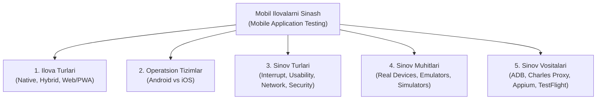
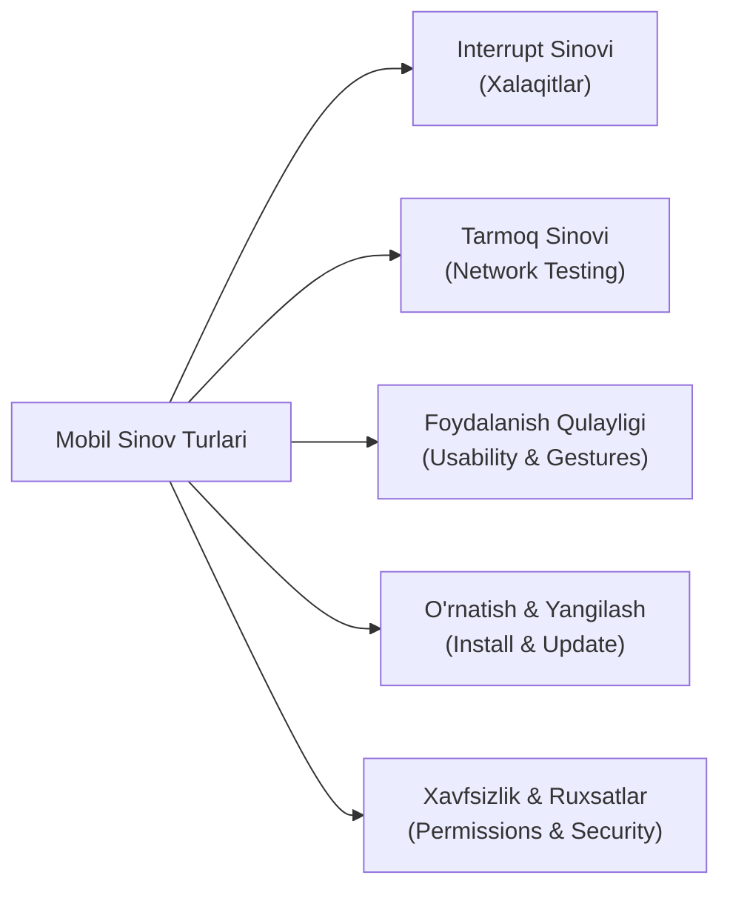
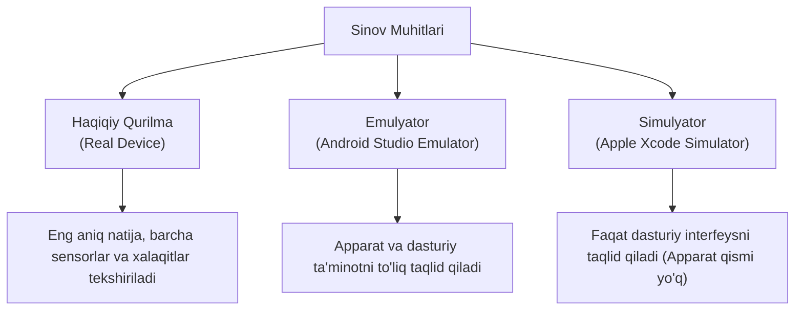

import { Callout, Steps } from 'nextra/components'

# Mobil Ilovalarni Sinash (Mobile Testing in Software Testing)

Bugungi raqamli davrda insonlar internet va dasturiy xizmatlardan foydalanish vaqtining 70% dan ortig'ini smartfonlar orqali amalga oshiradilar. Shu sababli mobil ilovaning barqarorligi, xavfsizligi va qulayligi biznes muvaffaqiyatining bosh omiliga aylangan.

**Mobil ilovalarni sinash (Mobile Testing)** — bu Android va iOS operatsion tizimlarida ishlaydigan dasturiy ilovalarning funksionalligi, qulayligi (usability), unumdorligi, xavfsizligi va turli qurilmalarga moslashuvchanligini tekshirish jarayonidir.

---

## Mobil Sinovning Asosiy Tuzilishi



---

## 1. Mobil Ilova Turlari (Types of Mobile Applications)

Mobil ilovalarni to'g'ri sinash uchun dastlab ularning qaysi arxitekturada yaratilganini bilish shart:

| Xususiyati | Nativ Ilova (Native App) | Veb / PWA Ilova (Mobile Web) | Gibrid Ilova (Hybrid App) |
| :--- | :--- | :--- | :--- |
| **Dasturlash tili** | Kotlin/Java (Android), Swift (iOS) | HTML5, CSS3, JavaScript | Flutter (Dart), React Native (JS) |
| **O'rnatish usuli** | Google Play / App Store | Brauzer orqali (URL orqali ochiladi) | App do'konlar orqali o'rnatiladi |
| **Qurilma imkoniyatlari** | Kamera, Bluetooth, GPS, sensorlar bilan 100% integratsiya | Imkoniyatlar cheklangan | Ko'p imkoniyatlar plaginlar orqali ishlaydi |
| **Unumdorlik (Speed)** | Juda yuqori (Eng tezkor) | Internet tezligiga bog'liq | Yuqori, ammo nativdan biroz sekin |
| **Offline ishlash** | To'liq qo'llab-quvvatlanadi | Kesh orqali qisman (PWA) | Kesh va lokal baza orqali |

---

## 2. Mobil Sinovning O'ziga Xos Qiyinchiliklari

Veb-saytlarni kompyuterda sinashdan farqli o'laroq, mobil sinov muhandisi quyidagi o'ziga xos chaqiriqlarga duch keladi:

1. **Qurilmalar fragmentatsiyasi (Device Fragmentation):**
   - Ayniqsa Android tizimida yuzlab ishlab chiqaruvchilar (Samsung, Xiaomi, Google Pixel, OnePlus) mavjud.
   - Minglab turli ekran o'lchamlari, piksellar zichligi (DPI) va protsessor quvvatlari.
2. **Operatsion tizim versiyalari:**
   - Bir vaqtning o'zida bozorda Android 11 dan Android 15 gacha, iOS 16 dan iOS 18 gacha bo'lgan versiyalar faol ishlatiladi.
3. **Beqaror tarmoq (Network Fluctuations):**
   - Foydalanuvchi doimo harakatda bo'ladi: Wi-Fi dan 4G/5G ga o'tish, tunnelda internet yo'qolishi, samolyot rejimi.
4. **Apparat resurslarining cheklanganligi:**
   - Smartfon batareyasi, operativ xotirasi (RAM) va qizib ketish (overheating) cheklovlari.

---

## 3. Asosiy Mobil Sinov Turlari



### 1. Xalaqit Berish Sinovi (Interrupt Testing)
Bu mobil sinovning eng muhim va faqat mobil muhitga xos bo'lgan turidir. Foydalanuvchi ilovada muhim amalni (masalan, pul o'tkazmasi) bajarayotgan paytda kutilmagan tashqi hodisalar yuz bersa, ilova qanday o'zini tutishi tekshiriladi:
- **Kiruvchi qo'ng'iroq yoki SMS kelishi;**
- **Batareya quvvati 20% yoki 10% dan kam qolganligi haqida tizim xabarnomasi;**
- **Budilnik yoki eslatma jiringlashi;**
- **Ilovani fon rejimiga (Background) tushirib, 5 daqiqadan so'ng qayta ochish;**
- **Boshqa og'ir ilovalarga o'tib qaytish (xotira yetishmovchiligida ilovaning majburiy yopilishi - OOM Crash).**

<Callout type="warning">
  **Oltin qoida:** Har qanday xalaqitdan so'ng ilova avvalgi holatini (State) saqlab qolishi lozim. Foydalanuvchi kiritgan ma'lumotlar o'chib ketmasligi va takroriy to'lov yechilmasligi shart.
</Callout>

### 2. Tarmoq Sinovlari (Network Testing)
- **Tarmoq o'zgarishi:** Wi-Fi dan mobil internetga (LTE/5G) uzluksiz o'tish;
- **Sekin internet (Throttling):** 2G yoki 3G tezligida ilovaning yuklanish vaqti va kutish indikatorlari (Loaders/Spinners);
- **Aloqa yo'qolishi (No Internet):** Internet butunlay uzilganda "Internet bilan aloqa yo'q" xabarnomasi chiqishi va ilova qotib qolmasligi (Crash bo'lmasligi);
- **Keshdan foydalanish:** Offline rejimda avval ko'rilgan ma'lumotlarning ochilishi.

### 3. Foydalanish Qulayligi va Imo-ishoralar (Usability & Gestures)
- **Sensor imo-ishoralari (Gestures):** Tap, Double tap, Long press, Swipe (o'ngga/chapga surish), Pinch-to-zoom (yaqinlashtirish), Drag & Drop;
- **Ekran orientatsiyasi:** Vertikal (Portrait) holatdan Gorizontal (Landscape) holatga o'tkazganda elementlarning siljib ketmasligi;
- **Klaviatura xatti-harakati:** Matn maydoniga bosganda klaviatura kerakli kiritish tugmasini (Submit button) to'sib qo'ymasligi;
- **Bir qo'l bilan boshqarish:** Eng muhim tugmalarning bosh barmog'i yetadigan qulay zonada (Thumb Zone) joylashganligi.

### 4. O'rnatish, O'chirish va Yangilash Sinovlari (Installation & Upgrade)
- Yangi versiya chiqqanda dastur eski versiya ustiga muammosiz o'rnatilishi (**Upgrade testing**);
- Yangilanishdan so'ng foydalanuvchining login sessiyasi, shaxsiy sozlamalari va ma'lumotlari saqlanib qolishi;
- Ilova o'chirilganda (Uninstall) qurilmada keraksiz qoldiq kesh fayllarning to'planib qolmasligi;
- Google Play va TestFlight orqali yuklab olish jarayonining to'g'ri ishlashi.

### 5. Xavfsizlik va Ruxsatnomalar (Permissions & Security)
- **Tizim ruxsatlari:** Ilova faqat o'ziga kerakli ruxsatlarni so'rashi kerak (masalan, kalkulyator ilovasi kontaktlar yoki GPS ruxsatini so'ramasligi lozim);
- Foydalanuvchi ruxsat bermagan taqdirda (Permission Denied) ilova qulab tushmasdan tushunarli izoh berishi;
- **Biometrik autentifikatsiya:** FaceID yoki TouchID (Barmoq izi) orqali kirish;
- Skrinshot va video yozishdan himoya (bank va to'lov ilovalarida maxfiy ma'lumotlarni skrinshot qilishni taqiqlash).

---

## 4. Sinov Muhitlari: Real Qurilma, Emulyator va Simulyator

Mobil sinovda uch xil muhitdan foydalaniladi:



| Xususiyati | Haqiqiy Qurilma (Real Device) | Emulyator (Emulator) | Simulyator (Simulator) |
| :--- | :--- | :--- | :--- |
| **Ta'rifi** | Qo'lda ushlab turiladigan real telefon | Qurilmaning apparat va dasturini dasturiy taqlid qiluvchi | Qurilmaning faqat operatsion tizimini taqlid qiluvchi |
| **Qaysi OS uchun** | Barcha tizimlar (iPhone, Samsung va h.k.) | Asosan Android Studio | Asosan macOS'dagi iOS Xcode |
| **Aniqlik darajasi** | 100% real natija | 85 - 90% | 70 - 80% |
| **Interrupt sinovi** | Qo'ng'iroq, batareyani to'liq sinash mumkin | Cheklangan simulyatsiya | Imkonsiz |
| **Narxi va qulayligi** | Qimmat (ko'p qurilma xarid qilish kerak) | Bepul va kompyuterda ishga tushadi | Bepul (lekin Mac kompyuteri shart) |

---

## 5. QA Muhandisi Uchun Muhim Vositalar (Tools)

Mobil dasturiy ta'minotni sifatli sinash uchun quyidagi qurollardan foydalaniladi:

### 1. ADB (Android Debug Bridge)
Android qurilmalarni kompyuter terminali orqali boshqarish, loglarni olish va nosozliklarni aniqlash vositasi:

```bash
# Ulangan qurilmalar ro'yxatini ko'rish
adb devices

# Ilovani qurilmaga o'rnatish
adb install app-release.apk

# Ilovaning real vaqt tizim loglarini ko'rish (Crash loglarni ushlash)
adb logcat *:E

# Ilovani to'liq tozalab o'chirish
adb uninstall com.example.myapp

# Ilova skrinshotini kompyuterga saqlash
adb exec-out screencap -p > screen.png
```

### 2. Charles Proxy / Fiddler
Mobil ilova va backend server o'rtasidagi barcha HTTP/HTTPS so'rovlarni tutib oluvchi proksi vositalar.
- **SSL Proxying:** Mobil ilovadan chiqayotgan shifrlangan JSON ma'lumotlarni o'qish;
- **Map Local / Breakpoints:** Server javobini o'zgartirib (Mocking), xato status kodlarini (500, 403, 404) sinab ko'rish;
- **Throttling:** Zaif tarmoq tezligini (3G, GPRS) sun'iy hosil qilish.

### 3. Appium
Mobil ilovalarni (Android va iOS) avtomatlashtirish uchun dunyodagi eng mashhur ochiq manbali freymvork. U Selenium asosida ishlaydi va bitta test kodi orqali ikkala tizimni ham avtotest qilish imkonini beradi.

### 4. Firebase Crashlytics va TestFlight
- **Firebase Crashlytics:** Dasturdagi real qulashlar (crash) va xatoliklarni aniq kod satrigacha ko'rsatib beruvchi tahliliy tizim;
- **Apple TestFlight:** iOS ilovalarini App Store'ga chiqarmasdan oldin ichki jamoa va tashqi testerlarga tarqatish platformasi.

---

## 6. Mobil Sinov Nazorat Ro'yxati (QA Checklist)

Har bir relizdan oldin quyidagi nazorat punktlarini tekshirish tavsiya etiladi:

<Steps>

### 1. O'rnatish va Autentifikatsiya
- Ilova toza o'rnatiladimi va yangilanishlar xatosiz o'tadimi?
- Login, Ro'yxatdan o'tish, Parolni tiklash va Biometrik kirish (FaceID/Fingerprint) to'g'ri ishlayaptimi?

### 2. Funksional xatti-harakat va Xalaqitlar
- Foydalanuvchi ma'lumot to'ldirayotganda qo'ng'iroq kelsa yoki ilova orqa fonga tushsa, ma'lumotlar saqlanadimi?
- Pull-to-refresh (ekranni pastga tortib yangilash) to'g'ri ma'lumotlarni yuklayaptimi?

### 3. Tarmoq ssenariylari
- Samolyot rejimida yoki internetsiz holatda ilova chiroyli xatolik xabarini ko'rsatadimi?
- Wi-Fi dan mobil internetga o'tganda faol sessiya uzilib qolmaydimi?

### 4. UI va Dizayn moslashuvi
- Matnlar va tugmalar har xil o'lchamdagi kichik (iPhone SE) va katta (Samsung Ultra) ekranlarda to'g'ri joylashganmi?
- Qorong'i rejimda (Dark Mode) yozuvlar fonga qo'shilib o'qilmay qolmayaptimi?

### 5. Resurslar va Xavfsizlik
- Ilova fonda uzoq turganda batareyani haddan tashqari ko'p sarflamayaptimi?
- Maxfiy parollar yoki karta raqamlari tizim loglarida ochiq ko'rinib qolmayaptimi?

</Steps>

---

<Callout type="info">
  **Xulosa:** Mobil ilovalarni sinash — bu faqat tugmalarni bosish emas, balki apparat xususiyatlari, operatsion tizim cheklovlari va haqiqiy foydalanuvchining real harakatlarini hisobga olgan holda chuqur tahlil yuritish mahoratidir.
</Callout>
