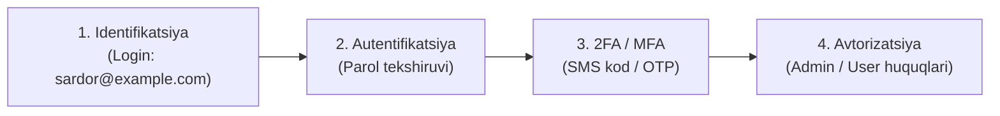
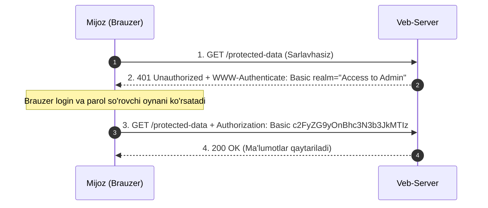
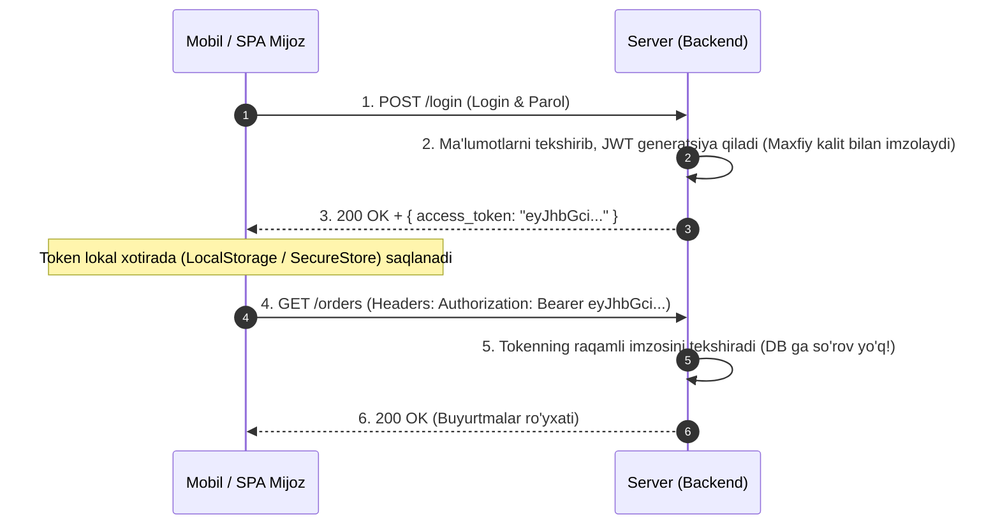
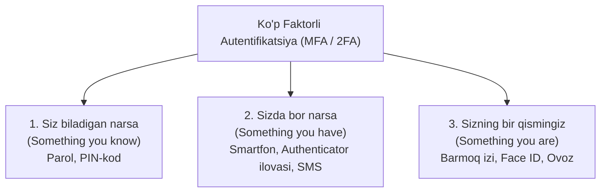

import { Callout } from 'nextra/components'

# Autentifikatsiya va Avtorizatsiya (Authentication and Authorization)

Axborot xavfsizligi va tarmoq texnologiyalarida foydalanuvchi yoki dastur tizim bilan muloqot qilganda uchta fundamental bosqichdan o'tadi: **Identifikatsiya**, **Autentifikatsiya** va **Avtorizatsiya**.

Ko'pincha bu tushunchalar bir-biri bilan adashtiriladi, biroq ularning har biri tizim xavfsizligida o'ziga xos aniq vazifani bajaradi.

---

## 1. Uchlik Tushunchasi: Farqlar va Mantiqiy Zanjir

| Bosqich | Savol | Maqsadi | Misol |
| :--- | :--- | :--- | :--- |
| **Identifikatsiya** | *"Siz kimsiz?"* | Foydalanuvchining tizimdagi unikal identifikatorini aniqlash | Login, Email yoki Telefon raqamini kiritish |
| **Autentifikatsiya** | *"Haqiqatan ham shu odammisiz?"* | Foydalanuvchi o'z shaxsini dalil bilan isbotlashi (haqiqiylikni tekshirish) | Parol, SMS orqali kelgan OTP kod yoki barmoq izi |
| **Avtorizatsiya** | *"Sizga nimalar qilishga ruxsat bor?"* | Tasdiqlangan foydalanuvchiga muayyan harakatlar yoki ma'lumotlarga huquq berish | Faqat o'z xabarlarini o'qish, Admin panelga kirish huquqi |

> [!NOTE] Ingliz Tili Manbalaridagi Yondashuv
> Ingliz tilidagi adabiyotlarda ko'pincha identifikatsiya alohida bosqich sifatida ajratilmaydi va autentifikatsiya tarkibiga kiritiladi:  
> *“Authentication is the process of identifying users and validating who they claim to be”* (Autentifikatsiya — foydalanuvchini identifikatsiya qilish va u da'vo qilayotgan shaxs ekanligini tekshirish jarayoni).



### Hayotiy Misol: Google Hisobiga Kirish
1. **Identifikatsiya:** Tizim elektron pochtani so'raydi. Siz `user@gmail.com` deb yozasiz, tizim bu nomdagi foydalanuvchi mavjudligini tasdiqlaydi.
2. **Autentifikatsiya:** Google parolni so'raydi. Parol bazadagi xesh bilan mos kelsa, tizim sizning hisob egasi ekanligingizga ishonadi.
3. **Ikki Faktorli Tasdiq (2FA):** Tizim telefoningizga bir martalik kod yuboradi. Kod to'g'ri kiritilgach, shaxsingiz to'liq tasdiqlanadi.
4. **Avtorizatsiya:** Google sizga pochtangizdagi xatlarni o'qish, Google Drive fayllarini boshqarish huquqini taqdim etadi.

### Bog'liqliklar va Qiziqarli Holatlar
- **Identifikatsiyasiz autentifikatsiya ma'nosizdir:** Tizim kimni tekshirayotganini bilmasa, parolni qaysi yozuv bilan solishtirishni tushunmaydi.
- **Autentifikatsiyasiz identifikatsiya xavflidir:** Tizimda mavjud bo'lgan begona loginni kiritish mumkin, ammo parolsiz kirishga ruxsat berish tizimni ochiq qoldirish demakdir.
- **Identifikatsiya va autentifikatsiyasiz avtorizatsiya bo'lishi mumkinmi?**  
  **Ha!** Masalan, Google Docs orqali hujjatingizni *"Havolaga ega bo'lgan barcha uchun ochiq"* qilib qo'ysangiz, unga hatto Google akkauntiga kirmagan odam ham kirishi mumkin. Ekranda u *"Noma'lum yenot"* (Anonymous Raccoon) sifatida ko'rinsa-da, tizim uni avtorizatsiya qilgan — ya'ni ushbu hujjatni o'qish huquqini bergan bo'ladi.

---

## 2. HTTP Autentifikatsiya Freymvorki (RFC 7235)

Vebda mijoz va server o'rtasidagi autentifikatsiya standart **RFC 7235** protokoli asosida so'rov-javob (challenge-response) modeli bo'yicha ishlaydi:



1. **401 Unauthorized:** Himoyalangan resursga hisob ma'lumotlarisiz murojaat qilinganda, server mijozga `401 Unauthorized` statusi va `WWW-Authenticate` sarlavhasini qaytaradi (qanday usulda autentifikatsiya qilish lozimligini ko'rsatadi).
2. **Authorization Sarlavhasi:** Mijoz login va parolni (yoki tokenni) `Authorization: <Scheme> <Credentials>` ko'rinishida jo'natadi.

---

## 3. Ommabop Autentifikatsiya Usullari

1. **Parolga asoslangan (Password-based):** Eng an'anaviy va oddiy usul. Foydalanuvchi o'zi o'rnatgan maxfiy matnni kiritadi.
2. **Parolsiz (Passwordless):** Foydalanuvchi parol o'ylab topishi va eslab qolishi shart emas:
   - **Magic Link:** Elektron pochtaga bir martalik kirish havolasi jo'natiladi.
   - **OTP (One-Time Password):** SMS yoki ilova (Google Authenticator) orqali vaqtinchalik raqamli kod uzatiladi.
3. **2FA / MFA (Ko'p Faktorli Autentifikatsiya):** Xavfsizlikni kuchaytirish uchun kamida ikkita mustaqil omildan foydalaniladi.
4. **Yagona kirish nuqtasi (SSO - Single Sign-On):** Bitta login orqali kompaniyaning bir nechta turli ilovalariga qayta kirmasdan kirish.
5. **Ijtimoiy autentifikatsiya (Social Login):** Google, Apple, Telegram yoki GitHub hisoblari orqali bir tugma bilan ro'yxatdan o'tish/kirish.
6. **Biometriya (Biometrics):** Foydalanuvchining barmoq izi (Touch ID), yuz qiyofasi (Face ID) yoki ko'z to'r pardasi skaneri.

---

## 4. Ommabop Avtorizatsiya Usullari

1. **RBAC (Role-Based Access Control):** Huquqlarni rollar (masalan, `Admin`, `Moderator`, `User`, `Guest`) bo'yicha taqsimlash.
2. **JWT (JSON Web Token):** Foydalanuvchi huquqlari va ma'lumotlarini raqamli imzolangan ixcham token ichida uzatish.
3. **OAuth 2.0:** Uchinchi tomon ilovalariga foydalanuvchining parolini bermasdan uning ma'lumotlariga xavfsiz kirish imkonini beruvchi ochiq standart.
4. **OpenID Connect (OIDC):** OAuth 2.0 ustiga qurilgan, shaxsni tasdiqlash uchun mo'ljallangan yengil identifikatsiya qatlami.
5. **SAML (Security Assertion Markup Language):** Korporativ muhitlarda SSO uchun qo'llaniladigan raqamli imzolangan XML-standart.

---

## 5. Sessiyaga Asoslangan Autentifikatsiya (Session-Based / Stateful)

HTTP protokoli holatni saqlamaydi (**Stateless**). Har bir yangi so'rovda foydalanuvchi yana qaytadan login-parol kiritmasligi uchun **sessiya va cookie** mexanizmi yaratilgan:

```mermaid
sequenceDiagram
    autonumber
    participant Browser as Brauzer (Mijoz)
    participant Server as Server (Backend)
    participant SessionStore as Xotira / DB (Sessions)

    Browser->>Server: 1. POST /login (Login & Parol)
    Server->>SessionStore: 2. Foydalanuvchini tekshirib, sessiya yaratish {sessionId: 101, userId: 5}
    Server-->>Browser: 3. 200 OK + Set-Cookie: session_id=101; HttpOnly
    Note over Browser: Brauzer 'session_id' ni saqlab oladi
    Browser->>Server: 4. GET /orders (Cookie: session_id=101)
    Server->>SessionStore: 5. Sessiya 101 kimga tegishli?
    SessionStore-->>Server: 6. Bu User #5
    Server-->>Browser: 7. User #5 ning buyurtmalari ro'yxati
```

### Kamchiliklari:
- **Server xotirasi (RAM / DB) ga yuklama:** Har bir kirgan foydalanuvchi uchun serverda alohida yozuv saqlanishi shart. Foydalanuvchilar millionlab bo'lsa, xotira sarfi keskin oshadi.
- **Gorizontal masshtablash qiyinligi:** Agar server klasteri 5 ta mashinadan iborat bo'lsa, foydalanuvchi birinchi marta 1-serverga, keyingi safar 2-serverga tushib qolsa, 2-server uning sessiyasini bilmaydi (Maxsus Redis sessiya serveri yoki murakkab replikatsiya talab etiladi).

---

## 6. Tokenga Asoslangan Autentifikatsiya (Token-Based / Stateless — JWT)

Zamonaviy veb, mobil ilovalar (Android/iOS) va mikroservislarda **JSON Web Token (JWT)** de-fakto standartga aylangan. Bu usulda server hech qanday sessiyani eslab qolmaydi (**Stateless**).



### JWT Tokenga Asoslangan Usulning Afzalliklari:
1. **Stateless (Masshtablash oson):** Server hech narsani xotirada saqlamaydi. Istalgan yangi server qo'shilsa ham, u umumiy maxfiy kalit yordamida tokenni tekshira oladi.
2. **Metadata saqlash imkoniyati:** Tokenda nafaqat `user_id`, balki foydalanuvchi roli (`role: "admin"`), ruxsatlar ro'yxati ham joylashadi.
3. **Ma'lumotlar bazasiga murojaatlarni tejash:** Sessiya usulida foydalanuvchi admin ekanini bilish uchun har safar DB dan tekshirish kerak bo'lsa, JWT da buni to'g'ridan-to'g'ri tokenni dekodlash orqali bilish mumkin.
4. **Mobil va IoT uchun ideal:** Mobil qurilmalarda brauzerdagi kabi cookie-lar bilan ishlash noqulay, oddiy `Bearer token` esa har qanday platformada bir xil ishlaydi.

---

## 7. Parolsiz Autentifikatsiya (Passwordless)

Foydalanuvchilar murakkab parollarni unutib qo'yishadi yoki barcha saytlar uchun bitta sodda parolni ishlatishadi. Parolsiz tizim bu muammoni bartaraf etadi:
- **Magic Link:** Foydalanuvchi faqat emailini kiritadi. Uning pochtasiga 10-15 daqiqa amal qiluvchi maxsus havola keladi. Havola bosilganda saytga to'g'ridan-to'g'ri kiriladi.
- **SMS / Telegram OTP:** Telefon raqamiga yuboriladigan bir martalik kod.
- **Passkeys (FIDO2 / WebAuthn):** Qurilmaning o'zidagi Touch ID yoki Face ID orqali kriptografik kalitlar juftligi yordamida parolsiz kirish.

---

## 8. Yagona Kirish Nuqtasi (SSO - Single Sign-On)

Masalan, Google servislarida Gmail orqali bir marta tizimga kirsangiz, YouTube, Google Drive va Google Meet-ga alohida login-parol terib o'tirmaysiz:
- Foydalanuvchi markaziy **Identifikatsiya Provayderi (IdP - Identity Provider)** orqali autentifikatsiyadan o'tadi.
- Qolgan barcha mustaqil ilovalar (**SP - Service Provider**) ushbu markaziy provayderga ishonadi va foydalanuvchini to'g'ridan-to'g'ri o'z tizimiga kiritadi.

---

## 9. Ijtimoiy Kirish (Social Login — OAuth 2.0)

Ilovangizda alohida ro'yxatdan o'tish formasini to'ldirish o'rniga "Google orqali kirish" tugmasini bosish yetarli:
1. Ilova foydalanuvchini Google serveriga yo'naltiradi.
2. Foydalanuvchi o'z roziligini bildiradi (*"Ushbu ilovaga ismingiz va pochtangizni ko'rishga ruxsat berasizmi?"*).
3. Google ilovaga maxsus kirish kodini (Authorization Code) beradi.
4. Ilovaning backend qismi bu kodni tokenga almashtirib, foydalanuvchining ism va rasmini oladi.

---

## 10. Ikki Faktorli Autentifikatsiya (2FA)

Xavfsizlik sohasida uchta asosiy faktor mavjud:



> [!IMPORTANT] Nega Parolning O'zi Yetarli Emas?
> Parollar fishing (phishing), ma'lumotlar sizib chiqishi yoki oddiy taxmin qilish orqali o'g'irlanishi mumkin. 2FA yoqilgan bo'lsa, xaker parolni bilsa ham, ikkinchi faktorsiz (foydalanuvchining telefoni yoki biometriyasisiz) tizimga kira olmaydi.

---

## 11. Sessiya va JWT Token Taqqoslama Jadvali

| Xususiyat | Sessiyaga asoslangan (Session-Based) | Tokenga asoslangan (JWT) |
| :--- | :--- | :--- |
| **Holat (State)** | Stateful (Server har bir sessiyani eslab qoladi) | Stateless (Serverda hech narsa saqlanmaydi) |
| **Saqlash joyi** | Mijozda Cookie, serverda RAM yoki DB | Mijozda LocalStorage yoki Cookie |
| **Masshtablash** | Murakkab (markaziy Redis sessiya bazasi kerak) | Juda oson (istalgancha server qo'shish mumkin) |
| **Tokenni bekor qilish** | Juda oson (serverdan sessiyani o'chirish yetarli) | Qiyinroq (Token muddati tugashini kutish yoki qora ro'yxat tuzish kerak) |
| **Ma'lumot hajmi** | Kichik (faqat qisqa `session_id`) | Kattaroq (barcha foydalanuvchi ma'lumotlari shifrlangan bo'ladi) |
| **Qo'llanishi** | Monolit veb-saytlar (PHP, Django, Rails) | SPA, Mobil ilovalar, Mikroservislar |

---

## 12. QA Muhandisi Uchun Sinov Metodologiyasi (Testing Checklist)

Autentifikatsiya va avtorizatsiyani tekshirish har qanday tizim xavfsizligining negizidir:

### 1. Autentifikatsiya Sinovlari:
- **Manfiy holatlar:** Noto'g'ri login yoki parol kiritilganda umumiy va xavfsiz xatolik xabari chiqishi kerak (Tizim *"Bunday foydalanuvchi yo'q"* yoki *"Parol xato"* demasdan, *"Login yoki parol noto'g'ri"* deb javob berishi lozim — bu foydalanuvchi bor-yo'qligini aniqlash hujumlaridan himoya qiladi).
- **Brute-Force himoyasi:** Bir necha marta ketma-ket (masalan, 5 marta) xato parol kiritilganda akkaunt vaqtincha bloklanishi yoki Captcha talab qilinishi shart.
- **2FA tekshiruvi:** Bir martalik OTP kodining yaroqlilik muddati (odatda 2–3 daqiqa) o'tgandan so'ng u ishlamasligi, bitta kod faqat bir marta ishlatilishi lozim.

### 2. Avtorizatsiya Sinovlari (Huquqlar Nazorati):
- **Gorizontal Huquqni Oshirish (IDOR - Insecure Direct Object References):**
  - Foydalanuvchi "A" tizimga kirib, URL manzilidagi o'z ID raqamini (`/api/users/123/profile`) foydalanuvchi "B" ning raqamiga (`/api/users/124/profile`) o'zgartirsa, tizim begona profilni ko'rsatmasdan `403 Forbidden` qaytarishi shart!
- **Vertikal Huquqni Oshirish (Privilege Escalation):**
  - Oddiy foydalanuvchi Admin API so'rovlarini (masalan, `DELETE /api/users/10`) to'g'ridan-to'g'ri Postman orqali chaqira olmasligi kerak.

### 3. Sessiya va Tokenning Amal Qilish Muddati (Expiration & Logout):
- Tizimdan chiqish (**Logout**) bosilganda token yoki sessiya zudlik bilan bekor qilinishi lozim.
- Eskirgan token bilan yuborilgan so'rovlarga server qat'iy `401 Unauthorized` qaytarishi va foydalanuvchini avtomatik Login sahifasiga yo'naltirishi kerak.
