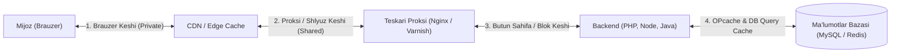
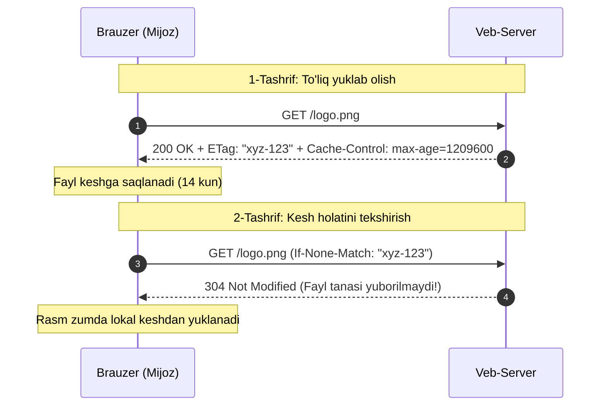
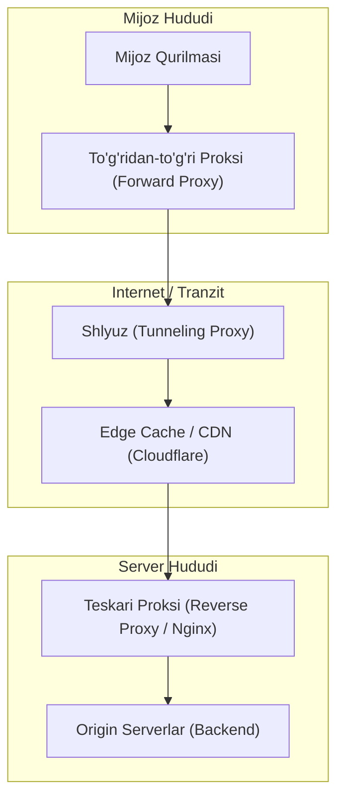

import { Callout } from 'nextra/components'

# Kesh (Cache)

Veb-saytlar va ilovalarning tezligi hamda unumdorligini oshirishning eng samarali usuli — oldin olingan yoki hisoblangan resurslardan qayta foydalanishdir.

**Kesh (Caching / Cache)** — bu ma'lumotlarni vaqtinchalik saqlab turuvchi oraliq bufer hisoblanadi. Kesh veb-sahifaning har bir tashrif buyuruvchi uchun noldan qayta yaratilishining oldini oladi. U katta hajmdagi ma'lumotlarni eng qisqa vaqt ichida, cheklangan server va mijoz resurslari evaziga qayta ishlash imkonini beradi.



---

## 1. Keshning Asosiy Toifalari (Cache Categories)

Ma'lumotlarning kimga tegishliligi va qayerda joylashishiga ko'ra kesh 2 ta yirik toifaga bo'linadi:

### 1. Shaxsiy Brauzer Keshi (Private Browser Cache)
- Faqat **bitta aniq foydalanuvchi** uchun mo'ljallangan.
- Foydalanuvchi brauzer orqali yuklab olgan barcha HTTP hujjatlar, uslublar, skriptlar va media fayllarni diskda yoki tezkor xotirada saqlaydi.
- Sahifalar bo'ylab oldinga va orqaga harakatlanishda (`Back / Forward`), sahifani qayta ochishda yoki tarmoq uzilib qolgan paytda serverga takroriy so'rov yubormasdan, ma'lumotni zudlik bilan ekranga chiqaradi.

### 2. Umumiy Proksi Keshi (Shared Proxy Cache)
- **Bir nechta foydalanuvchilar** o'rtasida bo'lishiladigan umumiy oraliq kesh.
- Internet provayderlari (ISP), yirik korporativ tarmoqlar, kontent yetkazib berish tarmoqlari (CDN) yoki teskari proksilar tomonidan o'rnatiladi.
- Minglab foydalanuvchilar bir xil ommabop resurslarni (masalan, mashhur videolavhalar, kutubxonalar yoki rasmlar) so'raganda, proksi javobni bir marta saqlab oladi va barcha foydalanuvchilarga serverga bormasdan tarqatadi. Bu tarmoq trafigi va kechikish vaqtini (latency) keskin kamaytiradi.

---

## 2. Mijoz Tomonidagi Kesh (Browser / Client-Side Caching)

Mijoz tomonidagi kesh — brauzerga ilgari saqlangan nusxadan foydalanishni buyurish mexanizmidir. Takroriy tashrifda server `304 Not Modified` javobini qaytaradi va sahifa yoki rasm to'g'ridan-to'g'ri foydalanuvchining lokal keshidan yuklanadi.



### 2.1 Fayllar va Rasmlarni Keshlashtirish
- Ko'p miqdorda surat va statik fayllarga ega saytlar uchun eng muhim bosqich.
- Standart amaliyotda statik resurslar uchun **2 haftadan 1 yilgacha** bo'lgan kesh muddati eng samarali hisoblanadi.
- **Kritik nozik jihat:** Agar serverdagi rasm yoki fayl o'zgartirilsa, brauzer uning eskirganini bilmaydi va kesh muddati tugaguncha yoki kesh qo'lda tozalanguncha eski nusxani ko'rsatishda davom etadi. Shu sababli zamonaviy ishlab chiqishda **Cache Busting** usullari qo'llaniladi (masalan, `main.a8f2c.js` yoki `logo.png?v=2`).

### 2.2 HTTPS Keshlashtirish (HSTS)
- `Strict-Transport-Security` (HSTS) kabi maxsus sarlavhalar orqali brauzerga tanlangan domenga doimo faqat xavfsiz **HTTPS** orqali murojaat qilish buyuriladi.
- Ushbu sozlama qat'iy keshlanadi: hatto xizmat o'chirilsa ham, brauzer uzoq vaqt davomida joriy sarlavhalarni e'tiborsiz qoldirib, HTTPS orqali bog'lanishga urinishni davom ettiradi.

### 2.3 Sertifikatlashtirish Markazi Keshi (OCSP Stapling)
- Foydalanuvchi saytga kirganda, uning brauzeri SSL/TLS sertifikatining haqiqiyligini tekshirish uchun sertifikat markazi (CA) serveriga murojaat qilib vaqt yo'qotmasligi lozim.
- **OCSP Stapling** texnologiyasi orqali veb-server CA markazidan olingan vaqt tamg'ali tasdiqni o'zida keshlab oladi va uni mijozga sertifikat bilan birga qo'shib yuboradi.

### 2.4 Sahifalarni Keshlashtirish va Foydalanuvchilar Toifasi
Dinamik bloklardan yig'iladigan sahifalarda har bir qismning o'zgarish vaqti nazorat qilinadi:
- **Avtorizatsiyadan o'tgan foydalanuvchilar:** Har bir foydalanuvchi uchun unikal kontent (profil, buyurtmalar, shaxsiy balans) bo'lgani sababli ularning sahifalarini umumiy keshga joylab bo'lmaydi.
- **Mehmonlar (Avtorizatsiyasiz foydalanuvchilar):** Barcha uchun bir xil umumiy kontent (bosh sahifa, maqolalar). Ularning kontenti deyarli o'zgarmas bo'lgani sababli, butun sahifa keshlanadi.

---

## 3. Server Tomonidagi Kesh (Server-Side Caching)

Server tomonidagi kesh mijoz brauzeriga ko'rinmaydi. U server resurslarini (CPU, RAM, Disk I/O) tejash va "bitta server — millionlab mijozlar" tamoyili bo'yicha javoblarni tezkor taqdim etish uchun xizmat qiladi.

### 3.1 Butun Sahifani Keshlashtirish (Full Page Caching)
- **Eng tezkor kesh turi:** Sahifani RAM (tezkor xotira) tezligida, minimal protsessor yuklamasi bilan qaytaradi.
- Hatto eng kuchsiz server ham bunday kesh yordamida daqiqasiga millionlab so'rovlarni osonlikcha yenga oladi.
- **Cheklovi:** Sahifa kontenti foydalanuvchi parametrlariga yoki sessiyasiga bog'liq bo'lmasligi lozim (mehmonlar uchun ideal).
- Favqulodda yuklama holatlarida (masalan, kutilmagan tashriflar to'lqini paytida) sahifalar 2 daqiqalik qisqa muddatga to'liq keshlanishi mumkin.

### 3.2 Dastur Kodi Kompilyatsiyasini Keshlashtirish (OPcache)
- PHP kabi interpretatsiya qilinadigan tillarda har bir so'rov kelganda kodni noldan o'qib, sintaktik tahlil qilib, bayt-kodga aylantirish shart emas.
- **OPcache** tayyor kompilyatsiya natijasini xotirada saqlaydi va keyingi so'rovlarda skriptni to'g'ridan-to'g'ri bajaradi.

### 3.3 Alohida Sahifa Bloklarini Keshlashtirish (Fragment / Block Caching)
- Eng moslashuvchan va amaliyotda eng ko'p qo'llaniladigan usul.
- Sahifaning o'zgarmas qismlari (navigatsiya menyusi, footer, ommabop yangiliklar) keshlanadi, o'zgaruvchan shaxsiy qismlari (savatcha, bildirishnomalar) esa dinamik yuklanadi.
- Bu yondashuv avtorizatsiyalangan foydalanuvchilar oqimida ma'lumotlar bazasiga tushadigan og'ir so'rovlar sonini keskin kamaytiradi.

### 3.4 Bo'lishilmaydigan va Bo'lishiladigan Resurslar Keshi
- **Bo'lishilmaydigan resurslar:** Bitta sahifani yaratish davomida bir necha marta murojaat qilinadigan ichki o'zgaruvchilar va oraliq ma'lumotlarni saqlash.
- **Bo'lishiladigan resurslar:** Serializatsiya qilingan konfiguratsiya fayllari, ma'lumotlar bazasi jadvallari holati va fayl tizimi ro'yxatlarini umumiy xotirada saqlash.

### 3.5 Ma'lumotlar Bazasi So'rovlari Keshi (MySQL Query Cache va Vaqt Tamg'asi Muammosi)
So'rovlar keshida doimiy o'zgaruvchan funksiyalar ishlatilsa (masalan, `WHERE show_ts <= UNIX_TIMESTAMP()`), bu keshni foydasiz va hatto zararli qilib qo'yadi. Chunki har bir soniyada yangi vaqt keladi va kesh doim bekor bo'lib, xotirani to'ldirib boradi.

```sql
/* Yomon yondashuv: Har soniyada kesh bekor bo'ladi */
SELECT * FROM articles WHERE show_ts <= UNIX_TIMESTAMP();

/* To'g'ri yondashuv: Maksimal vaqt alohida tekshiriladi */
SELECT SQL_NO_CACHE MAX(show_ts) FROM articles WHERE show_ts <= UNIX_TIMESTAMP();
```
*So'rovlar natijalarini faqat o'qish amallari soni yozish amallaridan sezilarli darajada ko'p bo'lgan jadvallarda keshlashtirish mantiqan to'g'ri hisoblanadi.*

### 3.6 Agregatsiya Jadvallarini Keshlashtirish
- **Asosiy qoida:** Ma'lumotlar yangilanishi chastotasi ularni o'qishlar sonidan ancha kam bo'lishi kerak.
- Qayta-qayta hisoblash qimmatga tushadigan statistik ko'rsatkichlar (masalan, foydalanuvchining umumiy izohlari soni, oxirgi tahrir vaqti, reytinglar) alohida agregatsiya keshiga yozib boriladi.

---

## 4. Kesh va Proksi-Serverlar (Proxies & Gateways)

Tarmoqda mijoz va server o'rtasida vositachi bo'lib turuvchi maxsus proksi-serverlar keshlashtirish jarayonida muhim rol o'ynaydi:



### 1. Shlyuzlar (Gateways / Tunneling Proxies)
- So'rov yoki javoblarni o'zgartirmasdan o'tkazib yuboruvchi, bitta xavfsizlik devori (firewall) ortida joylashgan barcha mijozlar uchun umumiy bo'lgan proksi. So'rovlarni umumiy keshlashtirish uchun juda qulay.

### 2. To'g'ridan-to'g'ri Proksi (Forward Proxy)
- Mijoz tomonida o'rnatiladi. Brauzer barcha chiquvchi so'rovlarni ushbu proksiga yo'naltiradi, u esa internetdagi manzilga murojaat qiladi.
- Mijozning shaxsiy ma'lumotlarini himoyalaydi va ichki tarmoq trafigini keshlaydi.

### 3. Veb-akseleratorlar (Web Accelerators)
- Saytga kirish tezligini sun'iy oshirish uchun mijoz keyingi daqiqalarda so'rashi mumkin bo'lgan hujjatlarni oldindan serverdan so'rab oladi (**Prefetching**).
- Resurslarni siqadi (Gzip/Brotli), shifrlashni tezlashtiradi va tasvirlar hajmini kichraytiradi.

### 4. Teskari Proksi (Reverse Proxy — Nginx, HAProxy)
- Asosiy veb-serverlar oldiga joylashtiriladi.
- To'g'ridan-to'g'ri serverlarga murojaat qilishning oldini oladi, yuklamani taqsimlaydi (**Load Balancing**), SSL sertifikatlarini boshqaradi va statik javoblarni o'zida keshlab, asosiy serverlarni ortiqcha so'rovlar yukidan xalos qiladi.

### 5. Edge Caching va CDN (Content Delivery Network)
- Kesh serverlarini to'g'ridan-to'g'ri foydalanuvchilar joylashgan geografik hududlarga (Edge) eng yaqin nuqtalarga joylashtirish texnologiyasi (masalan, Cloudflare, Akamai).
- O'zbekistondagi foydalanuvchi AQSHdagi serverga murojaat qilganda, statik fayllarni Toshkentdagi Edge serveridan millisekundlar ichida oladi.

---

## 5. QA Muhandisi Uchun Kesh Sinovlari Metodologiyasi

Dasturiy ta'minotni sinashda kesh ikkita eng katta muammoni keltirib chiqaradi:
1. **Unumdorlik testlari natijalarini sun'iy buzishi:** Tizim haqiqatda qanday ishlashini emas, keshdagi statik nusxa tezligini ko'rsatib qo'yishi mumkin.
2. **Soxta defektlar (False Positive Bugs):** Eskirgan kesh sababli yangi funksionallik ko'rinmasligi yoki noto'g'ri ma'lumot aks etishi mumkin.

> [!IMPORTANT] QA ning Oltin Qoidasi
> Har bir test yugurtirishdan (**Test Run**) oldin keshni tozalash shart! (Faqatgina keshning o'zi yoki kesh bilan bog'liq ssenariylar sinovdan o'tkazilayotgan holatlar bundan mustasno).

### Keshni Sinash Chek-listi (Cache Testing Checklist):
1. **Sarlavhalar nazorati (Header Inspection):**
   - DevTools Network panelida `Cache-Control`, `Expires`, `ETag`, `Last-Modified` sarlavhalari kutilganidek berilayotganini tekshiring.
   - Maxfiy ma'lumotlar uchun `Cache-Control: no-store, no-cache, must-revalidate` qo'yilganligiga ishonch hosil qiling.
2. **`304 Not Modified` ishlashini tekshirish:**
   - Sahifa qayta yuklanganda server to'liq ma'lumotni qaytarmasdan faqat 304 kodi bilan javob berishi va o'lcham (size) bir necha bayt bo'lishi kerak.
3. **Cache Busting mexanizmi:**
   - Saytda yangi reliz chiqqanda JS/CSS fayllarining xesh-summasi (`app.hash123.js`) o'zgarishi va foydalanuvchilarga darhol yangi versiya ko'rinishi shart.
4. **Shaxsiy ma'lumotlar sizib chiqmasligi (Data Leakage):**
   - Avtorizatsiyalangan foydalanuvchi "A" ning keshga tushgan shaxsiy sahifasi (masalan, `Cache-Control: public` xatosi sababli) boshqa mehmon yoki foydalanuvchi "B" ga ko'rinib qolmasligi lozim.
5. **Hard Refresh va Keshni Tozalash:**
   - `Ctrl + F5` (yoki `Cmd + Shift + R`) bosilganda brauzer barcha resurslarni keshni aylanib o'tib, noldan (`200 OK`) yuklab olayotganini tekshiring.
