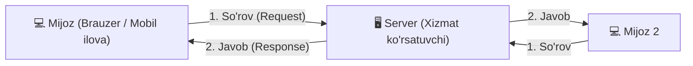
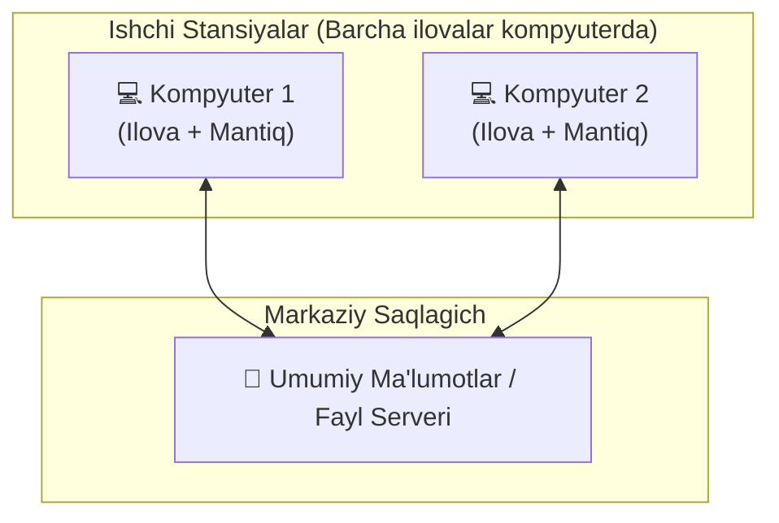
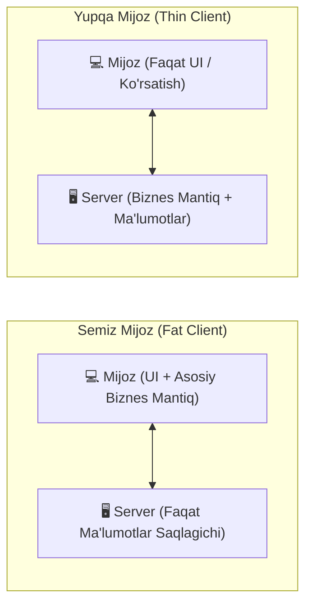
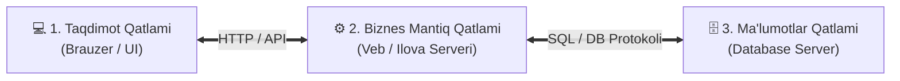
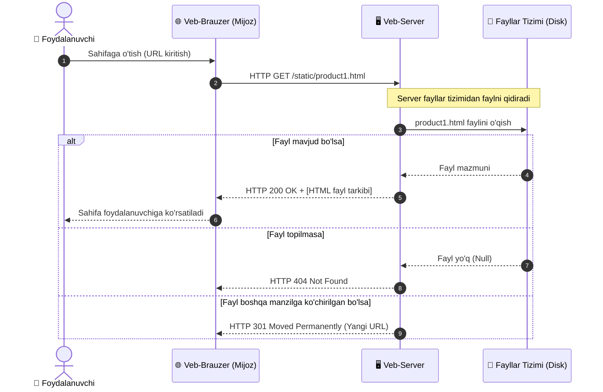
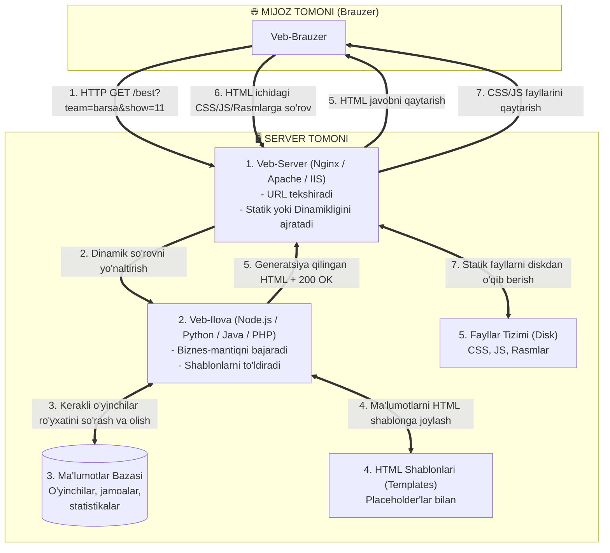
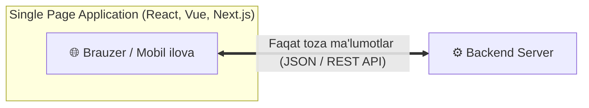

import { Callout } from 'nextra/components'

# Mijoz-Server Arxitekturasi (Client-Server Architecture)

**Mijoz-Server (Client-Server)** — bu tarmoqdagi vazifalar va yuklamalarni xizmat ko'rsatuvchi (**Server**) hamda ushbu xizmatlardan foydalanuvchi (**Mijoz / Client**) o'rtasida taqsimlovchi hisoblash arxitekturasidir.

Mijoz va server mohiyatan alohida dasturiy ta'minotlardir. Odatda ushbu dasturlar kompyuter tarmog'i orqali tarmoq protokollari yordamida muloqot qiluvchi turli xil kompyuterlarda joylashadi, biroq ular bitta jismoniy kompyuter ichida ham ishlashi mumkin.

Server dasturlari doimiy ravishda mijoz dasturlaridan keladigan so'rovlarni tinglaydi va ularga o'z resurslarini quyidagi ko'rinishlarda taqdim etadi:
- **Ma'lumotlar (Data):** HTTP, FTP, BitTorrent orqali fayllarni yuklab olish, media oqimlari (streaming) yoki ma'lumotlar bazasi bilan ishlash.
- **Xizmat funksiyalari (Service functions):** Elektron pochta xizmatlari, tezkor xabarlar (messencerlar) yoki Butunjahon o'rgimchak to'rida (WWW) veb-sahifalarni ko'rish.

Yagona server dasturi bir vaqtning o'zida yuzlab va minglab mijoz dasturlarining so'rovlariga xizmat ko'rsatishi mumkin bo'lgani sababli, u maxsus sozlangan, yuqori unumdorlikka ega alohida hisoblash mashinasiga (serverga) joylashtiriladi.

---

## 1. Mijoz-Server Arxitekturasi Darajalari (Tier Models)

Mijoz-server tizimlari komponentlarning qayerda joylashgani va vazifalarning taqsimlanishiga ko'ra bir nechta sinflarga bo'linadi:

### 1-Pog'onali Arxitektura (1-Tier)

Barcha ilovalar to'g'ridan-to'g'ri umumiy ma'lumotlar bazasi yoki fayl serveriga murojaat qiluvchi ishchi stansiyalarda (foydalanuvchi kompyuterlarida) joylashadi. Server bu yerda hech qanday dasturiy mantiqni bajarmaydi, faqat ma'lumotlarni saqlaydi va taqdim etadi.

- **Afzalligi:** Tuzilishi juda sodda.
- **Kamchiligi:** Boshqarish qiyin; har bir mashinada ma'lumotlarning turli xil versiyalari yuzaga keladi va ma'lumotlarni sinxronizatsiya qilish jiddiy muammoga aylanadi.

---

### 2-Pog'onali Arxitektura (2-Tier)

Ilova dasturlari markaziy Ilova Serverida (Application Server, masalan, 1C serveri yoki CRM tizimi), mijoz dasturlari esa foydalanuvchi ishchi stansiyalarida joylashadi. Mijoz foydalanuvchiga interfeys taqdim etadi va so'rovlarni serverga yo'naltiradi.

Ikki pog'onali arxitekturada ikki xil yondashuv ajratiladi:

1. **"Semiz mijoz — Yupqa server" (Fat Client, Thin Server):** Barcha asosiy biznes-mantiq va ma'lumotlarni qayta ishlash mijoz kompyuterida bajariladi, server faqat ma'lumotlar ombori vazifasini o'taydi.
2. **"Yupqa mijoz — Semiz server" (Thin Client, Fat Server):** Mijoz kompyuterida faqat vizual interfeys bo'ladi. Barcha murakkab hisob-kitoblar, biznes qoidalari va ma'lumotlar serverda qayta ishlanadi. Ushbu model zamonaviy **bulutli hisoblash (Cloud Computing)** prototipi hisoblanadi.

---

### 3-Pog'onali Arxitektura (3-Tier)

Klassik veb-arxitektura bo'lib, unda 3 ta mustaqil qatlam mavjud:
1. **Taqdimot qatlami (Presentation Tier / Client):** Foydalanuvchi interfeysi (Brauzer, Mobil ilova).
2. **Ilova / Mantiq qatlami (Application Tier / Logic):** Biznes-qoidalar, ma'lumotlarni tekshirish va middleware joylashgan veb/ilova serveri.
3. **Ma'lumotlar qatlami (Data Tier / Database):** Alohida ma'lumotlar bazasi (RDBMS/NoSQL) yoki fayl tizimi.

Mijoz ma'lumotlar bazasiga to'g'ridan-to'g'ri kira olmaydi; barcha aloqa faqat ilova serveri orqali o'tadi. Bu tizimning xavfsizligini, unumdorligini va moslashuvchanligini keskin oshiradi.

---

### Ko'p Pog'onali Arxitektura (N-Tier)

Bir nechta ixtisoslashgan ilova serverlari, kesh qatlamlari, mikroservislar va turli ma'lumotlar bazalari bir-birining natijalaridan foydalanadigan murakkab korporativ arxitekturadir. 3-Tier model N-Tier modelining xususiy holatidir.

- **Afzalligi:** Cheksiz kengayish (gorizontal masshtablanish) va yuqori moslashuvchanlik.
- **Kamchiligi:** Tizimning o'ta murakkabligi va komponentlararo integratsiyani sinashning qiyinligi.

---

## 2. Mijoz-Server Arxitekturasining 10 ta Asosiy Xususiyati

| Xususiyat | Mazmuni |
| :--- | :--- |
| **1. Protokol asimmetriyasi (Protocol asymmetry)** | Mijoz va server o'rtasida bir-ko'pga (*one-to-many*) bog'liqlik mavjud. Muloqotni doimo mijoz boshlaydi (so'rov yuboradi). |
| **2. Xizmat inkapsulyatsiyasi (Service encapsulation)** | Mijoz so'rov yuborganidan so'ng, server vazifani o'zi qanday bajarishini ichki mantiq asosida hal qiladi. Serverni yangilash e'lon qilingan interfeysni buzmagan holda amalga oshiriladi. |
| **3. Yaxlitlik (Integrity)** | Ma'lumotlar va biznes-qoidalar serverda markazlashgan holda boshqariladi. Bu xizmat ko'rsatish xarajatlarini kamaytiradi va ma'lumotlar buzilishining oldini oladi. |
| **4. Lokal shaffoflik (Local transparency)** | Server dasturiy jarayondir: u mijoz bilan bitta mashinada ham, dunyoning narigi burchagidagi serverda ham ishlashi mumkin. Tarmoq mijozdan serverning aniq jismoniy joylashuvini yashiradi. |
| **5. Xabarlarga asoslangan muloqot (Message-based)** | Mijoz va server bir-biri bilan uzviy bog'lanmagan (*loosely coupled*) jarayonlar bo'lib, faqat so'rov va javob xabarlari orqali muloqot qiladi. |
| **6. Modulli va nosozlikka chidamli tuzilma** | Tizimdagi biror modul yoki zaxira serverlardan biri ishdan chiqsa ham, butun tizim qulab tushmaydi. |
| **7. Platformaga bog'liq emaslik (Platform independence)** | Mijoz va server mutlaqo turli operatsion tizimlar (Windows, Linux, iOS, Android) va apparat vositalarida ishlashi mumkin. |
| **8. Masshtablanuvchanlik (Scalability)** | Tizimni gorizontal (yangi server va mijozlar qo'shish) hamda vertikal (mavjud server quvvatini oshirish) usulda kuchaytirish mumkin. |
| **9. Vazifalar taqsimoti (Separation of functions)** | Server — xizmat va resurs yetkazib beruvchi, mijoz esa ushbu xizmatlarning iste'molchisidir. |
| **10. Resurslarni birgalikda ulashish (Resource sharing)** | Bitta server bir vaqtning o'zida minglab mijozlarga umumiy ma'lumotlar va resurslardan adolatli foydalanish imkonini beradi. |

---

## 3. Amaliy Qo'llanilish Misollari

- **Veb-saytlar va Ijtimoiy Tarmoqlar:** Facebook, Instagram, YouTube, elektron tijorat (Amazon, Ozon) tizimlarining barchasi mijoz-server tamoyilida ishlaydi. Brauzer yoki mobil ilova — mijoz, markaziy bulutli klasterlar — serverdir.
- **Avtomobil Navigatsiyasi (GPS/GIS Misoli):** Haydovchining smartfonidagi ilova — mijoz bo'lib, o'z joylashuvi va tezligini serverga yuboradi. Server GIS (Geografik axborot tizimi) ma'lumotlar bazasidan yo'l ta'mirlash va yangi qurilishlar ma'lumotlarini oladi, minglab foydalanuvchilar tezligini tahlil qilib, tirbandliklar bo'yicha eng maqbul yo'nalishni smartfon ekraniga qaytaradi.
- **Korporativ va Uy Tarmoqlari:** Kichik ofislarda bitta kompyuter umumiy fayllar va printer serveri bo'lishi mumkin. 10 tadan ortiq kompyuterli tashkilotlarda esa maxsus pochta, 1C va CRM serverlari ajratiladi. Aqlli uyda (Smart Home) robot-changyutgichlar, videokameralar va hisoblagichlar uy boshqaruv serveriga mijoz sifatida ulanadi.
- **Serversiz Arxitektura (Serverless / FaaS):** Zamonaviy bulut xizmatlarida serverlarni qo'lda boshqarish o'rniga kod qismlari "Xizmat sifatida funksiya" (*Function as a Service*) tarzida ishga tushiriladi. Jismonan serverlar mavjud bo'lsa-da, ularni sozlash va masshtablash bulut provayderi (AWS Lambda, Google Cloud Functions) zimmasiga o'tadi.

---

## 4. Statik Veb-Saytlar Arxitekturasi

**Statik veb-sayt** — ma'lum bir URL resursiga har safar so'rov yuborilganda serverdan avvaldan tayyorlab qo'yilgan (o'zgarmas) fayllarni qaytaruvchi tizimdir.

Masalan, `/static/myproduct1.html` sahifasi ochilganda barcha foydalanuvchilarga aynan bir xil HTML fayl yuboriladi. Yangi mahsulot qo'shish uchun alohida `myproduct2.html` faylini yaratish talab etiladi.

### Statik Veb-Serverning Ishlash Sxemasi

Quyidagi diagrammada brauzer statik fayllarni serverdan qanday qabul qilishi ko'rsatilgan:

<Callout type="info">
**Statik saytlarning xususiyatlari:**  
- Statik server faqat **GET** so'rovlarini qayta ishlaydi, chunki serverda o'zgartiriladigan dinamik ma'lumotlar saqlanmaydi.  
- Javoblar foydalanuvchining cookie fayllari yoki URL parametrlariga qarab o'zgarmaydi.  
- Kichik sahifalar uchun juda tezkor va arzon, ammo minglab sahifalar paydo bo'lganda boshqarish va dizaynni yangilash o'ta qimmatga tushadi.
</Callout>

---

## 5. Dinamik Veb-Ilovalar Arxitekturasi va So'rov Anatomiyasi

**Dinamik veb-sayt** — kelib tushgan so'rov parametri, foydalanuvchi shaxsi va ma'lumotlar bazasidagi ma'lumotlar asosida har bir so'rov uchun alohida HTML sahifani "parvoz paytida" (on the fly) generatsiya qiluvchi tizimdir.

### Afzalliklari:
1. **Ma'lumotlar bazasidan foydalanish:** Mahsulotlar yoki foydalanuvchilar ma'lumotlari alohida fayllarda emas, balki qulay qidiriladigan, kengaytiriladigan va saralanadigan ma'lumotlar bazasida saqlanadi.
2. **HTML Shablonlari (Templates):** Sayt dizayni va tuzilishi bitta shablonda saqlanadi. Dizaynni o'zgartirish uchun minglab fayllarni emas, bitta shablonni yangilash kifoya.

---

### Amaliy Misol: Sport Jamoasi Murabbiyi Sayti (Anatomy of a Dynamic Query)

Tasavvur qiling, murabbiy jamoa nomi va o'yinchilar sonini tanlab, bo'lajak o'yin uchun eng kuchli tarkib ro'yxatini (`/best`) olish uchun formani yuboradi.

Quyidagi diagrammada ushbu dinamik jarayonning **7 ta asosiy bosqichi** to'liq tasvirlangan:

### 7 Bosqichning Batafsil Tavsifi:

1. **HTTP GET so'rovi yuboriladi:** Murabbiy formani yuborgach, brauzer serverga URL parametrlari bilan `HTTP GET /best?team=my_team&show=11` so'rovini yuboradi (ma'lumotlarni o'zgartirmasdan, faqat olish bo'lgani uchun GET ishlatiladi).
2. **Veb-server marshrutlashni aniqlaydi:** Veb-server (Nginx/Apache) o'z konfiguratsiya qoidalari asosida so'rov statik faylga emas, dinamik ilovaga tegishli ekanligini biladi va uni Veb-ilovaga (Backend kodi) topshiradi.
3. **Veb-ilova ma'lumotlar bazasiga murojaat qiladi:** Veb-ilova URL ichidan jamoa nomi va sonini ajratib oladi, cookie orqali murabbiy shaxsini tasdiqlaydi va ma'lumotlar bazasidan (DB) eng yaxshi o'yinchilar ma'lumotlarini so'rab oladi.
4. **HTML sahifani generatsiya qiladi:** Veb-ilova bazadan kelgan ma'lumotlarni tayyor HTML shablondagi maxsus bo'sh o'rinlarga (*placeholders*) joylashtirib, yaxlit yangi HTML sahifani shakllantiradi.
5. **Javob brauzerga qaytariladi:** Generatsiya qilingan HTML sahifa veb-server orqali brauzerga **HTTP 200 OK** status kodi bilan yuboriladi.
6. **Statik resurslar uchun yangi so'rovlar:** Brauzer HTML kodni o'qish jarayonida sahifaga bog'langan CSS dizayn fayllari, JavaScript skriptlari va logotiplarga duch keladi va ular uchun serverga alohida statik GET so'rovlarini jo'natadi.
7. **Statik fayllar yetkaziladi:** Veb-server ushbu CSS va rasmlarni to'g'ridan-to'g'ri o'zining fayllar tizimidan olib brauzerga yetkazadi.

<Callout type="tip">
**Ma'lumotlarni yangilash (POST so'rovlari):**  
Agar murabbiy yangi o'yinchini ro'yxatga qo'shsa yoki bazadagi ma'lumotlarni o'zgartirsa, so'rov GET emas, albatta **POST** metodi orqali yuboriladi.
</Callout>

---

## 6. HTML'dan Boshqa Ma'lumotlarni Qaytarish va Zamonaviy SPA

Zamonaviy veb-ilovalarda server har safar butun boshli HTML sahifani qaytarishi shart emas. Server quyidagi formatlarni ham dinamik generatsiya qilib qaytarishi mumkin:
- **Ma'lumotlar formatlari:** **JSON** va **XML** (zamonaviy REST API va mobil ilovalar uchun asosiy format).
- **Hujjatlar va fayllar:** Dinamik tuzilgan PDF hisobotlar, Excel yoki CSV jadvallari.

### AJAX va Single Page Applications (SPA)
Veb-brauzer sahifani to'liq qayta yuklamasdan, orqa fonda faqat kerakli ma'lumotlarni serverdan so'rab olib sahifani yangilash texnologiyasi (**AJAX**) yaratildi.

Buning natijasida **Single Page Applications (SPA)** — yagona sahifali ilovalar (React, Angular, Vue, Next.js) paydo bo'ldi. Ularda butun sayt bitta boshlang'ich HTML bilan yuklanadi, keyingi barcha harakatlarda esa brauzer serverdan faqat yengil JSON ma'lumotlarini oladi va sahifa qismlarini o'zi chizadi (render qiladi). Bu serverdagi hisoblash yuklamasini mijoz brauzeriga ko'chiradi va ilovani oddiy mobil yoki desktop dasturlardek chaqqon ishlaydigan qiladi.

---

## 7. QA Muhandisi Uchun Muhim Xulosalar (Testing Considerations)

1. **Xatolik manzilini aniqlash (Client vs Server):**  
   - Agar sahifadagi tugma bosilmayotgan bo'lsa yoki forma validatsiyasi noto'g'ri ishlayotgan bo'lsa — bu ko'pincha **Frontend (Mijoz)** xatosi.  
   - Agar so'rov 500 Internal Server Error qaytarsa yoki bazadagi ma'lumotlar noto'g'ri saqlansa — bu **Backend (Server)** xatosi.
2. **Tarmoq harakatini kuzatish (DevTools Network tab):**  
   - Sinov paytida brauzer Network tabida so'rov URL manzili, yuborilayotgan parametrlar (Payload / Query params), HTTP metodlari (GET vs POST) va server qaytargan status kodlarini tahlil qilish eng asosiy ko'nikmadir.
3. **Statik va dinamik resurslarni tekshirish:**  
   - 404 xatosi ko'pincha statik fayllar (CSS, rasm) yo'li noto'g'ri ko'rsatilganda yoki serverda fayl mavjud bo'lmaganda uchraydi.  
   - Dinamik sahifalarda esa kesh (caching) tufayli yangilangan ma'lumotlar ko'rinmay qolishi holatlari sinchkovlik bilan tekshirilishi lozim.
