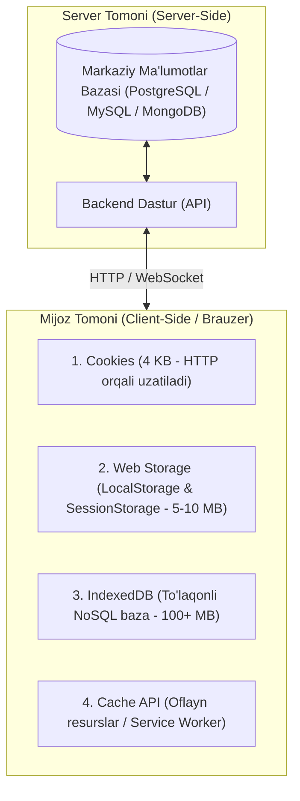
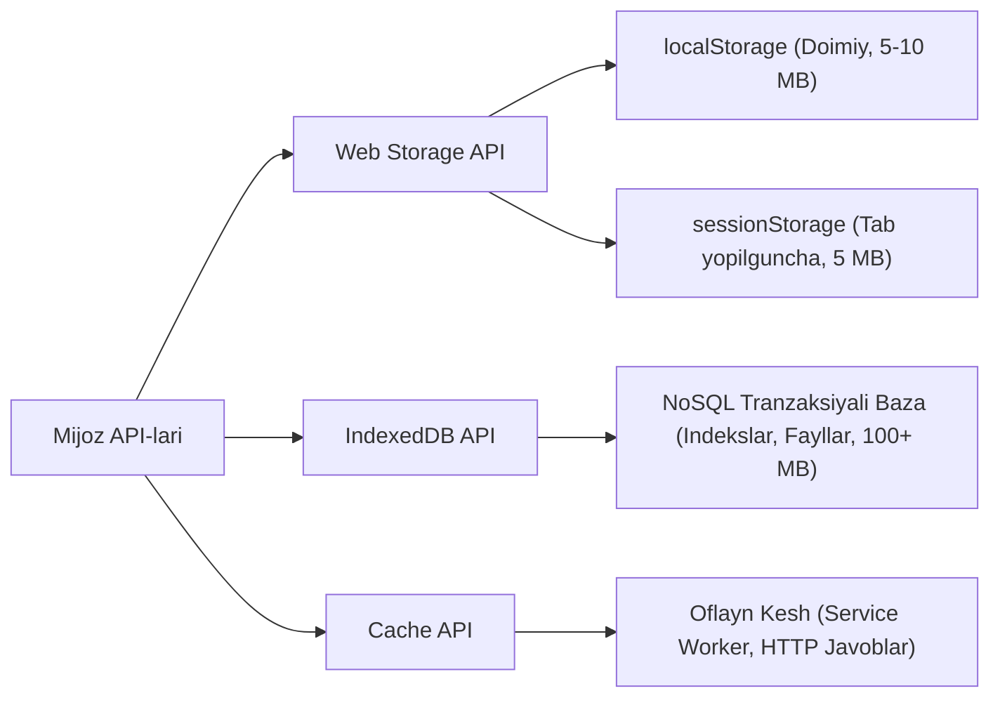
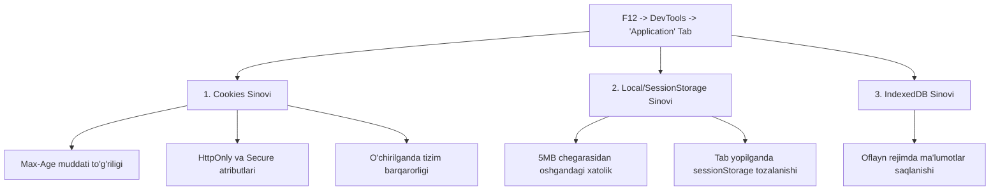

import { Callout } from 'nextra/components'

# Mijoz Tomonida Ma'lumotlarni Saqlash (Client-Side Storage)

Zamonaviy veb-brauzerlar sayt ma'lumotlarini foydalanuvchining ruxsati bilan uning kompyuterida yoki mobil qurilmasida saqlashning bir nechta qulay mexanizmlarini qo'llab-quvvatlaydi. 

Bu texnologiyalar ma'lumotlarni uzoq muddat saqlash, saytlar yoki hujjatlardan **oflayn (internetsiz)** rejimda foydalanish, foydalanuvchi sozlamalarini eslab qolish va veb-ilovalarning yuklanish tezligini sezilarli darajada oshirish imkonini beradi.

---

## 1. Mijoz va Server Xotirasi: Asosiy Farqlar

Ko'pgina zamonaviy veb-saytlar dinamik hisoblanadi: ular ma'lumotlarni serverdagi ma'lumotlar bazasida (**Server-Side Storage**) saqlaydi, so'rov kelganda HTML shablonlarini shakllantirib, brauzerga yuboradi.

**Mijoz tomonida saqlash (Client-Side Storage)** esa JavaScript API vositalari orqali ma'lumotlarni to'g'ridan-to'g'ri foydalanuvchi qurilmasida saqlash va kerak bo'lganda tezda o'qib olish imkonini beradi.



### Mijoz Xotirasining Asosiy Qo'llanilish Sohalari:
1. **Saytni personallashtirish:** foydalanuvchi tanlagan mavzu (Dark/Light mode), til, shrift o'lchami yoki vidjetlar joylashuvini saqlash.
2. **Oldingi harakatlarni saqlash:** ro'yxatdan o'tmagan foydalanuvchining savatchadagi tovarlari (Shopping Cart) yoki oxirgi ko'rilgan mahsulotlar ro'yxatini eslab qolish.
3. **Yuklanish tezligini oshirish va tejamkorlik:** statik resurslar va ma'lumotlarni bir marta yuklab, keshda saqlash orqali keyingi tashriflarda trafik sarflamaslik.
4. **Oflayn (Offline) rejimda ishlash:** internet uzilib qolganda ham ilovaning ishlashini ta'minlash (masalan, Google Docs yoki veb-o'yinlar).

> [!NOTE] Birgalikda Ishlash (Gibrid Yondashuv)
> Ko'pincha mijoz va server xotirasi parallel ishlaydi. Masalan, veb-pleyer qo'shiqlarni bir marta serverdan yuklab oladi va ularni mijozning lokal bazasida saqlaydi. Foydalanuvchi keyingi safar shu musiqani tinglaganda fayllar internetdan emas, balki lokal xotiradan zumda o'qiladi.

---

## 2. Klassik Yondashuv: Cookie-Fayllar (HTTP Cookies)

**Cookie (HTTP cookie, web cookie)** — veb-server tomonidan yuborilib, foydalanuvchi brauzerida saqlanadigan kichik hajmdagi (odatda 4 KB gacha) matnli ma'lumot bo'lagi.

Brauzer ushbu saytning istalgan sahifasini ochishga harakat qilganda, ushbu cookie ma'lumotlarini har bir HTTP so'rovining `Cookie` sarlavhasida serverga avtomatik ravishda qayta jo'natadi.

```mermaid
sequenceDiagram
    autonumber
    participant Browser as Brauzer (Mijoz)
    participant Server as Veb-Server

    Browser->>Server: 1. GET /login (Login & Parol yuboriladi)
    Server-->>Browser: 2. 200 OK + Set-Cookie: session_id=abc123xyz; Path=/; Secure; HttpOnly
    Note over Browser: Brauzer 'session_id' ni diskda saqlaydi
    Browser->>Server: 3. GET /profile (Cookie: session_id=abc123xyz)
    Server-->>Browser: 4. 200 OK (Foydalanuvchi profili ochildi)
```

### Cookie-larning Vazifalari:
- **Autentifikatsiya va sessiyani boshqarish:** foydalanuvchi tizimga kirganligini serverga bildirish (Session ID).
- **Foydalanuvchi sozlamalarini saqlash:** til, dizayn va qidiruv natijalari soni (masalan, Google qidiruvida 1 sahifada 50 ta natija ko'rsatish).
- **Foydalanuvchi xatti-harakatlarini kuzatish (Tracking):** tashrif buyurilgan sahifalar, bosilgan tugmalar bo'yicha tahliliy profil yaratish va moslashtirilgan reklama ko'rsatish.

---

## 3. Cookie Turlari (Types of Cookies)

Veb-texnologiyalarda saqlanish muddati va kelib chiqishiga ko'ra cookie-fayllar bir necha toifalarga bo'linadi:

### 1. Sessiya Cookie-fayllari (Session Cookies)
- Faqat vaqtinchalik xotirada (RAM) saqlanadi.
- Muayyan amal qilish muddati (`Expires` yoki `Max-Age`) bo'lmaydi.
- Foydalanuvchi brauzerni yoki joriy sahifani yopishi bilan avtomatik tarzda butunlay o'chib ketadi.

### 2. Doimiy Cookie-fayllar (Persistent / Tracking Cookies)
- Brauzer yopilgandan keyin ham o'chmaydi, foydalanuvchi qattiq diskida saqlanadi.
- Ularda aniq amal qilish muddati ko'rsatilgan bo'ladi (masalan, 30 kun yoki 1 yil).
- Ushbu muddat tugamaguncha, foydalanuvchi saytga har kirganida ushbu cookie serverga qayta-qayta yuboriladi (avtomatik login yoki uzoq muddatli sozlamalar uchun qo'llaniladi).

### 3. Uchinchi Tomon Cookie-fayllari (Third-Party Cookies)
- Sayt manzil qatoridagi domendan boshqa tashqi domenga tegishli bo'lgan cookie-lar.
- Odatda saytga joylashtirilgan tashqi reklama bannerlari, vidjetlar yoki tahlil tizimlari (masalan, `ad.foxytracking.com`) tomonidan o'rnatiladi.
- Agar foydalanuvchi turli xil saytlarga kirsa va ularning har birida bir xil reklama xizmati kodi bo'lsa, reklama beruvchi foydalanuvchining butun internetdagi qiziqishlar tarixini to'play oladi. Zamonaviy brauzerlar (Chrome, Safari, Firefox) maxfiylikni himoyalash maqsadida uchinchi tomon cookie-larini qat'iy cheklamoqda yoki bloklamoqda.

### 4. Super-Cookie (Supercookies)
- Butun yuqori darajadagi domen (TLD, masalan `.uz`, `.ru` yoki `.com`, `.co.uk`) uchun belgilanishga urinilgan cookie.
- Oddiy cookie faqat bitta aniq domenga (masalan, `example.com`) xizmat qiladi. Agar zararli sayt super-cookie o'rnata olsa, u boshqa mustaqil saytlarning so'rovlarini buzishi yoki sessiyalarni o'g'irlashi mumkin.
- Brauzerlar bunday xavfning oldini olish uchun xalqaro **Public Suffix List** ro'yxatidan foydalanib, TLD darajasidagi cookie-larni qat'iy taqiqlaydi.

### 5. Zombi-Cookie (Zombie / Evercookies)
- Foydalanuvchi brauzer tarixi va keshini to'liq tozalaganidan keyin ham qayta tiklanadigan, o'chirish juda qiyin bo'lgan cookie-lar.
- Buning sababi shundaki, maxsus JavaScript skripti identifikatorni bir vaqtning o'zida brauzerning barcha mavjud xotiralariga (HTTP ETag, SessionStorage, LocalStorage, IndexedDB, Flash LSO, Silverlight) yozib qo'yadi. Foydalanuvchi an'anaviy cookie-larni tozalaganda, skript boshqa xotiralardan nusxasini topib, cookie-ni zudlik bilan qayta tiklaydi.

---

## 4. Cookie-larning Ishlash Mexanizmi

Cookie-lar HTTP protokoli sarlavhalari orqali belgilanadi va boshqariladi:

```http
/* Serverdan brauzerga javob */
HTTP/1.1 200 OK
Content-Type: text/html
Set-Cookie: user=John; Path=/; Domain=example.org; Secure; HttpOnly; SameSite=Lax
Set-Cookie: theme=dark; Max-Age=2592000

/* Brauzerdan serverga keyingi so'rov */
GET /dashboard HTTP/1.1
Host: example.org
Cookie: user=John; theme=dark
```

### Muhim Cookie Atributlari:
- **`HttpOnly`:** Ushbu atribut o'rnatilsa, cookie-ga JavaScript kodi (`document.cookie`) orqali murojaat qilib bo'lmaydi. Bu **XSS (Cross-Site Scripting)** hujumlarida sessiya identifikatorlarini o'g'irlashdan himoya qiladi.
- **`Secure`:** Cookie faqat shifrlangan **HTTPS** aloqasi orqali uzatilishini ta'minlaydi.
- **`SameSite` (`Strict`, `Lax`, `None`):** **CSRF (Cross-Site Request Forgery)** hujumlaridan himoya qiladi, boshqa saytlardan yuborilgan so'rovlarda cookie qo'shib ketilishini cheklaydi.
- **`Path` va `Domain`:** Cookie qaysi manzil va qaysi subdomenlar uchun amal qilishini belgilaydi.

> [!WARNING] JavaScript Orqali Boshqarish
> Agar `HttpOnly` qo'yilmagan bo'lsa, JavaScript orqali ham cookie o'rnatish mumkin:
> ```javascript
> document.cookie = "username=Sardor; path=/; max-age=3600";
> ```

---

## 5. Cookie-larning Kamchiliklari

Cookie texnologiyasi 1990-yillarda yaratilgan bo'lib, bugungi kun talablari uchun jiddiy cheklovlarga ega:
1. **Juda kichik hajm:** Standart bo'yicha bitta cookie hajmi **ko'pi bilan 4 KB** bo'lishi mumkin.
2. **Ortiqcha tarmoq yuki:** Cookie-lar serverga yuboriladigan **har bitta HTTP so'roviga** (shu jumladan rasm, CSS, shrift so'rovlariga ham) avtomatik qo'shib jo'natiladi. Bu mobil internetda keraksiz trafik sarflanishiga olib keladi.
3. **Xavfsizlik muammolari:** Shifrlanmagan HTTP ulanishlarda ochiq Wi-Fi orqali osongina tutib olinishi (sniffing) mumkin.
4. **Faqat oddiy matn:** Murakkab ierarxik ma'lumotlar, massivlar yoki obyektlarni saqlash noqulay.
5. **Huquqiy to'siqlar (EU Cookie Directive / GDPR):** Yevropa Ittifoqi qonunchiligiga binoan, foydalanuvchiga majburiy ravishda *"Biz cookie-lardan foydalanamiz"* degan tasdiqlash oynasini (cookie banner) ko'rsatish talab etiladi.

---

## 6. Yangi Avlod Yondashuvi: Web Storage va IndexedDB

Zamonaviy veb-ishlab chiqishda cookie-larning cheklovlarini yengib o'tish uchun HTML5 bilan birga kuchli mijoz API-lari taqdim etildi.



### 1. Web Storage API (`localStorage` va `sessionStorage`)
Kalit-qiymat (`key: value`) juftligida oddiy matnli ma'lumotlarni saqlash uchun juda qulay:

```javascript
// LocalStorage bilan ishlash
localStorage.setItem('theme', 'dark');
const currentTheme = localStorage.getItem('theme');
localStorage.removeItem('theme');

// SessionStorage bilan ishlash
sessionStorage.setItem('currentStep', 'step-2');
```

- **`localStorage`:** Ma'lumotlar brauzer yopilgandan keyin ham qoladi. Bitta domen doirasidagi barcha oyna va tablar uchun umumiy bo'ladi.
- **`sessionStorage`:** Ma'lumotlar faqat joriy brauzer oynasi (tab) hayoti davomida mavjud bo'ladi. Oyna yopilishi bilan o'chadi. Bir vaqtning o'zida bir xil saytning ikkita oynasi ochilsa, ularning `sessionStorage` xotirasi bir-biriga mutlaqo xalaqit bermaydi.

### 2. IndexedDB API
Brauzer ichiga o'rnatilgan to'laqonli, asinxron **NoSQL ma'lumotlar bazasi**:
- Katta hajmdagi murakkab obyektlar, relyatsion bo'lmagan jadvallar, indekslar va fayllarni (`Blob`, `File`) saqlashga mo'ljallangan.
- Tranzaksiyalarni qo'llab-quvvatlaydi.
- Hajmi disk xotirasiga qarab yuzlab megabayt yoki gigabaytgacha yetishi mumkin.

### 3. Kelajak Texnologiyasi: Cache API
- Maxsus HTTP so'rovlariga qaytgan tarmoq javoblarini (HTML, CSS, JS, media fayllar) keshlab qo'yish uchun mo'ljallangan.
- Odatda **Service Worker** bilan birgalikda **PWA (Progressive Web Apps)** yaratishda qo'llaniladi va internet butunlay yo'q paytda ham saytning to'liq yuklanishini ta'minlaydi.

---

## 7. Mijoz Xotira Turlarining Taqqoslama Jadvali

| Xususiyat | Cookie | LocalStorage | SessionStorage | IndexedDB | Cache API |
| :--- | :--- | :--- | :--- | :--- | :--- |
| **Hajm chegarasi** | ~4 KB | 5 - 10 MB | ~5 MB | Juda katta (diskingiz hajmiga bog'liq) | Katta (disk keshiga bog'liq) |
| **Yashash muddati** | `Expires` / `Max-Age` bo'yicha | Doimiy (qo'lda tozalanguncha) | Oyna/tab yopilguncha | Doimiy | Doimiy |
| **Serverga yuborilishi** | Har bir HTTP so'rovda boradi | Faqat mijozda qoladi | Faqat mijozda qoladi | Faqat mijozda qoladi | Faqat mijozda qoladi |
| **Ma'lumot turi** | Faqat String | Faqat String | Faqat String | Murakkab obyektlar, Fayllar, Blobs | Request / Response obyektlari |
| **Sinxron/Asinxron** | Sinxron | Sinxron (asosiy oqimni to'xtatishi mumkin) | Sinxron | Asinxron (UI qotib qolmaydi) | Asinxron |
| **Kirish sohasi (Scope)** | Domen va Path bo'yicha | Same-Origin (barcha tablar) | Faqat joriy tab (bitta oyna) | Same-Origin (barcha tablar) | Service Worker / Same-Origin |

---

## 8. QA Muhandisi Uchun Sinov Metodologiyasi (Testing Checklist)

Brauzer xotiralarini sinashda asosiy ish asbobi brauzerning **DevTools -> Application** (yoki Storage) paneli hisoblanadi.



### Cookie Sinovlari Bo'yicha Chek-list:
1. **Fayllarning to'g'ri yaratilishi:** Login qilinganda kutilgan barcha cookie-lar diskda to'g'ri nom, qiymat va atributlar bilan paydo bo'lyaptimi?
2. **Cookie rad etilganda dastur xatti-harakati:**
   - Brauzer sozlamalarida cookie-lar butunlay bloklanganda foydalanuvchiga *"Saytdan to'liq foydalanish uchun cookie-larni yoqing"* degan aniq va do'stona xabar ko'rsatiladimi?
   - Saytda oq sahifa yoki tushunarsiz qulash (crash) yuz bermayaptimi?
3. **Cookie o'chirilganda va o'zgartirilganda:**
   - DevTools orqali `session_id` cookie o'chirilsa, sayt sahifasi yangilanganda avtomatik tizimdan chiqishi (logout) kerak.
   - Cookie qiymati qo'lda o'zgartirilsa (tampering), server soxta sessiyani rad etib, qayta autentifikatsiyani talab qilishi shart.
4. **Xavfsizlik atributlari nazorati:**
   - Barcha muhim avtorizatsiya tokenlarida `HttpOnly` va `Secure` bayroqlari o'rnatilganmi?
   - Maxfiy shaxsiy ma'lumotlar (parollar, to'liq karta raqamlari) cookie ichida ochiq matn (plaintext) holida saqlanmasligi kerak.
5. **Kross-brauzer moslashuvchanligi:**
   - Xotiralar Chrome, Safari, Firefox va Edge brauzerlarida, shuningdek Incognito/Private oynalarda bir xil to'g'ri ishlayotgani tekshiriladi.
6. **Ortiqcha cookie-lar nazorati:** Saytda keraksiz, eskirgan va foydalanilmayotgan o'nlab ortiqcha cookie-lar yig'ilib qolmasligi lozim.
