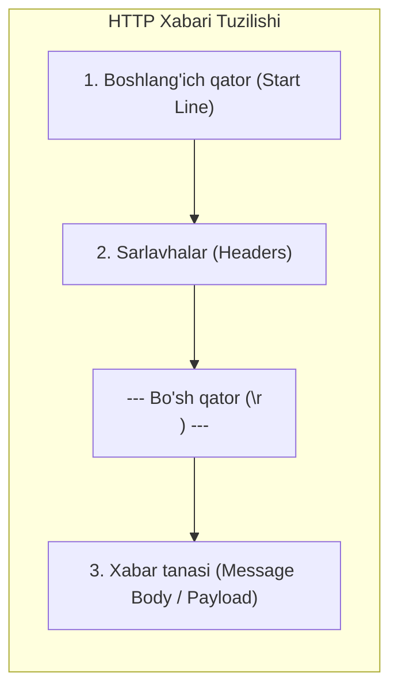
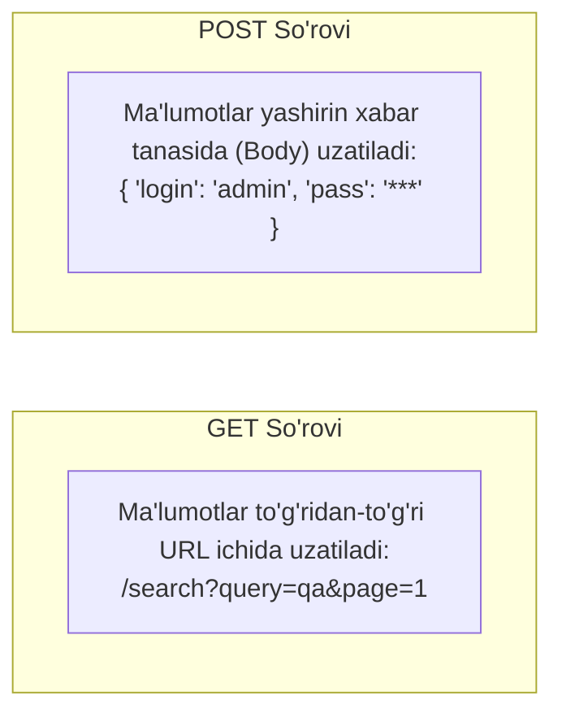
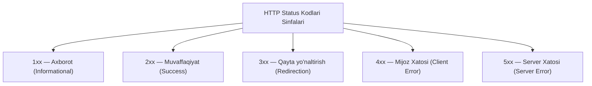
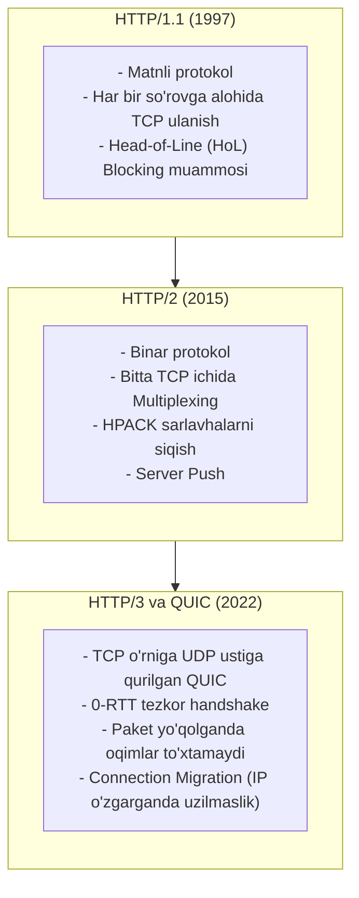
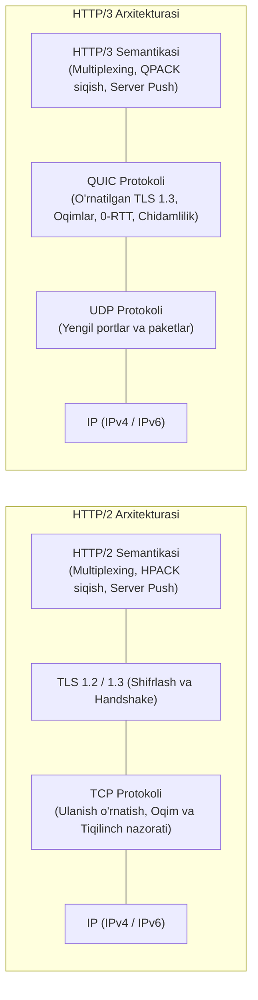
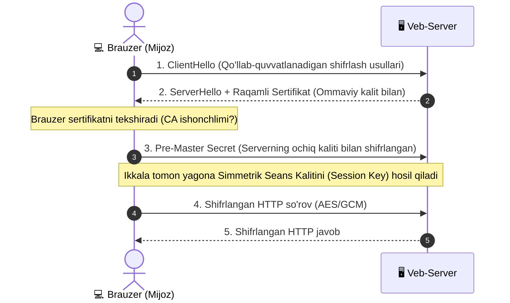

import { Callout } from 'nextra/components'

# HTTP va HTTPS Protokollari (HTTP & HTTPS)

**HTTP (HyperText Transfer Protocol)** — ma'lumotlarni uzatish uchun mo'ljallangan amaliy qatlam protokoli bo'lib, dastlab faqat gipermatnli hujjatlarni (HTML) uzatish uchun yaratilgan bo'lsa-da, hozirgi kunda ixtiyoriy turdagi ixtiyoriy ma'lumotlarni (JSON, XML, tasvirlar, audio, video va binar fayllar) uzatishning asosiy vositasiga aylangan.

HTTP klassik **Mijoz-Server (Client-Server)** texnologiyasiga tayanadi:
- **Mijoz (Client):** Ulanishni o'rnatadi va so'rov (**Request**) yuboradi;
- **Server:** So'rovni qabul qilib, kerakli amallarni bajaradi va natijani javob (**Response**) ko'rinishida qaytaradi.

Shuningdek, HTTP boshqa ko'plab amaliy protokollar (SOAP, XML-RPC, WebDAV, REST API) uchun ishonchli "transport vositasi" sifatida ham xizmat qiladi.

---

## 1. HTTP Protokolining Asosiy Xususiyatlari

1. **Resursga yo'naltirilganlik:** HTTP'da har bir obyekt yoki ma'lumot **URI (Uniform Resource Identifier)** orqali ifodalanadi. Bu serverdagi aniq fayl yoki mavhum mantiqiy obyekt bo'lishi mumkin.
2. **Resurslar ifodasi (Representation & Content Negotiation):** Bitta resurs so'rov va javob sarlavhalari orqali turli formatlarda (masalan, JSON yoki XML, ingliz yoki o'zbek tilida, siqilgan yoki ochiq) taqdim etilishi mumkin.
3. **Holatsizlik (Statelessness):** HTTP protokoli o'tmishdagi so'rov va javoblar haqida hech qanday xotira saqlamaydi. Har bir so'rov-javob juftligi mutlaqo mustaqildir. Tizimda foydalanuvchi holatini (sessiyasini) eslab qolish uchun protokol ustiga qo'shimcha mexanizmlar — mijoz tomonida **Cookie**, server tomonida esa **Session** va **Token**lar kiritilgan.
4. **Content-Type sarlavhasi (MIME Types):** FTP kabi fayl protokollaridan farqli o'laroq, HTTP ma'lumot turini fayl kengaytmasi (`.jpg`, `.json`) orqali emas, balki `Content-Type: application/json` yoki `text/html` kabi sarlavha orqali aniq ko'rsatib beradi. Bu serverga turli parametrlarga ko'ra dinamik natija qaytarish imkonini yaratadi.

---

## 2. HTTP Xabarining Tuzilishi (HTTP Message Structure)

Har qanday HTTP xabari (so'rov yoki javob) qat'iy tartibda uzatiladigan 3 ta qismdan iborat:



### 1. Boshlang'ich Qator (Start Line)

- **So'rovning boshlang'ich qatori:** `Metod URI HTTP/Versiya`
  ```http
  GET /wiki/HTTP HTTP/1.1
  Host: uz.wikipedia.org
  ```
- **Server javobining boshlang'ich qatori:** `HTTP/Versiya StatusKodi Izoh`
  ```http
  HTTP/1.1 200 OK
  ```

---

### 2. Sarlavhalar (HTTP Headers)

Sarlavhalar ikki nuqta bilan ajratilgan `Nomi: Qiymati` ko'rinishidagi satrlardir (RFC 822 standarti). Barcha sarlavhalar 4 ta asosiy guruhga bo'linadi:

1. **General Headers (Umumiy):** So'rovda ham, javobda ham uchrashi mumkin (`Date`, `Cache-Control`, `Connection`).
2. **Request Headers (So'rov):** Faqat mijoz so'rovida yuboriladi (`User-Agent`, `Accept`, `Authorization`, `Cookie`).
3. **Response Headers (Javob):** Faqat server javobida qaytariladi (`Server`, `Set-Cookie`, `Location`).
4. **Entity Headers (Entiti):** Xabar tanasining o'lchami va turini tavsiflaydi (`Content-Type`, `Content-Length`, `Content-Encoding`).

<Callout type="info">
**QA Muhandisi Uchun Muhim Sarlavhalar:**  
- **User-Agent:** Brauzer, uning versiyasi, dvigateli va operatsion tizimi haqida ma'lumot beradi. Saytning moslashuvchan (responsive/mobile) dizaynini tekshirishda muhim.  
- **Authorization / Cookie:** Autentifikatsiya va ruxsatlarni tekshirish.  
- **Cache-Control / ETag:** Kesh holatini va yangilanishlarni aniqlash.  
- **Maxsus sarlavhalar:** Standart bo'lmagan sarlavhalar an'anaga ko'ra `X-` prefiksi bilan boshlanadi (masalan, `X-Request-ID`, `X-Powered-By`).
</Callout>

---

### 3. Xabar Tanasi (Message Body / Payload)

Xabar tanasi sarlavhalardan keyin bitta **bo'sh qator** bilan ajratiladi va unda haqiqiy ma'lumotlar (HTML matni, JSON obyekt, rasm fayli) uzatiladi.

- **So'rovda tana bo'lishi:** `POST`, `PUT`, `PATCH` metodlarida ma'lumot jo'natilganda mavjud bo'ladi. `Content-Length` yoki `Transfer-Encoding: chunked` orqali uning o'lchami bildiriladi.
- **Javobda tana bo'lmasligi qoidalari:** Barcha `HEAD` so'rovlarining javoblarida, shuningdek `1xx` (Axborot), `204 No Content` va `304 Not Modified` status kodlarida javob tanasi **hech qachon bo'lmaydi**.

---

## 3. HTTP Metodlari (HTTP Methods & CRUD)

HTTP metodlari katta harflar bilan yoziladigan va resurs ustida qanday amal bajarilishini bildiruvchi harakatlardir. Ular ma'lumotlar bazasidagi **CRUD** operatsiyalariga to'liq mos keladi:

| Metod | Vazifasi | CRUD mosligi | Idempotentmi? | Xavfsizmi (Safe)? |
| :--- | :--- | :--- | :--- | :--- |
| **GET** | Resurs ma'lumotlarini olish | **Read** | Ha | Ha |
| **POST** | Yangi resurs yaratish yoki ma'lumot jo'natish | **Create** | Yo'q | Yo'q |
| **PUT** | Resursni to'liq almashtirish / yaratish | **Update / Replace** | Ha | Yo'q |
| **PATCH** | Resursning bir qismini o'zgartirish | **Partial Update** | Yo'q / Ha | Yo'q |
| **DELETE** | Ko'rsatilgan resursni o'chirish | **Delete** | Ha | Yo'q |
| **HEAD** | Faqat sarlavhalarni olish (Tanasiz GET) | Read metadata | Ha | Ha |
| **OPTIONS** | Server/resurs qo'llab-quvvatlaydigan metodlarni bilish | Metadata | Ha | Ha |
| **TRACE** | So'rov yo'lidagi o'zgarishlarni tekshirish (Loop-back) | Diagnostics | Ha | Ha |

<Callout type="warning">
**Idempotentlik nima?**  
Metod bir marta bajariladimi yoki bir xil parametrlar bilan 10 marta takroran bajariladimi — serverdagi yakuniy natija bir xil bo'lib qolsa, bu amal **idempotent** deyiladi.  
- `GET`, `PUT`, `DELETE` — idempotent metodlar.  
- `POST` esa idempotent **emas** (masalan, sahifani yangilaganda bitta to'lov yoki sharh bir necha bor qayta yuborilishi mumkin).
</Callout>

### GET va POST Metodlari O'rtasidagi Asosiy Farqlar



1. **Parametrlarning joylashuvi:** GET so'rovida barcha parametrlar ochiq holda URL qatorida uzatiladi; POST so'rovida esa xabar tanasida (Body) yashirin yuboriladi.
2. **Hajm cheklovi:** GET so'rovi URL uzunligi bilan cheklangan (odatda maksimal 2048 belgi); POST so'rovida esa katta fayllar va gigabaytlab ma'lumotlarni uzatish mumkin.
3. **Keshlanish va xatcho'p (Bookmark):** GET so'rovi brauzer tarixida saqlanadi, xatcho'pga qo'shiladi va keshlanadi. POST esa hech qachon keshlanmaydi.
4. **Xavfsizlik:** Parollar, to'lov kartalari kabi maxfiy ma'lumotlarni GET orqali uzatish mutlaqo xavfsizlikka ziddir.

---

## 4. HTTP Status Kodlari (Status Codes)

Status kodi server javobining dastlabki qatorida keluvchi 3 xonali son bo'lib, mijozga so'rov natijasi haqida darhol axborot beradi:



### 1. `1xx` — Axborot Kodlari (Informational)
So'rov qabul qilingan va jarayon davom etayotganini bildiradi (`100 Continue`, `101 Switching Protocols`).

### 2. `2xx` — Muvaffaqiyat (Success)
- **`200 OK`:** So'rov muvaffaqiyatli bajarildi va ma'lumot qaytarildi.
- **`201 Created`:** So'rov natijasida yangi resurs yaratildi (odatda POST/PUT ga javob, `Location` sarlavhasida yangi manzil ko'rsatiladi).
- **`204 No Content`:** So'rov muvaffaqiyatli bajarildi, ammo javobda qaytariladigan tana (body) mavjud emas (masalan, DELETE amali).

### 3. `3xx` — Qayta Yo'naltirish (Redirection)
- **`301 Moved Permanently`:** Sahifa butunlay yangi manzilga ko'chirilgan (SEO va qidiruv tizimlari yangi manzilni eslab qoladi).
- **`302 Found` / `307 Temporary Redirect`:** Vaqtinchalik qayta yo'naltirish.
- **`304 Not Modified`:** Resurs keshda mavjud va oxirgi so'rovdan beri o'zgarmagan (trafikni tejaydi).

### 4. `4xx` — Mijoz Xatolari (Client Error)
- **`400 Bad Request`:** So'rov sintaksisi noto'g'ri (masalan, noto'g'ri JSON shakli).
- **`401 Unauthorized`:** Autentifikatsiyadan o'tilmagan (login/parol yoki Token talab qilinadi).
- **`403 Forbidden`:** Foydalanuvchi tizimga kirgan, ammo bu resursga kirish huquqi yetarli emas.
- **`404 Not Found`:** So'ralgan sahifa yoki resurs serverda topilmadi. *(Nega bu server emas, mijoz xatosi? Chunki server to'g'ri ishlamoqda, lekin mijoz noto'g'ri manzilga murojaat qilgan).*
- **`405 Method Not Allowed`:** Ushbu manzil uchun ushbu metod (masalan, POST o'rniga GET) ruxsat etilmagan.

### 5. `5xx` — Server Xatolari (Server Error)
- **`500 Internal Server Error`:** Server kodi ichida kutilmagan ichki nosozlik (xato ushlanmagan - unhandled exception).
- **`501 Not Implemented`:** Server bu metodni qo'llab-quvvatlamaydi. *(Eslatma: barcha serverlar kamida `GET` va `HEAD` metodlarini qo'llab-quvvatlashi shart, ular uchun 501 qaytishi mumkin emas).*
- **`502 Bad Gateway`:** Proksi yoki API Gateway orqa fondagi servisdan noto'g'ri javob oldi.
- **`503 Service Unavailable`:** Server haddan tashqari yuklama ostida yoki texnik ta'mirlash rejimida.
- **`504 Gateway Timeout`:** Proksi orqa fondagi server javobini kutib turaverib, vaqt chegarasidan (timeout) oshib ketdi.

---

## 5. HTTP Protokollari Evolyutsiyasi: HTTP/1.1, HTTP/2 va HTTP/3 (QUIC)

Tarmoq texnologiyalarining rivojlanishi natijasida protokol bir necha avloddan o'tdi:



### HTTP/2 va HTTP/3 Arxitektura Qiyosi

Quyidagi chizmada HTTP/2 (TCP asosidagi) va HTTP/3 (QUIC va UDP asosidagi) arxitektura qatlamlari solishtirilgan:



### Nega TCP O'rniga QUIC va UDP Tanlandi?
1. **TCP Handshake kechikishi:** TCP ulanish o'rnatish uchun kamida 1–2 RTT (Round Trip Time) vaqt oladi. Uzoq masofalarda bu 100-200 millisekund kechikishga sabab bo'ladi. QUIC esa **0-RTT** (avval bog'langan serverga darhol birinchi paketdayoq ma'lumot yuborish) imkonini beradi.
2. **Head-of-Line (HoL) Blocking:** TCP barcha oqimlarni bitta ketma-ketlik deb biladi. Agar sahifadagi 50 ta elementdan bittasining paketi yo'qolsa, qolgan 49 ta fayl to'xtab turishga majbur. QUIC har bir oqimni mustaqil boshqaradi — bitta resursning kechikishi boshqalarga ta'sir qilmaydi.
3. **Nega UDP?** Yangi transport protokolini butun dunyo routerlari va firewall'lariga tanitish o'nlab yillar talab qilgan bo'lardi. Shuning uchun QUIC allaqachon barcha tarmoq uskunalarida ishlaydigan **UDP** ustiga qurildi, lekin uning ichida TCP kabi ishonchlilik va qayta yuborish mexanizmlari to'liq joriy etildi.

---

## 6. HTTPS (HyperText Transfer Protocol Secure)

Oddiy HTTP ma'lumotlarni ochiq matn (Clear Text) ko'rinishida uzatadi. Ommaviy Wi-Fi tarmoqlarida yoki oraliq marshrutizatorlarda tajovuzkorlar ushbu ma'lumotlarni osongina o'g'irlashi (**Sniffing** yoki **Man-in-the-Middle — MitM** hujumlari) mumkin.

**HTTPS** — bu xavfsiz transport qatlami (**TLS / SSL**) ustida ishlaydigan oddiy HTTP bo'lib, barcha ma'lumotlarni shifrlangan holda uzatadi:
- Standart port: **443** (oddiy HTTP esa **80** portdan foydalanadi).



### HTTPS Xavfsizlik Tamoyillari:
1. **Gibrid Shifrlash:** Boshlanishida asimmetrik shifrlash (ochiq va yopiq kalitlar) orqali umumiy maxfiy kalit kelishib olinadi. So'ngra ma'lumotlar o'ta tezkor **simmetrik shifrlash** (128 yoki 256-bitli kalitlar) orqali almashiniladi.
2. **Server Identifikatsiyasi:** Server o'zining rasmiy raqamli sertifikatini taqdim etadi. Sertifikatda domen nomi va uni tasdiqlagan sertifikatlash markazi (**CA — Certificate Authority**) ko'rsatiladi. Agar sertifikat muddati o'tgan yoki soxta bo'lsa, brauzer darhol ogohlantirish beradi.
3. **Ikki Tomonlama Autentifikatsiya (mTLS):** Yuqori darajadagi xavfsizlik talab etiladigan bank yoki B2B API tizimlarida server ham mijozdan uning shaxsiy sertifikatini talab qilishi mumkin.
4. **SNI (Server Name Indication):** Bitta umumiy IP-manzilga ega serverda bir nechta turli domenlar uchun alohida-alohida SSL/TLS sertifikatlarini to'g'ri ulash imkonini beruvchi TLS kengaytmasidir.
