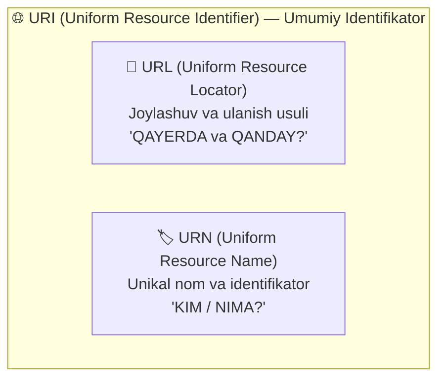
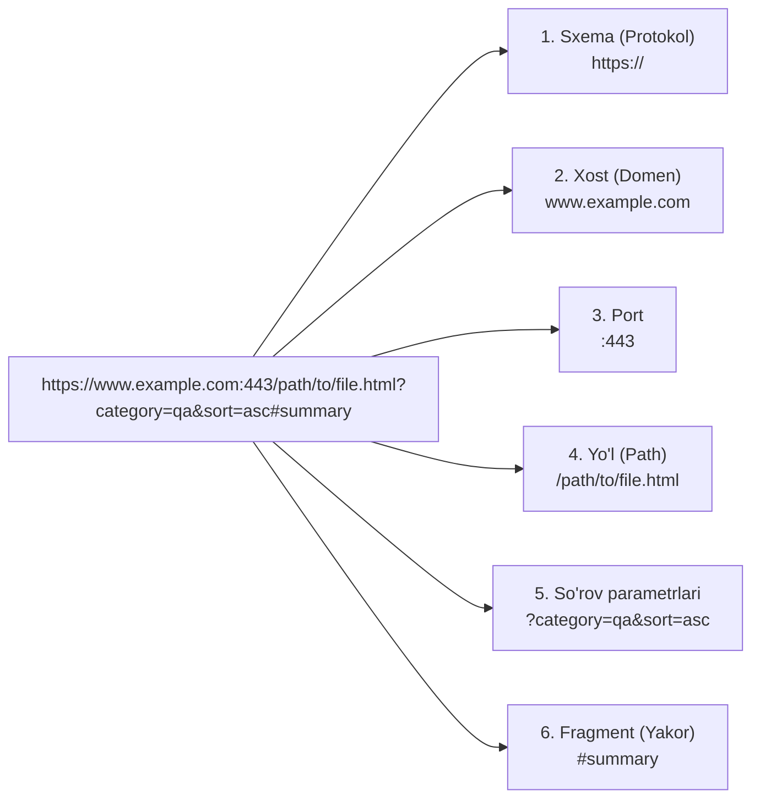

import { Callout } from 'nextra/components'

# Vebdagi Resurslarni Identifikatsiya Qilish (Identifying Resources on the Web)

Internetda har qanday HTTP so'rovining markaziy "obyekti" yoki "maqsadi" — **Resurs (Resource)** deb ataladi. Resursning tabiati har xil bo'lishi mumkin: matnli HTML sahifa, rasm, PDF hujjat, video lavha, JSON ma'lumotlar to'plami yoki serverdagi biror mavhum xizmat.

Har bir resursni butun jahon tarmog'ida adashmasdan topish va unga murojaat qilish uchun **URI**, **URL** va **URN** identifikatsiya tizimlaridan foydalaniladi.

---

## 1. URI, URL va URN: Farqlari va Aloqasi

Ushbu uchta atama ko'pincha sinonim sifatida qo'llanilsa-da, ular o'rtasida aniq mantiqiy chegara mavjud:

- **URI (Uniform Resource Identifier — Resursning unifikatsiyalangan identifikatori):** Jismoniy yoki mavhum resursni aniqlovchi belgilar ketma-ketligi bo'lib, o'z ichiga URL va URN tushunchalarini qamrab oluvchi umumiy tushunchadir.
- **URL (Uniform Resource Locator — Resurs joylashuvini aniqlovchi):** Resursning tarmoqdagi aniq manzilini va unga qaysi protokol orqali ulanish usulini belgilaydi.
- **URN (Uniform Resource Name — Resursning unifikatsiyalangan nomi):** Resursning unikal nomini belgilaydi, biroq unga qayerdan va qanday ulanish mumkinligini ko'rsatmaydi.



### Hayotiy Inson Analogiyasi:
- Sizning ismingiz va familiyangiz (masalan, **"Ali Valiyev"**) yoki pasport raqamingiz — bu **URN** (sizni unikal nomlaydi, lekin ayni damda qayerda ekanligingizni bildirmaydi).
- Siz yashayotgan manzil (masalan, **"Toshkent shahri, Amir Temur ko'chasi, 15-uy"**) — bu **URL** (sizni qayerdan topish mumkinligini ko'rsatadi).
- Sizning yagona va betakror shaxsingiz esa — **URI**dir.

<Callout type="info">
**Qisqa qoida:**  
- **URL:** *"Nimani QAYERDAN va QANDAY topish mumkin?"* degan savolga javob beradi.  
- **URN:** *"Bu nimaning o'zi?"* degan savolga javob beradi.  
- Har qanday URL — bu URI, har qanday URN — bu ham URI. Lekin URN hech qachon URL bo'la olmaydi.
</Callout>

### Internetdagi Misol:
- **URI:** `https://wiki.merionet.ru/images/vse-chto-vam-nuzhno-znat-pro-devops/1.png`
- **URL:** `https://wiki.merionet.ru` (Protokol va manzil)
- **URN:** `images/vse-chto-vam-nuzhno-znat-pro-devops/1.png` (Resursning yo'li/nomi)
- **Kitoblar uchun URN misoli:** `urn:isbn:978-0132350884` (Robert Martinning "Clean Code" kitobi kodi — internetda qayerda turganidan qat'i nazar nomi o'zgarmaydi).

---

## 2. To'liq URL Strukturasi va Sintaksisi (URL Anatomy)

Klassik URL manzili bir necha tarkibiy qismlardan iborat:



---

### URL Qismlarining Batafsil Tahlili:

#### 1. Sxema yoki Protokol (Scheme / Protocol)
Brauzer ushbu resursga murojaat qilishda qaysi tarmoq protokolini qo'llashi kerakligini belgilaydi (oxiriga ikki nuqta va ikkita slesh `://` qo'yiladi).

| Sxema | Tavsifi va Vazifasi |
| :--- | :--- |
| **`http` / `https`** | Gipermatn va veb-sahifalarni uzatish (Oddiy / Shifrlangan xavfsiz) |
| **`ws` / `wss`** | Real-vaqt WebSocket ulanishlari (Oddiy / Shifrlangan) |
| **`ftp` / `sftp`** | Fayllarni serverga yuklash va yuklab olish protokoli |
| **`file`** | Foydalanuvchining o'z kompyuteridagi lokal faylni ochish (`file:///C:/...`) |
| **`mailto`** | Kompyuterdagi pochta dasturini ishga tushirish (`mailto:info@qa.uz`) |
| **`tel`** | Smartfonda to'g'ridan-to'g'ri telefon raqamiga qo'ng'iroq qilish (`tel:+998901234567`) |
| **`ssh`** | Serverlar bilan xavfsiz masofaviy terminal aloqasi |
| **`data`** | Ma'lumotlarni to'g'ridan-to'g'ri URL ichida uzatish (Data URIs: Base64 rasm) |
| **`view-source`** | Brauzerda sahifaning boshlang'ich HTML kodini ko'rish |

#### 2. Domen Nomi yoki Xost (Host / Domain Name)
Resurs qaysi veb-serverda joylashganligini ko'rsatuvchi nom (masalan, `www.example.com` yoki to'g'ridan-to'g'ri server IP-manzili `192.168.1.1`). Domen nomi ortida DNS serverlari orqali aniqlanadigan IP-manzil yotadi.

#### 3. Port (Port)
Serverdagi texnik "darvoza" raqami bo'lib, ikki nuqta (`:`) bilan yoziladi.
- Standart portlar brauzer tomonidan avtomatik tanlanadi va ko'rsatilishi shart emas:
  - **HTTP:** `80`
  - **HTTPS:** `443`
- Agar server nostandart portda ishlayotgan bo'lsa (masalan, test muhitlari yoki lokal dasturlashda), port majburiy ko'rsatiladi: `http://localhost:3000` yoki `http://test-server.uz:8080`.

#### 4. Yo'l (Path)
Veb-server ichidagi ma'lum bir fayl yoki sahifaga olib boruvchi yo'l (`/path/to/myfile.html`). Dastlab bu server qattiq diskidagi haqiqiy jildlar va fayllarga mos kelgan bo'lsa, zamonaviy veb-ilovalarda (Next.js, Spring, Django) yo'l ko'pincha abstrakt marshrut (*Route / Endpoint*) hisoblanadi.

#### 5. So'rov Satri / Parametrlar (Query String)
So'roq belgisi (`?`) bilan boshlanadi va serverga qo'shimcha ko'rsatmalar berish uchun ishlatiladi:
- Parametrlar `kalit=qiymat` juftligida beriladi va bir nechta parametrlar ampersand (`&`) belgisi bilan ajratiladi:
  ```http
  ?search=software+testing&page=2&limit=20
  ```
- Server ushbu parametrlar yordamida qidiruv o'tkazadi, natijalarni sahifalarga ajratadi (pagination) yoki filtrlaydi.

#### 6. Fragment yoki Yakor (Fragment / Anchor)
Panjara belgisi (`#`) bilan boshlanadi:
- Hujjat ichidagi ma'lum bir sarlavha yoki bo'limga (ID bo'yicha) darhol sakrash (skroll qilish) uchun xizmat qiladi.
- Audio va video pleyerlarda aniq bir vaqt sekundiga o'tish uchun ishlatiladi (masalan, `#t=01m30s`).

<Callout type="warning">
**O'ta Muhim Qoida!**  
URL manzilidagi `#` (fragment) qismi **hech qachon serverga yuborilmaydi**. Bu qism faqat mijozning o'z brauzerida ishlaydi. Serverga yuboriladigan HTTP GET so'rovida faqat yo'l va parametrlar ketadi.
</Callout>

---

## 3. URL-Kodlash (Percent-Encoding)

URL standartiga (RFC 3986) ko'ra, URL faqat cheklangan ASCII belgilar to'plamidan iborat bo'lishi shart.

Agar URL ichida bo'sh joy (*space*), tinish belgilari yoki o'zbek/rus harflari (`o'`, `g'`, `ш`, `ў`) ishlatilsa, brauzer ularni avtomatik tarzda **foizli kodlash (Percent-Encoding)** orqali xavfsiz shaklga o'tkazadi:

| Asl Belgi | URL-kodlangan shakli | Izoh |
| :--- | :--- | :--- |
| **Bo'sh joy (Space)** | `%20` yoki `+` | Eng ko'p uchraydigan kodlash |
| **`/` (Slash)** | `%2F` | Agar yo'l ajratuvchisi sifatida emas, parametr qiymatida kelsa |
| **`?` (Question mark)** | `%3F` | Parametr ichida so'roq belgisi kelsa |
| **`&` (Ampersand)** | `%26` | Parametr qiymati ichida `&` qatnashsa |
| **`=` (Equal)** | `%3D` | Parametr ichida tenglik belgisi |
| **`#` (Hash)** | `%23` | Yakor emas, oddiy matn bo'lsa |

---

## 4. QA Muhandisi Uchun URL va Resurslarni Sinash Ro'yxati (Test Checklist)

Dasturiy ta'minotni sinashda URL parametrlari va yo'llar bilan bog'liq xatolar eng ko'p uchraydigan zaifliklardandir:

1. **Parametrlarning chegaraviy qiymatlari (Boundary Testing):**
   - Parametrlarga manfiy sonlar (`?page=-1`), o'ta katta sonlar (`?limit=999999999`) yoki bo'sh qiymatlar (`?search=`) berilganda tizim qanday javob beradi? Server 500 xato bermasdan, to'g'ri `400 Bad Request` qaytarishi shart.
2. **Xavfsizlik sinovlari (SQL Injection va XSS):**
   - Query parametrlari orqali maxsus belgilar (`'`, `"`, `<script>alert(1)</script>`) kiritilganda server ularni tozalashi (*sanitize*) va xavfsiz qayta ishlashi kerak.
3. **Katta-kichik harflar sezgirligi (Case Sensitivity):**
   - Domen nomi (`google.com` va `GOOGLE.COM`) har doim registrga befarq.
   - Biroq yo'l qismi (`/Products` va `/products`) Linux serverlarida ikki xil resurs hisoblanishi mumkin. Bu yerda 404 xatosi chiqmasligiga ishonch hosil qiling.
4. **URL-kodlashni to'g'ri qayta ishlash:**
   - Qidiruv maydoniga bo'sh joylar, kirillcha harflar yoki maxsus belgilar yozilganda URL to'g'ri kodlanishi va serverdan kerakli ma'lumotlar qaytishi tekshiriladi.
5. **Yakor (#) orqali o'tishlar:**
   - Havola orqali sahifa ochilganda brauzer ko'rsatilgan sarlavhaga to'g'ri skroll qilayotganini tekshirish.
