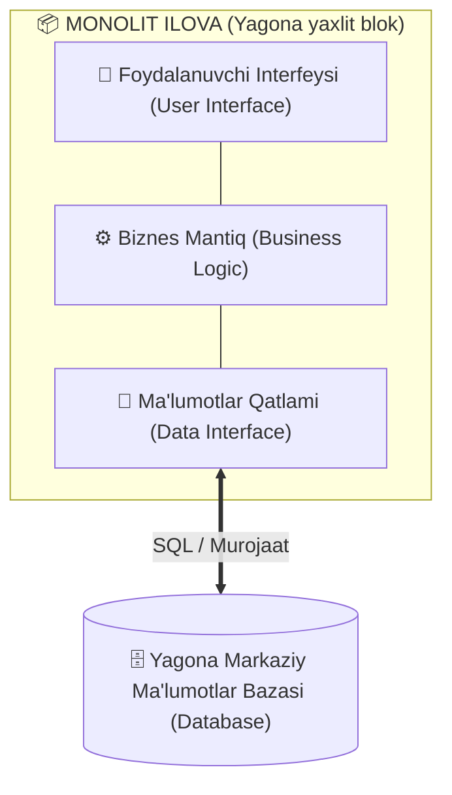
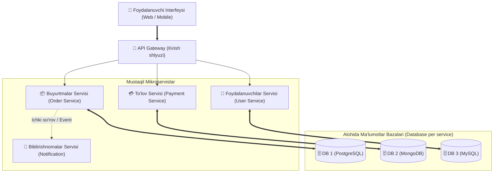
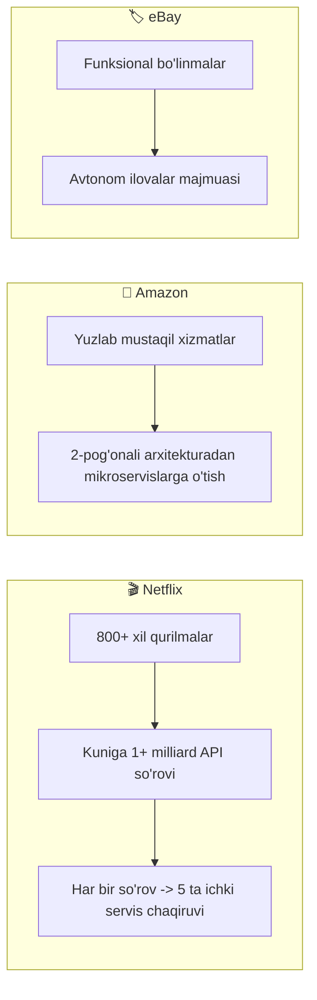
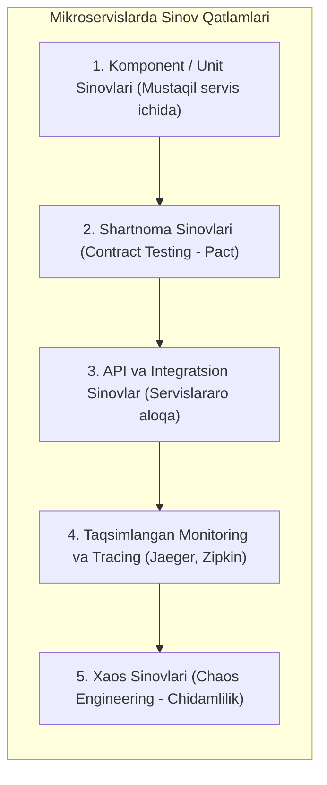

import { Callout } from 'nextra/components'

# Mikroservis Arxitekturasi (Microservice Architecture)

**Mikroservis arxitekturasi (Microservices)** — dasturiy tizimlarni ishlab chiqishning zamonaviy yondashuvi bo'lib, uning asosiy mohiyati dasturni yagona butun (monolit) kod sifatida emas, balki aniq belgilangan interfeyslarga (API) ega bo'lgan, bir-biridan mustaqil ishlaydigan kichik modullar (servislar) to'plami sifatida yaratishdan iborat.

So'nggi yillarda korxonalar o'z faoliyatida chaqqonlikka (**Agile**), uzluksiz yetkazib berishga (**DevOps**) va uzluksiz sinovga (**Continuous Testing**) intilayotgani sababli mikroservislar global dasturiy ta'minot sanoatining asosiy standartiga aylandi.

---

## 1. Monolit vs Mikroservis Arxitekturasi

Dasturiy arxitektura evolyutsiyasini tushunish uchun avvalo monolit va mikroservis tizimlarining tub farqlarini ko'rib chiqish lozim:

### Monolit Arxitektura (Monolithic Architecture)

Monolit ilovada foydalanuvchi interfeysi (UI), biznes-mantiq va ma'lumotlar bilan ishlash qatlami yagona, bo'linmas avtonom birlik (*Single Unit*) sifatida bitta loyiha ichida ishlab chiqiladi va bitta umumiy ma'lumotlar bazasiga ulanadi.

#### Monolitning Cheklovlari:
- **Sekin o'zgarishlar:** Ilovaning biror kichik moduliga kiritilgan o'zgarish butun tizimni boshqatdan kompilyatsiya qilishni va to'liq qayta o'rnatishni (*redeploy*) talab qiladi.
- **Masshtablash muammosi:** Agar faqat to'lov tizimiga yuklama oshsa ham, alohida to'lov qismini emas, balki butun boshli ulkan ilovani yangi serverlarga ko'paytirish (masshtablash) kerak bo'ladi.
- **Yagona nosozlik nuqtasi (*Single Point of Failure*):** Kodning bir joyidagi jiddiy xato butun tizimning to'xtab qolishiga olib keladi.

---

### Mikroservis Arxitekturasi (Microservice Architecture)

Mikroservislarda ilova mustaqil xizmatlarga ajratiladi. Har bir servis o'zining alohida jarayonida (*process*) ishlaydi, o'zining shaxsiy ma'lumotlar bazasiga ega bo'ladi va boshqa servislar bilan yengil tarmoq protokollari (odatda REST API yoki gRPC) orqali muloqot qiladi.

#### Asosiy Afzalliklari:
1. **Mustaqil joylashtirish (Independent Deployment):** Bitta servisni yangilash boshqa servislarning ishlashiga xalal bermaydi.
2. **Texnologik erkinlik (Polyglot Architecture):** Masalan, foydalanuvchilar servisi **Node.js**da, mashinani o'rganish servisi **Python**da, yuqori tezlik talab qiluvchi to'lov servisi esa **Go** yoki **Java**da yozilishi mumkin.
3. **Moslashuvchan masshtablash:** Faqat eng ko'p yuklama tushayotgan servis nusxalari ko'paytiriladi, bu esa server resurslarini sezilarli darajada tejaydi.

---

## 2. Mikroservis Tizimlarining 6 ta Asosiy Xususiyati

| Xususiyat | Mazmuni va Ahamiyati |
| :--- | :--- |
| **1. Ko'p komponentlilik (Multi-component)** | Dastur tarkibiy xizmatlarga bo'lingan. Har bir xizmat ilovaning yaxlitligini buzmasdan mustaqil ishga tushiriladi, sozlanadi va yangilanadi. *(Kamchiligi: tarmoq orqali masofaviy API chaqiruvlari hisobiga kechikishlar oshishi mumkin).* |
| **2. Biznes imkoniyatlari atrofida qurilgan** | An'anaviy loyihalardagi "UI jamoasi", "Baza jamoasi" o'rniga, kross-funksional (har sohadan mutaxassisi bor) jamoalar tuziladi. Amazon shiori: *"You build it, you run it"* (Siz yaratdingizmi — siz boshqarasiz). Har bir jamoa o'z servisining butun hayotiy sikliga javob beradi. |
| **3. Oddiy marshrutlash (Smart endpoints, dumb pipes)** | Xuddi klassik UNIX tizimi kabi: servis so'rovni oladi, qayta ishlaydi va javob qaytaradi. O'ta murakkab va og'ir ESB shinalari o'rniga mantiq to'liq servisning o'zida bo'ladi, aloqa kanallari esa faqat xabarni yetkazadi. |
| **4. Markazsizlashtirish (Decentralized)** | Har bir servis o'ziga ma'qul texnologiya, dasturlash tili va ma'lumotlar bazasidan foydalanadi (*Database per service*). Monolitdagi kabi barcha qismlarni bitta gigant bazaga ulash taqiqlanadi. |
| **5. Nosozliklarga chidamlilik (Fault-tolerant / Resilient)** | Biror servis (masalan, tavsiyalar servisi) ishdan chiqqan taqdirda ham, butun tizim to'xtab qolmaydi — foydalanuvchi buyurtma berishda va mahsulotlarni ko'rishda davom eta oladi. |
| **6. Evolyutsion arxitektura (Evolutionary design)** | Kelajakda qanday yangi qurilmalar (Smart Watch, IoT, yangi mobil OS) ulanishini oldindan bilish shart emas. Tizim yangi servislar va APIlar qo'shish orqali bosqichma-bosqich rivojlanib boradi. |

---

## 3. Haqiqiy Hayotiy Misollar (Katta Kompaniyalar Tajribasi)

Taniqli arxitektor Martin Fauler ta'kidlaganidek, dunyoning eng yirik texnologik gigantlari monolit cheklovlaridan qochib, mikroservisga o'tishgan:

- **Netflix:** Monolitdan mikroservisga o'tishning eng yorqin namunasi. Har kuni 800 dan ortiq turli xil qurilmalardan (televizorlar, telefonlar, konsollar) 1 milliarddan ortiq video oqimi so'rovlarini qabul qiladi. Har bir tashqi API so'rovi orqa fonda o'rtacha 5 ta qo'shimcha ichki mikroservislar zanjirini ishga tushiradi.
- **Amazon:** Millionlab xaridorlarga xizmat ko'rsatish uchun barcha operatsiyalarni (savatcha, to'lov, ombor, tavsiya tizimlari) avtonom xizmatlarga ajratgan. Eski 2 pog'onali tizimda bunday yuklamani ko'tarish mutlaqo imkonsiz edi.
- **eBay:** Xaridlar va auksion tizimini alohida-alohida biznes-vazifalarni bajaruvchi mustaqil ilovalar klasteriga aylantirgan.

---

## 4. SOA (Service-Oriented Architecture) vs Mikroservislar

Ko'pincha yangi muhandislarda: *"Mikroservislar bu shunchaki SOA ning boshqacha nomi emasmi?"* degan savol tug'iladi.

Ular o'rtasida umumiy o'xshashliklar (ikkisi ham xizmatlarga asoslangani) bo'lsa-da, tub fundamental farqlar mavjud:

| Solishtirma Mezon | An'anaviy SOA (Xizmatlarga Yo'naltirilgan) | Mikroservis Arxitekturasi (MSA) |
| :--- | :--- | :--- |
| **Xizmatlar ko'lami** | Katta, korporativ ko'lamdagi xizmatlar (*Enterprise Scope*) | Kichik, bitta biznes-vazifaga yo'naltirilgan xizmatlar |
| **Aloqa mexanizmi** | Og'ir **ESB (Enterprise Service Bus)**, SOAP, XML | Yengil xabarlar: **REST API, gRPC, JSON**, Kafka, RabbitMQ |
| **Ma'lumotlar bazasi** | Odatda bitta umumiy, ulkan relyatsion baza | Har bir servisning o'z shaxsiy bazasi (*Polyglot Persistence: NoSQL, PostgreSQL*) |
| **Dasturlash uslubi** | Imperativ, qat'iy standartlashtirilgan | Reaktiv, erkin va chaqqon (Agile) |
| **Boshqaruv** | Qat'iy markazlashgan | To'liq markazsizlashtirilgan (*Decentralized*) |

<Callout type="info">
**Xulosa:** Mikroservislar — bu SOA g'oyalarining zamonaviy bulutli muhit, konteynerlashtirish (Docker, Kubernetes) va DevOps talablariga moslashtirilgan, mukammal va nozik darajadagi amaliy ifodasidir.
</Callout>

---

## 5. QA Muhandisi Uchun Mikroservislarni Sinash Xususiyatlari

Mikroservisli tizimlarni sinash an'anaviy monolit ilovalarni testlashdan sezilarli darajada farq qiladi:

1. **API va Shartnoma Sinovlari (*Contract Testing*):**  
   Har bir servis boshqa servisga ma'lum bir API shartnomasi (shakli) orqali ma'lumot beradi. Bir jamoa API parametrini o'zgartirsa, boshqa servislar sinib qolmasligi uchun **Pact** kabi vositalar yordamida shartnoma testlari o'tkaziladi.
2. **Kaskadli nosozliklarni tekshirish:**  
   Agar A servis B servisga, B servis esa C servisga bog'liq bo'lsa va C qulasa nima bo'ladi? QA muhandisi tizimda **Circuit Breaker** (Zanjir uzgich) mexanizmi to'g'ri sozlanganligini va bitta servis qulashi butun tizimni to'xtatib qo'ymasligini tekshiradi.
3. **Taqsimlangan Tracing (*Distributed Tracing*):**  
   Foydalanuvchining bitta so'rovi 10 ta turli mikroservislardan o'tishi mumkin. Xatolik yoki kechikish (latency) aynan qaysi servisda yuz berganini aniqlash uchun QA mutaxassisi **Jaeger**, **Zipkin** yoki **OpenTelemetry** loglarini o'qiy olishi kerak.
4. **Mustaqil ma'lumotlar yaxlitligi:**  
   Monolitdagi kabi umumiy SQL tranzaksiyalar (ACID) mikroservislarda ishlamaydi. Shuning uchun ma'lumotlar sinxronizatsiyasi (**Eventual Consistency**) va kompensatsiya qiluvchi tranzaksiyalar (*Saga pattern*) sinchkovlik bilan tekshirilishi lozim.
