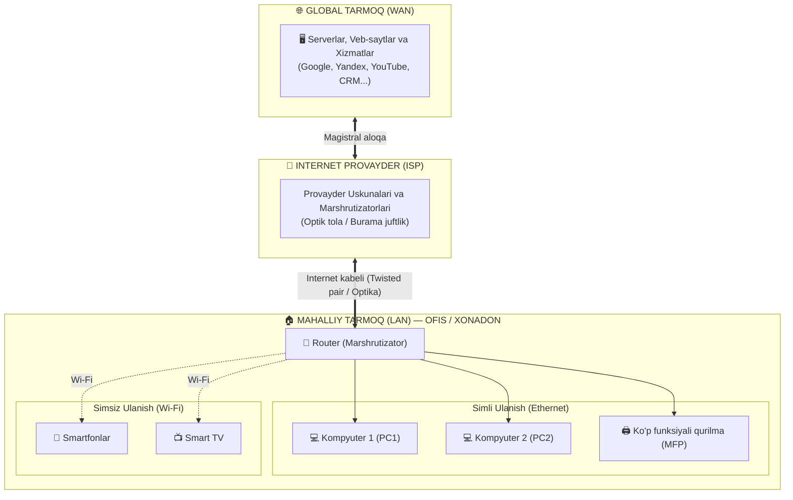
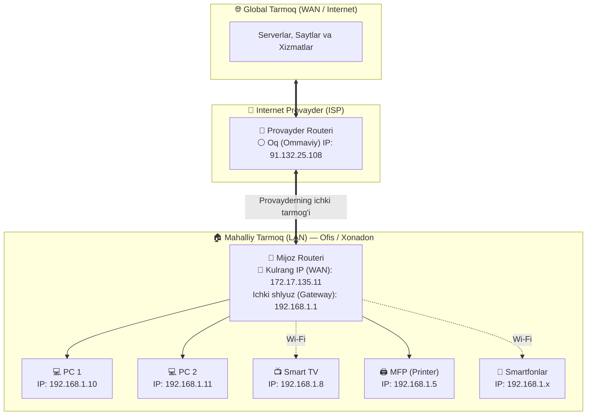
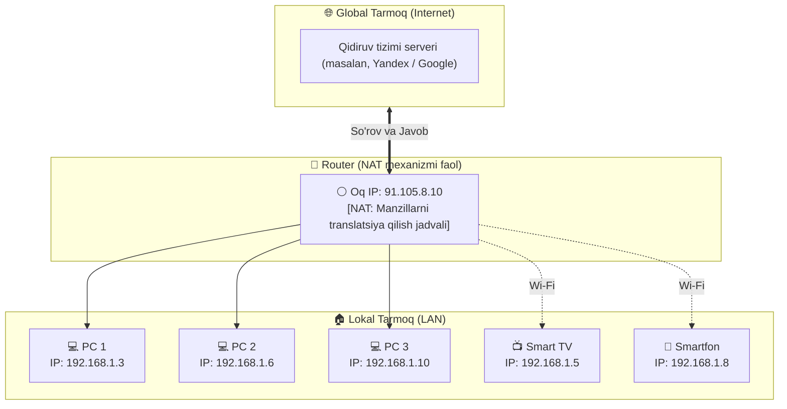
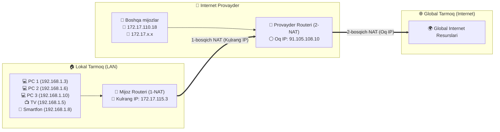
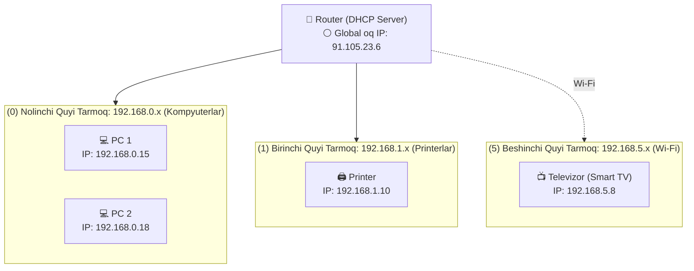
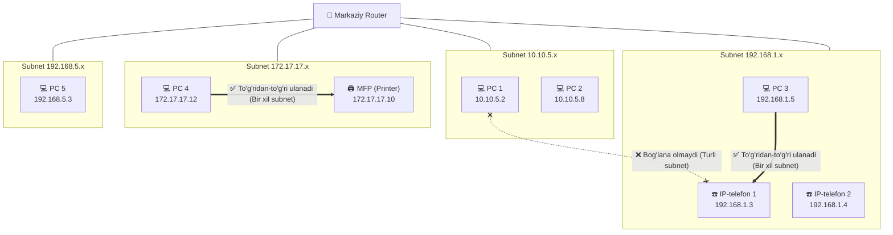
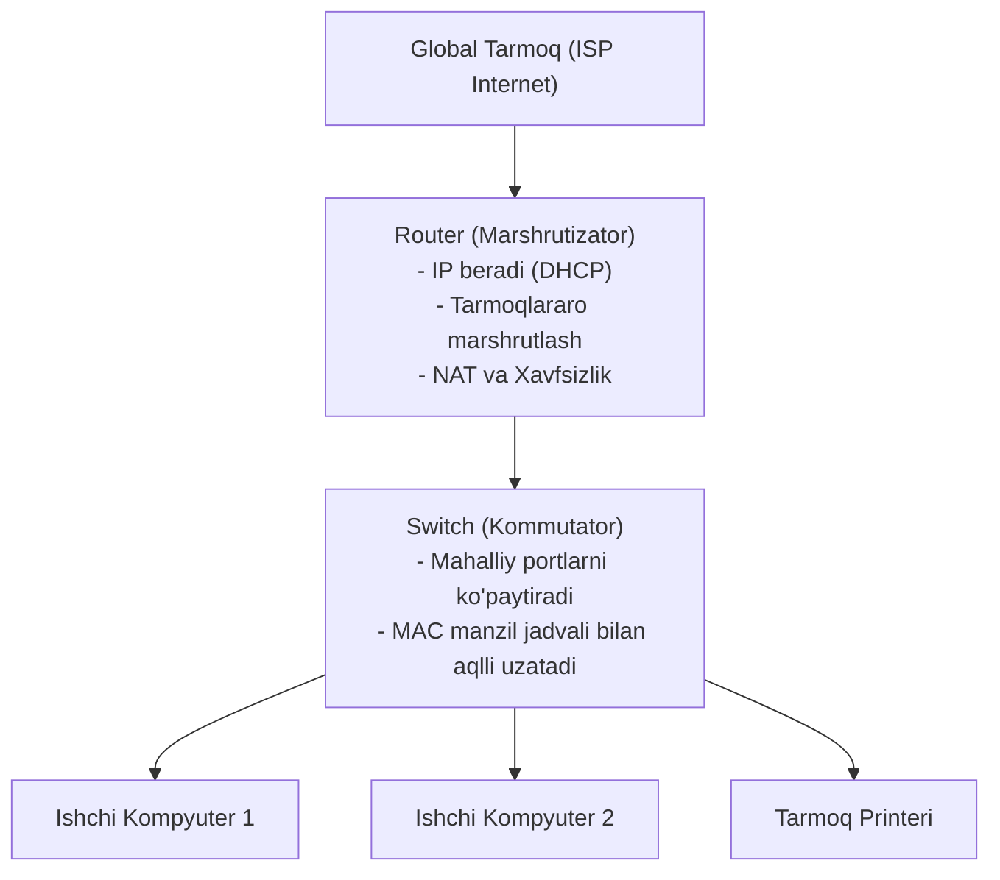
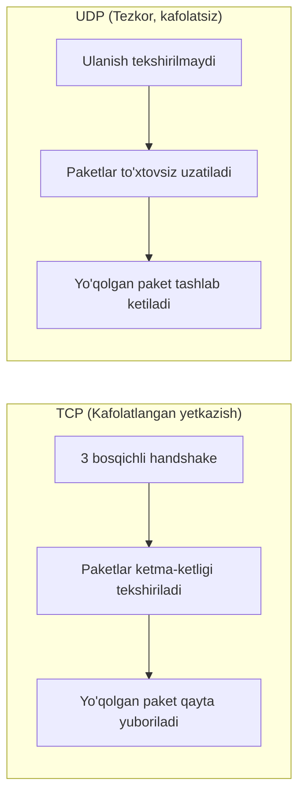

import { Callout } from 'nextra/components'

# Tarmoq Asoslari va Tizimi (Networks & Network Database)

Zamonaviy axborot texnologiyalari va dasturiy ta'minot sinovi (QA) sohasida har bir mutaxassis tarmoqlar qanday tuzilgani, qurilmalar o'zaro qanday ma'lumot almashishi va internet qanday ishlashini bilishi fundamental ahamiyatga ega.

Ushbu qo'llanmada global va lokal tarmoqlar, IP-manzillar turlari, NAT mexanizmi, DHCP, quyi tarmoqlar (subnets), tarmoq uskunalarining farqlari, diagnostika buyruqlari hamda TCP va UDP transport protokollari batafsil yoritilgan.

---

## 1. Global va Mahalliy Tarmoqlar (WAN va LAN)

Barcha kompyuter tarmoqlari o'z ko'lamiga ko'ra asosan ikki toifaga bo'linadi:

1. **LAN (Local Area Network — Mahalliy tarmoq):** Bitta xonadon, ofis yoki butun bir bino ichidagi foydalanuvchi qurilmalarini (kompyuterlar, smartfonlar, printerlar, televizorlar va boshqalar) router (marshrutizator) orqali birlashtiruvchi ichki tarmoq.
2. **WAN (Wide Area Network — Global tarmoq):** Turli shaharlar, mamlakatlar va qit'alardagi mahalliy tarmoqlarni o'zaro bog'lovchi butunjahon tarmog'i (Internet).

Mahalliy tarmoq (LAN) a'zolari internet-provayderga ulanmasdan turib ham o'zaro ma'lumot almashishlari, fayllarni ulashishlari yoki tarmoq printeridan foydalanishlari mumkin. Biroq, tashqi xizmatlar (Google, Yandex, YouTube, ijtimoiy tarmoqlar, CRM tizimlari) bilan ishlash uchun albatta global tarmoqqa (WAN) chiqish talab etiladi.

### Avtomobil Yo'llari Analogiyasi
Tarmoqlarni tushunish uchun yo'llar tizimini tasavvur qilish qulay:
- **Lokal tarmoq (LAN):** Siz yashayotgan shahar ichidagi ichki ko'chalar. Bu ko'chalar orqali siz do'konga, bog'chaga yoki ofisga borasiz (ichki ma'lumot almashinuvi).
- **Global tarmoq (WAN):** Boshqa shaharga yoki chet elga olib boruvchi xalqaro tezyurar avtomagistral (federal highway).

Global tarmoqqa ulanishni **Internet Provayder (ISP — Internet Service Provider)** ta'minlaydi. Provayder o'z uskunalarida tarif rejasiga muvofiq tezlikni belgilaydi va mijoz routeriga burama juftlik (twisted pair) yoki optik tolali kabel orqali ulanish olib kiradi.



---

## 2. Oq va Kulrang IP-Manzillar (Public vs Private IP)

Tarmoqdagi har bir qurilma o'zining noyob raqamli manziliga — **IP-manziliga (Internet Protocol Address)** ega bo'ladi. Ushbu manzil tarmoq uskunalariga so'rovlar va javoblar aynan qayerga yo'naltirilishi kerakligini tushunishga xizmat qiladi (xuddi xat yuborishda pochta indeksi, shahar, ko'cha va xonadon raqami ko'rsatilganidek).

Mahalliy tarmoq ichida qurilmalarga ichki (kulrang) manzillar ajratiladi. Masalan, kompyuteringiz manzili ko'pincha `192.168.x.x` ko'rinishida bo'ladi.

### Mahalliy Tarmoqlar Uchun Ruxsat Etilgan Standart Diapazonlar (RFC 1918)

| Sinf (Class) | Boshlang'ich IP | Tugash IP | Mumkin bo'lgan manzillar soni | Qo'llanilish sohasi |
| :--- | :--- | :--- | :--- | :--- |
| **Class A** | `10.0.0.0` | `10.255.255.255` | 16 777 216 | Yirik korporatsiyalar, ma'lumotlar markazlari |
| **Class B** | `172.16.0.0` | `172.31.255.255` | 1 048 576 | O'rta va yirik tashkilotlar |
| **Class C** | `192.168.0.0` | `192.168.255.255` | 65 536 (256 ta quyi tarmoq) | Xonadonlar, kichik ofislar (SOHO) |

Uy va kichik ofislarda odatda `192.168.0.0/24` yoki `192.168.1.0/24` diapazonlari ishlatiladi, chunki bitta segmentda 254 tagacha faol mijoz qurilmasi bo'lishi xonadon ehtiyojlari uchun to'liq yetarlidir.

<Callout type="info">
**Kompyuteringizning mahalliy IP-manzilini aniqlash:**  
- **Windows:** Buyruqlar qatorida (`cmd` yoki PowerShell) `ipconfig` buyrug'ini yozing.  
- **macOS / Linux:** Terminalda `ifconfig` yoki `ip a` buyrug'ini kiriting.  
- **Ommaviy (tashqi) IP-manzilni aniqlash:** Brauzerda [2ip.ru](https://2ip.ru) yoki [whatismyipaddress.com](https://whatismyipaddress.com) saytlariga kiring.
</Callout>



Yuqoridagi sxemada:
- Provayder tashqi global tarmoqqa (Internet) **oq (ommaviy) IP:** `91.132.25.108` orqali chiqarmoqda.
- Bizning routerga provayder tomonidan **kulrang IP:** `172.17.135.11` berilgan.
- Ichki lokal tarmog'imizdagi barcha qurilmalar esa `192.168.x.x` ko'rinishidagi kulrang manzillarga ega.

### Ommaviy IP-Manzillar Taqchilligi Muammosi

IPv4 formatidagi ommaviy manzillar soni cheklangan bo'lib, dunyo bo'ylab qurilmalar soni bu miqdordan ancha oshib ketgan. Shu bois provayderlar har bir foydalanuvchiga alohida oq IP berish o'rniga, ularni o'zlarining ichki lokal tarmog'iga ulab (masalan, `172.17.x.x` kabi xususiy IP bilan), butun bir tuman yoki ko'p qavatli uylarni yagona oq IP orqali global tarmoqqa chiqaradilar.

<Callout type="warning">
**Uy interneti vs Korporativ ofislar:**  
Oddiy uy foydalanuvchilari uchun kulrang IP yetarli bo'ladi. Biroq korporativ ofislar va serverlar uchun provayderdan alohida **oq (statik/ommaviy) IP** sotib olish tavsiya etiladi. Chunki xususiy IP orqali tashqi masofaviy VPN server tashkil etish, IP-telefoniya (VoIP) yoki ofis serverini to'g'ridan-to'g'ri internetga ulash imkonsiz bo'lib qoladi.
</Callout>

---

## 3. NAT (Network Address Translation) Mexanizmi

**NAT (Network Address Translation)** — ichki mahalliy tarmoqdagi xususiy IP-manzillarni tashqi global tarmoqdagi ommaviy IP-manzillarga (va aksincha) o'zgartirib beruvchi tarmoq texnologiyasidir.

NAT barcha zamonaviy routerlarda ishlaydi va bitta ommaviy IP orqali o'nlab, yuzlab qurilmalarning bir vaqtda internetga chiqishini ta'minlaydi.

### 1-holat: Statik Oq IP Sotib Olingan Holat

Mijoz provayderdan shaxsiy oq IP (`91.105.8.10`) sotib olgan:



1. Lokal tarmoqdagi PC1 (`192.168.1.3`) qidiruv tizimiga so'rov yuboradi.
2. Router ushbu so'rovni tashqariga chiqarishda NAT orqali PC1 manzilini o'zining oq IP-manziliga (`91.105.8.10`) almashtiradi va qaysi port orqali yuborganini maxsus jadvalga (NAT Table) yozib qo'yadi.
3. Tashqi serverdan javob qaytib kelganda, router NAT jadvaliga qarab javobni aynan PC1 qurilmasiga (`192.168.1.3`) yo'naltiradi.

### 2-holat: Oq IP Sotib Olinmagan Holat (Double NAT — Ikki Karra NAT)

Mijoz provayderdan alohida oq IP olmagan bo'lsa, u ikki karra NAT orqali internetga ulanadi:



1. PC1 ning `192.168.1.3` manzili uy routeri tomonidan provayder tarmog'idagi `172.17.115.3` kulrang manziliga o'giriladi.
2. So'ngra provayder routeri ushbu manzilni o'zining ommaviy `91.105.108.10` manziliga o'girib, global tarmoqqa uzatadi.

<Callout type="warning">
**Double NAT oqibatlari:**  
Ikki karra NAT qurilmalarning xavfsizlik darajasini oshirsa-da, jiddiy noqulayliklarni keltirib chiqaradi:  
- VoIP qurilmalarida SIP ro'yxatdan o'tish beqarorlashadi.  
- IP-telefoniya qo'ng'iroqlarida bir tomonlama ovoz (bir kishi eshitib, ikkinchisi eshitmasligi) yuzaga keladi.  
- Onlayn o'yinlarda ulanish xatolari (Strict NAT) va P2P ulanish muammolari paydo bo'ladi.
</Callout>

---

## 4. DHCP Server va Quyi Tarmoqlar (Subnets)

Qurilma tarmoq kabeli yoki Wi-Fi orqali routerga ulanganda, u qo'lda sozlamalarsiz qanday qilib darhol IP-manzil oladi? Bu vazifani **DHCP (Dynamic Host Configuration Protocol) server** bajaradi.

### Dinamik va Statik IP-manzillar
- **Dinamik IP:** DHCP server tomonidan vaqtinchalik (lease time) avtomatik ajratiladi. Har safar router qayta o'chib yonganda yoki yangi ulanishda qurilmaning IP-manzili o'zgarishi mumkin (masalan, `192.168.1.10` bo'lib turgan manzil qayta yuklanishdan so'ng `192.168.1.35` ga o'zgarishi mumkin).
- **Statik IP:** Tarmoq sozlamalarida qurilmaga yoki routerda MAC-manzilga biriktirilgan o'zgarmas doimiy manzil. Serverlar, printerlar va monitoring tizimlari uchun doimo statik IP qo'llaniladi.

### Quyi Tarmoqlarga Bo'lish (Subnetting)

Routerda bir nechta DHCP hovuzlarini (pools) sozlash orqali bitta jismoniy tarmoqni bir nechta mantiqiy quyi tarmoqlarga ajratish mumkin:
- **0-quyi tarmoq (Kompyuterlar):** `192.168.0.2` – `192.168.0.255`
- **1-quyi tarmoq (Printerlar va MFP):** `192.168.1.2` – `192.168.1.255`
- **5-quyi tarmoq (Mehmon Wi-Fi tarmog'i):** `192.168.5.2` – `192.168.5.255`



### Muhim Qoida: Quyi Tarmoqlararo Aloqa Cheklovlari

Agar maxsus yo'naltirish (routing) qoidalari o'rnatilmagan bo'lsa, turli quyi tarmoqlardagi qurilmalar bir-biri bilan to'g'ridan-to'g'ri bog'lana olmaydi.



Misol:
- PC1 kompyuterida (`10.10.5.2`) ishlayotgan xodim IP-telefonning (`192.168.1.3`) veb-interfeysiga kira olmaydi, chunki ular mutlaqo boshqa quyi tarmoqlarda joylashgan.
- Ushbu IP-telefonga faqat bitta quyi tarmoqdagi PC3 (`192.168.1.5`) kompyuteridan ulanish mumkin.
- Ko'p funksiyali printerga (`172.17.17.10`) esa faqat PC4 (`172.17.17.12`) orqali kirish mumkin.

<Callout type="info">
**QA va Tizim administratori uchun eslatma:**  
Masofaviy server, IoT qurilma, printer yoki IP-telefon veb-interfeysi ochilmayotgan bo'lsa, birinchi navbatda sizning kompyuteringiz va ushbu qurilma bir xil quyi tarmoqda (subnet) ekanligini tekshiring!
</Callout>

---

## 5. Tarmoq Uskunalari: Router, Switch, Hub

IT sohasiga endi kirib kelgan mutaxassislar router, kommutator (switch) va xab (hub) qurilmalarini tez-tez adashtirishadi:



### 1. Router (Marshrutizator / Tarmoq Shlyuzi)
Tarmoqning "miyasi". U turli tarmoqlar o'rtasida ma'lumotlar paketini yo'naltiradi, IP-manzillar tarqatadi (DHCP), internetni taqsimlaydi va NAT orqali xavfsizlikni ta'minlaydi. Shuningdek, oddiy kompyuterga bir nechta tarmoq kartasi o'rnatib, unga Mikrotik RouterOS kabi operatsion tizimni o'rnatish orqali kuchli professional routerga aylantirish mumkin.

### 2. Switch (Kommutator)
Mahalliy tarmoqni shoxobchalash (kengaytirish) qurilmasi. Routerda odatda 4-5 ta port bo'ladi. Agar ofisda 24 ta kompyuter bo'lsa, routerning bitta portiga 24 portli Switch ulanadi va barcha kompyuterlar switch orqali tarmoqqa ulanadi.  
Switch **MAC-manzillar jadvaliga** ega bo'lib, kelgan paketni ko'r-ko'rona hammaga emas, balki faqat qabul qiluvchi qurilmaning portiga aniq yetkazib beradi.

### 3. Hub (Konsentrator)
Switchning eng qadimgi va sodda ajdodi. Hubda hech qanday xotira yoki MAC-jadval mavjud emas. Bir portdan kelgan ma'lumot paketini u barcha boshqa ulangan portlarga baravar tarqatadi (broadcast). Qurilmalarning o'zi paket ularga tegishli yoki yo'qligini aniqlashi kerak bo'ladi. Bu ortiqcha tarmoq tiqilinchini va xavfsizlik zaifliklarini keltirib chiqaradi. Hozirgi kunda hublar deyarli qo'llanilmaydi va ularni switchga almashtirish tavsiya etiladi.

| Xususiyat | Router (Marshrutizator) | Switch (Kommutator) | Hub (Konsentrator) |
| :--- | :--- | :--- | :--- |
| **OSI Modeli Qatlami** | 3-qatlam (Network Layer) | 2-qatlam (Data Link Layer) | 1-qatlam (Physical Layer) |
| **Paketni yo'naltirish asosi** | IP-manzil | MAC-manzil | Barcha portlarga ko'r-ko'rona |
| **IP-manzil taqsimlash (DHCP)** | Ha | Yo'q | Yo'q |
| **Internetga ulash (Routing)** | Ha | Yo'q (Router talab etiladi) | Yo'q |
| **Samaradorlik va tezlik** | Yuqori | Juda yuqori | Past (Kolliziyalar ko'p) |

---

## 6. Tarmoq Tahlili va Diagnostikasi Uchun Asosiy Buyruqlar

Sinovchi va muhandislar ulanishdagi nosozliklarni aniqlash uchun quyidagi terminal buyruqlaridan foydalanadilar:

### 1. `ping` — Tugun Faolligini Tekshirish
Berilgan IP-manzil yoki domen bilan aloqa mavjudligini va javob vaqtini (latency) tekshiradi.

```bash
# Oddiy tekshirish
ping google.com

# Cheksiz ping yuborish (to'xtatish uchun Ctrl + C bosing)
ping 192.168.1.1 -t

# IP manzil bo'yicha server/tugun nomini aniqlash
ping -a 91.105.8.10
```

<Callout type="warning">
**Muhim!** Ba'zi routerlar va serverlarda ICMP protokoli (ping so'rovlari) xavfsizlik maqsadida o'chirib qo'yiladi. Bunday holda qurilma internetda faol ishlab turgan bo'lsa ham ping javob bermasligi mumkin (*Request timed out*).
</Callout>

### 2. `traceroute` (`tracert`) — Paket Marshrutini Kuzatish
Paketning manzilga yetib borguncha qaysi oraliq routerlardan (hop) o'tishini va aynan qaysi nuqtada tiqilib qolayotganini ko'rsatib beradi.

```bash
# Windows tizimlarida:
tracert google.com

# Linux va macOS tizimlarida:
traceroute google.com
```

### 3. `whois` — Domen va IP Haqida Ma'lumot Olish
Domen qaysi kompaniyaga tegishli ekanligi, ro'yxatdan o'tgan sanasi, registratori hamda IP-manzillar blokining egasi haqidagi ommaviy ma'lumotlarni chiqaradi.

---

## 7. Transport Protokollari: TCP va UDP

Tarmoqdagi qurilmalar o'rtasida barcha so'rovlar va javoblar **TCP** yoki **UDP** protokollari orqali uzatiladi.



### TCP (Transmission Control Protocol)
- **Kafolatlangan yetkazish:** Ma'lumot uzatishdan oldin ulanishni tekshiradi (*Three-Way Handshake: SYN -> SYN-ACK -> ACK*).
- **Yaxlitlik va tartib:** Paketlar yo'lda buzilsa yoki yo'qolsa, TCP ularni qayta yuborishni talab qiladi va qabul qiluvchi tomonda to'g'ri tartibda yig'adi.
- **Qo'llanilishi:** Veb-saytlar (HTTP/HTTPS), fayl yuklash (FTP), elektron pochta (SMTP/IMAP) va ma'lumotlar yaxlitligi muhim bo'lgan tizimlar.

### UDP (User Datagram Protocol)
- **Kafolatsiz, ammo juda tez:** Ulanish o'rnatilishini tekshirib o'tirmaydi, paket yetib borgani haqida tasdiq kutmaydi.
- **Yo'qotishlarga bardoshli:** Agar paket yo'lda yo'qolsa, uni qayta tiklashga vaqt sarflamaydi, keyingi yangi paketni uzatishda davom etadi.
- **Qo'llanilishi:** Jonli ovoz va video qo'ng'iroqlar (WhatsApp, Telegram, Zoom, Skype), onlayn o'yinlar, video translyatsiyalar (Streaming) va DNS so'rovlari.

| Solishtirma Mezon | TCP | UDP |
| :--- | :--- | :--- |
| **Ulanish o'rnatish** | Majburiy (3-way handshake) | Aloqasiz (Connectionless) |
| **Ma'lumot yetib borish kafolati** | 100% kafolatlanadi | Kafolatlanmaydi |
| **Tezlik va kechikish** | O'rtacha (Kafolat tekshiruvlari hisobiga) | O'ta yuqori (Minimal kechikish) |
| **Paketlar tartibi** | Qat'iy nazorat qilinadi | Tartibsiz yetib kelishi mumkin |
| **Sarlavha hajmi** | 20-60 bayt | 8 bayt |

### Nega Qo'ng'iroqlarda Ovoz Uziladi yoki "Robot-ovoz" Paydo Bo'ladi?
Jonli ovozli muloqotda kechikish bo'lmasligi uchun UDP ishlatiladi. Agar internet kanali band bo'lsa, Wi-Fi radioto'lqinlarida shovqin bo'lsa yoki oraliqda Double NAT mavjud bo'lsa, UDP paketlarining bir qismi yo'qoladi. Natijada so'zlarning uzilib qolishi, exoning paydo bo'lishi yoki metalllashgan ovoz ("robot-ovoz") kuzatiladi.

<Callout type="tip">
**UDP sifatini yaxshilash choralari:**  
Barqaror yuqori tezlikdagi ulanishdan foydalanish hamda routerda **QoS (Quality of Service)** sozlamalarini yoqish orqali UDP ovozli trafigiga TCP trafigiga nisbatan yuqori ustuvorlik berish talab etiladi.
</Callout>

---

## 8. Xulosa va QA Muhandisi Uchun Muhim Ko'nikmalar

Dasturiy ta'minotni sinashda tarmoq qatlamidagi xatolarni to'g'ri izolyatsiya qilish muammoni hal etish tezligini oshiradi:
1. **Muhit tekshiruvi:** Sinov paytida API serverga ulanish xatosi (masalan, `Connection Refused` yoki `Timeout`) server qulaganidan emas, balki qurilmangiz boshqa quyi tarmoqda (subnet) ekanligidan yoki firewall/NAT cheklovlaridan bo'lishi mumkin.
2. **IP-manzillar bilan ishlash:** Test muhitlari (staging/prod) ko'pincha ma'lum bir oq IP-manzillar ro'yxati (whitelist) orqali himoyalanadi. Sizning qurilmangiz oq yoki kulrang IP orqali chiqayotganini tushunish ruxsat olishda juda muhim.
3. **Protokol bo'yicha xatolarni ajratish:** Real-vaqt ovoz va video funksiyalarini (WebRTC, SIP) sinashda yuzaga keladigan nuqsonlar ko'pincha UDP va Double NAT bilan bog'liq bo'ladi.
