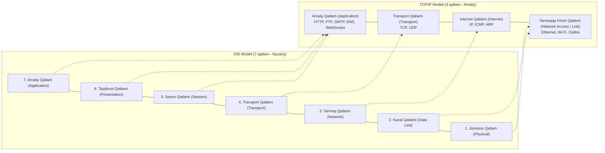
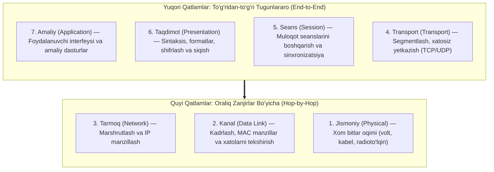
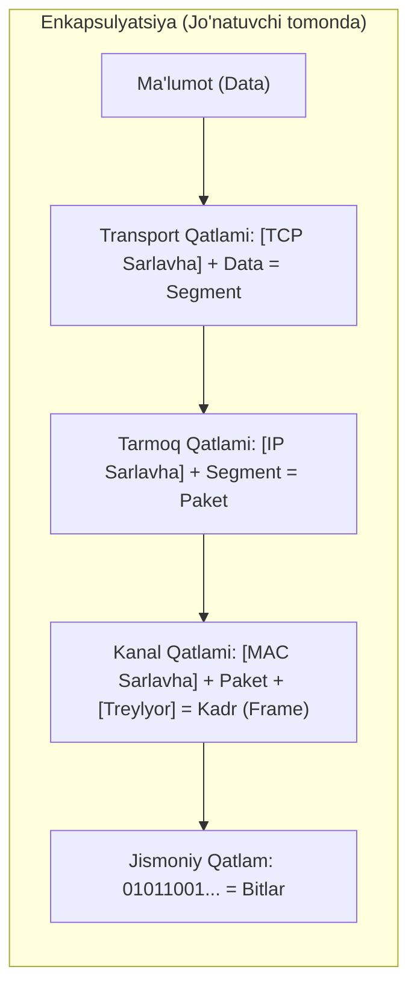

import { Callout } from 'nextra/components'

# OSI va TCP/IP Modellari (OSI and TCP/IP Reference Models)

Kompyuter tarmoqlarida ma'lumotlar almashinuvini standartlashtirish va tushunish uchun ikkita asosiy etalon model mavjud: **OSI (Open Systems Interconnection)** va **TCP/IP** modellari.

Qiziqarli tomoni shundaki:
- **OSI modeli:** U bilan birga ishlab chiqilgan protokollar bugungi kunda deyarli ishlatilmaydi, biroq modelning o'zi (7 qatlamli tuzilma) butun dunyo bo'ylab tarmoq arxitekturasini o'rganish va muammolarni bartaraf etishda (*troubleshooting*) eng mukammal nazariy qo'llanma bo'lib qolmoqda.
- **TCP/IP modeli:** Nazariy jihatdan kamchiliklarga ega bo'lsa-da, uning protokollari (IP, TCP, UDP, HTTP va boshqalar) zamonaviy global Internetning amaliy va o'zgarmas asosini tashkil etadi.

---

## 1. Modellar Qiyosi (OSI vs TCP/IP Mapping)

Quyidagi diagrammada 7 qatlamli OSI modeli va 4 qatlamli TCP/IP modelining o'zaro muvofiqligi hamda ma'lumotlar birliklari (PDU) tasvirlangan:

---

## 2. OSI Etalon Modeli (Open Systems Interconnection)

Ushbu model Xalqaro Standartlashtirish Tashkiloti (**ISO**) tomonidan ishlab chiqilgan bo'lib, o'zaro muloqotga ochiq bo'lgan tizimlar (*Open Systems*) uchun xalqaro standart yaratish yo'lidagi birinchi qadam bo'ldi (Day va Zimmerman, 1983; 1995-yilda qayta ko'rib chiqilgan).

### Nega Aynan 7 Qatlam?
Modelni yaratishda quyidagi fundamental tamoyillarga tayanilgan:
1. Har bir alohida abstraksiya darajasi uchun yangi qatlam yaratilishi lozim;
2. Har bir qatlam qat'iy belgilangan funksiyani bajarishi kerak;
3. Qatlamlararo interfeyslar orqali o'tadigan ma'lumotlar oqimi minimal bo'lishi shart;
4. Qatlamlar soni arxitektura haddan tashqari og'irlashib ketmaydigan, shu bilan birga turli vazifalar bitta qatlamga aralashib ketmaydigan darajada maqbul (7 ta) bo'lishi zarur.

---

### OSI Qatlamlari (Pastdan Yuqoriga)

#### 1. Jismoniy Qatlam (Physical Layer)
Aloqa kanali orqali **xom bitlar oqimini (0 va 1)** jismonan uzatish bilan shug'ullanadi.
- **Asosiy savollar:** 1 va 0 ni ifodalash uchun qanday kuchlanish (volt) ishlatiladi? Bitta bit qancha mikrosekund davom etadi? Bir vaqtning o'zida ikki tomonga ma'lumot uzatish mumkinmi (Full Duplex)? Kabelda nechta sim bor va ularning har biri qanday vazifani bajaradi?
- **Uskunalar va vositalar:** Burama juftlik (RJ-45), optik tola, koaksial kabel, radioto'lqinlar (Wi-Fi antennasi), xablar (Hub).

#### 2. Kanal Qatlami (Data Link Layer)
Jismoniy qatlamdagi xom bitlarni ishonchli, xatolardan xoli bo'lgan ma'lumotlar bloklariga — **kadrlarga (Frames)** ajratadi (odatda bir necha yuzdan bir necha ming baytgacha).
- **Asosiy vazifalari:** Kadrlarni ketma-ket uzatish, qabul qiluvchidan tasdiqlovchi kadrlar (ACK) olish, xatolarni aniqlash (CRC) va yuqori qatlamlardan yashirish.
- **Oqim nazorati (Flow Control):** Tezkor jo'natuvchi sekin qabul qiluvchining buferini to'ldirib yubormasligi uchun tezlikni jilovlash (*throttling*) mexanizmini qo'llaydi.
- **MAC quyi qatlami:** Umumiy simsiz yoki ko'p nuqtali kanallarda to'qnashuvlarni (kolliziyalarni) oldini olish va kanalga navbat bilan kirishni boshqaradi.

#### 3. Tarmoq Qatlami (Network Layer)
Quyi tarmoqlar (subnets) ishini va paketlarni manbadan manzilga yetkazish yo'llarini — **marshrutlashni (Routing)** boshqaradi.
- **Marshrutlash turlari:** Statik (jadvallar orqali) yoki dinamik (tarmoq tiqilinchlari va nosozliklarni chetlab o'tish uchun har bir paket alohida hisoblanadi).
- **Turli tarmoqlarni bog'lash:** Manzillash tizimi, ruxsat etilgan paket hajmi (MTU) va protokollari har xil bo'lgan tarmoqlarni o'zaro muvofiqlashtiradi.
- **Protokollar va uskunalar:** IP (IPv4, IPv6), ICMP, marshrutizatorlar (Router).

#### 4. Transport Qatlami (Transport Layer)
Ma'lumotlarni seans qatlamidan qabul qilib, kerak bo'lsa kichik bo'laklarga (**segmentlarga**) ajratadi va ularni manzilga to'g'ri ketma-ketlikda, butun holda yetib borishini ta'minlaydi.
- **Haqiqiy "End-to-End" qatlam:** 1, 2 va 3-qatlamlar oraliq zanjir (har bir qo'shni router orqali) sifatida ishlasa, transport qatlami to'g'ridan-to'g'ri jo'natuvchi kompyuterdagi dasturni qabul qiluvchi kompyuterdagi dastur bilan bog'laydi.
- **Xizmat turlari:** Kafolatlangan, xatosiz kanal (TCP) yoki tezkor, tartibni kafolatlamaydigan uzatish (UDP).

#### 5. Seans Qatlami (Session Layer)
Turli kompyuterlardagi foydalanuvchilar va dasturlar o'rtasida muloqot seanslarini o'rnatish, boshqarish va tugatish imkonini beradi.
- **Vazifalari:** Muloqot tartibini boshqarish (navbat bilan yoki bir vaqtda gapirish), tokenlar boshqaruvi (bir vaqtda faqat bitta tizim kritik amalni bajarishi uchun) hamda **sinxronizatsiya** (uzoq fayllarni uzatishda oraliq nazorat belgilarini qo'yish, uzilish bo'lsa butun faylni boshidan emas, o'sha belgidan davom ettirish).

#### 6. Taqdimot Qatlami (Presentation Layer)
Faqat bitlarni uzatish bilan cheklanmay, uzatilayotgan ma'lumotlarning **sintaksisi va semantikasiga** javob beradi.
- Har xil ichki tuzilishga va belgilar kodirovkasiga ega kompyuterlar o'rtasida ma'lumotlarni standart umumiy formatga o'giradi.
- Shifrlash (SSL/TLS), ma'lumotlarni siqish (Gzip) va formatlash (JSON, XML) aynan shu qatlamga tegishlidir.

#### 7. Amaliy Qatlam (Application Layer)
Foydalanuvchi va amaliy dasturlar tarmoq xizmatlaridan foydalanishi uchun zarur bo'lgan barcha yuqori darajadagi protokollarni o'z ichiga oladi:
- **HTTP / HTTPS:** Veb-sahifalarni ko'rish;
- **FTP / SFTP:** Fayllarni uzatish;
- **SMTP / IMAP / POP3:** Elektron pochta;
- **DNS:** Domen nomlarini IP-manzillarga aylantirish.

---

## 3. TCP/IP Etalon Modeli

TCP/IP modeli zamonaviy internetning "bobosi" bo'lgan **ARPANET** tadqiqot tarmog'ida yaratilgan (Vint Serf va Bob Kan, 1974; Braden, 1989).

### Yaratilish Tarixi va Asosiy Talablar:
AQSh Mudofaa Vazirligi (DoD) tomonidan moliyalashtirilgan ushbu loyihada ikkita o'ta muhim talab bor edi:
1. **Turli tarmoqlarni birlashtirish:** Telefon liniyalari, radiokanallar va sun'iy yo'ldosh tarmoqlarini yagona global arxitekturaga bog'lash.
2. **Yashovchanlik va nosozlikka chidamlilik (*Survivability*):** Agar oraliqdagi routerlar, kabellar yoki aloqa tugunlari kutilmaganda portlatib yuborilsa ham, jo'natuvchi va qabul qiluvchi mashinalar ishlab turgan ekan, aloqa to'xtamasligi va paketlar muqobil aylanma yo'llar orqali manzilga yetib borishi shart edi.

---

### TCP/IP ning 4 ta Qatlami:

#### 1. Tarmoqqa Kirish Qatlami (Link / Network Access Layer)
Paketli kommutatsiyaning eng quyi qatlami bo'lib, qurilmaning jismoniy tarmoq uzatish kanallariga (Ethernet, ketma-ket ulanishlar, Wi-Fi) ulanish interfeysini tavsiflaydi.

#### 2. Internet Qatlami (Internet Layer)
Butun arxitekturaning poydevori bo'lib, OSI modelining tarmoq qatlamiga mos keladi.
- **Vazifasi:** Har qanday kompyuterga paketlarni istalgan tarmoqqa yuborish va ularning bir-biridan mustaqil ravishda manzilga yetib borishini ta'minlash. Paketlar yo'lda turli marshrutlardan o'tib, yuborilgan tartibidan butunlay boshqacha tartibda yetib kelishi mumkin.
- **Pochta Tizimi Analogiyasi:** Siz xalqaro xatni biron davlatdagi pochta qutisiga tashlaysiz. Xat oraliqda qaysi tranzit saralash markazlaridan o'tgani sizga qorong'u, har bir davlatning o'z qoidalari bor, ammo yakunda xat manzilga yetib boradi.
- **Asosiy protokollar:** **IP (Internet Protocol)** va **ICMP (Internet Control Message Protocol)**.

#### 3. Transport Qatlami (Transport Layer)
Jo'natuvchi va qabul qiluvchi o'rtasidagi so'nggi nuqtalar muloqotini ta'minlaydi. Bu yerda ikkita asosiy protokol mavjud:
- **TCP (Transmission Control Protocol):** Ishonchli, ulanish o'rnatuvchi (*connection-oriented*) protokol. Baytlar oqimini xatosiz, yo'qotishlarsiz va yuborilgan tartibda yetkazilishini 100% kafolatlaydi hamda oqimni nazorat qiladi.
- **UDP (User Datagram Protocol):** Ishonchsiz, ulanishsiz (*connectionless*) protokol. Paket yetib borganini tekshirib o'tirmaydi, lekin minimal kechikish va maksimal tezlik beradi (jonli ovoz, video qo'ng'iroqlar, DNS).

#### 4. Amaliy Qatlam (Application Layer)
TCP/IP modelida seans va taqdimot qatlamlari kiritilmagan, chunki amaliyot shuni ko'rsatdiki, ko'pchilik ilovalarga bu qatlamlar alohida kerak emas — agar kerak bo'lsa, dasturchi uni ilovaning o'zida yozib ketadi. Amaliy qatlam barcha yuqori protokollarni birlashtiradi: **HTTP, FTP, SMTP, DNS, RTP, TELNET, SSH**.

---

## 4. Ma'lumotlarning Enkapsulyatsiyasi (Encapsulation Process)

Foydalanuvchi ma'lumoti tarmoq orqali yuborilayotganda yuqori qatlamdan pastki qatlamga tushadi va har bir bosqichda unga o'ziga xos sarlavha (Header) biriktiriladi. Qabul qiluvchi tomonda esa teskari jarayon — dekapsulyatsiya sodir bo'ladi:

| Qatlam | Ma'lumot Birligi (PDU) | Qo'shiladigan Sarlavha | Misol Protokollar |
| :--- | :--- | :--- | :--- |
| **Amaliy** | Data (Xabar) | Dastur ma'lumotlari | HTTP, SMTP, FTP |
| **Transport** | **Segment** (TCP) / **Datagram** (UDP) | Portlar (Source/Destination Port) | TCP, UDP |
| **Tarmoq** | **Paket (Packet)** | IP manzillar (Source/Destination IP) | IP, ICMP |
| **Kanal** | **Kadr (Frame)** | MAC manzillar (Source/Destination MAC) | Ethernet, Wi-Fi |
| **Jismoniy** | **Bitlar (Bits)** | Elektr signallari, fotonlar | Kabellar, radio |

---

## 5. QA Muhandisi Uchun Qatlamlar Bo'yicha Tahlil (Troubleshooting)

Tarmoqqa bog'liq nosozliklarni sinashda QA mutaxassisi xatolik aynan qaysi qatlamda ekanligini tezkor aniqlay olishi zarur:

1. **1-2 Qatlamlar (Jismoniy va Kanal):** Wi-Fi o'chganmi? Tarmoq kabeli ulanganmi? Kompyuter routerdan IP oldimi?
2. **3-Qatlam (Tarmoq):** Server IP-manzili ping berayaptimi? Paketlar yo'lda yo'qolyaptimi (`tracert`)? VPN/NAT sozlamalari to'g'rimi?
3. **4-Qatlam (Transport):** Serverda kerakli port ochiqmi (masalan, 443 yoki 8080)? Firewall yoki Antivirus ulanishni bloklamayaptimi?
4. **7-Qatlam (Amaliy):** Veb-server qanday HTTP status kodi qaytaryapti (`401 Unauthorized`, `404 Not Found`, `500 Internal Server Error`)? API sarlavhalari (Headers) va Body to'g'ri shakllanganmi?
