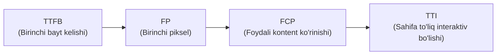
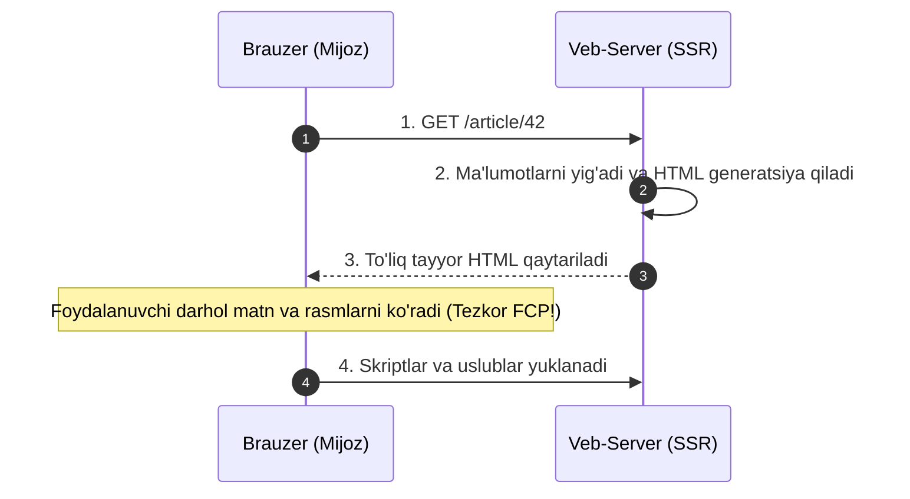
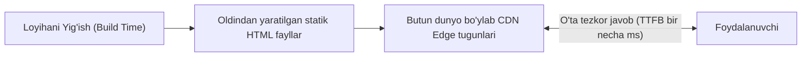
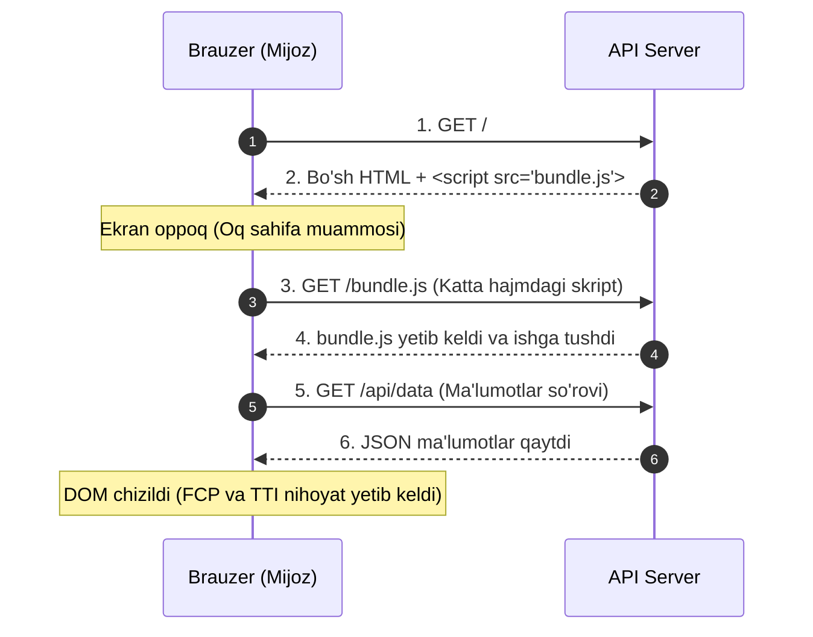
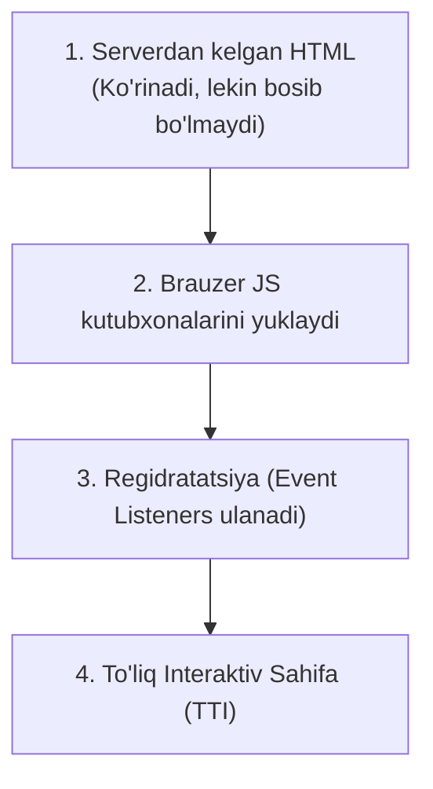
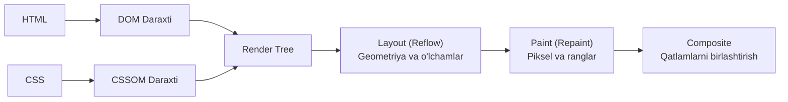
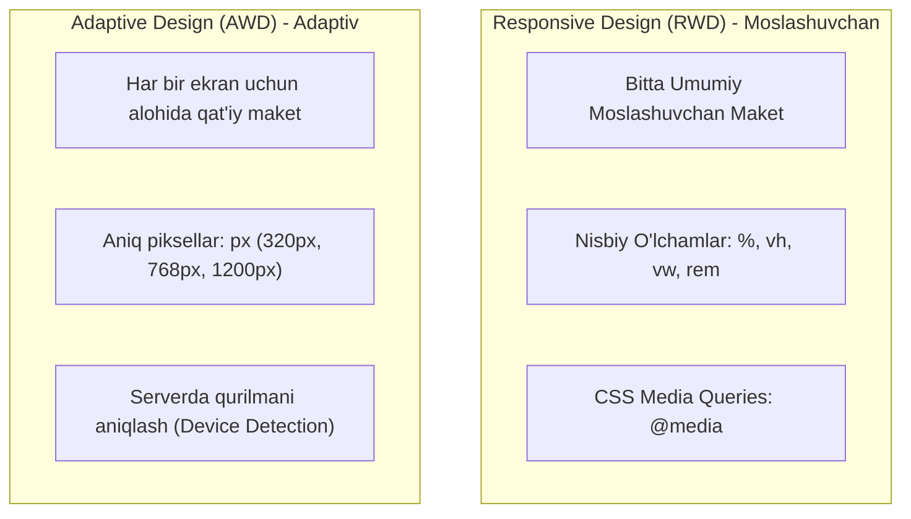

import { Callout } from 'nextra/components'

# Vebda Renderlash (Rendering on the Web)

Veb-ishlab chiquvchilar va dasturiy ta'minot arxitektorlari oldida turgan eng muhim qarorlardan biri — dastur mantiqi (logic) va foydalanuvchi interfeysini (**rendering**) qayerda amalga oshirishdir: **serverda**, **mijoz brauzerida** yoki **ikkalasining kombinatsiyasida**.

Har bir renderlash usuli unumdorlik, qidiruv tizimlari (SEO), server yuklamasi va foydalanuvchi tajribasiga (UX) turlicha ta'sir ko'rsatadi.

---

## 1. Asosiy Terminologiya va Metrikalar

Vebda renderlash usullarini taqqoslash uchun avvalo asosiy tushunchalar va yuklanish tezligini o'lchovchi xalqaro metriklarni bilish zarur:

### Asosiy Tushunchalar:
- **SSR (Server-Side Rendering):** Ilovaning HTML kodi foydalanuvchi so'roviga javoban bevosita serverda renderlanadi.
- **CSR (Client-Side Rendering):** Ilova butunlay foydalanuvchi brauzerida JavaScript va DOM yordamida chiziladi.
- **Rehydration (Regidratatsiya):** Serverdan tayyor kelgan statik HTML va DOM daraxtiga brauzerda JavaScript hodisa tinglovchilarini (event listeners) ulab, sahifani "jonlantirish" jarayoni.
- **Prerendering (Oldindan renderlash):** Build (yig'ish) jarayonida mijoz ilovasining boshlang'ich holatini statik HTML sifatida saqlab olish.

### Tezlik Metrikalari (Performance Metrics):
- **TTFB (Time to First Byte):** Foydalanuvchi havolani bosgan lahzadan to brauzerga serverdan birinchi bayt ma'lumot yetib kelguncha ketgan vaqt.
- **FP (First Paint):** Ekranda foydalanuvchiga birinchi marta biron bir piksel (masalan, oq fon o'rniga rang) ko'ringan payt.
- **FCP (First Contentful Paint):** So'ralgan asosiy kontent (maqola matni, rasm yoki navigatsiya paneli) ekranda paydo bo'lgan vaqt.
- **TTI (Time to Interactive):** Sahifa to'liq interaktiv holatga kelib, tugmalar, havolalar va kiritish maydonlari bosishlarga kechikishsiz javob bera boshlagan vaqt.

---

## 2. Serverda Renderlash (Server-Side Rendering — SSR)

SSR usulida foydalanuvchi biror sahifaga o'tganda, server real-vaqt rejimida barcha ma'lumotlar bazasi so'rovlarini bajaradi, shablonlarni birlashtiradi va to'liq tayyor **HTML hujjatini** brauzerga yuboradi.

### Afzalliklari:
1. **Tezkor FP va FCP:** Brauzer JavaScript yuklanishi va bajarilishini kutmasdan, tayyor HTML-ni birdaniga ko'rsatadi.
2. **Kuchsiz qurilmalarga mosligi:** Protsessorga yuk tushiradigan og'ir hisob-kitoblar serverda bajariladi, mijoz qurilmasi qizib ketmaydi yoki qotib qolmaydi.
3. **Mukammal SEO:** Qidiruv botlari (Googlebot, Yandex) hech qanday qiyinchiliksiz sahifa kontentini indekslaydi.

### Kamchiliklari:
- **Sekinroq TTFB:** Server har bir so'rov kelganda HTML-ni noldan yig'ishi kerak, bu esa birinchi bayt kutish vaqtini uzaytiradi.
- **Server CPU yuklamasi:** Minglab foydalanuvchilar bir vaqtda kirganda server protsessori sahifalarni render qilish bilan haddan tashqari band bo'lib qoladi.

> [!TIP] Gibrid Yondashuv (Netflix Misoli)
> Netflix o'zining deyarli o'zgarmas bo'lgan kirish sahifalarini (Landing pages) serverda render qiladi, ammo foydalanuvchi tizimga kirib videolarni ko'rish bo'limiga o'tganda kerak bo'ladigan og'ir JavaScript-ni orqa fonda oldindan (prefetching) yuklab oladi.

---

## 3. Statik Renderlash (Static Rendering / SSG)

Statik renderlash dasturni yig'ish (**Build time**) jarayonida amalga oshiriladi. Sayt foydalanuvchilarga taqdim etilishidan oldin har bir URL manzil uchun oldindan alohida `.html` fayllar generatsiya qilib qo'yiladi.

### Afzalliklari:
- **Barqaror va o'ta tez TTFB:** Server hech narsani hisoblab o'tirmaydi, tayyor faylni bir zumda uzatadi.
- **Edge-Caching va CDN:** Statik HTML fayllarni Cloudflare, Vercel yoki AWS CloudFront kabi global CDN tarmoqlariga joylashtirish mumkin.
- **Xavfsizlik va arzonlik:** Ma'lumotlar bazasi va server xotirasiga doimiy so'rovlar bo'lmagani sababli buzib kirish ehtimoli minimal.

### Cheklovlari:
- Har bir sahifa uchun oldindan HTML fayl yaratilishi shart. Agar saytda millionlab tovarlar bo'lsa yoki URL manzillarni oldindan bilib bo'lmasa, build jarayoni soatlab davom etishi mumkin.

### Statik Renderlash vs Oldindan Renderlash (Prerendering)
Ko'pincha bu ikki tushuncha adashtiriladi:
- **Statik Renderlash (SSG):** Sahifalar hatto mijozda JavaScript umuman bo'lmagan taqdirda ham to'liq ishlaydi (havolalar, matnlar ochiq).
- **Oldindan Renderlash (Prerendering):** SPA (Single Page Application) ning birinchi ko'rinishini tezlashtirish uchun faqat "qobiq" (shell) saqlab olinadi. Biroq sahifa to'laqonli ishlashi uchun baribir mijozda katta JS to'plami bajarilishi shart.

> [!NOTE] QA Sinov Usuli: "Disable JavaScript" Testi
> Saytingiz statikmi yoki prerenderlanganmi ekanini bilish uchun:
> 1. Brauzerda DevTools (`F12`) ni oching;
> 2. Sozlamalardan **Disable JavaScript** bandini yoqing va sahifani yangilang;
> 3. Agar saytning asosiy funksionalligi va o'qilishi saqlanib qolsa — bu **statik renderlash**; agar faqat o'lik qobiq ko'rinib, hech narsa bosilmasa — bu **oldindan renderlash**.

---

## 4. Mijoz Tomonida Renderlash (Client-Side Rendering — CSR)

CSR usulida server brauzerga deyarli bo'sh bo'lgan HTML shablonini (`

`) va katta JavaScript paketini (`bundle.js`) yuboradi. Brauzer ushbu skriptni yuklab olgach, DOM elementlarini o'zi mustaqil yaratadi va API-dan ma'lumotlarni so'rab oladi.

### CSR ning Kamchiliklari:
1. **Dastlabki yuklanishning sekinligi:** Katta JavaScript kutubxonalari (React, Vue, lodash) yuklanmaguncha foydalanuvchi bo'sh ekranni ko'rib turadi.
2. **Mobil qurilmalardagi qiyinchiliklar:** Mobil protsessorlar katta hajmdagi JS kodini tahlil qilish (parse) va kompilyatsiya qilishda qiynaladi, bu batareyani sarflaydi va qotishlarga olib keladi.

### CSR Optimizatsiyasi:
- **Kodni bo'lish (Code Splitting):** Butun dasturni bitta katta fayl qilib bermasdan, faqat joriy sahifaga kerakli bo'laklarni uzatish.
- **PRPL modeli:** **P**ush (muhim resurslarni uzatish), **R**ender (dastlabki marshrutni renderlash), **P**re-cache (qolganlarini orqa fonda keshga olish), **L**azy-load (kerak bo'lganda yuklash).
- **Application Shell:** Ilovaning asosi (header, menyu) keshlanadi, o'zgaruvchan qismlar esa dinamik yuklanadi.

---

## 5. SSR va CSR Ning Birlashuvi: Regidratatsiya (Rehydration)

Bu yondashuv zamonaviy Next.js, Nuxt va Angular Universal freymvorklarining negizidir. U server va mijozning kuchli tomonlarini birlashtirishga harakat qiladi:
1. Birinchi tashrifda server sahifani to'liq HTML qilib beradi (tezkor FCP).
2. Keyin brauzer orqa fonda JavaScript to'plamini yuklaydi va mavjud DOM daraxtiga hodisa tinglovchilarini bog'laydi (**Regidratatsiya**).
3. Shundan so'ng ilova an'anaviy tezkor SPA kabi ishlashni davom ettiradi.

### Regidratatsiyaning Asosiy Muammolari:

> [!WARNING] "Bitta Ilova Uchun Ikkita Narx To'lash"
> Regidratatsiya ishlashi uchun server nafaqat HTML interfeysini, balki shu interfeysni chizishda ishlatilgan barcha xom ma'lumotlarni ham HTML ichiga `<script>` teglari ko'rinishida serializatsiya qilib joylashtiradi (State serialization). Natijada HTML hajmi ikki barobar oshib ketadi.

### "G'alati Vodiy" (The Uncanny Valley) Muammosi
Foydalanuvchi sahifaga kiradi. Sahifa to'liq yuklangandek ko'rinadi (tugmalar, rasmlar joyida). Foydalanuvchi tugmani yoki menyuni bosadi, ammo hech narsa sodir bo'lmaydi! Chunki brauzer hali og'ir JavaScript-ni ishga tushirib, regidratatsiyani tugatmagan bo'ladi. Bu foydalanuvchida jiddiy asabiylashishni keltirib chiqaradi.

---

## 6. Ilg'or Renderlash Texnologiyalari

Regidratatsiyaning kamchiliklarini bartaraf etish uchun zamonaviy arxitekturalar quyidagi yechimlarni taklif qilmoqda:

### 1. Oqimli Server Renderlash (Streaming SSR)
Butun sahifani serverda to'liq generatsiya bo'lishini kutib o'tirmasdan, HTML bo'laklari (chunks) tayyor bo'lishi bilan brauzerga oqim sifatida uzatib boriladi (React `renderToPipeableStream`). Natijada foydalanuvchi sarlavha va yuklagichlarni birinchi millisekundlardayoq ko'radi.

### 2. Progressiv Regidratatsiya (Progressive Rehydration)
Sahifaning barcha komponentlarini bir vaqtda "jonlantirish" o'rniga, faqat foydalanuvchi ekranida turgan yoki birinchi navbatda bosilishi mumkin bo'lgan qismlari regidratatsiya qilinadi. Qolgan qismlari asosiy oqim (Main Thread) bo'shaganda jonlantiriladi.

### 3. Qisman Regidratatsiya (Partial Hydration / Islands Architecture)
Sahifaning 80% qismi butunlay statik HTML sifatida qoldiriladi va unga umuman JavaScript yuklanmaydi. Faqatgina o'ta dinamik bo'lgan kichik "orollar" (Islands — masalan, interaktiv savatcha yoki qidiruv paneli) alohida izolyatsiyalangan holda regidratatsiya qilinadi (Astro, Fresh).

### 4. Trizomorfik Renderlash (Trisomorphic Rendering)
Uchta vosita hamkorligi:
- Birinchi kirishda: **Server (Streaming SSR)**;
- Oflayn va keyingi o'tishlarda: **Service Worker**;
- Interaktivlik uchun: **Mijoz JS**.

---

## 7. Brauzer Ichida Renderlash Qanday Ishlaydi? (Rendering Pipeline)

Serverdan yoki mijozdan ma'lumot kelgach, brauzer dvigateli (Blink, Gecko, WebKit) quyidagi 5 bosqichli konveyer bo'yicha ekranda tasvir hosil qiladi:

1. **DOM (Document Object Model):** HTML teglari daraxtsimon obyektlarga aylantiriladi.
2. **CSSOM (CSS Object Model):** Barcha CSS qoidalari va uslublar tahlil qilinadi.
3. **Render Tree:** DOM va CSSOM birlashtiriladi. **Eslatma:** `display: none` bo'lgan yoki `<head>` ichidagi ko'rinmaydigan elementlar Render Tree-ga kirmaydi!
4. **Layout (Reflow):** Har bir ko'rinadigan elementning ekrandagi aniq o'lchamlari va koordinatalari piksellarda hisoblab chiqiladi.
5. **Paint & Composite:** Ranglar, chegaralar, matnlar va soyalar chiziladi hamda GPU qatlamlari birlashtirilib ekranga uzatiladi.

---

## 8. Moslashuvchan Veb-Dizayn: Responsive vs Adaptive (RWD vs AWD)

Sayt har xil o'lchamdagi ekranlarda (kompyuter, planshet, smartfon) chiroyli ko'rinishi uchun ikkita asosiy metodologiya qo'llaniladi:

| Xususiyat | Responsive Design (RWD) | Adaptive Design (AWD) |
| :--- | :--- | :--- |
| **Qurilmani aniqlash** | Brauzerning o'zida (CSS media query) | Serverda yoki brauzerda skript orqali |
| **O'lcham birliklari** | Moslashuvchan foizlar (`%`, `flex`, `grid`) | Qat'iy o'lchamdagi piksellar (`px`) |
| **URL manzili** | Barcha qurilmalar uchun bitta yagona URL | Odatda bitta URL, ba'zan mobil subdomen (`m.site.uz`) |
| **Afzalligi** | Loyihani qo'llab-quvvatlash oson, yagona kod bazasi | Har bir qurilma uchun maksimal optimallashtirilgan tezlik |
| **Kamchiligi** | Katta rasmlar yuklanishi sababli mobilda sekinlashishi mumkin | Bir nechta alohida maketlarni ishlab chiqish va sinash qimmat |

---

## 9. Renderlash Strategiyalarining Taqqoslama Jadvali

| Strategiya | TTFB | FCP | TTI | SEO | Server Yuki |
| :--- | :--- | :--- | :--- | :--- | :--- |
| **SSR (Server)** | O'rtacha / Sekin | Tez | Tez | A'lo | Yuqori |
| **SSG (Statik)** | O'ta tez | O'ta tez | O'ta tez | A'lo | Minimal (CDN) |
| **CSR (Mijoz)** | Tez | Sekin | Sekin | O'rtacha / Qiyin | Minimal (Faqat API) |
| **SSR + Regidratatsiya** | O'rtacha | Tez | O'rtacha / Sekin | A'lo | Yuqori |
| **Islands / Qisman** | O'ta tez | O'ta tez | O'ta tez | A'lo | Minimal / O'rtacha |
