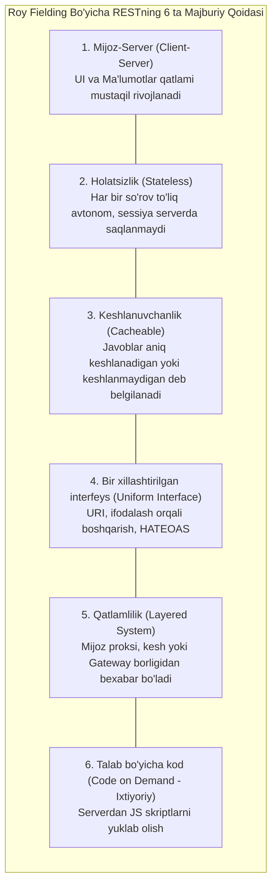
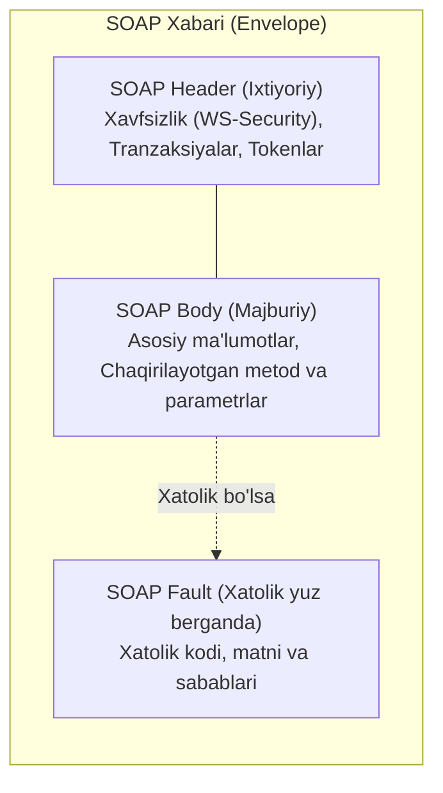
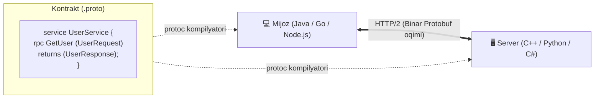

import { Callout } from 'nextra/components'

# REST, SOAP va gRPC (REST / SOAP / gRPC)

Zamonaviy dasturiy ta'minotda turli tizimlar va mikroservislarning o'zaro muloqotini tashkil etish uchun uchta asosiy yondashuv qo'llaniladi: **REST**, **SOAP** va **gRPC**.

Ularning har biri o'zining arxitektura tamoyillari, ma'lumotlar formatlari, afzalliklari va qo'llanilish sohalariga ega:
- **REST:** Global Internetda eng ommalashgan, o'rganish va sinash oson bo'lgan arxitektura uslubi (JSON).
- **SOAP:** Qat'iy shartnomalar, xavfsizlik va tranzaksiyalar talab etiladigan bank va korporativ soha protokoli (XML).
- **gRPC:** Google tomonidan yaratilgan, mikroservislararo aloqa uchun mo'ljallangan ultra tezkor binar protokol (Protocol Buffers + HTTP/2).

---

## 1. REST (Representational State Transfer)

**REST** — tarmoqdagi taqsimlangan gipermedia tizimlarining o'zaro hamkorligi uchun mo'ljallangan **arxitektura uslubidir** (2000-yilda Roy Fielding tomonidan fanga kiritilgan).

REST alohida protokol yoki standart emas — bu dasturchi server kodini tizimlar oson integratsiya bo'ladigan va gorizontal masshtablana oladigan qilib loyihalashi uchun ishlab chiqilgan **qoidalar va cheklovlar to'plamidir**. Ushbu qoidalarni buzmagan holda qurilgan tizimlar **RESTful** tizimlar deb ataladi.

### Roy Fielding Bo'yicha RESTning 6 ta Qoidasi:

1. **Mijoz-Server (Client-Server):** Foydalanuvchi interfeysi (Frontend) serverdagi ma'lumotlarni saqlash qatlamidan (Backend) butunlay ajratilgan bo'lishi shart. Bu mijoz interfeysini turli platformalarga (Web, iOS, Android) oson ko'chirish imkonini beradi.
2. **Holatsizlik (Statelessness):** Mijozning holati serverda saqlanmaydi. Har bir so'rov server uni bajarishi uchun zarur bo'lgan barcha ma'lumotlarni (autentifikatsiya tokeni, parametrlar) o'zida to'liq mujassam etishi shart.
3. **Keshlanuvchanlik (Cacheable):** Tarmoq yuklamasini kamaytirish uchun server javoblari keshlanadigan (`Cache-Control`) yoki keshlanmaydigan deb belgilanishi shart.
4. **Bir xillashtirilgan interfeys (Uniform Interface):** RESTning eng asosiy poydevori bo'lib, quyidagi 4 ta talabni o'z ichiga oladi:
   - **Resurslarni identifikatsiyalash:** Har bir resurs o'z unikal URI manziliga ega bo'ladi (`/api/v1/users/42`).
   - **Ifodalash orqali boshqarish:** Mijoz resurs ma'lumotlariga (masalan, JSON ko'rinishida) ega bo'lsa, uni o'zgartirish yoki o'chirish uchun yetarli ma'lumotga ega hisoblanadi.
   - **O'zini-o'zi tavsiflovchi xabarlar:** Xabar qanday ochilishi va o'qilishi kerakligi sarlavhalarda (MIME tiplar, `Content-Type: application/json`) aniq ko'rsatiladi.
   - **HATEOAS (Hypermedia As The Engine Of Application State):** Server qaytargan javob ichida mijoz keyingi qadamda qaysi amallarni bajara olishi uchun dinamik giperhavolalar (`links`) taqdim etiladi.
5. **Qatlamli tizim (Layered System):** Mijoz to'g'ridan-to'g'ri yakuniy server bilan gaplashyaptimi yoki oraliqdagi yuklama taqsimlovchi (Load Balancer), kesh serveri (CDN) yoxud API Gateway orqalimi — buni bilishi shart emas.
6. **Talab bo'yicha kod (Code on Demand — Ixtiyoriy):** Server mijozning imkoniyatlarini kengaytirish uchun unga bajariluvchi kod (masalan, JavaScript appletlari) jo'natishi mumkin.

---

## 2. SOAP (Simple Object Access Protocol)

**SOAP** — taqsimlangan tizimlarda qat'iy tuzilmaga ega xabarlarni almashish uchun mo'ljallangan **rasmiy protokoldir** (W3C standarti). SOAP dastlab XML-RPC kengaytmasi sifatida paydo bo'lgan va ma'lumotlarni faqat **XML** formatida uzatadi.

SOAP har qanday transport protokoli (HTTP, HTTPS, SMTP, FTP) ustida ishlay oladi, biroq amaliyotda 99% hollarda HTTP ustida qo'llaniladi.

### SOAP Xabarining 4 Qismi:
1. **Envelope (Konvert):** Barcha SOAP xabarini o'rab turuvchi ildiz XML tegi bo'lib, xabarning qoidalar to'plami va nomlar fazosini (*namespace*) belgilaydi.
2. **Header (Sarlavha):** Ixtiyoriy qism bo'lib, autentifikatsiya, raqamli imzo, shifrlash (*WS-Security*) va tarmoq marshrutlash atributlarini saqlaydi.
3. **Body (Tana):** So'rov yoki javobning haqiqiy ma'lumotlarini o'z ichiga oluvchi majburiy qism.
4. **Fault (Xatolik):** Serverda xatolik yuz berganda avtomatik shakllantiriluvchi maxsus xato bloki.

### WSDL va XSD Nima?
- **WSDL (Web Services Description Language):** XML formatida yozilgan rasmiy texnik shartnoma (kontrakt). U servisning manzili, unda mavjud funksiyalar (operatsiyalar), kiruvchi va chiquvchi parametrlar haqida to'liq ma'lumot beradi. WSDL yordamida **SoapUI** kabi dasturlar sinov so'rovlarini avtomatik generatsiya qiladi.
- **XSD (XML Schema Definition):** XML hujjatning tuzilishi, elementlar ketma-ketligi va ma'lumotlar turlarini (`string`, `integer`, `dateTime`) qat'iy tekshiruvchi sxema tili.

---

## 3. gRPC (Google Remote Procedure Call)

**gRPC** — Google tomonidan yaratilgan, yuqori unumdorlikka ega, ochiq manbali masofaviy protseduralarni chaqirish (RPC) freymvorkidir.

REST ma'lumotlarni matnli JSON formatida uzatsa, gRPC ma'lumotlarni **Protocol Buffers (Protobuf)** yordamida siqilgan binar shaklda uzatadi va transport sifatida **HTTP/2** dan foydalanadi.

### gRPC ning Asosiy Afzalliklari:
1. **Protocol Buffers (Protobuf):** Tildan mustaqil IDL (Interface Definition Language). `.proto` fayl yoziladi va `protoc` kompilyatori orqali Java, Python, Go, C# tillariga tayyor kod klasslari generatsiya qilinadi.
2. **HTTP/2 Transporti:** Bitta TCP ulanish ichida bir vaqtning o'zida yuzlab so'rovlarni parallel uzatish (Multiplexing) va sarlavhalarni siqish imkoniyati.
3. **Ikki tomonlama oqim (Bi-directional Streaming):** Mijoz va server bir vaqtning o'zida uzluksiz ma'lumotlar oqimini almashishi mumkin.
4. **Ultra yuqori tezlik:** JSON'ni matndan obyektga o'girish (serialization/deserialization) o'rniga binar kod bilan ishlagani uchun REST'dan **5–10 barobar tezroq** ishlaydi.

---

## 4. REST vs SOAP vs gRPC: Katta Qiyosiy Tahlil

| Mezon | REST | SOAP | gRPC |
| :--- | :--- | :--- | :--- |
| **Mohiyati** | Arxitektura uslubi | Qat'iy Protokol | RPC Freymvorki |
| **Ma'lumot formati** | JSON, XML, Matn | Faqat XML | Protocol Buffers (Binar) |
| **Transport protokoli** | HTTP / HTTPS (1.1 yoki 2) | HTTP, SMTP, TCP | Faqat HTTP/2 |
| **Shartnoma (Contract)** | OpenAPI / Swagger (Tavsiya) | WSDL (Majburiy) | `.proto` fayl (Majburiy) |
| **Bog'liqlik (Coupling)** | Erkin bog'langan (Loosely) | Qat'iy bog'langan (Tightly) | Qat'iy bog'langan (Tightly) |
| **Unumdorlik va tezlik** | Yaxshi / O'rtacha | Past (Og'ir XML) | O'ta yuqori (Binar + HTTP/2) |
| **Brauzer qo'llab-quvvatlashi** | 100% mukammal | Cheklangan | gRPC-Web talab etiladi |
| **Asosiy qo'llanilish sohasi** | Public Web va Mobil APIlar | Bank, Moliya, Sug'urta | Ichki Mikroservislararo aloqa |

---

## 5. QA Muhandisi Uchun Sinov Strategiyalari

1. **REST API Sinovlari:**
   - **Vositalar:** Postman, Insomnia, DevTools Network.
   - **Nimalar tekshiriladi:** HTTP status kodlari (`200`, `201`, `400`, `404`, `500`), JSON javob tanasining (Schema validation) to'g'riligi, CRUD va Idempotentlik qoidalari.
2. **SOAP Sinovlari:**
   - **Vositalar:** SoapUI, ReadyAPI.
   - **Nimalar tekshiriladi:** WSDL va XSD sxema validatsiyasi, SOAP Fault xabarlarining to'g'ri qaytishi, WS-Security raqamli imzolarining ishlashi.
3. **gRPC Sinovlari:**
   - **Vositalar:** BloomRPC, Postman gRPC, `grpcurl`.
   - **Nimalar tekshiriladi:** `.proto` shartnomasiga mos kelish, binar ma'lumotlarning to'g'ri o'qilishi, oqimli (streaming) ma'lumotlar uzatish barqarorligi.
