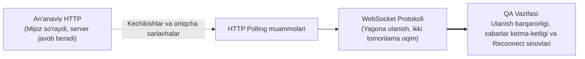

import { Cards, Callout } from 'nextra/components'

# Soket va Veb-soket (Socket / WebSocket)

Haqiqiy vaqt rejimida (**Real-Time**) ishlovchi dasturlar, tezkor xabarlashuv tizimlari (chatlar), onlayn o'yinlar va moliya birjalari rivojlanishi bilan an'anaviy HTTP protokoli yetarli bo'lmay qoldi.

Serverdan yangi ma'lumotlarni kutib o'tirmasdan, ikki tomonlama to'liq dupleks (*Full-Duplex*) aloqa o'rnatish uchun **Tarmoq Soketlari** va **WebSocket** texnologiyalari ishlab chiqildi.

---

## ⚡ Bo'lim Mundarijasi

Ushbu modulda siz soketlarning ishlash tamoyillari, WebSocket protokoli arxitekturasi hamda mijoz tomonida veb-soketlarni amaliy sinash uslublarini o'rganasiz:

<Cards num={2}>
  <Cards.Card
    title="🔌 Soket va Veb-soket Asoslari"
    href="/docs/networks/socket-websocket/socket-websocket"
  >
    Tarmoq soketlari (IP + Port), HTTP Polling cheklovlari, WebSocket Handshake (101 Switching Protocols), to'liq dupleks aloqa va HTTP vs WebSocket qiyosi.
  </Cards.Card>
  <Cards.Card
    title="🧪 Mijozlarda Veb-soketlarni Sinash"
    href="/docs/networks/socket-websocket/testing-websockets-on-clients"
  >
    Brauzer DevTools (WS tab), Postman orqali WebSocket testlash, reconnect mantig'i, Heartbeat (Ping-Pong), xavfsizlik va QA sinov ssenariylari.
  </Cards.Card>
</Cards>

---

## Nega Bu Mavzu QA Uchun Muhim?

<Callout type="info">
Oddiy HTTP so'rovlarida so'rov jo'natiladi, javob olinadi va TCP ulanish yopiladi. WebSocket'da esa bitta TCP ulanish doimiy ochiq qoladi va server ham istalgan paytda mijozga so'rovsiz ma'lumot jo'nata oladi. Ushbu xususiyat sinov jarayonida alohida yondashuv va yangi vositalarni talab qiladi.
</Callout>
