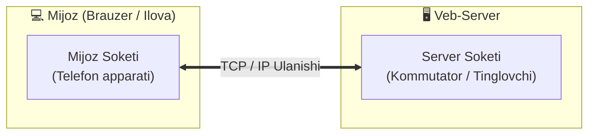
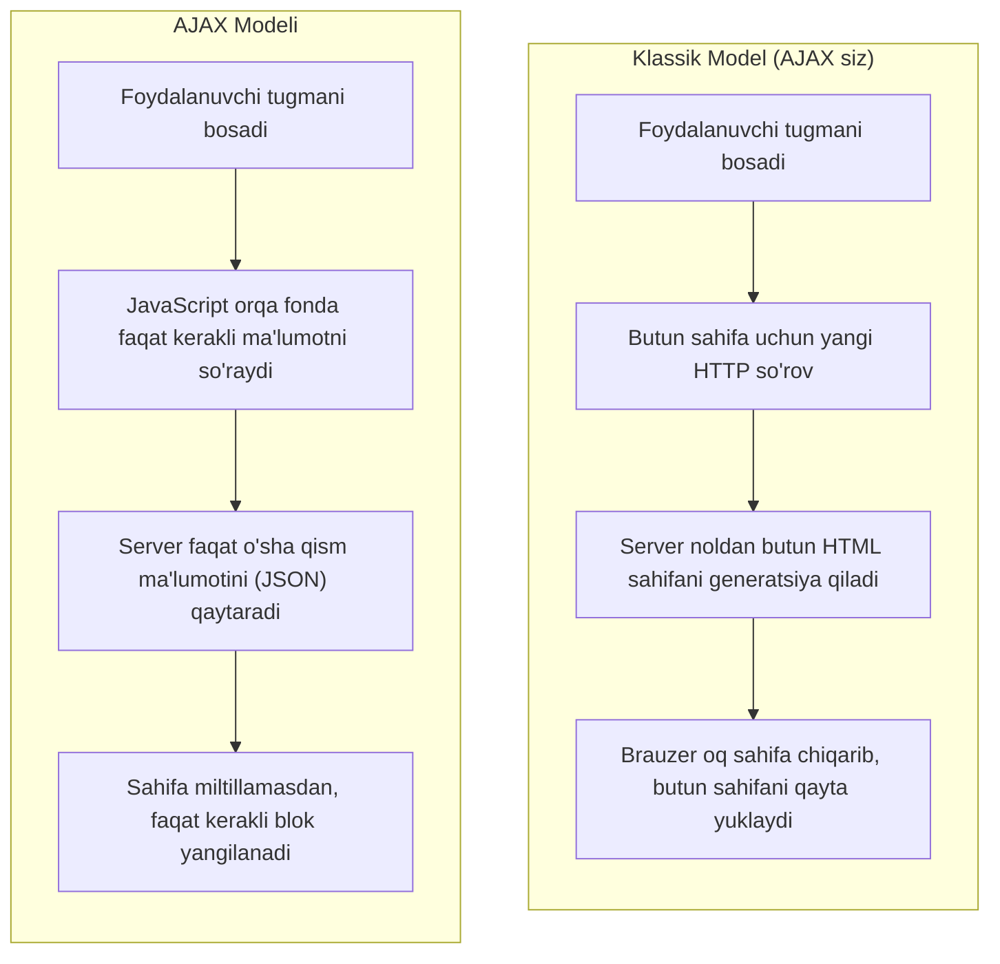

import { Callout } from 'nextra/components'

# Soket va Veb-soket (Socket / WebSocket)

Dasturiy ta'minotda ma'lumotlar almashinuvi va real-vaqt (Real-Time) texnologiyalari haqida so'z ketganda, ko'pincha **Soket**, **WebSocket**, **Socket.IO** va **AJAX** tushunchalari tilga olinadi. Ushbu texnologiyalar o'rtasidagi fundamental farqlar, ularning ishlash tamoyillari va tarmoqdagi roli quyida batafsil tahlil qilinadi.

---

## 1. Soket Nima? (What is a Socket?)

**Soket (Socket — "raz'yom" yoki "uya")** — jarayonlar (*processes*) o'rtasida ma'lumot almashinuvini ta'minlovchi dasturiy interfeys bo'lib, tarmoq ulanishining **oxirgi nuqtasi (Endpoint)** hisoblanadi. Muloqot qiluvchi jarayonlar bitta kompyuter ichida ham, tarmoq orqali bog'langan turli kompyuterlarda ham ishlashi mumkin.



### Mijoz va Server Soketlari Farqi:
- **Mijoz soketi (Client socket):** Telefon tarmog'idagi oddiy so'nggi telefon apparatiga o'xshaydi. Mijoz dasturi (masalan, brauzer) faqat mijoz soketidan foydalanadi va ulanishni birinchi bo'lib boshlaydi.
- **Server soketi (Server socket / Listener):** Telefon stansiyasi kommutatoriga o'xshaydi. U bitta aniq portda yangi qo'ng'iroqlarni (ulanishlarni) kutib turadi. Veb-server bir vaqtning o'zida ham tinglovchi server soketlaridan, ham ulangan har bir mijoz uchun alohida mijoz soketlaridan foydalanadi.

---

## 2. Soketlarning Ishlash Tamoyillari

TCP/IP tarmog'ida kompyuterlararo muloqot qilish uchun **IP-manzil** va **Port raqami** ishlatiladi:
- **IP-manzil:** Qurilmani tarmoqda aniqlaydi (IPv4 da 32-bitli, IPv6 da 128-bitli).
- **Port raqami:** Kompyuter ichidagi aniq dasturni belgilovchi `0` dan `65535` gacha bo'lgan butun son.

Mantiqiy jihatdan soket aynan mana shu juftlik orqali ifodalanadi:

```text
Soket = IP-manzil + Port raqami
```

Ma'lumot almashinuvi jarayonida har doim **ikkita soket** qatnashadi:
1. **Jo'natuvchi soketi:** Masalan, mijozning tasodifiy porti — `192.168.1.50:52410`
2. **Qabul qiluvchi soketi:** Masalan, serverning HTTP porti — `194.106.118.30:80`

### Tinglovchi Soket va UNIX Soketlari:
- Server jarayoni **"tinglovchi" (listening)** soket yaratadi va uni operatsion tizim portiga biriktiradi (UNIX tizimlarida 1024 dan kichik portlar faqat administrator/root huquqi bilan ochiladi). Tinglovchi jarayon yangi ulanish kelguncha kutish holatida (*wait loop*) uxlaydi va yangi ulanish kelishi bilan uyg'onadi.
- **INET soketlari:** Tarmoq orqali tashqi aloqa uchun ishlatiladi va port raqamini talab qiladi.
- **UNIX Domain soketlari:** Faqat bitta operatsion tizim ichidagi lokal jarayonlar o'rtasida fayl tizimi deskriptori orqali o'ta tezkor ma'lumot almashish uchun xizmat qiladi (tarmoq kartasi va port ishlatilmaydi).

---

## 3. WebSocket Protokoli

**WebSocket** (RFC 6455) — TCP ulanishi ustida ishlaydigan, brauzer va veb-server o'rtasida real-vaqt rejimida xabarlar almashish uchun mo'ljallangan mustaqil aloqa protokoldir.

W3C va IETF tomonidan standartlashtirilgan ushbu protokol brauzer va veb-sayt o'rtasida uzluksiz, ikki tomonlama (**Full-Duplex**) jonli aloqa o'rnatish imkonini beradi.

---

## 4. Socket va WebSocket O'rtasidagi Farq

Ko'pincha yangi muhandislar bu ikkisini adashtirishadi, biroq ular mutlaqo boshqa-boshqa tushunchalardir:

1. **Soket (Socket):** Bu tarmoqdagi so'nggi ulanish nuqtasi (`IP:Port`) bo'lib, deyarli barcha protokollar (HTTP, FTP, SSH, SMTP va WebSocket ham) tarmoq orqali ulanish uchun oddiy tarmoq soketlaridan foydalanadi.
2. **WebSocket:** Bu soket emas, balki oddiy TCP soketi ustida ishlovchi **amaliy protokoldir**.

```text
ws://127.0.0.1:15000
```
- `ws://` — bu yerda ma'lumot almashinuvi **WebSocket protokoli** orqali bo'lishini ko'rsatadi.
- `127.0.0.1:15000` — bu ulanish amalga oshirilayotgan **tarmoq soketidir** (IP + Port).

### WebSocket'ning HTTP'dan Farqi:
WebSocket protokoli HTTP'ga umuman o'xshamaydi. Uning HTTP bilan yagona o'xshash joyi — eng birinchi ulanish so'rovi (**Handshake**) hisoblanadi. Brauzer serverning WebSocket'ni qo'llab-quvvatlashini bilish uchun oddiy HTTP GET orqali `Upgrade: websocket` so'rovini yuboradi.

Ulanish o'rnatilgach (`101 Switching Protocols`), HTTP butunlay to'xtatiladi va sof, ortiqcha sarlavhalarsiz yengil WebSocket freymlari uzatiladi. Aynan ortiqcha sarlavhalarning yo'qligi WebSocket'ga maksimal tezlikni taqdim etadi.

---

## 5. WebSocket va Socket.IO O'rtasidagi Farq

| Mezon | WebSocket | Socket.IO |
| :--- | :--- | :--- |
| **Mohiyati** | Rasmiy tarmoq protokoli (W3C / IETF standarti) | JavaScript kutubxonasi (Node.js va Brauzer uchun) |
| **Zaxira usullari (Fallback)** | Faqat WebSocket qo'llab-quvvatlansa ishlaydi | WebSocket bo'lmasa, avtomatik AJAX Long Polling yoki HTTP Streaming'ga o'tadi |
| **Avtomatik qayta ulanish** | Qo'lda kod yozish kerak | Ichki o'rnatilgan tayyor funksiya (Auto-reconnect) |
| **Xonalar (Rooms / Channels)** | Yo'q, serverda o'zingiz yaratasiz | Tayyor guruhlar va broadcast mexanizmi mavjud |

### Qisqacha:
**WebSocket** — bu texnologiya va protokol. **Socket.IO** esa WebSocket ustiga qurilgan, agar brauzerda WebSocket ishlamay qolsa, boshqa eski usullarga (AJAX Long Polling) o'tib ulanishni saqlab qoluvchi qulay JavaScript kutubxonasidir.

### WebSocket Qo'llaniladigan Asosiy Sohalar:
- Jonli chatlar va messencerlar;
- Ko'p o'yinchili onlayn brauzer o'yinlari;
- Birgalikda tahrirlash (Google Docs, Figma, Miro);
- Jonli ijtimoiy va yangiliklar lentalari;
- Geopozitsiya va xarita ilovalari (jonli taksi harakati).

---

## 6. AJAX (Asynchronous JavaScript and XML)

**AJAX** — veb-sahifani to'liq qayta yuklamasdan, orqa fonda server bilan asinxron ma'lumot almashish va sahifaning faqat kerakli qismini dinamik yangilash yondashuvidir.



### Ishlash Bosqichlari:
1. Foydalanuvchi sahifadagi biror tugmani (masalan, "Layk" yoki "Keyingi sharhlar") bosadi.
2. JavaScript sahifani yangilash uchun aynan qaysi ma'lumot zarurligini aniqlaydi.
3. Brauzer orqa fonda (`fetch()` yoki `axios` orqali) serverga yengil asinxron HTTP so'rov jo'natadi.
4. Server butun sahifani emas, faqat so'ralgan ma'lumotni (JSON formatida) qaytaradi.
5. JavaScript skripti qaytgan ma'lumot asosida sahifaning faqat kerakli DOM elementini yangilaydi (foydalanuvchi uchun sahifa miltillamaydi va uzilish sezilmaydi).
