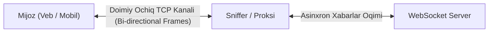
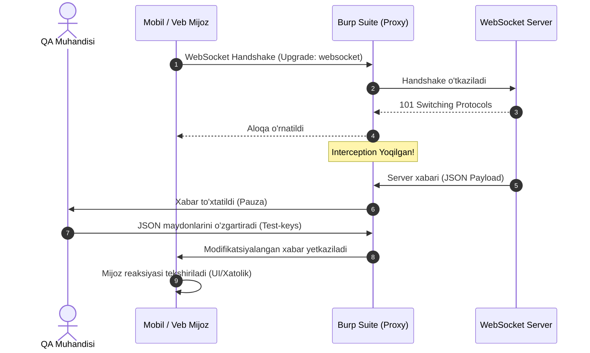
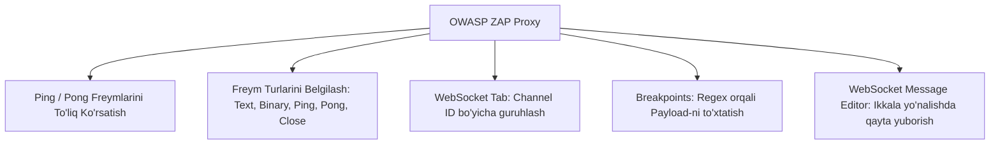

import { Callout } from 'nextra/components'

# Mijozlarda Veb-soketlarni Sinash (Testing WebSockets on Clients)

Mijoz dasturlarida (ayniqsa mobil ilovalar — Android/iOS va zamonaviy Single Page Application veb-mijozlarda) tarmoq funksiyalarini sinash uchun odatda **Charles**, **Fiddler**, **Proxyman** kabi tarmoq snifferlaridan (traffic sniffers) foydalaniladi. Ular an'anaviy HTTP/HTTPS so'rovlarini osongina tutib oladi, tahrirlash (intercept/breakpoint) va avtomatik qoidalar bo'yicha parametrlarni almashtirish imkonini beradi.

Biroq, gap **WebSocket** trafigini sinashga kelganda, vaziyat ancha murakkablashadi.

---

## 1. Muammoning Mohiyati: Nima Uchun Oddiy Snifferlar Yetarli Emas?

WebSocket protokoli HTTP kabi qisqa muddatli "so'rov-javob" (request-response) emas, balki **bitta doimiy ochiq TCP sessiyasi** ichida asinxron freymlar almashinuvidir.

### An'anaviy Vositalarning Cheklovlari:
1. **Charles va Fiddler:** WebSocket ulanishlarini ko'rsatishi mumkin, ammo ularda xabarlarni real-vaqt rejimida qulay tutib olish (breakpoint), parchalash yoki dinamik o'zgartirish (tampering) imkoniyatlari juda cheklangan.
2. **Postman:** WebSocket mijoz sifatida serverga so'rov yuborish va javob olish uchun ajoyib, ammo haqiqiy mijoz (masalan, iOS ilova) serverdan xabar olayotganda o'zini qanday tutishini tekshirish uchun u mos kelmaydi.
3. **Backend tayyor bo'lmaganda:** Agar server tomoni (backend) hali kerakli xatoliklarni simulyatsiya qilishga moslashmagan bo'lsa yoki ishlab chiqarish (production) muhitida kamdan-kam uchraydigan holatlarni qayta tiklash talab etilsa, xabarlarni parvoz paytida (on-the-fly) almashtirib turuvchi maxsus proksi vositalari zarur bo'ladi.

Bu vaziyatda yordamga ixtisoslashgan xavfsizlik va QA tahlil vositalari — **Burp Suite** hamda **OWASP ZAP (Zed Attack Proxy)** keladi.

---

## 2. Burp Suite Orqali Veb-soketlarni Sinash

**Burp Suite** — veb-ilovalar xavfsizligini tekshirishda jahon standarti hisoblanadi, biroq uning bepul versiyasi bo'lmish **Community Edition** QA muhandislariga WebSocket trafigini to'liq nazorat qilish uchun yetarli imkoniyatlarni taqdim etadi.

### 1-qadam: Proksi Tinglovchisini (Proxy Listener) Sozlash
1. Burp Suite-ni oching va **Proxy -> Proxy Settings** bo'limiga o'ting.
2. **Proxy Listeners** blokida standart `127.0.0.1:8080` manzilini tahrirlang yoki yangi listener qo'shing:
   - **Interface:** `All interfaces` (yoki kompyuteringizning mahalliy IP manzili, masalan `192.168.1.100`) qilib belgilang. Bu mobil qurilmadan ulanish uchun zarur.
   - **Port:** Masalan, `8080`.
   - **Running** katakchasi faol (belgilangan) ekanligiga ishonch hosil qiling.

### 2-qadam: Sertifikatni Eksport va Import Qilish
Shifrlangan `wss://` trafigini o'qish uchun Burp CA sertifikatini qurilmaga o'rnatish lozim:
1. Burp menyusida: **Proxy -> Proxy Settings -> Import / export CA certificate**.
2. **Certificate in DER format** bandini tanlang va faylni saqlang (masalan, `burp_cacert.der`).
3. Zarurat bo'lsa, fayl kengaytmasini `.crt` yoki `.cer` ga o'zgartirib, uni sinov qurilmangizga (Android, iOS yoki kompyuter tizim sertifikatlari omboriga) o'rnating va ishonchli (Trusted Root CA) deb belgilang.
4. Mobil qurilmaning Wi-Fi sozlamalarida Manual Proxy manziliga kompyuteringiz IP-si va `8080` portini kiriting.

### 3-qadam: WebSocket Xabarlarini Tutib Olish (Interception Rules)
1. **Proxy -> Intercept** bo'limiga o'ting va **Intercept is on** holatiga keltiring.
2. Qaysi xabarlar to'xtatilishini belgilash uchun **Proxy Settings -> WebSocket Interception Rules** bo'limiga kiring:
   - Siz alohida **Client-to-server** (mijozdan chiquvchi) yoki **Server-to-client** (mijozga keluvchi) xabarlarni to'xtatish qoidalarini belgilashingiz mumkin.
   - Regex qoidalari yordamida faqat kerakli URL manzil yoki ma'lum xabar turlari uchun filtr qo'yish qulay.
3. Serverdan mijozga xabar kelganda, Burp uni to'xtatib turadi:
   - Siz xabar tanasidagi JSON parametrlarini buzishingiz, narxlarni yoki foydalanuvchi statusini o'zgartirishingiz mumkin.
   - O'zgartirish kiritgach, **Forward** tugmasini bossangiz, yangilangan xabar mijozga jo'natiladi. Agar xabarni yo'qotmoqchi bo'lsangiz, **Drop** tugmasi bosiladi.

### 4-qadam: WebSocket Tarixi va Repeater
- **Proxy -> WebSockets history** yorlig'ida barcha o'tgan freymlar, ularning yo'nalishi (chiquvchi/kiruvchi), vaqti va hajmi batafsil saqlanadi.
- Istalgan xabarni sichqonchaning o'ng tugmasi bilan bosib, **Send to Repeater** buyrug'ini tanlash mumkin.
- **Repeater** ichida siz mustaqil ravishda serverga yangi freymlarni yuborishingiz yoki mijoz nomidan har xil noan'anaviy xabarlarni ketma-ket jo'natib, tizim barqarorligini sinashingiz mumkin.

---

## 3. OWASP ZAP (Zed Attack Proxy) Orqali Sinash

**OWASP ZAP** — butunlay bepul va ochiq kodli (open-source) xavfsizlik vositasi bo'lib, uning WebSocket bilan ishlash mexanizmi ko'p jihatdan Burp Suite-dan ham ustunroq va qulayroqdir.

### OWASP ZAP ning Burp Suite-dan Afzalliklari:
> [!NOTE] Nima uchun ko'plab QA jamoalari WebSocket uchun ZAP ni afzal ko'rishadi?
> - **Ping/Pong ko'rinishi:** ZAP tarmoqdagi barcha xizmat freymlarini (Ping va Pong heartbeats) ochiq ko'rsatadi (Burp Community-da bular odatda yashirilgan bo'ladi).
> - **Freym turlarini aniq ajratish:** Har bir freym turi (`Text`, `Binary`, `Ping`, `Pong`, `Close`) alohida piktogramma va rang bilan belgilab beriladi.
> - **Qulay Breakpoint mexanizmi:** WebSocket xabarlari ichidagi ma'lum matn yoki regex qolipi bo'yicha to'xtatish nuqtasini sozlash ancha oson.

### 1-qadam: Mahalliy Proksini Sozlash
1. ZAP-da **Tools -> Options -> Network -> Local Servers/Proxies** menyusiga kiring.
2. Manzilni `0.0.0.0` (barcha interfeyslar) va portni (masalan, `8081`) qilib belgilang.
3. **Tools -> Options -> Dynamic SSL Certificates** oynasiga o'tib, **Generate** yoki **Save** tugmasi orqali ZAP ildiz sertifikatini yuklab oling va sinov qurilmasiga o'rnating.

### 2-qadam: WebSockets Yorlig'i (Tab)
Asosiy panelning pastki qismida **WebSockets** yorlig'i joylashgan. U yerda quyidagi ustunlar aks etadi:
- **Channel ID:** Alohida WebSocket sessiyasining unikal raqami.
- **Direction:** `Client -> Server` (chiquvchi) yoki `Server -> Client` (kiruvchi).
- **Opcode:** Freym turi (`Text`, `Binary`, `Close`, `Ping`, `Pong`).
- **Payload:** Xabarning haqiqiy matni yoki JSON mazmuni.
- **Timestamp:** Aniq vaqt.

### 3-qadam: To'xtatish Nuqtalari (Breakpoints) O'rnatish
1. Yuqori asboblar panelidagi **Add a custom HTTP/WebSocket break point** (yashil doira yoki maxsus nishon) belgisini bosing.
2. Ochilgan oynada:
   - **Match:** `WebSocket Messages`.
   - **Payload Pattern:** Kerakli regex yoki qidirilayotgan kalit so'zni yozing (masalan, `"status":"SUCCESS"` yoki `"balance":`).
   - **Direction:** Qaysi yo'nalishdagi xabarlarni tutish kerakligini belgilang.
3. Shart bajarilganda ZAP xabarni **Break** oynasida ochib beradi. QA muhandisi parametr qiymatini o'zgartirib (masalan, manfiy balans yoki noto'g'ri sanani kiritib), **Step** yoki **Continue** tugmasini bosadi.

### 4-qadam: WebSocket Message Editor (Xabarlarni Qayta Yuborish)
- ZAP ro'yxatidagi istalgan xabarni o'ng tugma bilan bosib, **Open/Resend with WebSocket Message Editor...** oynasini oching.
- Bu muharrirda siz:
  - Xabarning yuborilish yo'nalishini (`Client to Server` yoki `Server to Client`) tanlashingiz;
  - JSON obyektini xohlagancha tahrirlashingiz;
  - To'g'ridan-to'g'ri mijozga server nomidan xabar jo'natib, mijoz ilovasi (mobil ilova yoki veb-sahifa) qanday munosabat bildirishini kuzatishingiz mumkin.

---

## 4. Asboblar Taqqoslovi: Qaysi Biri Qachon Qo'llaniladi?

| Xususiyat | Chrome DevTools | Postman | Burp Suite Community | OWASP ZAP |
| :--- | :--- | :--- | :--- | :--- |
| **Asosiy Maqsadi** | Brauzer tahlili | API ishlab chiqish/sinash | Xavfsizlik va QA proksi | Ochiq kodli xavfsizlik/proksi |
| **Mobil Qurilmalarni Sinash** | Yo'q (faqat Remote Debug) | Yo'q | Ha (A'lo) | Ha (A'lo) |
| **Xabarlarni Tutib O'zgartirish (Intercept)** | Qiyin / Cheklangan | Mumkin emas | Ha (Keng qamrovli) | Ha (Juda qulay) |
| **Ping/Pong Freymlarini Ko'rish** | Ha | Yo'q | Cheklangan | Ha (To'liq va ochiq) |
| **Mijozga Soxta Server Javobi Yuborish** | Yo'q | Yo'q | Ha (Repeater orqali) | Ha (Message Editor orqali) |
| **Narxi va Litsenziyasi** | Bepul | Bepul / Obuna | Bepul versiya mavjud | 100% Bepul va Ochiq kodli |

---

## 5. QA Muhandisi Uchun Muhim Test Ssenariylari (Checklist)

Veb-soketlar integratsiyasini to'liq tekshirishda quyidagi sinov holatlarini proksi vositalari (Burp yoki ZAP) orqali bajarish tavsiya etiladi:

### 1. Salbiy Ma'lumotlar va Buzilgan JSON (Malformed Payloads)
- **Harakat:** Serverdan mijozga yuborilayotgan xabardagi JSON sintaksisini buzing (masalan, yopuvchi qavsni olib tashlang yoki majburiy maydonga `null` qiymat bering).
- **Kutilgan natija:** Mobil yoki veb-ilova qulab tushmasligi (**Crash bo'lmasligi**), xatolikni ushlab olib, foydalanuvchiga tushunarli holatni ko'rsatishi shart.

### 2. Chegaraviy Qiymatlar (Boundary Values & Data Tampering)
- Server xabaridagi sonli qiymatlarni haddan tashqari katta sonlarga (`99999999999999`), manfiy sonlarga yoki kutilmagan uzunlikdagi matnlarga almashtirib ko'ring.
- UI dizayn elementlarining buzilib ketmasligi (overflow, matn ustma-ust tushishi) tekshiriladi.

### 3. Tarmoq Uzilishi va Qayta Ulanish (Reconnection & Exponential Backoff)
- Proksi orqali aloqani sun'iy ravishda to'xtating (Drop) yoki internetni uzing.
- Mijoz ilova darhol foydalanuvchiga *"Ulanish tiklanmoqda..."* indikatorini ko'rsatishi, orqa fonda esa serverga ulanishni 1s, 2s, 4s, 8s oralig'ida qayta sinab ko'rishi kerak.

### 4. Heartbeat (Ping / Pong) Nazorati
- ZAP orqali Ping xabarlariga server nomidan javob berishni to'xtatib qo'ying (Drop Pong).
- Mijoz belgilangan taym-autdan so'ng (odatda 30-60 soniya) qotib qolgan aloqani avtomatik yopib, yangi ulanish ochishini tekshiring.

### 5. Xavfsizlik va XSS Sinovlari
- WebSocket xabarlari orqali HTML yoki JavaScript inyeksiyalarini (``) mijozga jo'natib ko'ring. Mijoz ekranda xabarni aks ettirayotganda skript bajarilib ketmasligi, ma'lumot to'g'ri ekranlashtirilishi (**Data Sanitization**) shart.
