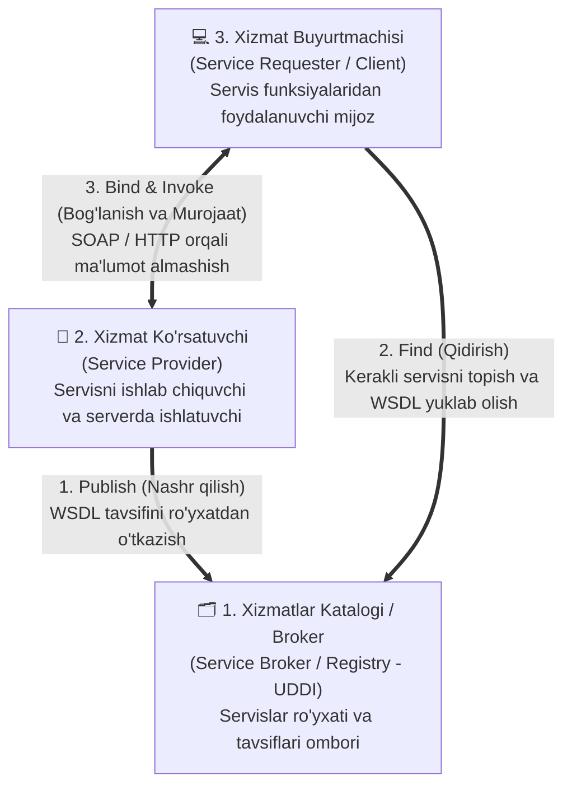
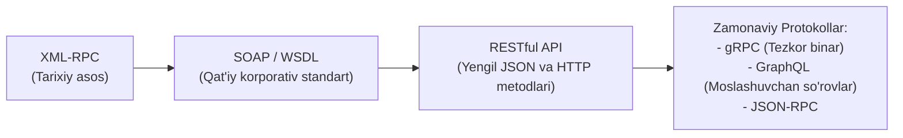
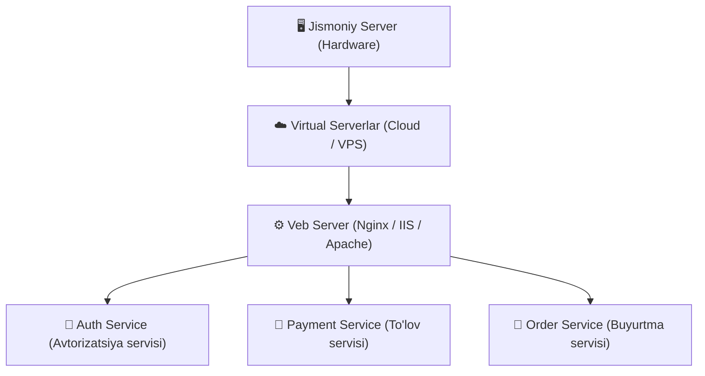

import { Callout } from 'nextra/components'

# Veb-Servislar (Web Services — WS)

**Veb-servis (Web Service)** — standartlashtirilgan interfeyslarga ega bo'lgan, tarmoqda unikal URL manzil orqali identifikatsiya qilinuvchi dasturiy tizimdir. Veb-servislar maxsus protokollar (SOAP, XML-RPC, gRPC) yoki me'moriy qoidalar (REST) orqali boshqa ilovalar bilan xabarlar almashadi hamda **Servisga Yo'naltirilgan Arxitekturaning (SOA)** asosiy modulli birligi hisoblanadi.

Internetdagi turli tizimlar bir-biridan tubdan farq qiladi: biri Java'da Linux serverida ishlasa, ikkinchisi C#'da Windows'da, uchinchisi esa Python yoki Go'da yozilgan. **Veb-servislarning asosiy vazifasi** — ana shu geterogen (turli xil dasturlash tillari, operatsion tizimlar va ma'lumotlar bazalariga ega) tizimlar o'rtasida umumiy standartlar orqali to'siqsiz ma'lumot almashinuvini ta'minlashdir.

---

## 1. Veb-Servis Arxitekturasi (Klassik Uchburchak Modeli)

Klassik veb-servislar arxitekturasi o'zaro hamkorlik qiluvchi 3 ta asosiy ishtirokchidan iborat:

### Jarayonning 3 Bosqichi:
1. **Nashr qilish (Publish):** Xizmat ko'rsatuvchi (**Service Provider**) o'z servisini ishlab chiqqach, uning texnik shartnomasini (**WSDL** faylini) xizmatlar katalogida (**Service Broker**) ro'yxatdan o'tkazadi.
2. **Qidirish (Find):** Xizmat buyurtmachisi (**Service Requester / Mijoz**) o'z ilovasi uchun zarur bo'lgan xizmatni (masalan, ob-havo yoki to'lov shlyuzini) katalogdan qidirib topadi va uning WSDL spesifikatsiyasini import qiladi.
3. **Bog'lanish va Chaqirish (Bind & Invoke):** Buyurtmachi WSDL qoidalari asosida so'rov shakllantiradi va bevosita Xizmat ko'rsatuvchiga murojaat qilib, javob oladi.

---

## 2. Veb-Servis Standartlari va Protokollari

Tizimlararo integratsiyani ta'minlash uchun turli davrlarda quyidagi standartlar va protokollar shakllangan:

### 1. SOAP (Simple Object Access Protocol)
SOAP — bu butun boshli standartlar oilasi bo'lib, uning asosi **SOAP + WSDL + UDDI** uchligidan iborat:
- **Xabarlar formati:** Faqat qat'iy **XML** formatida uzatiladi.
- **WSDL (Web Services Description Language):** Servisning barcha metodlari, parametrlari va qaytaradigan tiplarini tavsiflovchi rasmiy XML shartnoma (kontrakt).
- **Qo'llanilishi:** Banklar, moliya tashkilotlari, davlat xizmatlari va yuqori darajadagi xavfsizlik (WS-Security, tranzaksiyalar yaxlitligi) talab qilinadigan korporativ tizimlarda.

### 2. REST (Representational State Transfer)
Bu alohida protokol emas, balki HTTP imkoniyatlaridan to'liq foydalanishga asoslangan me'moriy uslubdir:
- HTTP metodlari (`GET`, `POST`, `PUT`, `DELETE`) orqali **CRUD** operatsiyalarini bajaradi.
- Ma'lumotlarni ko'pincha yengil **JSON** formatida uzatadi.
- SOAP'ga nisbatan ancha sodda, tez va zamonaviy veb/mobil ilovalarda eng ko'p qo'llaniladi.

### 3. XML-RPC va JSON-RPC
- **XML-RPC:** Masofadagi funksiyani chaqirish (Remote Procedure Call) bo'yicha eng qadimgi protokollardan biri. SOAP aynan XML-RPC evolyutsiyasidan kelib chiqqan.
- **JSON-RPC:** XML-RPC'ning zamonaviy va yengil analogi bo'lib, ma'lumotlar JSON orqali uzatiladi.

### 4. gRPC (Google Remote Procedure Call)
Google tomonidan ishlab chiqilgan zamonaviy yuqori unumdorlikka ega protokol:
- **HTTP/2** transportidan foydalanadi.
- Ma'lumotlarni matn (JSON/XML) emas, balki **Protocol Buffers (Protobuf)** orqali siqilgan binar shaklda uzatadi.
- Ichki mikroservislar o'rtasida o'ta tezkor muloqot qilish uchun ideal tanlov.

### 5. GraphQL
Facebook tomonidan yaratilgan so'rov tili bo'lib, mijozga serverdan faqat o'ziga zarur bo'lgan aniq maydonlarni (fields) so'rab olish imkonini beradi (ortiqcha ma'lumot yuklanishining oldini oladi).

---

## 3. Protokollar Taqqoslovi

| Xususiyat | SOAP | REST | gRPC | GraphQL |
| :--- | :--- | :--- | :--- | :--- |
| **Protokol / Uslub** | Qat'iy Protokol | Arxitektura Uslubi | RPC Protokoli | So'rov Tili |
| **Ma'lumot formati** | Faqat XML | JSON, XML, Matn | Protocol Buffers (Binar) | JSON |
| **Transport** | HTTP, SMTP, TCP | HTTP / HTTPS | Faqat HTTP/2 | HTTP / HTTPS |
| **Shartnoma (Contract)** | WSDL (Majburiy) | OpenAPI / Swagger (Ixtiyoriy) | `.proto` fayl (Majburiy) | Sxema (Schema) |
| **Tezlik** | Sekin (Og'ir XML) | Tez | Juda tez (Binar) | Yuqori |
| **Asosiy soha** | Bank, korporativ tizimlar | Umumiy Web va Mobil ilovalar | Mikroservislararo aloqa | Mobil va murakkab UI |

---

## 4. "Servis" (Mikroservis) va "Server" O'rtasidagi Farq

IT sohasida bu ikki tushunchani adashtirmaslik juda muhim:

- **Servis (Service / Microservice):** Muayyan bitta funksiyani bajaruvchi, aniq tarmoq manzilida (URL) joylashgan va standart interfeysga (API) ega bo'lgan **dasturdir** (masalan, "Valyuta kurslarini hisoblash servisi" yoki "SMS jo'natish servisi").
- **Server:** Dasturlar va servislar ishga tushiriladigan hisoblash mashinasidir:
  - Bitta jismoniy serverda virtual mashinalar orqali minglab turli veb-servislar ishlashi mumkin.
  - Aksincha, bitta yirik veb-servis yuqori yuklamani ko'tarish uchun bir vaqtning o'zida yuzlab serverlarga taqsimlangan (*cluster*) bo'lishi ham mumkin.

---

## 5. QA Muhandisi Uchun Veb-Servislarni Sinash (Testing Checklist)

Veb-servislarni sinash (API testing) QA muhandisining eng muhim kundalik vazifalaridan biridir:

1. **WSDL va OpenAPI/Swagger Shartnomasini Tekshirish:**
   - So'rov parametrlari, majburiy maydonlar (*required fields*) va ma'lumotlar tiplari shartnomaga to'liq mos kelishini tekshirish.
2. **Vositalar:**
   - SOAP servislarni sinash uchun: **SoapUI**;
   - REST va GraphQL servislarni sinash uchun: **Postman**, **Insomnia**, **cURL**;
   - gRPC servislarni sinash uchun: **BloomRPC**, **Postman gRPC**.
3. **Chegaraviy va Manfiy Sinovlar (Negative Testing):**
   - Noto'g'ri shakllangan XML/JSON jo'natilganda servis to'g'ri xatolik kodi (`400 Bad Request` yoki SOAP Fault) qaytaryaptimi?
4. **Xavfsizlik va Autentifikatsiya:**
   - Tokenlar (JWT), API kalitlari va ruxsatlar (Role-based access) to'g'ri tekshirilayotganiga ishonch hosil qilish.
