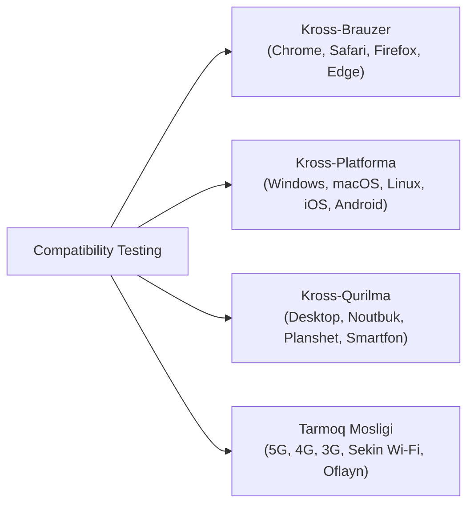

import { Callout } from 'nextra/components'

# Compatibility Testing: Moslashuvchanlik Sinovi

**Compatibility Testing** — dasturiy ta'minotning turli xil apparat vositalari, operatsion tizimlar, veb-brauzerlar, mobil qurilmalar va tarmoq sharoitlarida bir xil barqarorlik va ko'rinishda ishlashini tekshiruvchi nofunksional sinov turidir.

---

## Moslashuvchanlik Sinovining Asosiy Yo'nalishlari

---

## 1. Kross-Brauzer Sinovi (Cross-Browser Testing)

Zamonaviy veb-brauzerlar turli xil render dvigatellariga (masalan: Chrome va Edge da *Blink*, Safari da *WebKit*, Firefox da *Gecko*) ega. Shu sababli bir sahifa Chrome da ideal ko'ringani bilan, Safari da elementlari surilib ketishi mumkin.

### Sinovchining Vazifasi:
- HTML5 va CSS3 uslublarining barcha ommabop brauzerlarda to'g'ri chizilishini tekshirish.
- JavaScript skriptlari va API larning turli brauzer versiyalarida xatosiz bajarilishini ta'minlash.

---

## 2. Kross-Platforma va Qurilmalar Mosligi

- **Ekran o'lchamlari va zichligi (Responsive Design):** Keng formatli 4K monitorlardan tortib to kichik iPhone ekranlarigacha elementlarning moslashuvchan (responsive) joylashishi.
- **Operatsion tizim versiyalari:** Android 11 dan Android 15 gacha, iOS 16 dan iOS 18 gacha bo'lgan tizimlarda sinash.
- **Orqaga moslik (Backward Compatibility):** Yangi versiyadagi dastur eski versiyadagi ma'lumotlar bazasi yoki eski operatsion tizimlarda ham ishlay olishi.

<Callout type="info">
  **Bulutli sinov laboratoriyalari:** QA jamoasi yuzlab haqiqiy qurilmalarni sotib olish o'rniga, bulutda minglab qurilma va brauzerlarni taqdim etuvchi **BrowserStack**, **Sauce Labs** yoki **LambdaTest** xizmatlaridan keng foydalanadi.
</Callout>
