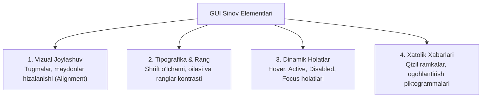

import { Callout } from 'nextra/components'

# GUI Testing: Grafik Interfeys Sinovi

**GUI (Graphical User Interface) Testing** — dasturning foydalanuvchiga ko'rinib turgan barcha vizual elementlari (ekranlar, tugmalar, matn maydonlari, menyular, piktogrammalar, ranglar va shriftlar) dizayn talablariga (Figma / Adobe XD) va xalqaro foydalanish mezonlariga to'liq mosligini tekshirish jarayonidir.

Funksional sinov dasturning mantiqiy ishlashini tekshirsa, GUI sinov uning tashqi ko'rinishi, estetikasi va vizual qulayligini baholaydi.

---

## GUI Sinovining Asosiy Tekshiruv Obyektlari

---

## Nazorat Qilinadigan Asosiy Qoidalar (GUI Checklist)

1. **Elementlarning tekislanishi va oraliqlari (Spacing & Alignment):** Barcha maydonlar va yozuvlar belgilangan to'r (Grid) bo'yicha chapga, markazga yoki o'ngga simmetrik hizalangan bo'lishi kerak.
2. **Shriftlar uyg'unligi (Typography):** Barcha sarlavhalar, asosiy matnlar va izohlar loyihaning umumiy dizayn tizimiga (Design System) mos shriftda yozilishi shart. Shriftlarning ixtiyoriy o'zgarishi qat'iyan man etiladi.
3. **Ranglar va kontrastlik (Color Contrast):** Matn rangi fon rangidan yetarlicha ajralib turishi kerak (WCAG standarti bo'yicha kamida 4.5:1 nisbatda kontrastlik).
4. **Tugmalar holati (Button States):**
   - *Default:* Odatiy ko'rinish
   - *Hover:* Sichqoncha olib kelingandagi rang o'zgarishi
   - *Active / Pressed:* Bosilgan lahzadagi reaksiya
   - *Disabled:* Bosish mumkin bo'lmaganda xiralashishi va bosilmasligi
5. **Matn sig'imi va qirqilish (Text Truncation):** Boshqa tilga tarjima qilinganda uzunroq so'zlar tugmadan chiqib ketmasligi yoki vizual tartibni buzmasligi kerak.

<Callout type="info">
  **GUI vs Usability farqi:** GUI sinov elementlarning dizayn chizmasiga ko'ra to'g'ri chizilganini (masalan: tugma o'lchami 40px va rangi ko'k bo'lishini) tekshirsa, Usability sinov ushbu tugma foydalanuvchiga qulay va tushunarli ekanligini baholaydi.
</Callout>
