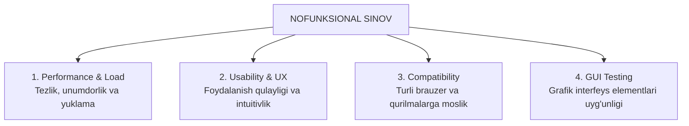

import { Cards, Callout } from 'nextra/components'

# Nofunksional Sinov Turlari (Non-Functional Testing)

Dasturiy ta'minotning barcha funksiyalari to'g'ri ishlashi mumkin, ammo agar sahifa yuklanishi 10 soniya vaqt olsa, 100 kishi bir vaqtda kirganda server qulab tushsa yoki interfeys o'ta noqulay bo'lsa, foydalanuvchilar ushbu dasturdan voz kechadilar.

**Nofunksional sinov** — dasturning "qanday ishlashi"ni (unumdorligi, tezligi, qulayligi, barqarorligi va moslashuvchanligini) tekshiruvchi muhim sinov yo'nalishidir.

---

## Nofunksional Sinovning Asosiy Yo'nalishlari

---

## Modul Bo'limlari

<Cards num={2}>
  <Cards.Card
    title="▶️ Performance Testing"
    href="/docs/non-functional-testing/performance-testing"
  >
    Yuklama ostida ishlash qobiliyati: Load, Stress, Spike, Scalability va Endurance sinovlari.
  </Cards.Card>
  <Cards.Card
    title="▶️ Usability Testing"
    href="/docs/non-functional-testing/usability-testing"
  >
    Foydalanuvchi tajribasi (UX), qulaylik mezonlari, navigatsiya va Yakob Nilsen evristikasi.
  </Cards.Card>
  <Cards.Card
    title="▶️ Compatibility Testing"
    href="/docs/non-functional-testing/compatibility-testing"
  >
    Kross-brauzer, operatsion tizimlar, turli ekran o'lchamlari va tarmoq parametrlariga moslashuvchanlik.
  </Cards.Card>
  <Cards.Card
    title="▶️ GUI Testing"
    href="/docs/non-functional-testing/gui-testing"
  >
    Grafik elementlar, shriftlar, tugmalar joylashuvi, ranglar kontrasti va vizual mukammallik.
  </Cards.Card>
</Cards>
